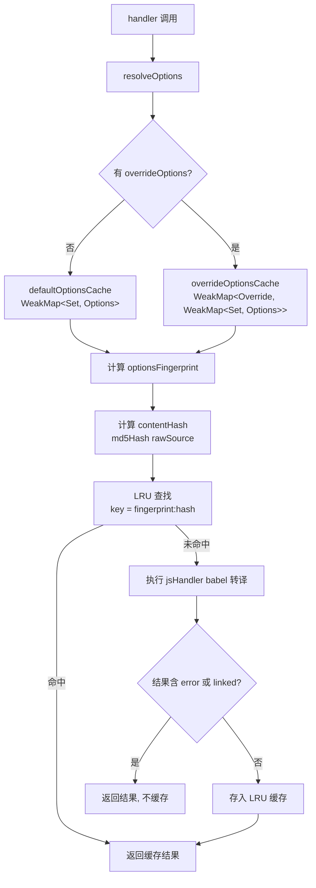

# Design Document: JS Handler 缓存策略优化

## Overview

本设计优化 `createJsHandler`（`packages/weapp-tailwindcss/src/js/index.ts`）的结果缓存策略，解决四个核心缺陷：

1. **512 字符上限** — 大文件永远不缓存，bundler 场景下大量 JS 产物无法命中缓存
2. **FIFO 淘汰** — 高频文件被低频文件驱逐，HMR 场景缓存命中率低
3. **Bundler 路径跳过** — 携带 `filename`/`moduleGraph` 的调用完全不缓存
4. **4 层 WeakMap** — 选项解析缓存嵌套过深，难以推理和调试

优化方案：使用内容哈希（MD5）作为缓存键、LRU 淘汰策略（复用已有 `lru-cache` 依赖）、支持 bundler 路径缓存、简化选项解析为 2 层结构。所有变更保持输入输出向后兼容。

## Architecture

### 当前架构

```
createJsHandler(options)
  ├── resolveOptions(classNameSet, overrideOptions)
  │   ├── resolvedOptionsByClassNameSet: WeakMap<Set<string>, IJsHandlerOptions>        (层1)
  │   ├── resolvedOverrideOptions: WeakMap<CreateJsHandlerOptions, IJsHandlerOptions>   (层2)
  │   └── resolvedOverrideOptionsByClassNameSet:                                         (层3+4)
  │       WeakMap<CreateJsHandlerOptions, WeakMap<Set<string>, IJsHandlerOptions>>
  └── resultCache: WeakMap<IJsHandlerOptions, Map<string, JsHandlerResult>>
      └── key = rawSource (原始源码字符串, ≤512 chars)
          └── FIFO 淘汰, limit=256
          └── shouldCacheJsResult: 排除 filename/moduleGraph
```

### 优化后架构

```
createJsHandler(options)
  ├── resolveOptions(classNameSet, overrideOptions)
  │   ├── defaultOptionsCache: WeakMap<Set<string>, IJsHandlerOptions>                  (层1: 无override)
  │   └── overrideOptionsCache: WeakMap<CreateJsHandlerOptions,                         (层2: 有override)
  │       WeakMap<Set<string> | symbol, IJsHandlerOptions>>
  └── resultCache: LRUCache<string, JsHandlerResult>
      └── key = `${optionsFingerprint}:${contentHash}`
          └── LRU 淘汰, max=512
          └── 不缓存: error 结果, linked 结果, 空源码
```



### 设计决策

1. **MD5 内容哈希** — 复用已有 `src/cache/md5.ts`（即 `@weapp-tailwindcss/shared/node` 的 `md5`），32 字符十六进制字符串作为缓存键，替代原始源码字符串。碰撞概率在实际场景下可忽略。

2. **LRU 替代 FIFO** — 复用已有 `lru-cache@10.4.3` 依赖，无需引入新包。LRU 确保 HMR 场景下频繁编辑的文件不被驱逐。

3. **Bundler 路径缓存** — 移除 `shouldCacheJsResult` 中对 `filename`/`moduleGraph` 的排除逻辑。通过 `optionsFingerprint` 区分不同配置，使 bundler 调用也能命中缓存。但含 `linked` 结果的不缓存（因为 linked 依赖外部模块状态）。

4. **Options Fingerprint** — 将影响转译结果的选项字段序列化为字符串指纹。使用 `WeakMap<IJsHandlerOptions, string>` 缓存指纹计算结果，避免重复序列化。ClassNameSet 通过递增 ID 追踪身份。

5. **选项解析简化** — 从 4 层 WeakMap 简化为 2 层：无 override 时 1 层 `WeakMap<Set<string>, Options>`，有 override 时 2 层 `WeakMap<Override, WeakMap<Set|symbol, Options>>`。使用 `NO_CLASSNAME_SET` symbol 替代 `undefined` 键。

## Components and Interfaces

### 1. `createJsHandler` (修改)

文件：`packages/weapp-tailwindcss/src/js/index.ts`

```typescript
import { LRUCache } from 'lru-cache'
import { md5Hash } from '../cache/md5'

/** 默认 LRU 缓存最大条目数 */
const RESULT_CACHE_MAX = 512

/** 无 classNameSet 时的占位符键 */
const NO_CLASSNAME_SET = Symbol('NO_CLASSNAME_SET')

export function createJsHandler(options: CreateJsHandlerOptions): JsHandler
```

主要变更：
- `resultCache` 从 `WeakMap<IJsHandlerOptions, Map<string, JsHandlerResult>>` 改为 `LRUCache<string, JsHandlerResult>`
- 移除 `CACHEABLE_SOURCE_MAX_LENGTH` 常量和长度限制
- 移除 `shouldCacheJsResult` 函数
- 新增 `computeCacheKey(rawSource, resolvedOptions)` 内部函数
- 新增 `getOptionsFingerprint(resolvedOptions)` 内部函数
- 新增 `getClassNameSetId(set)` 内部函数

### 2. Options Fingerprint 计算

```typescript
/** 缓存 IJsHandlerOptions -> fingerprint 的映射 */
const fingerprintCache = new WeakMap<IJsHandlerOptions, string>()

/**
 * 计算选项指纹，包含所有影响转译结果的字段
 */
function getOptionsFingerprint(options: IJsHandlerOptions): string
```

指纹包含的字段（影响转译输出的字段）：
- `classNameSet` → 通过 `getClassNameSetId()` 获取身份 ID
- `escapeMap` → JSON 序列化
- `needEscaped`, `alwaysEscape`, `unescapeUnicode` → 布尔标志
- `arbitraryValues` → JSON 序列化
- `tailwindcssMajorVersion` → 数字
- `staleClassNameFallback`, `jsArbitraryValueFallback` → 标志
- `uniAppX`, `wrapExpression`, `generateMap` → 布尔标志
- `ignoreCallExpressionIdentifiers`, `ignoreTaggedTemplateExpressionIdentifiers` → 序列化
- `moduleSpecifierReplacements` → JSON 序列化
- `babelParserOptions` → JSON 序列化

不包含的字段（不影响转译结果或不适合缓存）：
- `filename` — 仅用于模块图分析，不影响单文件转译结果
- `moduleGraph` — 仅用于跨文件分析，不影响单文件转译结果
- `jsPreserveClass` — 函数引用，通过 options 对象引用稳定性间接保证

### 3. ClassNameSet 身份追踪

```typescript
/** 为每个 ClassNameSet 实例分配递增 ID */
const classNameSetIds = new WeakMap<Set<string>, number>()
let nextClassNameSetId = 0

function getClassNameSetId(set?: Set<string>): string
```

使用 `WeakMap` + 递增 ID 追踪 `Set<string>` 的引用身份。当 `classNameSet` 引用变化时，ID 不同，指纹不同，缓存自然失效。

### 4. 选项解析缓存（简化后）

```typescript
/** 层1: 无 override 时，classNameSet -> resolvedOptions */
const defaultOptionsCache = new WeakMap<Set<string>, IJsHandlerOptions>()
let resolvedOptionsWithoutClassNameSet: IJsHandlerOptions | undefined

/** 层2: 有 override 时，overrideOptions -> (classNameSet -> resolvedOptions) */
const overrideOptionsCache = new WeakMap<
  CreateJsHandlerOptions,
  WeakMap<Set<string> | typeof NO_CLASSNAME_SET, IJsHandlerOptions>
>()
```

## Data Models

### 缓存键结构

```
LRU Key = `${optionsFingerprint}:${md5Hash(rawSource)}`
```

- `optionsFingerprint`: 由 `getOptionsFingerprint()` 计算，格式为内部序列化字符串
- `md5Hash(rawSource)`: 32 字符十六进制 MD5 哈希

### LRU 缓存配置

```typescript
const resultCache = new LRUCache<string, JsHandlerResult>({
  max: RESULT_CACHE_MAX,  // 512
})
```

### Options Fingerprint 字段映射

| 字段 | 序列化方式 | 说明 |
|------|-----------|------|
| `classNameSet` | `getClassNameSetId()` → 递增整数 | 引用身份追踪 |
| `escapeMap` | `JSON.stringify()` | 转义映射表 |
| `needEscaped` | `0`/`1` | 是否需要转义 |
| `alwaysEscape` | `0`/`1` | 是否总是转义 |
| `unescapeUnicode` | `0`/`1` | 是否反转义 Unicode |
| `generateMap` | `0`/`1` | 是否生成 source map |
| `uniAppX` | `0`/`1` | uni-app-x 模式 |
| `wrapExpression` | `0`/`1` | 表达式包装模式 |
| `tailwindcssMajorVersion` | 数字字符串 | TailwindCSS 主版本 |
| `staleClassNameFallback` | 字符串 | 兜底策略 |
| `jsArbitraryValueFallback` | 字符串 | 任意值兜底 |
| `arbitraryValues` | `JSON.stringify()` | 任意值配置 |
| `ignoreCallExpressionIdentifiers` | 序列化数组 | 忽略的调用标识符 |
| `ignoreTaggedTemplateExpressionIdentifiers` | 序列化数组 | 忽略的标签模板标识符 |
| `moduleSpecifierReplacements` | `JSON.stringify()` | 模块标识符替换 |
| `babelParserOptions` | `JSON.stringify()` | Babel 解析选项 |
| `jsPreserveClass` | 不参与序列化 | 通过 options 引用稳定性保证 |


## Correctness Properties

*A property is a characteristic or behavior that should hold true across all valid executions of a system — essentially, a formal statement about what the system should do. Properties serve as the bridge between human-readable specifications and machine-verifiable correctness guarantees.*

### Property 1: Content hash caching works for any source length

*For any* non-empty source string of any length (including lengths > 512 characters), calling the handler twice with the same source and same options SHALL return the cached result on the second call, confirming that content-hash-based keying works without length restrictions.

**Validates: Requirements 1.1, 1.3**

### Property 2: LRU eviction preserves recently accessed entries

*For any* sequence of N+1 unique source insertions into a cache of max size N, if a subset of the first N entries are accessed (cache hit) before the (N+1)th insertion, those accessed entries SHALL survive eviction while the least-recently-used entry SHALL be evicted.

**Validates: Requirements 2.1, 2.2, 2.3**

### Property 3: Bundler path calls are cacheable

*For any* non-empty source string and options containing `filename` or `moduleGraph`, calling the handler twice with the same source and options SHALL return the cached result on the second call, provided the first call did not produce a `linked` or `error` result.

**Validates: Requirements 3.1, 3.2**

### Property 4: Options resolution reference stability

*For any* `classNameSet` and `overrideOptions` combination, calling `resolveOptions` twice with the same inputs SHALL return the same `IJsHandlerOptions` object reference (identity equality `===`).

**Validates: Requirements 4.2**

### Property 5: Backward-compatible output

*For any* valid `rawSource`, `classNameSet`, and `options` input, the optimized handler SHALL produce the same `code` output as the original `jsHandler` function from `./babel`.

**Validates: Requirements 5.1**

### Property 6: ClassNameSet identity isolation

*For any* source string, calling the handler with `classNameSetA` and then with a different reference `classNameSetB` (even if contents are identical) SHALL NOT return the result cached for `classNameSetA`.

**Validates: Requirements 6.1, 6.2**

## Error Handling

### 解析错误

当 Babel 解析失败时，`jsHandler` 返回 `{ code: rawSource, error }` 结构。优化后的缓存策略：
- 含 `error` 字段的结果 **不存入缓存**（Requirements 3.4）
- 下次相同输入会重新尝试解析，避免缓存错误结果导致永久失败

### Linked 结果

当转译产生跨文件分析结果（`linked` 字段）时：
- 含 `linked` 字段的结果 **不存入缓存**（Requirements 3.3）
- 因为 linked 结果依赖外部模块状态，缓存可能导致过期数据

### 空源码

空字符串（`rawSource.length === 0`）：
- **跳过缓存查找**，直接执行转译（Requirements 1.4）
- 避免为无意义输入占用缓存空间

### MD5 计算异常

`md5Hash` 基于 Node.js `crypto.createHash`，对任意字符串输入不会抛出异常。无需额外错误处理。

## Testing Strategy

### 属性测试（Property-Based Testing）

使用 `fast-check`（已在 devDependencies 中）实现属性测试，每个属性测试至少运行 100 次迭代。

测试文件：`packages/weapp-tailwindcss/test/js-cache.property.test.ts`

每个属性测试需标注对应的设计属性：
- **Feature: js-handler-cache-optimization, Property 1**: Content hash caching works for any source length
- **Feature: js-handler-cache-optimization, Property 2**: LRU eviction preserves recently accessed entries
- **Feature: js-handler-cache-optimization, Property 3**: Bundler path calls are cacheable
- **Feature: js-handler-cache-optimization, Property 4**: Options resolution reference stability
- **Feature: js-handler-cache-optimization, Property 5**: Backward-compatible output
- **Feature: js-handler-cache-optimization, Property 6**: ClassNameSet identity isolation

### 单元测试

测试文件：`packages/weapp-tailwindcss/test/js-cache.test.ts`

覆盖以下场景：
- 空源码跳过缓存（Requirements 1.4）
- 含 `error` 的结果不缓存（Requirements 3.4）
- 含 `linked` 的结果不缓存（Requirements 3.3）
- 默认缓存上限 ≥ 256（Requirements 2.4）
- `classNameSet` 为 `undefined` 时正常工作（Requirements 5.4）

### 回归测试

现有测试文件 `test/js.test.ts` 必须在优化后全部通过（Requirements 5.5）。

验证命令：
```bash
pnpm --filter weapp-tailwindcss vitest run test/js.test.ts
pnpm --filter weapp-tailwindcss vitest run test/js-cache.test.ts
pnpm --filter weapp-tailwindcss vitest run test/js-cache.property.test.ts
```
