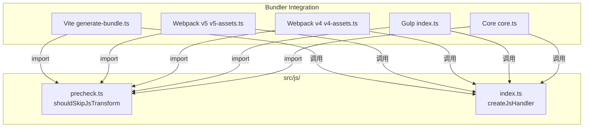

# Design Document: JS 预检查扩展到全部 Bundler

## Overview

将现有 Vite 专属的 JS 预检查逻辑（`shouldSkipViteJsTransform`）迁移到共享模块 `src/js/precheck.ts`，并集成到 Webpack v5、Webpack v4、Gulp 以及核心 `createContext().transformJs()` 路径中。预检查通过两个正则表达式快速判断 JS 源码是否包含需要转译的模式（类名相关模式和依赖语句），从而跳过不必要的 Babel AST 解析，统一提升所有构建器的 JS 转译性能。

### 设计决策

1. **共享模块位置选择 `src/js/precheck.ts`**：预检查逻辑与 JS 处理器紧密相关，放在 `src/js/` 目录下比 `src/bundlers/shared/` 更符合职责划分。
2. **函数签名保持兼容**：新函数 `shouldSkipJsTransform` 与原 `shouldSkipViteJsTransform` 签名一致，仅重命名以去除 Vite 前缀。
3. **环境变量统一为 `WEAPP_TW_DISABLE_JS_PRECHECK`**：替代 Vite 路径中的 `WEAPP_TW_VITE_DISABLE_JS_PRECHECK`，在预检查函数内部读取，各 bundler 无需重复判断。
4. **Vite 路径保留 re-export**：原 `src/bundlers/vite/js-precheck.ts` 改为从共享模块 re-export，保持 Vite 内部引用不变，降低迁移风险。

## Architecture



预检查函数在每个 bundler 的 JS 处理循环中，位于 `jsHandler` 调用之前。当预检查判定可跳过时，直接保留原始源码，不进入 Babel 解析流程。

## Components and Interfaces

### 1. 共享预检查模块 `src/js/precheck.ts`

```typescript
import type { CreateJsHandlerOptions } from '../types'

/** 用于检测源码中是否包含类名相关模式的正则表达式 */
const FAST_JS_TRANSFORM_HINT_RE = /className\b|class\s*=|classList\.|\b(?:twMerge|clsx|classnames|cn|cva)\b|\[["'`]class["'`]\]|text-\[|bg-\[|\b(?:[whpm]|px|py|mx|my|rounded|flex|grid|gap)-/

/** 用于检测源码中是否包含 import/export/require 语句的正则表达式 */
const DEPENDENCY_HINT_RE = /\bimport\s*[("'`{*]|\brequire\s*\(|\bexport\s+\*\s+from\s+["'`]|\bexport\s*\{[^}]*\}\s*from\s+["'`]/

/**
 * 判断是否可以跳过 JS 转换。
 * 通过正则快速检测源码内容，避免不必要的 Babel AST 解析。
 */
export function shouldSkipJsTransform(
  rawSource: string,
  options?: CreateJsHandlerOptions,
): boolean
```

### 2. Vite 兼容层 `src/bundlers/vite/js-precheck.ts`

```typescript
// 保留原有导出名，从共享模块 re-export
export { shouldSkipJsTransform as shouldSkipViteJsTransform } from '../../js/precheck'
```

### 3. 各 Bundler 集成点

| Bundler | 文件 | 集成位置 |
|---------|------|----------|
| Vite | `generate-bundle.ts` | 无需修改（通过 re-export 自动生效） |
| Webpack v5 | `v5-assets.ts` | `jsTaskFactories` 循环内，`jsHandler` 调用前 |
| Webpack v4 | `v4-assets.ts` | `jsTaskFactories` 循环内，`jsHandler` 调用前 |
| Gulp | `gulp/index.ts` | `transformJs` 的 `transform` 回调内 |
| Core API | `core.ts` | `transformJs` 函数内，`jsHandler` 调用前 |

### 4. 环境变量控制

环境变量 `WEAPP_TW_DISABLE_JS_PRECHECK` 设置为 `'1'` 时，预检查函数对所有源码返回 `false`（不可跳过），强制走完整转译流程。该判断在 `shouldSkipJsTransform` 函数内部完成。

Vite 路径原有的 `WEAPP_TW_VITE_DISABLE_JS_PRECHECK` 环境变量保持兼容：在 `generate-bundle.ts` 中继续读取该变量，与新的统一变量取 OR 关系。

## Data Models

本特性不引入新的数据模型。核心数据流为：

```
rawSource: string  ──→  shouldSkipJsTransform(rawSource, options?)  ──→  boolean
                              │
                              ├── options?.alwaysEscape → false
                              ├── options?.moduleSpecifierReplacements → false
                              ├── options?.wrapExpression → false
                              ├── DEPENDENCY_HINT_RE.test(rawSource) → false
                              ├── FAST_JS_TRANSFORM_HINT_RE.test(rawSource) → false
                              └── 以上均不匹配 → true (可跳过)
```

`CreateJsHandlerOptions` 中与预检查相关的字段：
- `alwaysEscape?: boolean` — 强制不跳过
- `moduleSpecifierReplacements?: Record<string, string>` — 有条目时强制不跳过
- `wrapExpression?: boolean` — 为 true 时强制不跳过

## Correctness Properties

*A property is a characteristic or behavior that should hold true across all valid executions of a system — essentially, a formal statement about what the system should do. Properties serve as the bridge between human-readable specifications and machine-verifiable correctness guarantees.*

### Property 1: 迁移等价性

*For any* JS 源码字符串和任意 `CreateJsHandlerOptions` 配置，新的 `shouldSkipJsTransform` 函数应返回与原 `shouldSkipViteJsTransform` 函数完全一致的布尔值结果（在环境变量未设置的情况下）。

**Validates: Requirements 1.3, 7.4**

### Property 2: 强制选项阻止跳过

*For any* JS 源码字符串，当 `alwaysEscape` 为 `true`、或 `moduleSpecifierReplacements` 包含至少一个条目、或 `wrapExpression` 为 `true` 时，`shouldSkipJsTransform` 应返回 `false`（不可跳过）。

**Validates: Requirements 2.2, 2.3, 2.4**

### Property 3: 依赖语句阻止跳过

*For any* 包含 `import`、`export` 或 `require` 语句的 JS 源码字符串（在无强制选项的情况下），`shouldSkipJsTransform` 应返回 `false`（不可跳过）。

**Validates: Requirements 2.5, 7.2**

### Property 4: 类名模式阻止跳过

*For any* 包含 `className`、`classList`、`twMerge`、`clsx`、`classnames`、`cn`、`cva`、`text-[`、`bg-[` 或其他 Tailwind 工具类模式的 JS 源码字符串，`shouldSkipJsTransform` 应返回 `false`（不可跳过）。

**Validates: Requirements 2.6, 7.1, 7.3**

### Property 5: 无匹配则跳过

*For any* 非空 JS 源码字符串，若不包含任何依赖语句模式和类名相关模式，且无强制选项，`shouldSkipJsTransform` 应返回 `true`（可跳过）。

**Validates: Requirements 2.7**

### Property 6: 环境变量禁用预检查

*For any* JS 源码字符串，当环境变量 `WEAPP_TW_DISABLE_JS_PRECHECK` 设置为 `'1'` 时，`shouldSkipJsTransform` 应返回 `false`（不可跳过）。

**Validates: Requirements 8.1**

## Error Handling

预检查函数为纯函数，不抛出异常。所有输入均有确定的布尔返回值：

| 场景 | 行为 |
|------|------|
| `rawSource` 为 `undefined` 或 `null` | 视为空字符串，返回 `true`（可跳过） |
| `rawSource` 为空字符串 | 返回 `true`（可跳过） |
| `options` 为 `undefined` | 仅基于正则判断 |
| 正则执行异常（理论上不会发生） | 不捕获，由调用方处理 |

各 bundler 集成点在预检查返回 `true` 时跳过 `jsHandler` 调用，不影响后续资产处理流程。预检查失败（返回 `false`）时回退到完整转译，保证安全性。

## Testing Strategy

### 单元测试

- 测试 `shouldSkipJsTransform` 的各种输入组合（空字符串、纯数字代码、含类名模式、含依赖语句、各种选项组合）
- 测试环境变量 `WEAPP_TW_DISABLE_JS_PRECHECK` 的开关行为
- 测试边界情况：仅空白字符、超长源码、混合模式

### 属性测试

使用 `fast-check` 进行属性测试，每个属性测试至少运行 100 次迭代。

- **Feature: js-precheck-universal, Property 1**: 迁移等价性 — 随机生成源码和选项，验证新旧函数结果一致
- **Feature: js-precheck-universal, Property 2**: 强制选项阻止跳过 — 随机生成源码，设置强制选项，验证返回 false
- **Feature: js-precheck-universal, Property 3**: 依赖语句阻止跳过 — 随机生成含依赖语句的源码，验证返回 false
- **Feature: js-precheck-universal, Property 4**: 类名模式阻止跳过 — 随机生成含类名模式的源码，验证返回 false
- **Feature: js-precheck-universal, Property 5**: 无匹配则跳过 — 随机生成不含任何匹配模式的源码，验证返回 true
- **Feature: js-precheck-universal, Property 6**: 环境变量禁用预检查 — 随机生成源码，设置环境变量，验证返回 false

### 集成测试

- Webpack v5：验证预检查在 `processAssets` 钩子中正确集成，可跳过的资产不调用 `jsHandler`
- Webpack v4：验证预检查在 `emit` 钩子中正确集成
- Gulp：验证预检查在 `transformJs` 流中正确集成
- Core API：验证预检查在 `createContext().transformJs()` 中正确集成

### 回归测试

- 使用现有 Vite 测试用例验证迁移后行为不变
- 确保 `shouldSkipViteJsTransform` 的 re-export 正常工作
