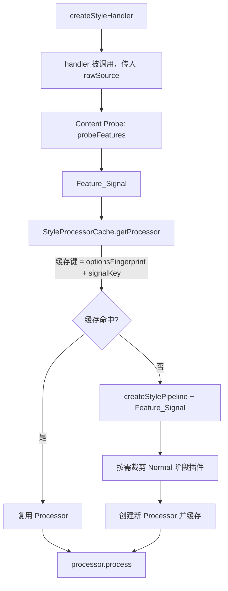

# Design Document: PostCSS Pipeline 按需裁剪

## Overview

本特性在 `@weapp-tailwindcss/postcss` 的 PostCSS 流水线中引入一个轻量级 CSS 内容探测层（Content Probe），在构建流水线前通过正则/字符串匹配快速判断 CSS 是否包含特定特征，从而按需跳过 Normal 阶段中不必要的插件（`postcss-preset-env`、`color-functional-fallback`），减少 AST 遍历次数。

核心设计原则：
- **宁可误报，不可漏报**：探测结果为 false 时才跳过插件，确保处理结果等价
- **零配置**：对外 API 签名不变，调用方无需修改代码
- **轻量探测**：仅使用字符串方法和正则，不引入 AST 解析开销

## Architecture



整体架构分为四个层次：

1. **Content Probe 层**（新增）：纯函数模块 `content-probe.ts`，接收 CSS 字符串，返回 `FeatureSignal`
2. **Pipeline 层**（修改）：`createPreparedNodes` 接收 `FeatureSignal` 参数，根据信号跳过对应插件
3. **Cache 层**（修改）：`StyleProcessorCache` 将 `FeatureSignal` 纳入缓存键计算
4. **Handler 层**（修改）：`createStyleHandler` 返回的处理函数在调用时自动执行探测

## Components and Interfaces

### 1. Content Probe 模块

新增文件：`packages/postcss/src/content-probe.ts`

```typescript
/**
 * CSS 内容特征信号，表示哪些特征存在于当前 CSS 中
 */
export interface FeatureSignal {
  /** CSS 中是否包含现代颜色函数语法（如 rgb(r g b / a) 空格分隔写法） */
  hasModernColorFunction: boolean
  /** CSS 中是否包含需要 postcss-preset-env 处理的特征 */
  hasPresetEnvFeatures: boolean
}

/**
 * 所有标志均为 true 的默认信号（回退值）
 */
export const FULL_SIGNAL: FeatureSignal = {
  hasModernColorFunction: true,
  hasPresetEnvFeatures: true,
}

/**
 * 所有标志均为 false 的空信号
 */
export const EMPTY_SIGNAL: FeatureSignal = {
  hasModernColorFunction: false,
  hasPresetEnvFeatures: false,
}

/**
 * 探测 CSS 内容特征，返回 Feature_Signal
 */
export function probeFeatures(css: string): FeatureSignal

/**
 * 将 FeatureSignal 序列化为缓存键片段
 */
export function signalToCacheKey(signal: FeatureSignal): string
```

探测策略：

- **`hasModernColorFunction`**：检测 `rgb(` 或 `rgba(` 后跟空格分隔参数和 `/` 的模式。使用正则 `/rgb\w*\s*\([^,)]+\s+[^,)]+\s+[^,)]+\s*\/\s*[^)]+\)/i` 匹配 `rgb(r g b / a)` 写法。
- **`hasPresetEnvFeatures`**：检测以下关键字的存在：
  - `:is(` — `:is()` 伪类
  - `oklab(` / `oklch(` — 现代颜色函数
  - `color-mix(` — 颜色混合函数
  - `@layer ` — cascade layers
  - `color(` — CSS Color Level 4 函数

采用字符串 `includes()` 检测关键字，正则仅用于需要上下文匹配的场景。这确保了探测的轻量性。

### 2. Pipeline 修改

修改 `createPreparedNodes` 函数签名，增加可选的 `FeatureSignal` 参数：

```typescript
function createPreparedNodes(
  options: IStyleHandlerOptions,
  signal?: FeatureSignal,
): PipelinePreparedNode[]
```

修改 `createStylePipeline` 函数签名：

```typescript
export function createStylePipeline(
  options: IStyleHandlerOptions,
  signal?: FeatureSignal,
): StyleProcessingPipeline
```

在 `createPreparedNodes` 中，对 `preset-env` 和 `color-functional-fallback` 的添加逻辑增加信号判断：

```typescript
// 仅当信号指示需要时才加载
if (!signal || signal.hasPresetEnvFeatures) {
  preparedNodes.push(createPreparedNode('normal:preset-env', ...))
}
if (!signal || signal.hasModernColorFunction) {
  preparedNodes.push(createPreparedNode('normal:color-functional-fallback', ...))
}
```

当 `signal` 为 `undefined` 时（向后兼容），行为与当前完全一致——始终加载。

### 3. Cache 修改

修改 `StyleProcessorCache` 的 `getProcessor` 和 `getPipeline` 方法，增加 `signal` 参数：

```typescript
getPipeline(options: IStyleHandlerOptions, signal?: FeatureSignal): StyleProcessingPipeline
getProcessor(options: IStyleHandlerOptions, signal?: FeatureSignal): Processor
```

缓存键计算方式：将 `signalToCacheKey(signal)` 追加到现有的 `optionsFingerprint` 后面，形成复合键。当 `signal` 为 `undefined` 时，使用空字符串，保持向后兼容。

### 4. Handler 修改

在 `createStyleHandler` 返回的处理函数中，调用 `probeFeatures` 并传递给 cache：

```typescript
const handler = ((rawSource: string, opt?: Partial<IStyleHandlerOptions>) => {
  const resolvedOptions = resolver.resolve(opt)
  let signal: FeatureSignal | undefined
  try {
    signal = probeFeatures(rawSource)
  } catch {
    // 探测失败时回退到全量加载
    signal = undefined
  }
  const processor = cache.getProcessor(resolvedOptions, signal)
  const processOptions = cache.getProcessOptions(resolvedOptions)
  // ...
}) as StyleHandler
```

### 5. 兼容函数 `getPlugins`

`getPlugins` 函数（`plugins/index.ts`）不接收 CSS 内容，因此保持原有行为——不传 signal，始终加载全部插件。

## Data Models

### FeatureSignal

| 字段 | 类型 | 说明 |
|------|------|------|
| `hasModernColorFunction` | `boolean` | CSS 中是否包含 `rgb(r g b / a)` 等空格分隔的现代颜色函数写法 |
| `hasPresetEnvFeatures` | `boolean` | CSS 中是否包含 `:is()`、`oklab()`、`oklch()`、`color-mix()`、`@layer`、`color()` 等需要 preset-env 处理的特征 |

### 缓存键结构

```
{optionsFingerprint}|signal:{hasPresetEnvFeatures?1:0},{hasModernColorFunction?1:0}
```

当 `signal` 为 `undefined` 时，缓存键不包含 signal 部分，等价于全量加载的键。


## Correctness Properties

*A property is a characteristic or behavior that should hold true across all valid executions of a system — essentially, a formal statement about what the system should do. Properties serve as the bridge between human-readable specifications and machine-verifiable correctness guarantees.*

### Property 1: 探测完备性（无漏报）

*For any* CSS 字符串，若其中包含已知的现代颜色函数语法（如 `rgb(r g b / a)`）或 preset-env 特征关键字（如 `:is(`、`oklab(`、`oklch(`、`color-mix(`、`@layer `、`color(`），则 `probeFeatures` 返回的 `FeatureSignal` 中对应标志 SHALL 为 `true`。

**Validates: Requirements 1.2, 1.3, 6.1, 6.2**

### Property 2: 信号驱动的流水线裁剪

*For any* `FeatureSignal` 和有效的 `IStyleHandlerOptions` 组合，`createStylePipeline(options, signal)` 返回的节点列表 SHALL 满足：
- 当 `signal.hasPresetEnvFeatures` 为 `false` 时，节点列表不包含 `'normal:preset-env'`
- 当 `signal.hasModernColorFunction` 为 `false` 时，节点列表不包含 `'normal:color-functional-fallback'`
- 当对应标志为 `true` 时，节点列表包含对应插件

**Validates: Requirements 2.1, 2.2, 2.3**

### Property 3: 信号隔离性

*For any* `FeatureSignal` 值（包括全 true、全 false、混合），`createStylePipeline(options, signal)` 返回的节点列表 SHALL 满足：
- `'pre:core'` 和 `'post:core'` 始终存在
- 基于选项控制的插件（`units-to-px`、`px-transform`、`rem-transform`、`calc`、`calc-duplicate-cleaner`、`custom-property-cleaner`）的存在与否仅由 `options` 决定，不受 `signal` 影响

**Validates: Requirements 2.4, 2.5**

### Property 4: 流水线等价性

*For any* 有效 CSS 字符串，使用 `probeFeatures(css)` 得到的信号构建的裁剪流水线处理该 CSS 的结果 SHALL 与使用完整流水线（不传 signal）处理该 CSS 的结果完全一致。

**Validates: Requirements 5.1, 6.1, 6.3**

## Error Handling

### Content Probe 异常处理

- **探测函数异常**：`probeFeatures` 内部不应抛出异常（纯字符串/正则操作），但 handler 层仍包裹 try-catch 作为防御性编程
- **回退策略**：当探测异常时，`signal` 设为 `undefined`，等价于不传信号，流水线加载全部插件
- **空输入**：空字符串返回全 false 信号，这是安全的——空 CSS 不需要任何 Normal 阶段插件处理

### Cache 边界

- **signal 为 undefined**：缓存键不包含 signal 部分，与现有行为完全一致
- **WeakMap 引用**：pipeline 和 processor 的 WeakMap 缓存以 `options` 对象为键，signal 通过字符串键在 `Map` 中区分

### Pipeline 边界

- **signal 为 undefined**：`createPreparedNodes` 中 `!signal || signal.xxx` 条件确保不传 signal 时始终加载
- **所有插件被跳过**：即使 Normal 阶段所有可裁剪插件都被跳过，Pre 和 Post 阶段插件仍然加载，流水线不会为空

## Testing Strategy

### 单元测试

- **Content Probe 测试** (`test/content-probe.test.ts`)：
  - 空字符串返回全 false
  - 包含 `rgb(r g b / a)` 的 CSS 返回 `hasModernColorFunction: true`
  - 包含 `:is()`、`oklab()`、`oklch()`、`color-mix()`、`@layer`、`color()` 的 CSS 返回 `hasPresetEnvFeatures: true`
  - 不包含任何特征的简单 CSS 返回全 false
  - 注释中包含特征关键字时仍返回 true
  - `signalToCacheKey` 对不同信号产生不同键

- **Pipeline 裁剪测试** (`test/pipeline.test.ts` 扩展)：
  - 传入全 false 信号时 pipeline 不包含 preset-env 和 color-functional-fallback
  - 传入全 true 信号时 pipeline 包含所有插件
  - 不传 signal 时行为与当前一致
  - Pre/Post 阶段插件不受信号影响

- **Cache 测试** (`test/processor-cache.test.ts` 扩展)：
  - 相同选项 + 不同信号 → 不同 Processor
  - 相同选项 + 相同信号 → 同一 Processor
  - 不传信号时缓存行为不变

- **Handler 集成测试** (`test/handler.cache.test.ts` 扩展)：
  - 处理不含现代特征的 CSS 时自动跳过插件
  - 探测异常时回退到全量加载

### 属性测试（Property-based）

使用 [fast-check](https://github.com/dubzzz/fast-check) 库进行属性测试，每个属性至少运行 100 次迭代。

- **Property 1**：生成包含已知特征关键字的随机 CSS 字符串，验证 `probeFeatures` 对应标志始终为 true
- **Property 2**：生成随机 `FeatureSignal` 组合，验证 pipeline 节点列表正确包含/排除对应插件
- **Property 3**：生成随机 `FeatureSignal` 组合和随机选项配置，验证 pre/post 和选项控制的插件不受信号影响
- **Property 4**：生成随机 CSS 字符串（混合有/无现代特征），验证裁剪流水线与完整流水线处理结果一致

属性测试文件：`packages/postcss/test/content-probe.properties.test.ts`

每个测试标注格式：**Feature: postcss-pipeline-pruning, Property {number}: {property_text}**

### 测试文件结构

```
packages/postcss/test/
├── content-probe.test.ts              # Content Probe 单元测试
├── content-probe.properties.test.ts   # Content Probe 属性测试
├── pipeline.test.ts                   # 扩展：Pipeline 裁剪测试
├── processor-cache.test.ts            # 扩展：Cache 信号测试
└── handler.cache.test.ts              # 扩展：Handler 集成测试
```
