# Design Document: tailwind-merge-size-optimization

## Overview

本设计为 `@weapp-tailwindcss/merge`（tailwind-merge v3）和 `@weapp-tailwindcss/merge-v3`（tailwind-merge v2）提供三层入口体积优化方案。

核心洞察：tailwind-merge 的体积约 77-78% 来自内置的 `getDefaultConfig`（类冲突分组配置），而非核心合并算法。通过将配置与算法解耦，可以提供不同体积级别的入口：

| 入口 | 子路径 | Merge_Package | Merge_V3_Package | 包含配置 |
|------|--------|---------------|------------------|----------|
| Full | `.` | ~100KB | ~72KB | 完整 Default_Config |
| Slim | `/slim` | <60KB | <45KB | 精简 Slim_Config |
| Lite | `/lite` | <20KB | <15KB | 无配置（用户自行提供） |

设计原则：
- **共享运行时**：三个入口共享同一个 `createRuntimeFactory`，确保 escape/unescape、RPX_Transform、LRU_Cache 行为完全一致
- **配置即体积**：体积差异仅来自冲突分组配置的大小，核心算法代码完全相同
- **向后兼容**：Full Entry 的 API 和行为完全不变，现有用户零迁移成本

## Architecture

```mermaid
graph TD
    subgraph "tailwind-merge (upstream)"
        TM_CREATE[createTailwindMerge]
        TM_JOIN[twJoin]
        TM_MERGE[twMerge = createTailwindMerge&#40;getDefaultConfig&#41;]
        TM_EXTEND[extendTailwindMerge]
        TM_DEFAULT[getDefaultConfig ~79KB]
        TM_VALIDATORS[validators]
    end

    subgraph "@weapp-tailwindcss/runtime"
        RT[createRuntimeFactory]
        RPX[createRpxLengthTransform]
        ESC[escape / unescape]
    end

    subgraph "@weapp-tailwindcss/merge"
        subgraph "Full Entry (.)"
            FULL_INDEX[src/index.ts]
        end
        subgraph "Slim Entry (/slim)"
            SLIM_INDEX[src/slim.ts]
            SLIM_CONFIG[src/slim-config.ts ~30KB]
        end
        subgraph "Lite Entry (/lite)"
            LITE_INDEX[src/lite.ts]
        end
    end

    FULL_INDEX --> TM_MERGE
    FULL_INDEX --> TM_EXTEND
    FULL_INDEX --> TM_CREATE
    FULL_INDEX --> TM_JOIN
    FULL_INDEX --> TM_DEFAULT
    FULL_INDEX --> RT
    FULL_INDEX --> RPX

    SLIM_INDEX --> TM_CREATE
    SLIM_INDEX --> TM_JOIN
    SLIM_INDEX --> SLIM_CONFIG
    SLIM_INDEX --> RT
    SLIM_INDEX --> RPX

    LITE_INDEX --> TM_CREATE
    LITE_INDEX --> TM_JOIN
    LITE_INDEX --> RT
    LITE_INDEX --> RPX
```



关键架构决策：

1. **Lite Entry 不导入 `extendTailwindMerge` 和 `twMerge` from tailwind-merge**：因为上游的 `extendTailwindMerge` 内部硬编码了 `import { getDefaultConfig } from './default-config'`，即使不调用也会被打包。Lite Entry 需要自行实现一个不依赖 default config 的 `extendTailwindMerge` 包装。

2. **Slim Entry 同理不导入上游 `extendTailwindMerge`**：Slim Entry 的 `extendTailwindMerge` 基于 `getSlimConfig` 而非 `getDefaultConfig`，需要自行实现。

3. **`createTailwindMerge` 和 `twJoin` 可安全从上游导入**：这两个函数不依赖 `getDefaultConfig`，tree-shaking 可以正确移除未使用的配置代码。

## Components and Interfaces

### Lite Entry (`src/lite.ts`)

```typescript
// 仅从 tailwind-merge 导入不依赖 default config 的符号
import { createTailwindMerge as _createTailwindMerge, twJoin as _twJoin } from 'tailwind-merge'
import { createRpxLengthTransform, createRuntimeFactory, weappTwIgnore } from '@weapp-tailwindcss/runtime'

const rpxTransform = createRpxLengthTransform()

const create = createRuntimeFactory({
  createTailwindMerge: _createTailwindMerge,
  // extendTailwindMerge 需要一个不依赖 default config 的实现
  extendTailwindMerge: liteExtendTailwindMerge,
  twJoin: _twJoin,
  twMerge: _twJoin, // placeholder — lite 不提供预配置的 twMerge
  version: 3, // 或 2（merge-v3 包）
  ...rpxTransform,
})

// 导出
export { create, createTailwindMerge, extendTailwindMerge, twJoin, weappTwIgnore }
export type { ClassValue, CreateOptions, EscapeConfig, UnescapeConfig }
```

Lite Entry 的 `extendTailwindMerge` 实现：用户必须提供一个返回完整配置的函数或配置对象，不会引入 default config。实际上，由于 `createTailwindMerge` 本身就是工厂函数，`extendTailwindMerge` 在 lite 中等价于 `createTailwindMerge` 的便捷包装——接受一个基础配置和扩展配置。

### Slim Entry (`src/slim.ts`)

```typescript
import { createTailwindMerge as _createTailwindMerge, twJoin as _twJoin } from 'tailwind-merge'
import { createRpxLengthTransform, createRuntimeFactory, weappTwIgnore } from '@weapp-tailwindcss/runtime'
import { getSlimConfig } from './slim-config'

const rpxTransform = createRpxLengthTransform()

// 基于 slim config 的 extendTailwindMerge
function slimExtendTailwindMerge(configExtension, ...createConfig) {
  // 类似上游 extendTailwindMerge，但使用 getSlimConfig 替代 getDefaultConfig
}

// 基于 slim config 的预配置 twMerge
const _twMerge = _createTailwindMerge(getSlimConfig)

const create = createRuntimeFactory({
  createTailwindMerge: _createTailwindMerge,
  extendTailwindMerge: slimExtendTailwindMerge,
  twJoin: _twJoin,
  twMerge: _twMerge,
  version: 3,
  ...rpxTransform,
})

// 导出
export { create, createTailwindMerge, extendTailwindMerge, getSlimConfig, twJoin, twMerge, weappTwIgnore }
export type { ClassValue, CreateOptions, EscapeConfig, UnescapeConfig }
```

### Slim Config (`src/slim-config.ts`)

精简版冲突分组配置，仅包含小程序高频使用的 Tailwind 类：

**包含的冲突分组类别：**
- 布局：display, position, visibility, overflow, z-index
- Flexbox：direction, wrap, grow, shrink, basis, order
- Grid：template-columns, template-rows, gap
- 对齐：justify-content, align-items, align-self, place-content, place-items
- 间距：padding（含方向变体）, margin（含方向变体）
- 尺寸：width, height, min-width, min-height, max-width, max-height, size
- 排版：font-size, font-weight, font-family, text-align, text-color, line-height, letter-spacing, text-overflow, whitespace, word-break
- 背景：background-color, background-image, background-size, background-position, background-repeat
- 边框：border-width, border-color, border-style, border-radius
- 效果：opacity, box-shadow
- 变换：translate, scale, rotate

**排除的冲突分组类别：**
- SVG 相关（fill, stroke, stroke-width）
- 表格布局（table-layout, border-collapse, border-spacing）
- 滚动捕捉（scroll-snap-type, scroll-snap-align, scroll-margin, scroll-padding）
- 触摸操作（touch-action）
- 遮罩（mask-*）
- 透视（perspective）
- 容器查询（@container）
- 其他低频工具类

### Full Entry (`src/index.ts`) — 无变更

保持现有代码不变，继续导出所有符号。

### 构建配置变更 (`tsdown.config.ts`)

```typescript
import { defineConfig } from 'tsdown'

export default defineConfig([
  {
    entry: ['src/index.ts', 'src/slim.ts', 'src/lite.ts'],
    format: ['cjs', 'esm'],
    clean: true,
    dts: true,
    target: 'node18',
    failOnWarn: false,
  },
])
```

### Package.json exports 变更

```jsonc
{
  "exports": {
    ".": {
      "import": { "types": "./dist/index.d.mts", "default": "./dist/index.mjs" },
      "require": { "types": "./dist/index.d.cts", "default": "./dist/index.cjs" }
    },
    "./slim": {
      "import": { "types": "./dist/slim.d.mts", "default": "./dist/slim.mjs" },
      "require": { "types": "./dist/slim.d.cts", "default": "./dist/slim.cjs" }
    },
    "./lite": {
      "import": { "types": "./dist/lite.d.mts", "default": "./dist/lite.mjs" },
      "require": { "types": "./dist/lite.d.cts", "default": "./dist/lite.cjs" }
    }
  }
}
```

### 两个包的差异

| 方面 | Merge_Package | Merge_V3_Package |
|------|---------------|------------------|
| tailwind-merge 版本 | v3 (3.x) | v2 (2.x) |
| `version` 字段 | `3` | `2` |
| 依赖 | `tailwind-merge@^3.5.0` | `tailwind-merge@^2.6.1` |
| Slim_Config | 基于 v3 API 编写 | 基于 v2 API 编写 |

两个包的 slim.ts 和 lite.ts 结构完全相同，仅 `version` 值和 slim-config 的具体 API 调用方式因 tailwind-merge 版本差异而略有不同。

## Data Models

### SlimConfig 结构

Slim_Config 遵循 tailwind-merge 的 `Config` 类型接口：

```typescript
interface SlimConfig {
  cacheSize: number           // 默认 500（与上游一致）
  separator: string           // 默认 ':'
  experimentalParseClassName?: Function
  classGroups: Record<string, ClassGroup[]>
  conflictingClassGroups: Record<string, string[]>
  conflictingClassGroupModifiers?: Record<string, string[]>
}
```

`classGroups` 中仅包含上述"包含的冲突分组类别"对应的 key-value 对。

### 导出符号对比

| 符号 | Full | Slim | Lite |
|------|------|------|------|
| `twMerge` | ✅ | ✅ (基于 Slim_Config) | ❌ |
| `twJoin` | ✅ | ✅ | ✅ |
| `createTailwindMerge` | ✅ | ✅ | ✅ |
| `extendTailwindMerge` | ✅ (基于 Default_Config) | ✅ (基于 Slim_Config) | ✅ (无默认配置) |
| `getDefaultConfig` | ✅ | ❌ | ❌ |
| `getSlimConfig` | ❌ | ✅ | ❌ |
| `mergeConfigs` | ✅ | ❌ | ❌ |
| `create` | ✅ | ✅ | ✅ |
| `weappTwIgnore` | ✅ | ✅ | ✅ |
| `tailwindMergeVersion` | ✅ | ✅ | ✅ |
| 类型导出 | ✅ | ✅ | ✅ |


## Correctness Properties

*A property is a characteristic or behavior that should hold true across all valid executions of a system—essentially, a formal statement about what the system should do. Properties serve as the bridge between human-readable specifications and machine-verifiable correctness guarantees.*

### Property 1: Lite 工厂函数产出与 Full Entry 行为一致

*For any* valid tailwind-merge config and any class string input, when `createTailwindMerge` from the Lite Entry is called with that config, the resulting merge function SHALL produce the same output as `createTailwindMerge` from the Full Entry called with the same config (both wrapped through `create()` with identical `CreateOptions`).

**Validates: Requirements 1.3, 1.5, 6.1, 6.3, 6.7, 6.9**

### Property 2: twJoin 跨入口一致性

*For any* array of class name values (strings, nulls, undefined, false, nested arrays), `twJoin` from any entry (Full, Slim, Lite) SHALL produce the same output: all truthy string values concatenated with spaces in order, with no conflict resolution applied.

**Validates: Requirements 1.4, 2.6**

### Property 3: Slim 冲突解析覆盖已包含类别

*For any* pair of conflicting Tailwind classes from the Slim_Config's included utility categories (display, position, flexbox, spacing, sizing, typography, backgrounds, borders, effects, transforms), `twMerge` from the Slim Entry SHALL resolve the conflict by keeping only the last class, identically to how the Full Entry's `twMerge` resolves the same conflict.

**Validates: Requirements 2.3, 2.5, 6.2, 6.4, 6.8, 6.10**

### Property 4: Slim extendTailwindMerge 扩展性

*For any* valid config extension object, `extendTailwindMerge` from the Slim Entry SHALL produce a merge function that correctly resolves conflicts from both the Slim_Config's built-in groups and the extension's additional groups.

**Validates: Requirements 2.9**

### Property 5: Full Entry 向后兼容

*For any* class string input, `twMerge` from the Full Entry after this change SHALL produce the same output as `twMerge` from the Full Entry before this change (including RPX_Transform and Escape_Unescape behavior).

**Validates: Requirements 3.2, 3.3, 3.4**

## Error Handling

### 配置缺失错误

- **Lite Entry 无配置调用**：如果用户从 Lite Entry 导入 `createTailwindMerge` 但不提供配置函数，tailwind-merge 内部会在首次调用时抛出错误（`createConfigFirst` 返回 undefined）。这是上游行为，无需额外处理。
- **Slim Entry 配置扩展错误**：如果用户传入无效的配置扩展对象给 `extendTailwindMerge`，行为与上游一致——可能产生运行时错误或静默忽略无效字段。

### 导入路径错误

- 如果用户尝试从 Lite Entry 导入 `twMerge`、`getDefaultConfig` 或 `mergeConfigs`，TypeScript 编译器会报类型错误。运行时则为 `undefined`。
- 如果用户尝试从 Slim Entry 导入 `getDefaultConfig` 或 `mergeConfigs`，同上。

### 构建产物缺失

- 如果 `tsdown` 构建失败或产物不完整，`package.json` 中的 exports 路径将无法解析，消费方会得到 `MODULE_NOT_FOUND` 错误。CI 中的构建步骤应捕获此类问题。

## Testing Strategy

### 单元测试（Example-based）

1. **导出完整性测试**：
   - Full Entry 导出所有预期符号（3.1）
   - Slim Entry 导出预期符号，不导出 `getDefaultConfig`、`mergeConfigs`（7.1-7.3, 8.1-8.3）
   - Lite Entry 导出预期符号，不导出 `twMerge`、`getDefaultConfig`、`mergeConfigs`（2.6）

2. **Slim 排除类别测试**：
   - 对 SVG、table、scroll-snap 等排除类别的类对，验证 Slim twMerge 不解析冲突（2.4）

3. **LRU 缓存行为测试**：
   - 验证 256 条目限制和 FIFO 驱逐策略在所有入口一致（3.5, 6.5, 6.6）

4. **Full Entry 回归测试**：
   - 现有测试套件（`twMerge.test.ts`、`v4.unit.test.ts`、`snapshot.test.ts`）必须全部通过

### 属性测试（Property-based）

使用 [fast-check](https://github.com/dubzzz/fast-check) 库进行属性测试，每个属性至少运行 100 次迭代。

- **Property 1**: 生成随机的简化 tailwind-merge 配置和类字符串，验证 Lite `createTailwindMerge` 与 Full `createTailwindMerge` 在相同配置下产出一致
  - Tag: `Feature: tailwind-merge-size-optimization, Property 1: Lite factory produces identical results to Full entry for any config and class input`

- **Property 2**: 生成随机类名数组（含 null、undefined、false、嵌套数组），验证所有入口的 `twJoin` 输出一致
  - Tag: `Feature: tailwind-merge-size-optimization, Property 2: twJoin produces identical output across all entries for any class name values`

- **Property 3**: 从已包含类别中生成随机冲突类对，验证 Slim `twMerge` 与 Full `twMerge` 解析结果一致
  - Tag: `Feature: tailwind-merge-size-optimization, Property 3: Slim twMerge resolves conflicts identically to Full for included categories`

- **Property 4**: 生成随机配置扩展，验证 Slim `extendTailwindMerge` 正确处理基础 + 扩展冲突
  - Tag: `Feature: tailwind-merge-size-optimization, Property 4: Slim extendTailwindMerge handles both built-in and extended conflict groups`

- **Property 5**: 使用现有测试用例的类字符串作为种子，验证 Full Entry 输出不变
  - Tag: `Feature: tailwind-merge-size-optimization, Property 5: Full entry backward compatibility for any class string`

### 集成测试

1. **Bundle 体积检查**（SMOKE）：
   - 构建后测量各入口 ESM 产物大小，断言满足体积约束（1.6, 1.7, 2.7, 2.8）

2. **Tree-shaking 验证**（INTEGRATION）：
   - 构建 Lite Entry 后检查产物不包含 `getDefaultConfig` 相关代码（1.1, 1.2, 7.4）
   - 构建 Slim Entry 后检查产物不包含完整 Default_Config（8.4）

3. **子路径解析测试**（INTEGRATION）：
   - 验证 `/lite` 和 `/slim` 子路径在 ESM 和 CJS 下正确解析（4.3, 5.3）

4. **类型声明测试**（INTEGRATION）：
   - 使用 `tsd` 验证所有入口的类型声明正确性（9.1-9.6, 4.4, 5.4）

### 测试文件组织

```
packages-runtime/merge/test/
├── index.test.ts          # 现有 Full Entry 测试（不变）
├── twMerge.test.ts        # 现有合并行为测试（不变）
├── snapshot.test.ts       # 现有快照测试（不变）
├── v4.unit.test.ts        # 现有 v4 单元测试（不变）
├── slim.test.ts           # Slim Entry 功能测试
├── lite.test.ts           # Lite Entry 功能测试
└── properties.test.ts     # 属性测试（fast-check）

packages-runtime/merge-v3/test/
├── ...                    # 现有测试（不变）
├── slim.test.ts           # Slim Entry 功能测试
├── lite.test.ts           # Lite Entry 功能测试
└── properties.test.ts     # 属性测试（fast-check）
```
