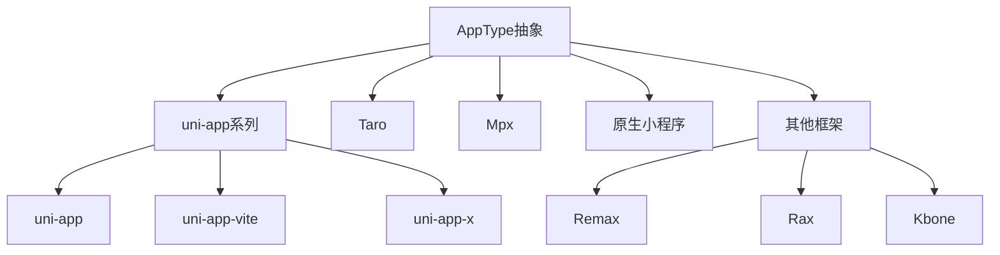
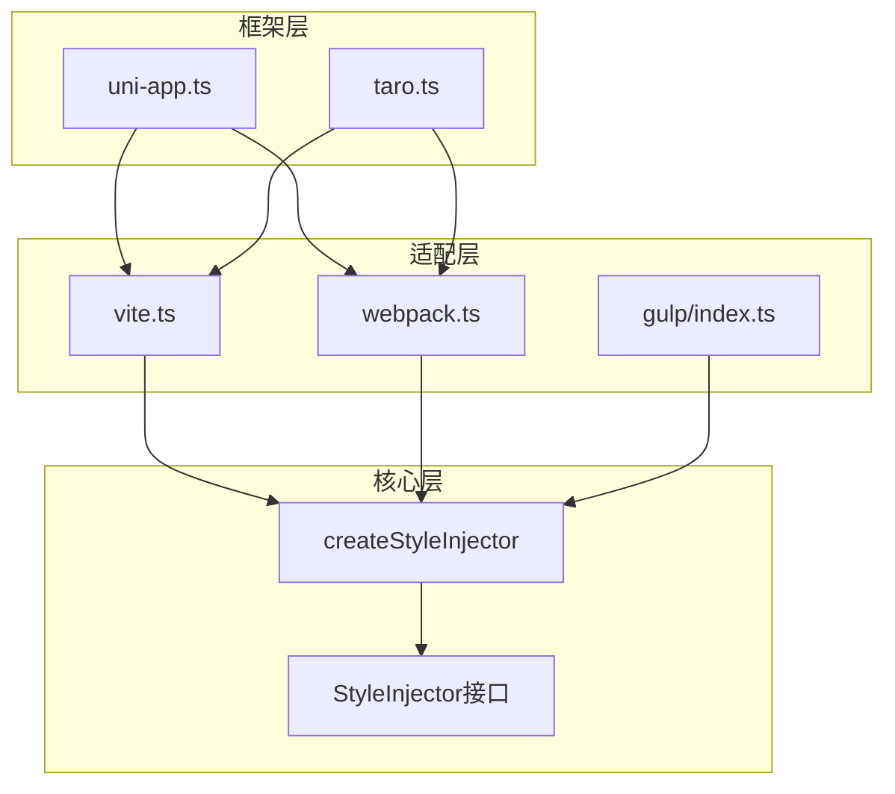

# weapp-tailwindcss 抽象层级设计分析

## 文档概述

本文档从工程复杂度管理角度分析 weapp-tailwindcss 项目在抽象层级设计上的取舍，包括抽象的引入位置、解决的问题、带来的复杂度，以及对未来扩展性的影响。

## 抽象引入位置

### 1. 核心抽象层：上下文系统

上下文系统位于项目的中枢位置，通过 Context 对象在整个构建流程中传递项目配置和状态信息。

#### 架构决策

在 `packages/weapp-tailwindcss/src/context/index.ts` 中实现了统一的上下文管理：

- 集中式配置管理：通过 `getCompilerContext` 函数将用户配置转换为内部标准化配置
- 单例缓存模式：通过 `withCompilerContextCache` 确保相同配置只创建一次上下文实例
- 生命周期管理：提供 `onLoad`、`onStart`、`onUpdate`、`onEnd` 等钩子函数

#### 关键组件

| 组件                                             | 职责                      | 依赖方           |
| ------------------------------------------------ | ------------------------- | ---------------- |
| `InternalUserDefinedOptions`                     | 标准化内部配置类型        | 所有处理器和插件 |
| `TailwindcssPatcherLike`                         | Tailwind CSS 补丁抽象接口 | 版本适配层       |
| `styleHandler` / `jsHandler` / `templateHandler` | 三大处理器工厂函数        | 构建工具插件     |

### 2. 流水线抽象层：PostCSS Pipeline

在 `packages/postcss/src/pipeline.ts` 中实现了三阶段流水线架构。

#### 架构决策

流水线分为 pre、normal、post 三个阶段，每个阶段可注册多个插件节点：

- 阶段隔离：用户插件默认注入 pre 阶段，核心转换在 normal 阶段，清理工作在 post 阶段
- 节点上下文：每个插件节点携带 `PipelineNodeContext`，包含当前位置、总数、前后节点游标等元信息
- 懒加载准备：通过 `prepare` 方法延迟实例化插件，支持条件性加载

#### 流水线结构


### 3. 构建工具适配层

在 `packages/weapp-tailwindcss/src/bundlers/` 下分别针对 Vite、Webpack 提供适配器。

#### 架构决策

- 统一接口封装：通过 `UserDefinedOptions` 类型统一各构建工具的配置入口
- 生命周期映射：将 Vite 的 `generateBundle` 和 Webpack 的 `compilation.hooks` 映射到统一的处理流程
- 输出标准化：通过 `OutputEntry` 抽象不同构建工具的产物格式

#### 适配器架构

| 构建工具   | 插件类型              | 核心钩子                        | 处理时机       |
| ---------- | --------------------- | ------------------------------- | -------------- |
| Vite       | Plugin[]              | generateBundle                  | 构建产物生成后 |
| Webpack v5 | WebpackPluginInstance | compilation.hooks.processAssets | 资源处理阶段   |
| Gulp       | Transform Stream      | pipe链式调用                    | 流式处理阶段   |

### 4. 框架检测与适配层

在 `packages/weapp-tailwindcss/src/presets/` 目录下针对不同小程序框架提供预设配置。

#### 架构决策

- 框架类型枚举：通过 `AppType` 类型定义支持的框架（uni-app、taro、mpx、native等）
- 自动检测机制：通过环境变量、配置文件、依赖包分析自动识别框架
- 预设配置封装：每个框架提供默认的 `cssMatcher`、`mainCssChunkMatcher` 等配置

#### 框架支持范围



### 5. 样式注入抽象层

在 `packages/weapp-style-injector/src/` 中实现了跨构建工具的样式注入机制。

#### 架构决策

- 核心注入逻辑分离：`core.ts` 提供框架无关的注入算法
- 构建工具适配器：分别为 Vite、Webpack、Gulp 提供适配层
- 框架特定逻辑：针对 uni-app 和 Taro 的子包处理提供专用解析器

#### 注入器架构



### 6. 类名转义抽象层

类名转义策略贯穿整个项目，从编译时到运行时都需要处理。

#### 架构决策

- 编译时转义：在 `@weapp-core/escape` 包中实现核心转义算法
- 运行时转义：在 `packages-runtime/runtime` 中提供运行时转义工具
- 可配置映射：通过 `customReplaceDictionary` 允许自定义转义规则

#### 转义流程

编译时转义发生在模板处理、JS处理、CSS处理三个环节，确保类名在各个阶段保持一致性。

### 7. 缓存抽象层

在 `packages/weapp-tailwindcss/src/cache/` 中实现了多级缓存系统。

#### 架构决策

- 编译器上下文缓存：相同配置复用同一个上下文实例
- 文件级缓存：基于文件内容哈希缓存处理结果
- Runtime类名集合缓存：缓存 Tailwind CSS 生成的类名集合

#### 缓存层级

| 缓存类型    | 生命周期 | 失效条件         | 应用场景       |
| ----------- | -------- | ---------------- | -------------- |
| 上下文缓存  | 进程级   | 配置变更         | 避免重复初始化 |
| 文件缓存    | 构建级   | 文件内容变更     | 跳过重复处理   |
| Runtime缓存 | 构建级   | Tailwind配置变更 | 加速类名校验   |

### 8. 运行时抽象层

在 `packages-runtime/` 目录下提供了完整的运行时工具链。

#### 架构决策

- 独立包拆分：将 cva、merge、variants、typography 等功能拆分为独立包
- 版本兼容：同时支持 Tailwind CSS v3 和 v4
- 可选转义：提供 `create` 函数允许禁用 escape/unescape

#### 运行时包结构

| 包名                          | 功能         | 依赖基础                 |
| ----------------------------- | ------------ | ------------------------ |
| @weapp-tailwindcss/runtime    | 转义基础设施 | 无                       |
| @weapp-tailwindcss/merge      | 类名合并工具 | tailwind-merge           |
| @weapp-tailwindcss/cva        | 条件变体     | class-variance-authority |
| @weapp-tailwindcss/variants   | 变体系统     | tailwind-variants        |
| @weapp-tailwindcss/typography | 排版插件     | @tailwindcss/typography  |

## 抽象解决的问题

### 1. 多构建工具兼容性问题

问题：不同构建工具的插件系统、生命周期、产物格式完全不同。

抽象方案：通过统一的上下文接口和处理器接口，将差异封装在适配层。

效果评估：

- 正向价值：新增构建工具支持只需实现适配器，核心逻辑无需修改
- 具体案例：从 Webpack 扩展到 Vite 时，核心处理逻辑完全复用
- 维护成本：适配层代码清晰，职责单一，维护成本低

### 2. 多框架差异化需求问题

问题：不同小程序框架在文件结构、子包机制、样式注入时机上存在差异。

抽象方案：通过 `AppType` 枚举和预设系统，将框架特定逻辑封装在预设中。

效果评估：

- 正向价值：用户只需指定框架类型即可获得最佳配置
- 具体案例：uni-app 子包样式注入、Taro 分包处理都通过预设自动处理
- 维护成本：每个框架预设相对独立，新增框架不影响现有代码

### 3. Tailwind CSS 版本兼容性问题

问题：Tailwind CSS v3 和 v4 在 API、配置格式、CSS 生成机制上存在重大差异。

抽象方案：通过 `TailwindcssPatcherLike` 接口和版本检测机制抽象版本差异。

效果评估：

- 正向价值：同一套代码同时支持 v3 和 v4，降低用户迁移成本
- 具体案例：自动检测版本并应用对应的补丁策略
- 维护成本：版本检测逻辑集中，补丁策略清晰

### 4. 特殊字符转义问题

问题：Tailwind CSS 使用的 `[]`、`/`、`:`、`#` 等字符在小程序中无法直接使用。

抽象方案：建立统一的转义映射表，在编译时和运行时同步转义策略。

效果评估：

- 正向价值：用户无感知，可以正常使用 Tailwind CSS 所有特性
- 具体案例：`text-[#000]` 自动转义为 `text-_bh000_B`
- 维护成本：转义规则集中管理，易于扩展

### 5. 性能优化问题

问题：每次构建都完整处理所有文件导致构建缓慢。

抽象方案：多级缓存系统，从上下文缓存到文件缓存层层优化。

效果评估：

- 正向价值：二次构建速度提升显著，开发体验改善
- 具体案例：文件内容未变时直接跳过处理
- 维护成本：缓存失效策略需要精确控制

### 6. CSS 处理流程扩展性问题

问题：不同项目需要在 CSS 处理流程中插入自定义逻辑。

抽象方案：PostCSS 流水线架构，支持在 pre、normal、post 三个阶段注册插件。

效果评估：

- 正向价值：用户可以无侵入地添加自定义 PostCSS 插件
- 具体案例：自动注入 px2rpx、rem2rpx 等转换插件
- 维护成本：流水线节点管理增加了理解成本

### 7. 模块图分析问题

问题：需要跨文件分析 JS 模块的类名依赖关系。

抽象方案：通过 `JsModuleGraphOptions` 接口抽象模块解析和加载逻辑。

效果评估：

- 正向价值：支持从导入的工具函数中提取类名
- 具体案例：处理 `import { cn } from '@/lib/utils'` 时能够分析 `cn` 函数内部的类名
- 维护成本：模块图遍历算法复杂，需要防止循环依赖

### 8. 运行时工具链独立性问题

问题：运行时工具（merge、cva等）应该独立于构建时工具。

抽象方案：将运行时包拆分到 `packages-runtime/` 目录，实现完全解耦。

效果评估：

- 正向价值：运行时包可以在任何环境使用，不依赖构建工具
- 具体案例：在云函数、SSR 场景中也能使用 merge 和 cva
- 维护成本：需要在编译时和运行时维护两套转义策略

## 抽象引入的新复杂度

### 1. 概念负担增加

问题表现：

- 用户需要理解上下文、流水线、适配器等多层概念
- 配置项过多，部分配置项之间存在隐式依赖关系
- 文档需要同时解释编译时和运行时的差异

具体影响：

- 学习曲线陡峭，新用户上手困难
- 错误配置时排查问题需要理解整个抽象链路
- 社区贡献者需要较长时间才能理解项目架构

缓解措施：

- 提供框架预设，隐藏大部分配置
- 默认值尽可能合理，减少必填配置项
- 分层文档：快速开始 → 进阶配置 → 架构设计

### 2. 类型系统复杂性

问题表现：

- `InternalUserDefinedOptions` 类型定义长达190行
- 泛型嵌套层级深，例如 `Config<T>` 的变体推断
- 运行时类型和编译时类型交织

具体影响：

| 复杂度来源 | 表现形式                                            | IDE体验影响    |
| ---------- | --------------------------------------------------- | -------------- |
| 类型转换   | `UserDefinedOptions` → `InternalUserDefinedOptions` | 自动补全不准确 |
| 泛型约束   | `TailwindcssPatcherLike` 的 AsyncableMethod         | 类型推断失败   |
| 联合类型   | `AppType` 有9种可能值                               | 类型收窄困难   |

缓解措施：

- 使用 `typedoc.export.ts` 专门导出文档类型
- 内部类型和公开类型分离
- 关键类型添加 JSDoc 注释

### 3. 依赖关系复杂

问题表现：

- monorepo 包含 19 个编译时包和 10 个运行时包
- 包之间存在交叉依赖，例如 `@weapp-tailwindcss/postcss` 依赖 `@weapp-tailwindcss/shared`
- 构建顺序要求严格，必须先构建基础包

具体影响：

```mermaid
graph TD
    A[@weapp-core/escape] --> B[shared]
    B --> C[postcss]
    C --> D[weapp-tailwindcss]
    B --> D
    A --> E[runtime]
    E --> F[merge]
    E --> G[cva]
    E --> H[variants]
```

- CI/CD 构建时间增加
- 本地开发需要 pnpm 的 workspace 链接正确
- 版本发布需要考虑包之间的兼容性

缓解措施：

- 使用 Turbo 管理构建依赖
- 严格的版本号管理策略
- 自动化的依赖检查工具

### 4. 调试难度增加

问题表现：

- 错误可能发生在流水线的任何阶段
- 上下文缓存可能导致配置变更未生效
- 跨文件模块分析时的堆栈深度很深

具体案例：

场景：用户报告某个类名未被正确转义

排查链路：

1. 检查是否命中缓存（文件级缓存）
2. 检查上下文配置是否正确（上下文缓存）
3. 检查模板处理器是否执行（流水线阶段）
4. 检查转义映射表是否包含该字符（转义层）
5. 检查运行时是否使用了正确的 merge 配置（运行时层）

缓解措施：

- 提供 `debug` 模式，输出详细的处理日志
- 在关键节点记录处理时间和缓存命中情况
- 提供缓存清理工具

### 5. 测试覆盖难度

问题表现：

- 需要为每个适配层编写独立测试
- 端到端测试需要搭建完整的构建环境
- 运行时测试需要在真实小程序环境中验证

具体统计：

| 测试类型 | 数量 | 维护成本 |
| -------- | ---- | -------- |
| 单元测试 | 200+ | 中等     |
| 集成测试 | 50+  | 较高     |
| E2E测试  | 20+  | 非常高   |

缓解措施：

- 核心逻辑优先保证单元测试覆盖
- E2E测试使用快照对比减少维护成本
- 提供 fixtures 目录统一测试数据

### 6. 性能追踪复杂性

问题表现：

- 性能瓶颈可能出现在任何抽象层
- 缓存效果依赖配置是否稳定
- 不同框架的性能特征差异很大

监控难点：

- 流水线各阶段耗时统计
- 缓存命中率监控
- 模块图遍历深度统计
- Runtime类名集合大小追踪

缓解措施：

- 内置性能监控埋点
- 提供性能分析工具
- 在 CI 中运行 benchmark

### 7. 错误处理的传播链

问题表现：

- 底层错误需要逐层向上传播
- 错误上下文信息可能在传播过程中丢失
- 用户看到的错误信息可能不够直观

错误传播路径：

```
PostCSS插件错误 → 流水线捕获 → styleHandler包装 → 构建工具适配器 → 用户
```

缓解措施：

- 统一的错误包装策略
- 在错误对象中附加上下文信息
- 提供错误码和解决方案链接

### 8. 版本兼容维护成本

问题表现：

- 需要同时维护 Tailwind CSS v3 和 v4 的兼容代码
- 需要兼容 Webpack 4 和 Webpack 5
- 需要兼容 Node.js 不同版本

兼容性矩阵：

| 依赖         | 支持版本 | 测试覆盖 |
| ------------ | -------- | -------- |
| Tailwind CSS | 3.x, 4.x | 是       |
| Webpack      | 4.x, 5.x | 是       |
| Node.js      | 18+, 20+ | 是       |
| Vite         | 4.x, 5.x | 是       |

缓解措施：

- 版本检测逻辑集中管理
- 使用条件导出支持不同版本
- 在 CI 中测试多个版本组合

## 抽象过度与抽象不足的边界

### 抽象过度的表现

#### 1. 流水线节点上下文信息

当前实现：

每个流水线节点都携带完整的 `PipelineNodeContext`，包含：

- 当前阶段（stage）
- 全局索引（index）和阶段内索引（stageIndex）
- 前后节点游标（previous、next）
- 总节点数和阶段节点数

问题分析：

- 大部分插件并不需要这些元信息
- 增加了内存占用和序列化成本
- 让流水线实现变得复杂

改进方向：

- 简化为 `{ stage: string, index: number }`
- 仅在需要时提供完整上下文
- 通过函数调用获取相邻节点信息

#### 2. 多层转义/反转义包装

当前实现：

运行时提供了多种转义配置：

- `escape: true/false` 控制是否转义
- `unescape: true/false` 控制是否反转义
- 支持四种组合

问题分析：

- 实际使用中 95% 场景使用默认配置
- 为了 5% 的灵活性增加了所有用户的认知成本
- 测试矩阵指数级增长

改进方向：

- 默认行为不可配置
- 仅提供 `create({ customEscape: Function })` 高级定制
- 减少配置项，增加实际案例文档

#### 3. 框架预设的细粒度

当前实现：

每个框架提供了十几项配置，包括：

- cssMatcher
- htmlMatcher
- jsMatcher
- mainCssChunkMatcher
- wxsMatcher
- 以及各种路径匹配规则

问题分析：

- 用户很少需要覆盖这些配置
- 预设之间存在大量重复代码
- 新增框架需要复制粘贴大量代码

改进方向：

- 提取公共配置基类
- 只在预设中定义差异部分
- 提供 `extends` 机制复用配置

### 抽象不足的表现

#### 1. 构建工具产物格式处理

当前问题：

在 `bundlers/vite/index.ts` 中存在大量针对 `OutputAsset` 和 `OutputChunk` 的类型判断：

```
if (output.type === 'chunk') {
  return output.code
} else {
  const source = output.source
  if (typeof source === 'string') {
    return source
  } else if (source instanceof Uint8Array) {
    return Buffer.from(source).toString()
  }
  // ...
}
```

问题分析：

- 同样的逻辑在多处重复
- 每个构建工具都需要实现自己的产物读取逻辑
- 缺少统一的产物抽象

改进方向：

定义统一的产物接口：

```
interface UnifiedAsset {
  fileName: string
  type: 'script' | 'style' | 'template'
  getContent(): string
  setContent(content: string): void
}
```

#### 2. 错误处理和日志记录

当前问题：

错误处理分散在各个层级，没有统一的错误类型和处理策略：

- 有些地方 throw Error
- 有些地方 logger.error 并继续执行
- 有些地方 silent fail

问题分析：

- 用户无法预期错误行为
- 排查问题时缺少上下文信息
- 没有统一的错误恢复策略

改进方向：

建立错误分类体系：

| 错误类型 | 处理策略            | 示例             |
| -------- | ------------------- | ---------------- |
| 致命错误 | 终止构建            | 配置文件解析失败 |
| 警告错误 | 记录日志并继续      | 某个文件处理失败 |
| 静默错误 | 仅在 debug 模式输出 | 缓存未命中       |

#### 3. 插件间通信机制

当前问题：

插件之间通过上下文对象共享状态，但缺少明确的通信协议：

- 直接修改上下文对象的属性
- 没有变更通知机制
- 无法追踪状态变化历史

问题分析：

- 调试困难，无法知道是哪个插件修改了状态
- 并发执行时可能出现竞态条件
- 缺少类型安全保障

改进方向：

引入发布订阅模式：

```
interface PipelineEventBus {
  emit(event: string, data: unknown): void
  on(event: string, handler: Function): void
}
```

#### 4. 配置验证机制

当前问题：

用户配置只在运行时检查，错误配置可能导致难以理解的错误：

- 缺少配置 schema 定义
- 没有类型级别的约束
- 错误配置的提示信息不明确

问题分析：

- 用户试错成本高
- 常见配置错误重复出现
- 缺少配置迁移工具

改进方向：

使用 Zod 等工具定义配置 schema：

- 编译时类型检查
- 运行时格式验证
- 自动生成配置文档

#### 5. 增量构建支持

当前问题：

缓存系统是文件级的，无法支持更细粒度的增量构建：

- 文件内容任何变化都导致重新处理
- 无法仅处理变更的类名
- 大文件的微小改动成本很高

问题分析：

- 开发模式下频繁修改导致性能问题
- HMR 场景无法充分利用缓存
- 缺少内容差异分析

改进方向：

引入内容级缓存：

- 提取文件中的类名集合
- 仅在类名集合变化时重新处理
- 支持部分更新

#### 6. 多入口场景处理

当前问题：

针对多入口构建场景缺少专门优化：

- 每个入口独立处理，无法共享结果
- Runtime 类名集合对所有入口都一样，造成浪费
- 缺少入口间的依赖分析

问题分析：

- 大型项目构建时间长
- 内存占用高
- 重复工作多

改进方向：

引入构建上下文共享：

- 跨入口共享 Runtime 类名集合
- 公共模块只处理一次
- 入口级的缓存命中统计

## 对未来新功能的扩展性评估

### 新功能场景分析

#### 场景1：支持新的构建工具（如 Rspack）

扩展路径：

1. 在 `packages/weapp-tailwindcss/src/bundlers/` 下新建 `rspack/` 目录
2. 实现 `RspackWeappTailwindcssPlugin` 适配器
3. 复用现有的 `getCompilerContext` 和处理器
4. 添加 E2E 测试

扩展难度：低

当前抽象友好度：高

原因：

- 构建工具适配层设计合理，职责清晰
- 核心处理逻辑完全可复用
- 已有 Vite 和 Webpack 两个参考实现

潜在问题：

- Rspack 特有的优化机制可能无法利用
- 需要确保产物格式兼容

#### 场景2：支持服务端渲染（SSR）

扩展路径：

1. 提供服务端专用的运行时包
2. 实现服务端的类名提取和注入机制
3. 支持流式渲染场景的增量注入
4. 处理客户端/服务端类名同步

扩展难度：高

当前抽象友好度：中

原因：

- 运行时包已经独立，可以在服务端使用
- 但缺少 SSR 场景的专门设计
- 需要重新思考转义策略在 SSR 中的应用

潜在问题：

- 服务端和客户端的类名集合可能不一致
- 流式渲染时的注入时机难以控制
- Hydration 时的类名匹配问题

改进建议：

- 在上下文中区分 SSR 模式
- 提供专门的 SSR 适配器
- 支持类名的序列化和反序列化

#### 场景3：支持运行时 CSS-in-JS

扩展路径：

1. 提供运行时的 CSS 生成器
2. 支持动态样式注入到小程序
3. 处理样式的作用域隔离
4. 优化性能，避免频繁注入

扩展难度：非常高

当前抽象友好度：低

原因：

- 当前架构是编译时优先的
- 缺少运行时样式生成和注入机制
- 小程序环境对动态样式支持有限

潜在问题：

- 小程序不支持动态创建 `<style>` 标签
- 需要通过 wxss 文件注入，延迟高
- 运行时生成的类名无法在编译时转义

改进建议：

- 需要重新设计运行时架构
- 可能需要引入虚拟样式表概念
- 考虑使用内联样式作为降级方案

#### 场景4：支持原子化 CSS 引擎（如 UnoCSS）

扩展路径：

1. 抽象 CSS 引擎接口，解耦 Tailwind CSS 依赖
2. 提供 UnoCSS 适配器
3. 统一类名提取和转义流程
4. 支持引擎级别的配置

扩展难度：中

当前抽象友好度：中

原因：

- 当前实现与 Tailwind CSS 耦合较深
- `TailwindcssPatcherLike` 接口有一定通用性
- 但很多地方假设了 Tailwind CSS 的行为

潜在问题：

- UnoCSS 的类名生成逻辑不同
- 配置格式差异大
- 部分 Tailwind CSS 特定功能无法迁移

改进建议：

- 定义通用的 CSS 引擎接口
- 将 Tailwind CSS 特定逻辑移到适配器中
- 提供引擎切换的配置项

#### 场景5：支持设计 Token 系统

扩展路径：

1. 支持从设计 Token（如 Figma Tokens）生成 Tailwind 配置
2. 提供 Token 变更的实时同步
3. 支持 Token 级别的主题切换
4. 集成设计工具的导出格式

扩展难度：中

当前抽象友好度：高

原因：

- Token 本质上是配置的来源，不影响核心处理逻辑
- 可以在上下文初始化阶段集成
- 运行时主题切换已有基础（theme-transition 包）

潜在问题：

- Token 更新需要触发重新构建
- 跨文件的 Token 引用追踪
- Token 冲突和覆盖规则

改进建议：

- 在配置层面提供 Token 解析器
- 支持 Token 文件的监听和热更新
- 提供 Token 冲突检测工具

#### 场景6：支持编辑器集成（LSP）

扩展路径：

1. 提供语言服务器协议（LSP）实现
2. 支持类名的自动补全
3. 提供类名到 CSS 的悬停提示
4. 支持跳转到定义

扩展难度：高

当前抽象友好度：中

原因：

- 需要提供独立的分析引擎
- LSP 需要快速响应，不能依赖完整构建
- 需要支持部分文件分析

潜在问题：

- 如何复用现有的类名提取逻辑
- 性能要求高，缓存策略需要重新设计
- 跨文件分析的性能问题

改进建议：

- 抽象类名提取为独立的分析器
- 提供增量分析 API
- 实现轻量级的上下文

### 扩展性优化建议

#### 短期优化（3-6个月）

1. 简化流水线节点上下文
   - 移除不必要的元信息
   - 按需提供完整上下文

2. 统一产物格式抽象
   - 定义 `UnifiedAsset` 接口
   - 减少适配器代码重复

3. 完善错误处理
   - 建立错误分类体系
   - 添加错误恢复机制

4. 优化配置系统
   - 减少暴露的配置项
   - 提供配置验证

#### 中期优化（6-12个月）

1. 引入 CSS 引擎抽象
   - 解耦 Tailwind CSS 依赖
   - 支持多种 CSS 引擎

2. 支持增量构建
   - 内容级缓存
   - 部分更新机制

3. 完善插件通信
   - 发布订阅模式
   - 状态变更追踪

4. 优化多入口处理
   - 跨入口共享
   - 依赖分析

#### 长期优化（1-2年）

1. 重新设计运行时架构
   - 支持 SSR 场景
   - 支持动态样式注入

2. 提供编辑器集成
   - LSP 实现
   - 分析引擎独立化

3. 支持设计工具集成
   - Token 系统
   - 实时同步

4. 性能极致优化
   - 并行处理
   - WASM 加速关键路径

### 扩展性总结

| 新功能场景  | 扩展难度 | 当前抽象友好度 | 需要重构程度 |
| ----------- | -------- | -------------- | ------------ |
| 新构建工具  | 低       | 高             | 无需重构     |
| SSR 支持    | 高       | 中             | 部分重构     |
| CSS-in-JS   | 非常高   | 低             | 大规模重构   |
| 新 CSS 引擎 | 中       | 中             | 适度重构     |
| Token 系统  | 中       | 高             | 无需重构     |
| 编辑器集成  | 高       | 中             | 部分重构     |

总体评估：

- 对于构建工具扩展：友好度高，架构设计优秀
- 对于运行时特性：友好度中等，需要补充设计
- 对于工具链集成：友好度中等，需要抽象分析引擎
- 对于激进创新：需要重新审视架构假设

## 改进建议优先级

### P0（必须改进）

1. 统一错误处理策略
   - 影响用户体验
   - 降低维护成本

2. 简化配置系统
   - 降低学习成本
   - 减少错误配置

3. 完善文档分层
   - 快速开始文档
   - 架构设计文档

### P1（应该改进）

1. 统一产物格式抽象
   - 减少适配器代码重复
   - 便于新增构建工具

2. 优化流水线设计
   - 简化节点上下文
   - 提升性能

3. 引入配置验证
   - 编译时检查
   - 运行时验证

### P2（可以改进）

1. 支持增量构建
   - 提升开发体验
   - 优化构建性能

2. 引入 CSS 引擎抽象
   - 支持多种引擎
   - 提升灵活性

3. 完善插件通信
   - 便于调试
   - 提升可维护性

## 总结

weapp-tailwindcss 在抽象层级设计上采取了多层次、模块化的架构策略，有效解决了跨构建工具、跨框架、跨版本的兼容性问题。主要优势包括：

1. 清晰的分层架构，职责边界明确
2. 良好的扩展性，支持新构建工具和框架
3. 完善的缓存系统，优化构建性能
4. 独立的运行时包，支持多种使用场景

同时也存在一些过度抽象和抽象不足的问题：

1. 部分抽象层次过深，增加理解成本
2. 配置项过多，用户学习曲线陡峭
3. 缺少统一的错误处理和产物抽象
4. 在 SSR 和动态样式等新场景支持不足

对于未来新功能，当前抽象对于构建工具扩展非常友好，对于运行时特性和工具链集成需要适度重构，对于激进创新可能需要重新审视架构假设。

建议按照优先级逐步优化，首先解决错误处理和配置系统问题，然后统一产物抽象和优化流水线，最后支持增量构建和 CSS 引擎抽象等高级特性。
