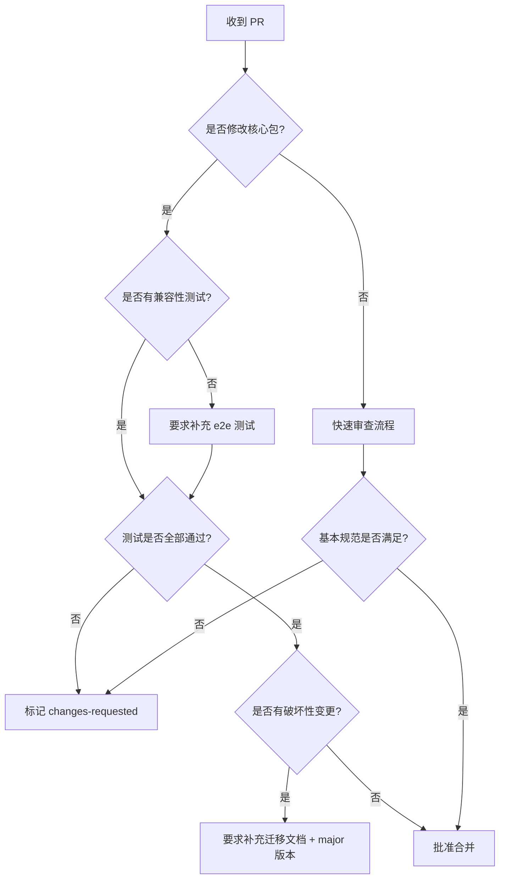

# weapp-tailwindcss 贡献者协作规范

## 文档定位

本规范面向真实的协作场景，聚焦实际问题而非形式主义。维护者与贡献者应共同遵守，以保持项目的可持续发展。

## 核心原则

### 自由与稳定的平衡

| 维度     | 自由贡献区                            | 受控稳定区                                               |
| -------- | ------------------------------------- | -------------------------------------------------------- |
| 代码区域 | 新增 demo、文档、测试用例、非核心插件 | 核心包（weapp-tailwindcss、postcss、injector）、构建配置 |
| 审核强度 | 功能验证 + 基本规范检查               | 架构审查 + 性能评估 + 兼容性测试                         |
| 决策周期 | 快速合并（1-3天）                     | 充分讨论（1-2周）                                        |
| 迭代方式 | 鼓励试错、持续改进                    | 前置设计、严格测试                                       |

### 贡献价值优先级

1. 修复影响用户的 bug
2. 补充缺失的测试覆盖
3. 改善文档质量与案例
4. 新增框架/工具集成支持
5. 性能优化与代码重构
6. 实验性功能探索

## 贡献者容易踩坑的地方

### 环境与工具

#### 常见错误

1. **包管理器混用**
   - 错误：使用 npm/yarn 安装依赖
   - 后果：依赖版本不一致、lockfile 冲突、工具链失效
   - 解决：严格使用 `pnpm install`，项目已配置 only-allow 拦截

2. **Node.js 版本过低**
   - 错误：使用 Node.js 16 或更早版本
   - 后果：构建失败、测试报错、类型检查异常
   - 解决：确保 Node.js >= 18，推荐使用 LTS 20 或 22

3. **忽略 prepare 钩子**
   - 错误：克隆后直接修改代码，不运行 `pnpm install`
   - 后果：git hooks 未安装，提交时绕过 lint-staged 检查
   - 解决：首次克隆后必须运行 `pnpm install` 安装 Husky

#### 执行检查清单

```markdown
克隆仓库后：

- [ ] 检查 Node.js 版本：node -v >= 18
- [ ] 安装依赖：pnpm install
- [ ] 验证构建：pnpm build
- [ ] 验证测试：pnpm test
```

### Monorepo 结构理解

#### 目录边界认知

| 目录              | 用途                 | 修改频率 | 是否核心 |
| ----------------- | -------------------- | -------- | -------- |
| packages/         | 核心功能包           | 中       | 是       |
| packages-runtime/ | 运行时工具库         | 低       | 是       |
| demo/             | 演示应用（内部测试） | 高       | 否       |
| apps/             | 示例应用（集成测试） | 高       | 否       |
| e2e/              | 端到端测试           | 中       | 是       |
| website/          | 文档网站             | 高       | 否       |
| templates/        | 项目模板             | 中       | 否       |

#### 常见错误

1. **workspace 依赖未更新**
   - 错误场景：修改了 `packages/shared` 但未触发 watch 模式，导致 `packages/weapp-tailwindcss` 引用旧版本
   - 解决：开发时运行 `pnpm run:watch` 保持增量构建

2. **交叉依赖破坏**
   - 错误场景：在 `packages/postcss` 中引入 `packages/tailwindcss-injector` 造成循环依赖
   - 解决：核心包之间保持单向依赖，共享逻辑抽取到 `packages/shared`

3. **demo 配置误用**
   - 错误场景：将 demo 的临时配置（如特定的 tailwind.config.js）作为最佳实践推广
   - 解决：demo 用于测试边界场景，正式集成参考 templates 和文档

### 测试编写误区

#### 快照测试滥用

**错误模式**：

```typescript
// 不推荐：直接快照整个大对象
test('should transform styles', () => {
  const result = transform(input)
  expect(result).toMatchSnapshot()
})
```

**问题**：

- 快照体积大、diff 难读
- 无关字段变化导致误报
- 无法明确表达测试意图

**正确模式**：

```typescript
// 推荐：断言关键字段 + 局部快照
test('should transform class names', () => {
  const result = transform(input)
  expect(result.classNames).toEqual(['tw-flex', 'tw-justify-center'])
  expect(result.cssOutput).toMatchSnapshot('transformed-css')
})
```

#### 单元测试与集成测试混淆

| 测试类型   | 位置                       | 执行速度     | 覆盖范围      |
| ---------- | -------------------------- | ------------ | ------------- |
| 单元测试   | packages/\*/\_\_tests\_\_  | 快（毫秒级） | 单个函数/模块 |
| 集成测试   | demo/\*/test、apps/\*/test | 中（秒级）   | 多模块协作    |
| 端到端测试 | e2e/\*.test.ts             | 慢（分钟级） | 完整构建流程  |

**常见错误**：

- 在单元测试中启动完整的 Webpack/Vite 构建
- 在 e2e 测试中重复单元测试的细节断言
- 测试文件命名不规范（如 test.ts 而非 xx.test.ts）

#### 快照更新随意

**风险场景**：

- 运行 `pnpm e2e:u` 后未仔细 review diff
- 快照包含时间戳、路径等不稳定字段
- 快照基线被本地环境污染（如 Windows 换行符）

**防护措施**：

- 更新快照前必须运行 `pnpm e2e` 确认现有测试全部通过
- 使用 `normalize-newline` 等工具标准化输出
- 快照文件独立提交，方便 review diff

### 提交规范理解偏差

#### Conventional Commits 误用

**错误示例**：

```
修复了一个 bug
feat: 更新文档
fix: add new feature
```

**问题分析**：

1. 无类型前缀 → commitlint 拦截失败
2. 类型与内容不符 → 自动生成 changelog 混乱
3. 中英文混用 → 语义不明确

**正确示例**：

```
fix(postcss): handle nested pseudo-class in arbitrary values
feat(injector): add vite 5 compatibility layer
docs(website): update taro integration guide
test(core): add regression test for issue #123
chore(deps): upgrade typescript to 5.9
```

#### Scope 选择混乱

**推荐 scope 映射**：

| Scope    | 对应包/目录                   |
| -------- | ----------------------------- |
| core     | packages/weapp-tailwindcss    |
| postcss  | packages/postcss              |
| injector | packages/tailwindcss-injector |
| runtime  | packages-runtime/\*           |
| cli      | packages/init                 |
| docs     | website/                      |
| demo     | demo/_, apps/_                |
| e2e      | e2e/                          |
| deps     | package.json 依赖更新         |
| ci       | .github/workflows             |

**无明确 scope 时可省略**（如 `chore: update readme`）

### Pull Request 常见问题

#### 描述不清晰

**反面案例**：

```markdown
修复 bug
```

**无法回答的问题**：

- 什么 bug？
- 如何复现？
- 修复方案是什么？
- 是否影响其他功能？

**正面案例**：

```markdown
## 问题描述

在 Taro + Webpack 5 环境下，使用 `@apply` 指令会导致编译报错

## 复现路径

1. 初始化 Taro 项目：pnpm dlx @tarojs/cli init demo
2. 安装 weapp-tailwindcss@3.x
3. 在 app.scss 中使用 @apply text-red-500
4. 运行 pnpm build:weapp

## 错误信息
```

PostCSS plugin weapp-tailwindcss-webpack-plugin failed
Error: Cannot find module 'tailwindcss/resolveConfig'

```

## 修复方案
- 将 resolveConfig 导入路径改为 tailwindcss/lib/util/resolveConfig
- 添加兼容性检测，优先使用新路径，降级使用旧路径

## 测试覆盖
- [ ] 添加单元测试：packages/postcss/__tests__/resolve-config.test.ts
- [ ] 验证 e2e：e2e/taro-app.test.ts 通过
- [ ] 手动测试：demo/taro-app 构建成功
```

#### 未关联 Issue

**问题**：

- 无法追溯需求来源
- 重复解决已知问题
- changelog 生成缺失上下文

**解决**：

- 优先响应 Issue 而非单方面提交
- PR 描述中添加 `Closes #123` 或 `Fixes #456`
- 无关联 Issue 时需在描述中补充背景

#### 代码量过大

**临界值**：

- 单次 PR 变更文件 > 20 个
- 代码行数 > 500 行
- 涉及多个功能模块

**建议**：

- 拆分成多个 PR，按逻辑单元提交
- 先提 RFC Issue 讨论设计，再实现
- 重构与功能分离，不在同一 PR 混合

#### 缺少 Changeset

**Changeset 要求**：

| 变更类型                | 是否需要       | 版本影响 |
| ----------------------- | -------------- | -------- |
| 修复用户可见 bug        | 是             | patch    |
| 新增功能特性            | 是             | minor    |
| 破坏性变更              | 是（必须标注） | major    |
| 内部重构（无 API 变化） | 否             | -        |
| 文档、测试、CI 更新     | 否             | -        |

**操作步骤**：

```bash
pnpm changeset
# 交互式选择：包名、版本类型、变更描述
git add .changeset/*.md
git commit -m "chore: add changeset"
```

## 维护者审核 PR 的关注点

### 第一优先级：架构兼容性

#### 核心包变更检查

**必审项目**：

1. **依赖引入的合理性**
   - 新增 dependencies 是否必要？
   - 是否可用已有依赖替代？
   - 体积影响（使用 `pnpm build:analyze` 检查）

2. **API 设计的向后兼容**
   - 是否破坏现有用户代码？
   - 参数变更是否提供默认值？
   - 废弃的 API 是否标记 @deprecated？

3. **跨框架/工具的适配**
   - Taro、uni-app、原生小程序是否均可用？
   - Webpack 4/5、Vite、Gulp 是否兼容？
   - Node.js 18+ 各版本是否通过测试？

**审查决策树**：



### 第二优先级：测试质量

#### 覆盖率要求

**核心包（强制）**：

- 行覆盖率 >= 80%
- 分支覆盖率 >= 75%
- 关键路径 100% 覆盖

**非核心包（推荐）**：

- 行覆盖率 >= 60%
- 边界场景有测试用例

**验证命令**：

```bash
# 检查特定包的覆盖率
pnpm --filter weapp-tailwindcss test --coverage

# 查看覆盖率报告
open coverage/index.html
```

#### 测试有效性判断

**无效测试特征**：

- 永远不会失败的断言（如 `expect(true).toBe(true)`）
- 测试代码与实现代码完全重复逻辑
- 仅测试 happy path，无边界场景

**有效测试特征**：

- 明确输入输出的对应关系
- 覆盖异常分支（错误输入、网络超时等）
- 包含回归测试（针对历史 bug）

**审查技巧**：

- 人为修改实现代码，观察测试是否能检测到
- 检查测试文件的 Git 提交历史，是否与 bug 修复对应

### 第三优先级：代码质量

#### 自动化工具验证

**CI 流程已覆盖**：

- ESLint：`pnpm lint`
- TypeScript 类型检查：构建时自动执行
- Prettier 格式化：通过 lint-staged 强制执行
- Commitlint：commit-msg 钩子拦截

**维护者无需人工检查**：

- 缩进、空格、引号等格式问题
- 未使用的变量、导入
- 基础的 TypeScript 类型错误

#### 人工审查要点

**代码可读性**：

- 函数命名是否表意清晰？
- 复杂逻辑是否有注释说明？
- 魔法数字/字符串是否提取为常量？

**性能隐患**：

- 是否存在不必要的循环嵌套？
- 正则表达式是否有回溯风险？
- 同步阻塞操作是否可异步化？

**安全性**：

- 是否执行用户输入的代码（eval、Function 构造器）？
- 文件路径是否经过校验（防止路径穿越）？
- 依赖包是否有已知漏洞（通过 npm audit 检查）？

### 第四优先级：文档完整性

#### 必备文档

**功能变更类 PR**：

- 更新对应的 API 文档（website/docs）
- 在 README 中补充使用示例
- 如影响配置，更新配置参考

**Bug 修复类 PR**：

- 在 PR 描述中说明复现路径
- 如属于常见问题，补充到 FAQ

**新增集成类 PR**：

- 提供完整的集成指南
- 添加可运行的 demo 项目
- 说明已知限制和注意事项

#### 文档质量标准

**反面案例**：

```markdown
## 使用方法

安装后直接用就行
```

**正面案例**：

````markdown
## 使用方法

### 安装

```bash
pnpm add -D weapp-tailwindcss-webpack-plugin
```
````

### 配置

在 `webpack.config.js` 中添加插件：

```javascript
const WeappTailwindcssPlugin = require('weapp-tailwindcss-webpack-plugin')

module.exports = {
  plugins: [
    new WeappTailwindcssPlugin({
      // 可选：自定义转换规则
      rem2rpx: true
    })
  ]
}
```

### 验证

运行构建后，检查生成的 CSS 文件中类名是否已转换：

```css
/* 源代码 */
.flex {
  display: flex;
}

/* 编译后 */
.\!flex {
  display: flex;
}
```

### 常见问题

**Q：为什么类名没有转换？**
A：检查 PostCSS 配置是否包含 tailwindcss 插件，需确保执行顺序为：tailwindcss → weapp-tailwindcss-webpack-plugin

**Q：是否支持 Webpack 4？**
A：支持，但需要安装 `postcss@8` 和 `postcss-loader@4`

````

## 最低可接受标准

### 代码标准

#### 必须满足（否则拒绝合并）

| 检查项                 | 验证方式                  | 备注                                 |
| ---------------------- | ------------------------- | ------------------------------------ |
| CI 构建通过            | GitHub Actions 全绿       | 包括 Linux/macOS/Windows 多平台      |
| 无 ESLint 错误         | `pnpm lint` 无报错        | warning 可接受但需说明               |
| 无 TypeScript 类型错误 | `pnpm build` 成功         | any 类型需添加 @ts-expect-error 注释 |
| 测试全部通过           | `pnpm test` 无失败        | 包括单元测试和 e2e                   |
| 提交信息规范           | 符合 Conventional Commits | commitlint 已自动检查                |

#### 推荐满足（可在后续迭代补充）

- 代码覆盖率达标
- 文档完整性
- 性能基准测试

### 文档标准

#### 必须满足

- PR 描述清晰说明变更内容
- 功能变更有对应的文档更新
- 破坏性变更有迁移指南

#### 推荐满足

- 提供使用示例或 demo
- 补充常见问题到 FAQ
- 包含截图或演示 GIF

### 测试标准

#### 必须满足

**功能类变更**：

- 新增代码路径有对应测试
- 修复的 bug 有回归测试
- 核心包变更必须更新 e2e 快照

**文档类变更**：

- 代码示例可正常运行
- 配置示例经过验证

#### 推荐满足

- 边界场景有测试覆盖
- 性能相关变更有 benchmark
- 多框架/工具的兼容性测试

### 快速判断矩阵

| PR 类型   | 代码标准    | 文档标准 | 测试标准         | 预计审查周期 |
| --------- | ----------- | -------- | ---------------- | ------------ |
| 修复 typo | 无要求      | 无要求   | 无要求           | 1 天         |
| 文档补充  | 无要求      | 必须     | 示例可运行       | 2 天         |
| Bug 修复  | 必须        | 必须     | 必须（回归测试） | 3-5 天       |
| 新增功能  | 必须 + 推荐 | 必须     | 必须 + 推荐      | 1-2 周       |
| 核心重构  | 必须 + 推荐 | 必须     | 必须 + 推荐      | 2-4 周       |

## 不遵守规范的处理原则

### 分级响应机制

#### Level 1：自动化拦截（无需人工介入）

**触发场景**：

- CI 构建失败
- ESLint / TypeScript 报错
- Commitlint 拦截不规范提交
- 使用 npm/yarn 而非 pnpm

**处理方式**：

- GitHub Actions 自动标记 PR 为 failed
- 机器人评论指出具体问题和修复建议
- 贡献者本地 git hooks 提前拦截

**示例 Bot 评论**：

```markdown
🤖 自动化检查失败

**问题：ESLint 检查失败**
在 packages/postcss/src/index.ts 中发现 3 个错误：

- Line 45: 'ctx' is defined but never used (no-unused-vars)
- Line 67: Missing return type on function (explicit-function-return-type)

**修复方法：**
运行 `pnpm lint:fix` 自动修复部分问题，手动解决剩余错误后重新提交。
```

#### Level 2：温和提醒（首次违规）

**触发场景**：

- PR 描述过于简略
- 缺少测试覆盖
- 未关联 Issue
- 功能变更未更新文档

**处理方式**：

- 维护者评论指出问题并附解决方案
- 标记 PR 为 `changes-requested`
- 给予 3-7 天修改时间

**示例评论模板**：

```markdown
感谢你的贡献！在合并前需要完善以下内容：

**1. 补充 PR 描述**
请说明：

- 解决了什么问题？
- 如何验证修复有效？

**2. 添加测试用例**
请在 `packages/postcss/__tests__/` 中添加测试，覆盖你修改的逻辑。
参考：[测试编写指南](link)

**3. 更新文档**
新增的 `rem2rpx` 配置项需要在 `website/docs/api/postcss.mdx` 中说明用法。

如有疑问请随时留言，我们会协助你完成改进 👍
```

#### Level 3：强制要求（重复违规或影响严重）

**触发场景**：

- 核心包变更无兼容性测试
- 破坏性变更未标注
- 多次提醒后仍不修改
- 恶意绕过自动化检查

**处理方式**：

- 直接关闭 PR 并说明原因
- 如为重复性问题，引导贡献者先阅读文档
- 严重违规者可能被标记 spam

**示例强制关闭评论**：

```markdown
抱歉，该 PR 暂时无法合并，原因如下：

**架构风险**
该变更修改了 `packages/weapp-tailwindcss/src/core.ts` 的导出接口，但未提供：

1. 兼容性测试（e2e 全部失败）
2. 迁移文档
3. Changeset 标注为 major

这会导致数千名用户的项目构建崩溃。

**建议方案**

1. 先提 Issue 讨论设计方案
2. 如确需破坏性变更，需在新 major 版本发布
3. 小范围优化可通过新增可选参数实现

期待你的新 PR！如有疑问请在 Issue 中讨论。
```

### 特殊情况处理

#### 热修复快速通道

**适用场景**：

- 线上严重 bug（如构建失败、数据丢失）
- 安全漏洞修复
- 关键依赖版本升级（如 Node.js EOL）

**简化流程**：

- 允许先合并后补测试
- 文档可在后续 PR 补充
- 维护者优先 review

**操作步骤**：

1. 贡献者在 PR 标题添加 `[HOTFIX]` 前缀
2. 说明紧急程度和影响范围
3. 维护者 1 小时内响应
4. 合并后立即发布 patch 版本

#### 长期贡献者权限

**认证条件**：

- 累计合并 5+ 个高质量 PR
- 熟悉项目架构和规范
- 积极参与 Issue 讨论

**权限提升**：

- 可直接 approve 低风险 PR（文档、demo）
- 参与核心功能的设计讨论
- 优先获得新特性试用资格

**申请方式**：

- 维护者主动邀请
- 贡献者可在 Issue 中自荐

#### 实验性功能豁免

**适用场景**：

- 标记为 `experimental` 的包
- demo 目录下的探索性代码
- 未正式发布的功能分支

**放宽要求**：

- 允许快速迭代，无需完整测试覆盖
- 文档可标注"实验性，API 可能变更"
- 不纳入稳定性 SLA 考核

**风险控制**：

- 实验性包不发布到 latest tag
- 在文档中明确标注风险提示
- 定期评估是否转正或废弃

### 争议处理

#### 技术分歧

**流程**：

1. 贡献者与维护者在 PR 中充分讨论
2. 如无法达成共识，发起 RFC Issue 公开讨论
3. 投票决定（维护者权重更高）
4. 记录决策依据，避免重复争论

**示例 RFC 模板**：

```markdown
## 背景

当前 PostCSS 插件的转换逻辑在处理伪类时存在性能瓶颈...

## 方案 A：正则表达式优化

优点：改动小、风险低
缺点：无法处理嵌套伪类

## 方案 B：引入 AST 解析

优点：准确性高、可扩展
缺点：依赖体积增加 50KB

## 社区投票

请在评论区投票（👍 支持 A / 👎 支持 B）

## 决策期限

7 天后根据投票结果和维护者意见确定方案
```

#### 行为准则冲突

**违规行为**：

- 人身攻击、歧视性言论
- 恶意刷屏、垃圾 PR
- 泄露他人隐私

**处理流程**：

1. 删除违规内容并警告
2. 重复违规者禁言 1-7 天
3. 严重违规者永久封禁并报告 GitHub

**申诉渠道**：

- 发送邮件至 1324318532@qq.com
- 维护者组内重新评估

## 规范持续改进

### 反馈渠道

**贡献者建议**：

- 在 Issue 中标记 `meta: contributing`
- 描述规范中的不合理之处
- 提出具体改进方案

**维护者复盘**：

- 每季度 review 已合并 PR 的质量
- 统计常见问题并优化文档
- 更新自动化检查规则

### 版本控制

本规范遵循语义化版本：

- **Major**：核心原则变更（如审核流程调整）
- **Minor**：新增检查项或标准
- **Patch**：文案优化、示例补充

**变更通知**：

- 在 GitHub Discussions 公告
- 更新 CONTRIBUTING.md 链接
- 给活跃贡献者发送邮件提醒

## 附录

### 快速参考

#### 新人贡献 Checklist

```markdown
提交 PR 前：

- [ ] 运行 pnpm lint 检查代码规范
- [ ] 运行 pnpm test 确保测试通过
- [ ] 补充或更新相关测试用例
- [ ] 更新文档（如有功能变更）
- [ ] 添加 Changeset（如需发布）
- [ ] 填写完整的 PR 描述
- [ ] 关联相关 Issue（使用 Closes #xxx）
- [ ] 提交信息符合 Conventional Commits
```

#### 常用命令速查

```bash
# 安装依赖
pnpm install

# 本地开发（watch 模式）
pnpm run:watch

# 构建所有包
pnpm build

# 运行测试
pnpm test                    # 所有测试
pnpm test:core              # 核心包测试
pnpm e2e                    # 端到端测试

# 代码检查
pnpm lint                   # 检查问题
pnpm lint:fix               # 自动修复

# 更新快照
pnpm e2e:u                  # 更新 e2e 快照
pnpm test -u                # 更新单元测试快照

# 发布流程
pnpm changeset              # 添加 changeset
pnpm cv                     # 批量更新版本号
pnpm publish-packages       # 发布到 npm
```

#### 关键文件索引

| 文件路径                 | 用途                            |
| ------------------------ | ------------------------------- |
| AGENTS.md                | 项目结构和开发指南（AI 友好版） |
| package.json             | 项目元信息和脚本命令            |
| pnpm-workspace.yaml      | Monorepo 工作区配置             |
| turbo.json               | 构建任务依赖配置                |
| eslint.config.js         | 代码规范配置                    |
| vitest.config.ts         | 测试配置                        |
| .github/workflows/ci.yml | CI 自动化流程                   |
| website/docs/            | 用户文档                        |

### 术语表

| 术语                 | 含义                                         |
| -------------------- | -------------------------------------------- |
| Monorepo             | 单仓库多包架构，通过 pnpm workspaces 管理    |
| Turbo                | 增量构建工具，缓存任务结果加速构建           |
| Changeset            | 版本变更管理工具，自动生成 changelog         |
| Conventional Commits | 结构化提交信息规范（如 `feat:` `fix:`）      |
| Snapshot Testing     | 快照测试，对比输出结果与基线文件             |
| E2E Testing          | 端到端测试，验证完整的构建流程               |
| JIT                  | Just-In-Time 编译，Tailwind CSS 按需生成样式 |
| Escape/Unescape      | 小程序类名转义机制（如 `:` 转为 `\:`）       |
| Polyfill             | 兼容性补丁，支持旧版本环境                   |
| Breaking Change      | 破坏性变更，需升级 major 版本                |

### 联系方式

- **Issue 讨论**：https://github.com/sonofmagic/weapp-tailwindcss/issues
- **GitHub Discussions**：用于非 bug 的讨论交流
- **邮件**：1324318532@qq.com（紧急问题或私密咨询）
````
