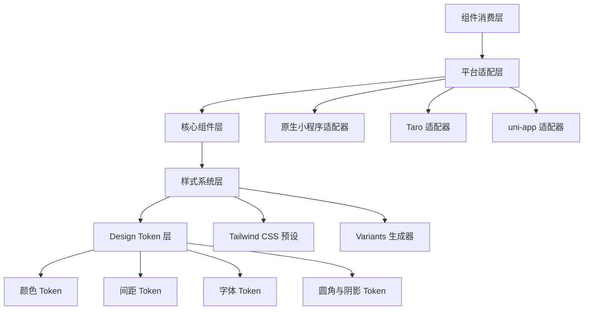
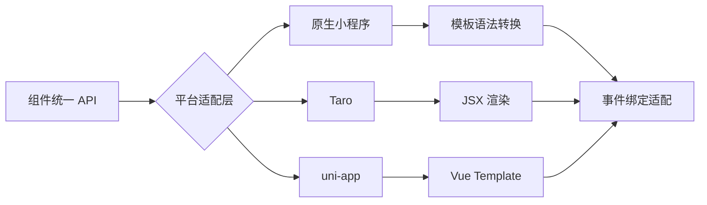
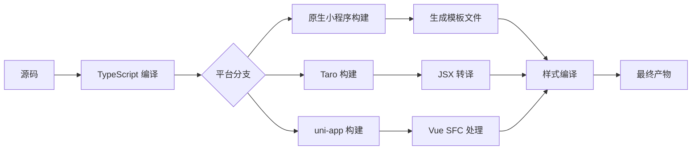

# Headless 组件库设计文档

## 项目概述

为 `packages-runtime/ui` 创建一套完整的 headless 组件库，支持原生微信小程序、uni-app 和 Taro 三大平台。组件设计理念参考 shadcn/ui 的开放代码哲学，采用 Tailwind CSS 作为原子化样式方案，通过 Design Token 实现动态样式注入和主题定制。

### 设计目标

- 提供跨平台一致的组件 API 和交互体验
- 支持通过 Design Token 动态注入和定制样式
- 保持代码开放可修改，开发者拥有完全控制权
- 实现组件的高度可组合性和可预测性
- 确保无障碍访问性（在小程序环境允许的范围内）

### 核心价值

- **开放代码**：开发者可直接修改组件源码以适配特定需求
- **跨平台统一**：单一 API 支持多个小程序平台
- **样式解耦**：逻辑与样式分离，样式由 Design Token 驱动
- **灵活组合**：组件采用统一的组合式接口设计

## 技术架构

### 整体架构层次



### 目录结构设计

```
packages-runtime/ui/
├── src/
│   ├── components/              # 组件源码目录
│   │   ├── core/                # 核心基础组件
│   │   │   ├── button/
│   │   │   │   ├── index.ts              # 组件入口
│   │   │   │   ├── button.native.wxml    # 原生小程序模板
│   │   │   │   ├── button.taro.tsx       # Taro 组件
│   │   │   │   ├── button.uni.vue        # uni-app 组件
│   │   │   │   ├── types.ts              # 类型定义
│   │   │   │   └── README.md             # 组件文档
│   │   │   ├── input/
│   │   │   ├── textarea/
│   │   │   ├── checkbox/
│   │   │   ├── radio/
│   │   │   ├── switch/
│   │   │   └── select/
│   │   ├── feedback/            # 反馈类组件
│   │   │   ├── toast/
│   │   │   ├── modal/
│   │   │   ├── dialog/
│   │   │   ├── alert/
│   │   │   ├── loading/
│   │   │   ├── skeleton/
│   │   │   └── progress/
│   │   ├── data-display/        # 数据展示组件
│   │   │   ├── card/
│   │   │   ├── avatar/
│   │   │   ├── badge/
│   │   │   ├── tag/
│   │   │   ├── list/
│   │   │   ├── table/
│   │   │   └── collapse/
│   │   ├── navigation/          # 导航类组件
│   │   │   ├── tabs/
│   │   │   ├── pagination/
│   │   │   ├── breadcrumb/
│   │   │   ├── menu/
│   │   │   └── dropdown/
│   │   └── layout/              # 布局组件
│   │       ├── grid/
│   │       ├── flex/
│   │       ├── divider/
│   │       └── spacer/
│   ├── adapters/                # 平台适配器
│   │   ├── native.ts            # 原生小程序适配
│   │   ├── taro.ts              # Taro 适配
│   │   └── uni-app.ts           # uni-app 适配
│   ├── hooks/                   # 跨平台 Hooks
│   │   ├── use-controllable-state.ts
│   │   ├── use-previous.ts
│   │   ├── use-toggle.ts
│   │   └── use-disclosure.ts
│   ├── utils/                   # 工具函数
│   │   ├── class-names.ts       # 类名合并
│   │   ├── platform.ts          # 平台检测
│   │   └── accessibility.ts     # 无障碍辅助
│   ├── preset.ts                # Tailwind 预设（已存在）
│   ├── variants.ts              # Variants 定义（已存在）
│   └── index.css                # 样式入口（已存在）
├── scripts/
│   ├── generate-component.ts    # 组件生成脚本
│   └── build-platforms.ts       # 多平台构建脚本
├── test/
│   └── components/              # 组件测试
└── README.md
```

## 平台适配策略

### 适配器设计原则

通过统一的适配器接口抹平三个平台的差异，每个平台适配器负责：

- 事件系统规范化
- 生命周期钩子映射
- 数据绑定机制转换
- 平台特定 API 封装

### 事件系统适配

| 统一事件名  | 原生小程序    | Taro        | uni-app    |
| ----------- | ------------- | ----------- | ---------- |
| onClick     | bindtap       | onClick     | @click     |
| onChange    | bindinput     | onChange    | @input     |
| onFocus     | bindfocus     | onFocus     | @focus     |
| onBlur      | bindblur      | onBlur      | @blur      |
| onLongPress | bindlongpress | onLongPress | @longpress |

### 平台能力对齐



## Design Token 系统

### Token 分层架构

Design Token 采用三层架构：基础层、语义层和组件层

#### 基础层 Token

基础层定义原始设计值，已在 `src/preset.ts` 中实现：

| Token 类别 | CSS 变量前缀 | 示例               |
| ---------- | ------------ | ------------------ |
| 颜色       | --wt-color-  | --wt-color-primary |
| 间距       | --wt-space-  | --wt-space-4       |
| 字体       | --wt-font-   | --wt-font-sans     |
| 圆角       | --wt-radius- | --wt-radius-lg     |
| 阴影       | --wt-shadow- | --wt-shadow-md     |

#### 语义层 Token

语义层将基础 Token 映射到具体用途：

| 语义名称                 | 映射基础 Token             | 用途说明       |
| ------------------------ | -------------------------- | -------------- |
| --wt-button-bg-primary   | --wt-color-primary         | 主要按钮背景色 |
| --wt-button-text-primary | --wt-color-text-on-primary | 主要按钮文字色 |
| --wt-input-border        | --wt-color-border          | 输入框边框色   |
| --wt-card-padding        | --wt-space-4               | 卡片内边距     |

#### 组件层 Token

组件层为每个组件提供可覆盖的特定 Token：

| 组件   | Token 示例            | 默认值引用     |
| ------ | --------------------- | -------------- |
| Button | --wt-button-height    | 88rpx          |
| Button | --wt-button-padding-x | --wt-space-4   |
| Input  | --wt-input-height     | 88rpx          |
| Card   | --wt-card-radius      | --wt-radius-lg |

### Token 动态注入机制

支持运行时通过 JavaScript 动态修改 Token 值：

```
运行时注入流程：
1. 组件初始化时读取默认 Token 值
2. 检查全局配置对象是否有覆盖值
3. 检查组件 props 是否传入自定义 Token
4. 将最终 Token 值转换为内联样式或 class
5. 响应 Token 变化并重新计算样式
```

### 主题切换能力

基于 Token 系统实现主题切换：

| 主题能力      | 实现方式     | 说明                          |
| ------------- | ------------ | ----------------------------- |
| 亮色/暗色模式 | CSS 变量覆盖 | 通过 .dark 类切换 Token 集合  |
| 自定义品牌色  | Token 注入   | 运行时修改 primary 相关 Token |
| 组件级主题    | Props 传递   | 单个组件接收 theme 配置对象   |

## 核心组件设计

### 组件分类与优先级

#### 第一优先级：核心基础组件

| 组件名   | 用途     | 平台支持          | 无障碍要求                  |
| -------- | -------- | ----------------- | --------------------------- |
| Button   | 按钮交互 | 原生/Taro/uni-app | role, aria-label            |
| Input    | 文本输入 | 原生/Taro/uni-app | aria-label, placeholder     |
| Textarea | 多行文本 | 原生/Taro/uni-app | aria-label                  |
| Checkbox | 复选框   | 原生/Taro/uni-app | role=checkbox, aria-checked |
| Radio    | 单选框   | 原生/Taro/uni-app | role=radio, aria-checked    |
| Switch   | 开关     | 原生/Taro/uni-app | role=switch, aria-checked   |
| Select   | 选择器   | 原生/Taro/uni-app | role=combobox               |

#### 第二优先级：反馈类组件

| 组件名   | 用途       | 依赖组件 | 特殊能力           |
| -------- | ---------- | -------- | ------------------ |
| Toast    | 轻提示     | 无       | 自动消失、位置定制 |
| Modal    | 模态框     | Button   | 遮罩层、焦点锁定   |
| Dialog   | 对话框     | Button   | 确认/取消操作      |
| Alert    | 警告提示   | 无       | 多种提示类型       |
| Loading  | 加载指示器 | 无       | 全局/局部加载      |
| Skeleton | 骨架屏     | 无       | 动画效果           |
| Progress | 进度条     | 无       | 百分比显示         |

#### 第三优先级：数据展示组件

| 组件名   | 用途     | 子组件                              | 组合能力           |
| -------- | -------- | ----------------------------------- | ------------------ |
| Card     | 卡片容器 | CardHeader, CardContent, CardFooter | 阴影、边框变体     |
| Avatar   | 头像     | 无                                  | 尺寸变体、占位图   |
| Badge    | 徽章     | 无                                  | 位置定制、数字显示 |
| Tag      | 标签     | 无                                  | 可关闭、颜色变体   |
| List     | 列表     | ListItem                            | 虚拟滚动支持       |
| Table    | 表格     | TableHeader, TableRow, TableCell    | 排序、固定列       |
| Collapse | 折叠面板 | CollapseItem                        | 手风琴模式         |

#### 第四优先级：导航组件

| 组件名     | 用途     | 状态管理      | 路由集成 |
| ---------- | -------- | ------------- | -------- |
| Tabs       | 标签页   | 受控/非受控   | 可选     |
| Pagination | 分页器   | 受控          | 否       |
| Breadcrumb | 面包屑   | 无            | 可选     |
| Menu       | 菜单     | 展开/收起状态 | 否       |
| Dropdown   | 下拉菜单 | 显示/隐藏状态 | 否       |

### 组件 API 设计规范

所有组件遵循统一的 API 设计模式：

#### Props 设计原则

| 属性类别   | 命名规范          | 示例                         | 说明             |
| ---------- | ----------------- | ---------------------------- | ---------------- |
| 变体属性   | variant/tone/size | variant="outline"            | 控制组件外观变体 |
| 状态属性   | is/has 前缀       | disabled, loading            | 布尔状态         |
| 事件回调   | on 前缀           | onClick, onChange            | 事件处理器       |
| 内容插槽   | 具体名称          | leftIcon, suffix             | 内容插入点       |
| 样式覆盖   | className/style   | className="custom"           | 允许样式扩展     |
| Token 覆盖 | tokens 对象       | tokens={{primary:'#ff0000'}} | 组件级 Token     |

#### 组件示例：Button

Button 组件作为参考实现：

##### Props 定义

| Prop 名称 | 类型                                              | 默认值    | 说明       |
| --------- | ------------------------------------------------- | --------- | ---------- |
| variant   | 'solid' \| 'outline' \| 'ghost' \| 'link'         | 'solid'   | 按钮变体   |
| tone      | 'primary' \| 'secondary' \| 'success' \| 'danger' | 'primary' | 按钮色调   |
| size      | 'sm' \| 'md' \| 'lg' \| 'icon'                    | 'md'      | 按钮尺寸   |
| disabled  | boolean                                           | false     | 禁用状态   |
| loading   | boolean                                           | false     | 加载状态   |
| block     | boolean                                           | false     | 块级按钮   |
| leftIcon  | ReactNode/string                                  | undefined | 左侧图标   |
| rightIcon | ReactNode/string                                  | undefined | 右侧图标   |
| onClick   | function                                          | undefined | 点击事件   |
| className | string                                            | undefined | 自定义类名 |
| tokens    | object                                            | undefined | Token 覆盖 |

##### 样式 Variants

通过 `tailwind-variants` 定义样式变体，已在 `src/variants.ts` 中实现基础版本，需扩展为：

| Variant 组合      | 生成类名                     | 视觉效果             |
| ----------------- | ---------------------------- | -------------------- |
| solid + primary   | wt-button wt-button--primary | 蓝色填充背景         |
| outline + primary | wt-button wt-button--outline | 蓝色边框透明背景     |
| ghost + primary   | wt-button wt-button--ghost   | 无边框无背景悬停显示 |
| solid + danger    | wt-button wt-button--danger  | 红色填充背景         |
| sm                | wt-button--small             | 较小尺寸             |
| icon              | wt-button--icon              | 正方形图标按钮       |

##### 平台实现差异

**原生小程序实现要点**

- 使用 button 标签结合 open-type 属性
- 通过 bindtap 绑定点击事件
- 使用 loading 属性显示加载状态
- 通过 disabled 属性控制禁用

**Taro 实现要点**

- 使用 Button 组件或自定义 View
- onClick 事件处理
- 条件渲染 loading 图标
- className 动态拼接

**uni-app 实现要点**

- 使用 button 组件
- @click 事件绑定
- v-if 控制 loading 显示
- :class 动态类名绑定

### 组件示例：Card

Card 组件展示组合式设计：

##### 子组件结构

Card 由多个子组件组合而成：

| 子组件名        | 职责       | 是否必需 |
| --------------- | ---------- | -------- |
| Card            | 根容器     | 是       |
| CardHeader      | 头部区域   | 否       |
| CardTitle       | 标题       | 否       |
| CardDescription | 描述文本   | 否       |
| CardAction      | 头部操作区 | 否       |
| CardContent     | 主要内容   | 否       |
| CardFooter      | 底部区域   | 否       |

##### Props 定义

**Card Props**

| Prop 名称 | 类型                           | 默认值    | 说明         |
| --------- | ------------------------------ | --------- | ------------ |
| shadow    | 'none' \| 'sm' \| 'md' \| 'lg' | 'sm'      | 阴影大小     |
| bordered  | boolean                        | true      | 是否显示边框 |
| hoverable | boolean                        | false     | 悬停效果     |
| className | string                         | undefined | 自定义类名   |

**CardHeader Props**

| Prop 名称 | 类型    | 默认值    | 说明       |
| --------- | ------- | --------- | ---------- |
| divider   | boolean | false     | 显示分割线 |
| className | string  | undefined | 自定义类名 |

##### 组合使用模式

Card 支持灵活的内容组合：

```
基础卡片：
Card > CardContent

标准卡片：
Card > CardHeader > (CardTitle + CardDescription) + CardContent

完整卡片：
Card > CardHeader > (CardTitle + CardDescription + CardAction)
     + CardContent
     + CardFooter
```

### 组件示例：Modal/Dialog

Modal 和 Dialog 展示复杂交互组件设计：

##### 状态管理

| 状态名         | 类型    | 说明             |
| -------------- | ------- | ---------------- |
| visible        | boolean | 显示/隐藏状态    |
| confirmLoading | boolean | 确认按钮加载状态 |
| destroyOnClose | boolean | 关闭时销毁内容   |

##### 交互行为

| 交互场景 | 行为描述           | 可配置性           |
| -------- | ------------------ | ------------------ |
| 遮罩点击 | 默认关闭 Modal     | maskClosable 控制  |
| ESC 键   | Web 环境关闭       | keyboard 控制      |
| 确认操作 | 触发 onOk 回调     | 支持异步操作       |
| 取消操作 | 触发 onCancel 回调 | -                  |
| 焦点锁定 | 聚焦到 Modal 内    | 小程序环境有限支持 |

##### Props 定义

| Prop 名称      | 类型                | 默认值    | 说明             |
| -------------- | ------------------- | --------- | ---------------- |
| visible        | boolean             | false     | 显示状态（受控） |
| title          | string \| ReactNode | undefined | 标题             |
| content        | string \| ReactNode | undefined | 内容             |
| confirmText    | string              | '确定'    | 确认按钮文字     |
| cancelText     | string              | '取消'    | 取消按钮文字     |
| confirmLoading | boolean             | false     | 确认按钮加载状态 |
| showCancel     | boolean             | true      | 显示取消按钮     |
| maskClosable   | boolean             | true      | 点击遮罩关闭     |
| onOk           | function            | undefined | 确认回调         |
| onCancel       | function            | undefined | 取消回调         |
| afterClose     | function            | undefined | 完全关闭后回调   |

### 组件示例：Tabs

Tabs 展示受控/非受控组件模式：

##### 受控与非受控模式

| 模式   | 状态管理 | Props                | 使用场景             |
| ------ | -------- | -------------------- | -------------------- |
| 非受控 | 组件内部 | defaultActiveKey     | 简单场景无需外部控制 |
| 受控   | 外部传入 | activeKey + onChange | 需要同步状态到外部   |

##### 子组件结构

| 子组件名    | 职责           | 数据传递         |
| ----------- | -------------- | ---------------- |
| Tabs        | 容器和状态管理 | 提供 context     |
| TabsList    | 标签栏容器     | 接收 context     |
| TabsTrigger | 单个标签       | tab key 和 label |
| TabsContent | 内容面板       | 对应 tab key     |

##### Props 定义

**Tabs Props**

| Prop 名称        | 类型              | 默认值     | 说明                   |
| ---------------- | ----------------- | ---------- | ---------------------- |
| activeKey        | string            | undefined  | 当前激活的 tab（受控） |
| defaultActiveKey | string            | 第一个 tab | 默认激活（非受控）     |
| onChange         | function          | undefined  | 切换回调               |
| type             | 'line' \| 'card'  | 'line'     | 标签样式类型           |
| position         | 'top' \| 'bottom' | 'top'      | 标签栏位置             |

### 无障碍支持

在小程序环境限制下尽可能提供无障碍支持：

| 组件类型 | ARIA 属性                   | 实现方式       |
| -------- | --------------------------- | -------------- |
| Button   | aria-label, role=button     | 自定义属性传递 |
| Checkbox | aria-checked, role=checkbox | 状态同步       |
| Radio    | aria-checked, role=radio    | 状态同步       |
| Tabs     | role=tablist, role=tab      | 语义化标记     |
| Modal    | aria-modal, aria-labelledby | 小程序有限支持 |

## 样式系统集成

### Tailwind CSS 预设扩展

当前 `src/preset.ts` 提供基础 Token 和工具类，需扩展以支持所有组件：

#### 需要新增的组件样式

| 组件类别 | 预设中添加的类                             | 包含的变体                        |
| -------- | ------------------------------------------ | --------------------------------- |
| Input    | .wt-input, .wt-textarea                    | default, success, error, disabled |
| Select   | .wt-select                                 | default, disabled                 |
| Checkbox | .wt-checkbox                               | checked, indeterminate, disabled  |
| Radio    | .wt-radio                                  | checked, disabled                 |
| Switch   | .wt-switch                                 | checked, disabled                 |
| Modal    | .wt-modal, .wt-modal\_\_mask               | -                                 |
| Dialog   | .wt-dialog                                 | -                                 |
| Tabs     | .wt-tabs, .wt-tabs**nav, .wt-tabs**panel   | line, card                        |
| Collapse | .wt-collapse, .wt-collapse\_\_item         | -                                 |
| Table    | .wt-table, .wt-table**row, .wt-table**cell | striped, bordered                 |

#### 工具类扩展需求

| 工具类类别 | 新增类名                              | 用途               |
| ---------- | ------------------------------------- | ------------------ |
| 布局       | .wt-flex, .wt-grid                    | 弹性布局和网格布局 |
| 定位       | .wt-relative, .wt-absolute, .wt-fixed | 定位相关           |
| 显示       | .wt-block, .wt-inline, .wt-hidden     | 显示控制           |
| 过渡       | .wt-transition, .wt-duration-300      | 动画过渡           |

### Variants 生成器扩展

当前 `src/variants.ts` 已实现 button、badge、card 等组件的 variants，需要为所有新组件添加对应的 variant 定义。

#### Variants 设计模式

每个组件的 variant 函数应遵循此模式：

| 设计元素         | 说明         | 示例                             |
| ---------------- | ------------ | -------------------------------- |
| base             | 基础类名     | 'wt-input'                       |
| variants         | 变体定义对象 | { state: { error: 'is-error' } } |
| defaultVariants  | 默认变体值   | { state: 'default' }             |
| compoundVariants | 复合变体规则 | size=sm + icon → 额外类名        |

### 响应式设计

小程序环境的响应式支持策略：

| 响应式能力 | 实现方式         | 适用场景         |
| ---------- | ---------------- | ---------------- |
| rpx 单位   | 所有尺寸使用 rpx | 自动适配屏幕宽度 |
| 媒体查询   | CSS @media       | 横竖屏、平板适配 |
| 环境变量   | env() 函数       | 安全区域适配     |
| 动态类名   | 根据屏幕尺寸计算 | 复杂响应式逻辑   |

## 开发工具链

### 组件生成脚本

提供 CLI 工具快速生成新组件脚手架：

#### 脚本功能

| 功能     | 命令示例                  | 生成内容                  |
| -------- | ------------------------- | ------------------------- |
| 创建组件 | pnpm gen:component <name> | 生成三平台模板文件        |
| 添加变体 | pnpm gen:variant <name>   | 在 variants.ts 中添加定义 |
| 生成测试 | pnpm gen:test <name>      | 生成测试文件模板          |
| 生成文档 | pnpm gen:doc <name>       | 生成 README.md 模板       |

#### 组件模板结构

生成的组件应包含以下文件：

```
components/<category>/<name>/
├── index.ts                    # 导出入口
├── <name>.native.wxml          # 原生小程序模板
├── <name>.native.wxss          # 原生小程序样式
├── <name>.native.ts            # 原生小程序逻辑
├── <name>.taro.tsx             # Taro 组件
├── <name>.uni.vue              # uni-app 组件
├── types.ts                    # TypeScript 类型定义
├── README.md                   # 组件文档
└── __tests__/
    └── <name>.test.ts          # 测试文件
```

### 多平台构建流程

构建脚本需要为三个平台分别打包：

#### 构建产物

| 平台       | 构建目标        | 产物目录      | 格式         |
| ---------- | --------------- | ------------- | ------------ |
| 原生小程序 | 模板+样式+逻辑  | dist/native/  | wxml/wxss/js |
| Taro       | JSX 组件        | dist/taro/    | tsx/js       |
| uni-app    | Vue 组件        | dist/uni-app/ | vue/js       |
| 通用       | TypeScript 类型 | dist/types/   | d.ts         |

#### 构建步骤



### 测试策略

#### 测试层次

| 测试类型 | 测试目标        | 工具                     | 覆盖率要求 |
| -------- | --------------- | ------------------------ | ---------- |
| 单元测试 | 工具函数、Hooks | Vitest                   | >80%       |
| 组件测试 | 组件渲染和交互  | Vitest + Testing Library | >70%       |
| 集成测试 | 组件组合使用    | Vitest                   | >60%       |
| 快照测试 | 样式输出一致性  | Vitest Snapshot          | 全覆盖     |

#### 测试重点

| 测试项     | 说明                    | 示例                       |
| ---------- | ----------------------- | -------------------------- |
| Props 验证 | 各种 props 组合正确渲染 | variant + tone 组合        |
| 事件处理   | 事件正确触发和传递      | onClick 被调用             |
| 状态变化   | 受控/非受控状态正确更新 | Tabs activeKey 变化        |
| 样式生成   | Variants 生成正确类名   | button({ tone: 'danger' }) |
| 无障碍     | ARIA 属性正确设置       | role 和 aria-\*            |
| 边界情况   | 异常输入处理            | undefined props            |

## 文档与示例

### 组件文档规范

每个组件的 README.md 应包含以下章节：

#### 文档结构

| 章节       | 内容                     | 必需性     |
| ---------- | ------------------------ | ---------- |
| 组件说明   | 用途和使用场景           | 必需       |
| 安装和引入 | 如何导入组件             | 必需       |
| 基础用法   | 最简单的使用示例         | 必需       |
| API 文档   | Props、Events、Slots     | 必需       |
| 样式定制   | Tokens 和 className 用法 | 推荐       |
| 平台差异   | 三平台的使用差异         | 如有则必需 |
| 无障碍     | ARIA 支持说明            | 推荐       |
| 常见问题   | FAQ                      | 可选       |

### 在线示例平台

为三个平台分别提供在线可运行示例：

| 平台       | 示例位置                            | 运行方式         |
| ---------- | ----------------------------------- | ---------------- |
| 原生小程序 | apps/vite-native/pages/components/  | 微信开发者工具   |
| Taro       | demo/taro-app/src/pages/components/ | pnpm dev:weapp   |
| uni-app    | demo/uni-app/pages/components/      | HBuilderX 或 CLI |

## 发布与版本管理

### 包发布策略

| 发布内容 | NPM 包名                       | 版本同步 |
| -------- | ------------------------------ | -------- |
| 完整包   | @weapp-tailwindcss/ui          | 主版本   |
| 样式预设 | @weapp-tailwindcss/ui/preset   | 随主包   |
| Variants | @weapp-tailwindcss/ui/variants | 随主包   |
| 类型定义 | 包含在主包                     | 随主包   |

### 语义化版本控制

| 变更类型 | 版本号变化 | 示例场景       |
| -------- | ---------- | -------------- |
| 重大变更 | Major 版本 | API 不兼容变更 |
| 新增功能 | Minor 版本 | 新增组件       |
| Bug 修复 | Patch 版本 | 修复组件问题   |
| 样式调整 | Patch 版本 | Token 值微调   |

### 变更日志

所有变更记录在 CHANGELOG.md：

| 记录内容   | 格式                            | 说明         |
| ---------- | ------------------------------- | ------------ |
| 版本号     | ## [x.y.z] - YYYY-MM-DD         | 版本和日期   |
| 变更类型   | ### Added/Changed/Fixed/Removed | 分类说明     |
| 组件变化   | - **Component**: 描述           | 具体组件名称 |
| 破坏性变更 | **BREAKING CHANGE**             | 突出显示     |

## 实施路线图

### 阶段一：基础设施（Week 1-2）

| 任务            | 产出           | 验收标准                 |
| --------------- | -------------- | ------------------------ |
| 完善 Token 系统 | 扩展 preset.ts | 覆盖所有组件所需 Token   |
| 搭建平台适配器  | adapters/ 目录 | 三平台事件和生命周期统一 |
| 开发工具脚本    | 组件生成 CLI   | 可快速生成组件脚手架     |
| 配置构建流程    | 构建脚本       | 可打包三平台产物         |

### 阶段二：核心组件（Week 3-5）

| 任务          | 包含组件                                                 | 验收标准             |
| ------------- | -------------------------------------------------------- | -------------------- |
| 基础表单组件  | Button, Input, Textarea, Checkbox, Radio, Switch, Select | 三平台可用且测试通过 |
| Variants 定义 | 为所有表单组件添加 variants                              | 样式变体完整         |
| 单元测试      | 表单组件测试                                             | 覆盖率 >80%          |
| 文档编写      | 各组件 README                                            | 文档完整             |

### 阶段三：反馈类组件（Week 6-7）

| 任务         | 包含组件                                                 | 验收标准    |
| ------------ | -------------------------------------------------------- | ----------- |
| 反馈组件开发 | Toast, Modal, Dialog, Alert, Loading, Skeleton, Progress | 三平台实现  |
| 样式集成     | 添加到 preset.ts                                         | 样式完整    |
| 测试覆盖     | 反馈组件测试                                             | 覆盖率 >70% |
| 示例开发     | 在三个平台示例中演示                                     | 可运行      |

### 阶段四：数据展示组件（Week 8-10）

| 任务         | 包含组件                                        | 验收标准   |
| ------------ | ----------------------------------------------- | ---------- |
| 展示组件开发 | Card, Avatar, Badge, Tag, List, Table, Collapse | 三平台实现 |
| 组合能力验证 | Card 子组件、List 虚拟滚动                      | 功能完整   |
| 性能优化     | 长列表性能                                      | FPS >50    |
| 文档和示例   | 完整文档                                        | 可用       |

### 阶段五：导航与布局组件（Week 11-12）

| 任务         | 包含组件                                     | 验收标准   |
| ------------ | -------------------------------------------- | ---------- |
| 导航组件开发 | Tabs, Pagination, Breadcrumb, Menu, Dropdown | 三平台实现 |
| 布局组件开发 | Grid, Flex, Divider, Spacer                  | 三平台实现 |
| 全面测试     | 所有组件回归测试                             | 无重大 bug |
| 集成测试     | 组件组合场景测试                             | 通过       |

### 阶段六：优化与发布（Week 13-14）

| 任务     | 产出                 | 验收标准       |
| -------- | -------------------- | -------------- |
| 性能优化 | 减小包体积、优化渲染 | 体积 < 目标值  |
| 文档站点 | 完整组件文档网站     | 上线           |
| 示例完善 | 三平台完整示例项目   | 可演示所有组件 |
| 正式发布 | 发布到 NPM           | v1.0.0         |

## 技术风险与对策

### 风险识别

| 风险项            | 影响程度 | 概率 | 对策                       |
| ----------------- | -------- | ---- | -------------------------- |
| 平台 API 差异过大 | 高       | 中   | 适配器抽象，必要时降级功能 |
| 样式表现不一致    | 中       | 高   | 充分测试，建立样式快照     |
| 性能问题          | 中       | 中   | 虚拟化、懒加载、性能监控   |
| 无障碍支持受限    | 低       | 高   | 文档说明限制，尽力而为     |
| 包体积过大        | 中       | 中   | 按需引入、Tree-shaking     |

### 兼容性保障

| 保障措施       | 实施方式                     | 负责人   |
| -------------- | ---------------------------- | -------- |
| 多平台测试     | CI 自动化测试三平台构建      | 开发团队 |
| 样式快照对比   | Vitest snapshot 锁定样式输出 | 开发团队 |
| 真机测试       | 定期在真实设备测试           | QA 团队  |
| 版本兼容性矩阵 | 文档记录支持的框架版本       | 文档团队 |

## 成功标准

### 功能性指标

| 指标       | 目标值           | 衡量方式           |
| ---------- | ---------------- | ------------------ |
| 组件数量   | ≥30 个           | 实际开发组件统计   |
| 平台覆盖   | 3 个平台完整支持 | 每个组件三平台可用 |
| 测试覆盖率 | >75%             | 代码覆盖率报告     |
| 文档完整度 | 100%             | 每个组件有完整文档 |

### 质量指标

| 指标       | 目标值       | 衡量方式       |
| ---------- | ------------ | -------------- |
| Bug 率     | <1%          | Issue 统计     |
| 样式一致性 | 100%         | 快照测试通过率 |
| 无障碍合规 | 尽力而为     | 人工审查       |
| API 稳定性 | 无破坏性变更 | 语义化版本控制 |

### 性能指标

| 指标         | 目标值                     | 衡量方式     |
| ------------ | -------------------------- | ------------ |
| 首次渲染时间 | <100ms                     | 性能测试     |
| 包体积       | 压缩后 <50KB（单组件平均） | Bundlephobia |
| 长列表 FPS   | >50                        | 真机测试     |
| 内存占用     | <10MB 增量                 | 性能监控     |

### 用户体验指标

| 指标       | 目标值            | 衡量方式   |
| ---------- | ----------------- | ---------- |
| API 易用性 | 开发者评分 >4/5   | 用户调研   |
| 文档可读性 | 可读性评分 >4/5   | 用户调研   |
| 上手时间   | <30分钟           | 新用户观察 |
| 社区活跃度 | GitHub Stars >100 | 统计数据   |
