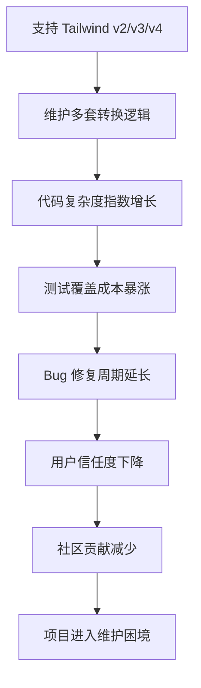
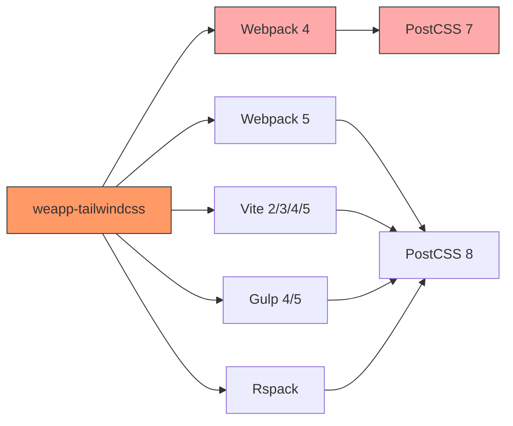
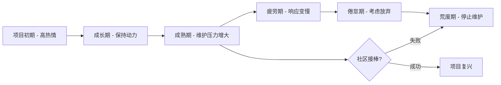
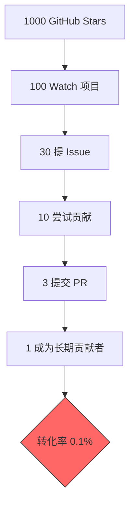
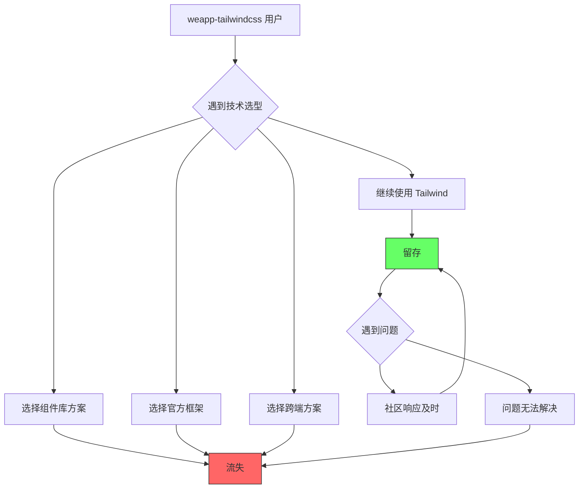
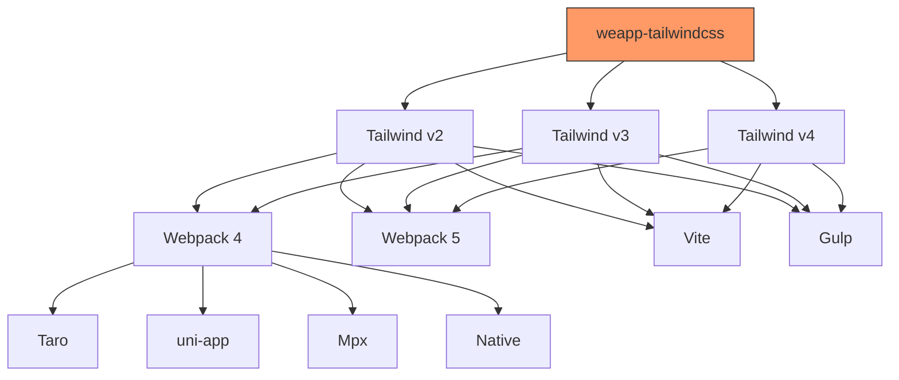

# weapp-tailwindcss 系统失败路径分析

## 文档说明

本文档以悲观但理性的视角，系统性推演 weapp-tailwindcss 可能走向失败或停滞的路径。分析基于技术现实、维护者资源限制、生态演变以及竞争环境，旨在提前识别风险信号并制定应对策略。

## 技术原因导致的失败路径

### 路径一：Tailwind CSS 核心依赖的破坏性变更

#### 风险描述

weapp-tailwindcss 深度依赖 Tailwind CSS 的内部实现机制。项目当前同时支持 Tailwind v2、v3 和 v4 三个主要版本，这种多版本兼容策略面临持续的技术债务累积。

#### 失败场景

- **场景 1：Tailwind v5 引入根本性架构重构**
  - Tailwind CSS 团队完全重写 JIT 引擎或编译器核心
  - 现有的 AST 操作、选择器转换逻辑全部失效
  - `tailwindcss-patch` 包无法继续对新版本进行猴子补丁
  - 需要从零重写核心转换逻辑，工作量巨大

- **场景 2：Tailwind 废弃 PostCSS 插件体系**
  - Tailwind 团队决定放弃 PostCSS 生态，转向自有编译器
  - `@weapp-tailwindcss/postcss` 包的核心架构失去基础
  - 需要完全重构插件系统，风险极高

- **场景 3：Tailwind 内部 API 频繁变更**
  - 每个小版本更新都破坏 weapp-tailwindcss 的内部集成
  - 维护者疲于追赶上游变更
  - 版本锁定导致安全漏洞无法修复

#### 技术债务累积路径



#### 预警信号

- Tailwind CSS 官方 Roadmap 中出现"重大重构"计划
- 连续三个版本的 Breaking Changes 影响 weapp-tailwindcss
- `tailwindcss-patch` 包的补丁成功率低于 80%
- 新版本适配时间超过 2 周

### 路径二：小程序平台规范持续演进导致的不兼容

#### 风险描述

微信、支付宝、抖音等小程序平台持续更新技术规范，可能引入与当前转换逻辑冲突的限制。

#### 失败场景

- **场景 1：平台强制启用 CSS 沙箱隔离**
  - 某主流小程序平台强制要求所有 CSS 选择器符合严格的命名空间规则
  - 现有的 `.` 转换为 `\\.` 的 escape 策略被平台运行时拒绝
  - 所有历史项目的样式在平台更新后失效

- **场景 2：平台禁止特殊字符选择器**
  - 平台出于性能考虑，禁止使用包含 `[`、`]`、`:`、`/` 等特殊字符的选择器
  - Tailwind 的 arbitrary values（如 `w-[100px]`）和修饰符（如 `hover:`）无法工作
  - 核心功能被阉割

- **场景 3：平台 CSS 解析器升级引入不兼容**
  - 新版解析器对转义序列的处理与 weapp-tailwindcss 的假设不一致
  - 部分样式渲染异常但难以复现和调试

#### 平台碎片化陷阱

不同平台的规范不一致，导致：

- 需要维护多套针对不同平台的转换规则
- 跨平台项目配置复杂度急剧上升
- 测试成本呈几何级增长

#### 预警信号

- 某主流平台发布"CSS 规范 2.0"公告
- 多个用户报告新平台版本下样式失效
- 平台官方文档中出现"不推荐使用特殊字符"的建议
- 需要针对单一平台编写超过 3 个 workaround

### 路径三：构建工具生态的快速迭代与弃用

#### 风险描述

项目同时支持 Webpack 4/5、Vite、Gulp、Rspack 等多种构建工具，每种工具都在快速演进。

#### 失败场景

- **场景 1：Webpack 完全退出历史舞台**
  - Vite 和 Rspack 成为绝对主流，Webpack 社区彻底萎缩
  - 维护 Webpack 插件成为纯粹的技术债务
  - 但大量老项目仍依赖 Webpack，无法抛弃

- **场景 2：Vite 引入 Lightning CSS 替代 PostCSS**
  - Vite 团队出于性能考虑，默认使用 Lightning CSS
  - PostCSS 插件系统被边缘化
  - 需要完全重写 Vite 集成层

- **场景 3：构建工具插件 API 频繁破坏性变更**
  - Rspack 每个大版本都改变插件 Hooks 机制
  - 维护者需要同时跟踪 5+ 个构建工具的 API 变更
  - 人力资源完全耗尽

#### 依赖地狱示意图



#### 预警信号

- Webpack 周下载量连续 6 个月下降超过 20%
- 主流框架（Taro、uni-app）宣布放弃某个构建工具支持
- 需要同时维护 5 个以上构建工具插件版本
- 某个构建工具的集成代码超过 1000 行且复杂度持续上升

### 路径四：性能瓶颈引发的用户流失

#### 风险描述

随着项目规模增大，编译转换过程的性能问题逐渐暴露，成为用户体验的关键痛点。

#### 失败场景

- **场景 1：大型项目编译时间不可接受**
  - 包含 10000+ 文件的项目，冷启动编译超过 5 分钟
  - HMR（热更新）响应时间超过 3 秒
  - 开发者体验极差，转向其他方案

- **场景 2：运行时库体积膨胀**
  - `@weapp-tailwindcss/merge`、`cva` 等运行时库体积持续增长
  - 小程序包体积限制越来越严格
  - 用户被迫放弃运行时功能

- **场景 3：内存泄漏导致构建失败**
  - 长时间运行的 watch 模式下，内存占用持续增长
  - 最终导致 Node.js OOM 崩溃
  - 持续集成（CI）环境下频繁失败

#### 性能衰退路径

| 项目规模 | 文件数    | 编译时间 | 用户耐受阈值 | 流失风险 |
| -------- | --------- | -------- | ------------ | -------- |
| 小型     | < 500     | < 10s    | 30s          | 低       |
| 中型     | 500-2000  | 30s-1m   | 1m           | 中       |
| 大型     | 2000-5000 | 1m-3m    | 2m           | 高       |
| 超大型   | > 5000    | > 3m     | 2m           | 极高     |

#### 预警信号

- GitHub Issues 中出现连续 3 个以上性能相关投诉
- 用户开始在社区询问"如何优化编译速度"
- Benchmark 测试显示性能较上一版本下降超过 30%
- 内存使用峰值超过 2GB

### 路径五：TypeScript 类型系统的维护困境

#### 风险描述

项目导出了大量类型定义（见 `typesVersions` 配置），类型系统的准确性和一致性维护成本极高。

#### 失败场景

- **场景 1：类型定义与实际行为不一致**
  - 用户基于类型定义编写代码，运行时却报错
  - 类型安全承诺被打破，信任崩塌

- **场景 2：TypeScript 版本兼容性问题**
  - 新版 TypeScript 引入更严格的类型检查
  - 现有类型定义产生大量编译错误
  - 需要同时兼容 TS 4.x 和 TS 5.x

- **场景 3：泛型推导失败**
  - 运行时库的复杂泛型推导在边缘情况下失败
  - 用户需要手动编写类型断言
  - 开发体验大幅下降

#### 预警信号

- TypeScript 相关 Issue 数量占比超过 20%
- 需要在文档中频繁说明"类型断言解决方案"
- 类型测试覆盖率低于 60%

## 维护者精力枯竭导致的风险

### 路径六：单点维护者风险

#### 现状分析

根据 package.json 信息，项目主要由单一维护者（ice breaker）驱动。这种模式存在严重的单点故障风险。

#### 失败场景

- **场景 1：维护者精力分散**
  - 维护者同时维护多个项目（如 weapp-vite）
  - 对 weapp-tailwindcss 的响应时间从天级延长到周级、月级
  - 关键 Bug 长期无人修复

- **场景 2：维护者职业转变**
  - 维护者转换工作领域，不再接触小程序开发
  - 对小程序生态的敏感度下降
  - 无法及时响应平台变化

- **场景 3：维护者倦怠（Burnout）**
  - 长期应对 Issue、PR、技术债务导致疲劳
  - 主动贡献意愿下降
  - 项目更新频率逐渐降低

#### 维护者精力衰减曲线



#### 响应时间退化指标

| 时期   | 平均响应时间 | Issue 解决率 | 月更新频率 | 风险等级 |
| ------ | ------------ | ------------ | ---------- | -------- |
| 健康期 | < 24h        | > 80%        | 2-4 次     | 低       |
| 预警期 | 2-7 天       | 60-80%       | 1-2 次     | 中       |
| 危险期 | 7-30 天      | 40-60%       | < 1 次     | 高       |
| 停滞期 | > 30 天      | < 40%        | 不定期     | 极高     |

#### 预警信号

- 连续 3 个月无新版本发布
- 高优先级 Issue 超过 7 天无回复
- PR 平均合并时间超过 30 天
- 维护者在 Issue 中表达"精力有限"、"抱歉延迟"等措辞

### 路径七：社区贡献者参与度不足

#### 风险描述

项目缺乏活跃的核心贡献者团队，外部贡献难以形成合力。

#### 失败场景

- **场景 1：贡献门槛过高**
  - 项目采用 Monorepo 架构，包含 19 个 packages
  - 新贡献者需要理解复杂的依赖关系和构建流程
  - 首次贡献成本高，挫败感强

- **场景 2：文档不足导致贡献困难**
  - CONTRIBUTING.md 仅有 2 行内容
  - 缺乏架构文档、贡献指南、Code Review 标准
  - 潜在贡献者无从下手

- **场景 3：贡献未被及时认可**
  - PR 长期挂起无人 Review
  - 贡献者热情消退
  - 项目失去吸引新鲜血液的能力

#### 贡献者漏斗模型



#### 预警信号

- 过去 6 个月外部 PR 少于 5 个
- 贡献者重复率低于 20%（大多数人只贡献一次）
- GitHub Insights 显示活跃贡献者数量持续下降
- 社区 QQ 群/Discord 活跃度低于每周 10 条消息

### 路径八：文档和知识传承的断裂

#### 风险描述

项目积累了大量隐性知识，但文档化程度不足，维护者变更时知识无法传承。

#### 失败场景

- **场景 1：核心设计决策未记录**
  - 为什么选择某种 escape 策略？
  - 某个 workaround 是解决什么平台 bug？
  - 新维护者无法理解历史包袱，不敢重构

- **场景 2：调试知识流失**
  - 某些 Bug 的 Root Cause 只有原维护者知道
  - 相同问题重复出现，每次都需要重新调查

- **场景 3：测试用例语义不明**
  - 测试覆盖率虽高，但缺乏说明"为什么需要这个测试"
  - 测试失败时，维护者不知道是功能回归还是测试过时

#### 预警信号

- 代码中出现大量 `// TODO`、`// FIXME` 注释无人处理
- 关键逻辑缺少注释说明
- 架构文档最后更新时间超过 1 年
- 新维护者上手时间超过 2 周

## 生态与用户预期失配的后果

### 路径九：目标用户群体技术栈转移

#### 风险描述

小程序开发生态本身可能发生根本性转变，导致 weapp-tailwindcss 的用户基础流失。

#### 失败场景

- **场景 1：小程序开发框架转向组件化 UI 库**
  - 开发者更倾向使用 Vant Weapp、Taro UI 等现成组件库
  - Tailwind 的原子化 CSS 思想与组件库封装理念冲突
  - 用户认为"不如直接用组件库"

- **场景 2：小程序平台引入官方 UI 框架**
  - 微信推出"微信原生 UI 框架 2.0"
  - 官方框架性能更优、集成更好
  - 第三方样式方案被边缘化

- **场景 3：小程序开发衰退，跨端方案崛起**
  - Flutter、React Native、Kotlin Multiplatform 成为主流
  - 开发者直接构建原生 App 而非小程序
  - 小程序特定工具失去市场

#### 用户流失路径图



#### 预警信号

- 新增 Star 数量连续 3 个月下降
- npm 周下载量连续 6 个月下降超过 15%
- 用户在 Issue 中提问"为什么不用组件库"
- 主流小程序教程/课程不再推荐 Tailwind CSS

### 路径十：用户期望膨胀与实际能力不匹配

#### 风险描述

用户期待 weapp-tailwindcss 解决所有小程序样式问题，但项目实际能力有限。

#### 失败场景

- **场景 1：期待零配置开箱即用**
  - 用户希望"安装即用，无需任何配置"
  - 但实际需要配置 PostCSS、构建工具插件、Tailwind config
  - 新手受挫，负面评价增多

- **场景 2：期待完美兼容所有 Tailwind 特性**
  - 用户使用 Tailwind 的任意值（`w-[calc(100%-20px)]`）
  - 某些边缘情况无法正确转换
  - 用户认为"不够成熟"

- **场景 3：期待解决所有平台差异**
  - 用户期望一份代码在微信、支付宝、抖音完全一致
  - 但不同平台的 CSS 特性本身存在差异
  - 项目无法违背物理规律

#### 期望与能力落差模型

| 用户期望           | 项目实际能力           | 落差等级 | 潜在冲突         |
| ------------------ | ---------------------- | -------- | ---------------- |
| 零配置             | 需要配置插件和 PostCSS | 中       | 学习曲线陡峭     |
| 100% Tailwind 兼容 | 95% 常用特性 + 5% 限制 | 低       | 边缘案例报错     |
| 跨平台完全一致     | 尽力而为，依赖平台能力 | 高       | 平台差异引发争议 |
| 性能无损           | 编译时间增加 10-30%    | 中       | 大项目体验下降   |
| 持续更新           | 取决于维护者精力       | 高       | 长期支持不确定   |

#### 预警信号

- Issue 中频繁出现"为什么不支持 XXX"
- 用户对"需要配置"表达不满
- 对比竞品时被列为"配置复杂"
- 文档 FAQ 部分持续膨胀，说明常见误解多

### 路径十一：生态割裂导致的碎片化

#### 风险描述

项目支持的框架和构建工具过多，导致无法保证所有组合的一致性体验。

#### 失败场景

- **场景 1：不同框架体验差异过大**
  - Taro 用户体验完美，uni-app 用户频繁报错
  - 用户社区分裂，互相抱怨
  - 维护者疲于调和矛盾

- **场景 2：版本组合爆炸**
  - Tailwind v3 + Webpack 5 + Taro 3.x + Node 18 = 可用
  - Tailwind v4 + Vite 5 + uni-app + Node 20 = 问题多
  - 测试矩阵无法覆盖所有组合
  - 用户踩坑概率高

- **场景 3：文档无法穷尽所有场景**
  - 用户使用 Mpx + Gulp + Tailwind v4，文档无相关说明
  - 配置全靠试错，体验极差

#### 支持矩阵复杂度



组合总数：3 × 4 × 4 = **48 种可能配置**（简化模型，实际更多）

#### 预警信号

- 新 Issue 中超过 30% 无法在标准配置下复现
- 需要针对特定框架编写专门文档
- 维护者回复"这个组合我没测试过"
- CI 测试矩阵超过 20 个组合但仍有遗漏

## 竞争方案出现后的冲击

### 路径十二：官方或巨头推出竞品

#### 风险描述

Tailwind CSS 官方或小程序平台方推出官方支持方案，weapp-tailwindcss 沦为非官方替代品。

#### 失败场景

- **场景 1：Tailwind Labs 官方支持小程序**
  - Tailwind CSS v5 发布"Mini Program Mode"
  - 官方方案性能更优、支持更好
  - weapp-tailwindcss 的存在价值被质疑

- **场景 2：微信团队推出官方 Tailwind 插件**
  - 微信开发者工具内置"原子化 CSS 编译器"
  - 深度集成，零配置使用
  - 第三方方案被官方方案碾压

- **场景 3：主流框架（Taro/uni-app）内置 Tailwind 支持**
  - Taro 4.x 直接集成 Tailwind 转换逻辑
  - 用户无需额外安装插件
  - weapp-tailwindcss 成为冗余依赖

#### 官方竞品冲击路径

```mermaid
graph LR
    A[官方方案发布] --> B[技术媒体报道]
    B --> C[用户尝试新方案]
    C --> D{对比体验}
    D --> E[官方方案更优]
    D --> F[weapp-tailwindcss 仍有优势]

    E --> G[大量用户迁移]
    G --> H[GitHub Issues 变成"如何迁移"]
    H --> I[项目维护者失去动力]
    I --> J[项目归档]

    F --> K[保留差异化价值]
    K --> L[小众但稳定]
```

#### 预警信号

- Tailwind Labs 或微信团队招聘"小程序方向工程师"
- 官方 Roadmap 出现"小程序支持"计划
- 主流框架维护者提出"内置 Tailwind 支持"的 RFC
- 技术会议上出现"官方 Tailwind 小程序方案"的议题

### 路径十三：更优雅的竞品方案出现

#### 风险描述

社区出现技术路径更优、体验更好的竞品，抢占市场份额。

#### 失败场景

- **场景 1：基于 Rust 的高性能编译器**
  - 竞品使用 SWC/Oxc 实现编译逻辑，性能提升 10 倍
  - weapp-tailwindcss 的 Node.js 实现相形见绌

- **场景 2：零运行时方案**
  - 竞品实现完全静态编译，无需任何运行时库
  - weapp-tailwindcss 的 `@weapp-tailwindcss/merge` 等运行时成为负担

- **场景 3：更好的开发者体验**
  - 竞品提供可视化配置界面、实时预览、错误诊断工具
  - weapp-tailwindcss 仅提供 CLI，体验落后

#### 竞品优势对比表

| 维度       | weapp-tailwindcss | 假想竞品         | 用户选择倾向 |
| ---------- | ----------------- | ---------------- | ------------ |
| 编译性能   | 基准              | 快 10 倍（Rust） | ← 竞品       |
| 包体积     | 中等              | 零运行时         | ← 竞品       |
| 配置复杂度 | 需手动配置        | 零配置           | ← 竞品       |
| 生态成熟度 | 高（多年积累）    | 低（新项目）     | weapp-tw →   |
| 社区支持   | 中等              | 初期较少         | weapp-tw →   |

#### 预警信号

- GitHub Trending 出现类似定位的新项目
- 技术社区开始对比 weapp-tailwindcss 与竞品
- 有用户在 Issue 中询问"和 XXX 比有什么优势"
- 竞品的 Star 增长速度超过 weapp-tailwindcss

### 路径十四：无代码/低代码平台的冲击

#### 风险描述

小程序开发向无代码/低代码方向发展，手写样式的需求下降。

#### 失败场景

- **场景 1：拖拽式小程序搭建平台普及**
  - 用户通过图形界面搭建小程序，不接触代码
  - Tailwind CSS 的应用场景消失

- **场景 2：AI 辅助开发取代手动编码**
  - AI 工具根据设计稿直接生成小程序代码
  - 开发者不再关心样式方案选择

#### 预警信号

- 主流技术媒体大量报道小程序低代码平台
- 搭建平台的市场份额持续增长
- 传统手写代码开发的小程序数量下降

## 危险信号清单

### 红色预警（极高风险，项目可能在 6 个月内停滞）

- [ ] 主维护者连续 3 个月无任何 Commit
- [ ] 高优先级 Bug 超过 30 天无响应
- [ ] npm 周下载量下降超过 50%
- [ ] Tailwind 官方宣布重大架构重构且预览版不兼容
- [ ] 主流小程序平台发布不兼容的 CSS 规范更新
- [ ] 出现获得大量关注的直接竞品（3 个月内 Star 破千）

### 黄色预警（中度风险，项目面临挑战但仍可控）

- [ ] 平均 Issue 响应时间超过 7 天
- [ ] 过去 6 个月外部 PR 少于 3 个
- [ ] 需要同时维护 3 个以上 Tailwind 主版本
- [ ] 某个框架集成出现持续性兼容问题
- [ ] 大型项目编译时间投诉增多
- [ ] 文档过时问题被多次提及

### 绿色预警（低风险，需要关注但暂无紧迫性）

- [ ] 某个次要功能长期无人使用
- [ ] 测试覆盖率下降超过 10%
- [ ] 依赖包出现安全漏洞警告
- [ ] 社区活跃度小幅下降
- [ ] 新框架或构建工具支持请求增多

## 可提前干预的措施

### 技术层面

#### 措施 1：建立 Tailwind 版本适配优先级策略

**目标**：避免多版本支持导致的资源消耗过度

**行动计划**：

- 明确版本生命周期：
  - Tailwind v4：主要支持版本
  - Tailwind v3：维护模式（仅修复严重 Bug）
  - Tailwind v2：废弃状态（社区自助）

- 在文档显著位置标注推荐版本
- 设定版本弃用 Timeline（例如：Tailwind v2 支持至 2025 年底）
- 为弃用版本提供迁移指南

**预期收益**：

- 减少 60% 的版本兼容性测试工作量
- 集中资源优化核心版本体验
- 降低代码复杂度

#### 措施 2：构建平台兼容性测试矩阵

**目标**：提前发现平台规范变更导致的不兼容

**行动计划**：

- 创建自动化测试，覆盖主流平台：
  - 微信小程序（正式版 + Beta 版）
  - 支付宝小程序
  - 抖音小程序
  - uni-app 编译产物

- 每周执行一次兼容性测试
- 订阅各平台的开发者更新公告
- 建立平台 Bug 数据库

**预期收益**：

- 提前 1-2 个月发现平台不兼容问题
- 争取应对时间窗口

#### 措施 3：性能预算机制

**目标**：防止性能衰退

**行动计划**：

- 设定性能基准：
  - 1000 文件项目冷启动 < 30s
  - HMR 响应 < 1s
  - 内存占用峰值 < 500MB

- 在 CI 中集成性能测试
- 超出预算的 PR 不允许合并
- 定期发布性能报告

**预期收益**：

- 性能回归问题及时暴露
- 用户体验稳定

#### 措施 4：插件架构解耦

**目标**：降低构建工具绑定风险

**行动计划**：

- 抽取核心转换逻辑为独立包（`@weapp-tailwindcss/core`）
- 各构建工具插件仅作为薄封装层
- 核心逻辑的测试独立于构建工具

**预期收益**：

- 新增构建工具支持的成本降低 70%
- 某个构建工具淘汰时影响范围可控

#### 措施 5：类型测试自动化

**目标**：保证 TypeScript 类型定义的准确性

**行动计划**：

- 使用 `tsd` 工具编写类型测试用例
- 在 CI 中运行类型测试
- 覆盖所有导出 API 的类型推导场景

**预期收益**：

- 类型定义错误在发布前被拦截
- 提升类型安全承诺的可信度

### 组织层面

#### 措施 6：培养核心贡献者团队

**目标**：降低单点维护者风险

**行动计划**：

- 识别活跃贡献者，邀请成为 Collaborator
- 赋予代码审查和合并权限
- 建立定期同步机制（每月线上会议）
- 为贡献者提供：
  - 致谢墙（README 展示）
  - 优先技术支持
  - 小型奖励（如贴纸、T 恤）

**预期收益**：

- 维护工作分散到 3-5 人
- Issue 响应时间缩短 50%
- 项目持续性增强

#### 措施 7：完善贡献者文档

**目标**：降低贡献门槛

**行动计划**：

- 编写详细的 CONTRIBUTING.md：
  - 项目架构图
  - 本地开发环境搭建
  - 代码风格规范
  - PR 提交流程
  - Code Review 标准

- 创建"Good First Issue"标签
- 为新贡献者提供一对一指导

**预期收益**：

- 首次贡献成功率提升 200%
- 外部 PR 数量增加 3 倍

#### 措施 8：建立知识库

**目标**：沉淀隐性知识，实现知识传承

**行动计划**：

- 在项目 Wiki 或独立仓库建立知识库：
  - 架构设计决策记录（ADR）
  - 常见问题根因分析
  - 平台特定 Bug 和 Workaround
  - 性能优化技巧

- 每次重大决策都记录 ADR
- 鼓励贡献者补充文档

**预期收益**：

- 新维护者上手时间缩短 60%
- 减少重复性调查工作

#### 措施 9：社区运营激活

**目标**：提升社区活跃度和归属感

**行动计划**：

- 定期（每季度）举办线上交流会：
  - 分享最佳实践
  - 收集用户反馈
  - 展示社区案例

- 建立 Discord/Slack 社区（相比 QQ 群更国际化）
- 发布月度/季度进展报告
- 评选"月度贡献者"

**预期收益**：

- 社区凝聚力增强
- 用户变成倡导者（Advocate）
- 自发帮助新手，减轻维护者压力

### 生态层面

#### 措施 10：明确项目定位和边界

**目标**：管理用户期望，避免期望膨胀

**行动计划**：

- 在 README 清晰说明：
  - 项目适用场景
  - 不适用场景（如：完全不关心样式复用的项目）
  - 功能边界（明确不会支持的特性）

- FAQ 部分前置常见误解
- 提供决策树帮助用户判断是否适合使用

**预期收益**：

- 减少 30% 的"为什么不支持 XXX"类 Issue
- 用户满意度提升（期望管理）

#### 措施 11：差异化竞争策略

**目标**：在竞品环境中保持优势

**行动计划**：

- 持续投入独特价值点：
  - 运行时库生态（cva、variants、merge）
  - 多框架深度集成经验
  - 完善的中文文档和社区支持

- 关注竞品动态，快速响应优势特性
- 与主流框架（Taro/uni-app）维护者建立联系，成为推荐方案

**预期收益**：

- 即使出现竞品，仍保留差异化优势
- 用户忠诚度提升

#### 措施 12：生态合作与整合

**目标**：成为生态的一部分而非孤岛

**行动计划**：

- 与 Tailwind CSS 官方社区建立联系
  - 分享小程序适配经验
  - 贡献上游 Issue/PR（如有需要）

- 与小程序框架维护者合作：
  - 提供官方集成指南
  - 贡献到框架文档

- 参与技术会议和分享：
  - 发表技术博客
  - 在会议上分享案例

**预期收益**：

- 提升项目知名度和权威性
- 获得官方或半官方背书
- 吸引更多用户和贡献者

### 监控层面

#### 措施 13：建立健康度仪表板

**目标**：实时监控项目健康状况

**行动计划**：

- 设置监控指标：
  - GitHub Stars/Forks 增长曲线
  - npm 下载量趋势
  - Issue 打开/关闭比例
  - PR 平均合并时间
  - 测试覆盖率
  - 构建性能基准

- 使用工具自动生成报告（如 GitHub Insights + 自定义脚本）
- 每月 Review 健康度数据

**预期收益**：

- 问题早期发现
- 数据驱动决策

#### 措施 14：用户反馈收集机制

**目标**：了解真实用户痛点和期望

**行动计划**：

- 每半年进行一次用户调研：
  - 使用场景
  - 痛点问题
  - 功能期望
  - 满意度评分

- 在文档网站添加反馈按钮
- 分析 Issue 标签分布，识别高频问题

**预期收益**：

- 需求优先级更清晰
- 避免闭门造车

## 哪些失败是"可以接受的"

### 可接受的失败 1：不再支持过时的技术栈

**场景**：停止对 Webpack 4、PostCSS 7、Tailwind v2 的支持

**理由**：

- 这些技术栈已进入生命周期末期
- 维护它们的成本远超收益
- 绝大多数用户已迁移到新版本

**应对策略**：

- 提前 6 个月宣布弃用计划
- 提供详细的迁移指南
- 在最后一个支持版本做好文档归档

**可接受原因**：

资源有限的开源项目必须聚焦，无限期支持老技术是不可持续的。

### 可接受的失败 2：不支持某些小众框架

**场景**：不再新增对 Remax、Rax 等使用量极低框架的支持

**理由**：

- 这些框架的用户基数不足 1%
- 投入产出比极低
- 社区缺乏相应技术栈的贡献者

**应对策略**：

- 在文档说明"社区贡献支持"
- 提供通用集成指南，由社区自助适配
- 不拒绝相关 PR，但不主动维护

**可接受原因**：

每个开源项目都有边界，不可能覆盖所有技术栈。

### 可接受的失败 3：放弃 100% Tailwind 特性兼容

**场景**：某些极其复杂的任意值（如嵌套 `calc`）无法完美转换

**理由**：

- 这些边缘情况的使用频率极低（< 0.1%）
- 完美支持需要实现完整的 CSS 解析器，成本过高
- 用户可以通过其他方式（如内联样式）规避

**应对策略**：

- 在文档清晰列出"已知限制"
- 提供替代方案
- 收集边缘情况的真实使用数据，评估是否值得支持

**可接受原因**：

帕累托法则：80% 的价值来自 20% 的功能。优先保证核心功能的稳定性。

### 可接受的失败 4：项目进入"维护模式"

**场景**：不再开发新功能，仅修复严重 Bug 和安全漏洞

**理由**：

- 项目已足够成熟，功能完备
- 维护者精力转移到其他项目
- 用户需求趋于稳定

**应对策略**：

- 在 README 明确标注项目状态
- 告知用户项目稳定但不活跃开发
- 欢迎社区 Fork 和继续发展

**可接受原因**：

并非所有项目都需要永远活跃。一个稳定、功能完备、低 Bug 的项目进入维护模式是正常生命周期。

### 可接受的失败 5：被官方方案取代

**场景**：Tailwind CSS 官方或小程序平台官方推出更优方案

**理由**：

- 官方方案拥有更多资源和更深度的集成能力
- 这是技术进步的自然结果
- weapp-tailwindcss 的历史使命已完成（推动了生态发展）

**应对策略**：

- 积极拥抱官方方案，提供迁移指南
- 将项目定位调整为"遗留项目兼容方案"
- 为历史用户提供有限支持

**可接受原因**：

开源项目的价值不仅在于自身，更在于推动生态进步。如果官方方案出现，说明项目的探索是成功的。

### 不可接受的失败：无声消失

**场景**：维护者突然停止维护，没有任何通知或交接

**为什么不可接受**：

- 对依赖项目的用户极不负责
- 损害开源社区的信任
- 浪费了项目积累的价值

**避免方法**：

- 维护者如需停止维护，提前 3 个月公告
- 尝试寻找接任者
- 如无人接任，明确标记项目为"无维护状态"
- 归档项目但保留只读访问

## 失败路径总结表

| 失败路径                    | 触发因素     | 严重程度 | 可干预性 | 优先级 |
| --------------------------- | ------------ | -------- | -------- | ------ |
| Tailwind 核心依赖破坏性变更 | 技术演进     | 极高     | 低       | P0     |
| 小程序平台规范不兼容        | 平台更新     | 高       | 中       | P0     |
| 构建工具生态快速迭代        | 技术演进     | 高       | 中       | P1     |
| 性能瓶颈引发用户流失        | 项目规模     | 中       | 高       | P1     |
| TypeScript 类型维护困境     | 复杂度累积   | 中       | 高       | P2     |
| 单点维护者风险              | 人力资源     | 极高     | 高       | P0     |
| 社区贡献者参与度不足        | 社区运营     | 高       | 高       | P1     |
| 文档知识传承断裂            | 文档缺失     | 中       | 高       | P2     |
| 目标用户群体技术栈转移      | 市场变化     | 中       | 低       | P2     |
| 用户期望与能力不匹配        | 期望管理     | 中       | 高       | P2     |
| 生态碎片化                  | 支持范围过广 | 中       | 高       | P1     |
| 官方或巨头竞品冲击          | 市场竞争     | 高       | 低       | P1     |
| 社区竞品出现                | 市场竞争     | 中       | 中       | P2     |
| 无代码/低代码平台冲击       | 技术范式转移 | 低       | 低       | P3     |

**优先级说明**：

- P0：需要立即采取行动
- P1：需要在 3 个月内制定应对计划
- P2：需要持续关注并定期评估
- P3：了解趋势但暂不需行动

## 最后的思考

weapp-tailwindcss 作为一个开源项目，其生命周期受到技术演进、维护者精力、生态变迁和市场竞争等多重因素影响。失败不一定是坏事，关键是：

1. **坦然面对失败的可能性**：没有项目能永远繁荣，接受生命周期是成熟的表现。

2. **尽力延长有效生命**：通过提前干预措施，最大化项目的价值交付期。

3. **优雅地退出**：如果失败不可避免，以负责任的方式处理，不留烂摊子。

4. **传承价值**：即使项目停止，其设计思想、代码实现、社区经验仍可为后来者提供参考。

5. **保持开放心态**：拥抱官方方案或更优竞品，这是技术进步的体现，而非失败的耻辱。

项目的成功不仅在于技术的优越性，更在于是否在正确的时间解决了真实的问题，是否为社区创造了价值，是否推动了生态的进步。从这个角度看，weapp-tailwindcss 已经是成功的——它让小程序开发者能够使用 Tailwind CSS 这一现代化工具，这本身就是巨大的贡献。

未来无论走向何方，保持对用户负责、对社区真诚、对技术敬畏的态度，就是最好的应对策略。
