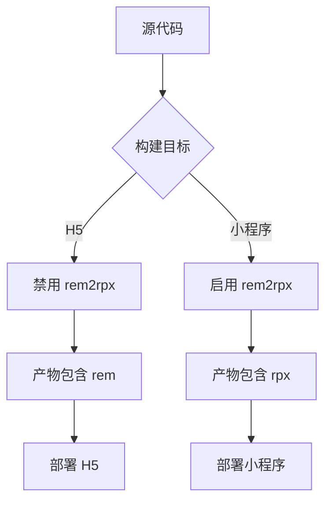
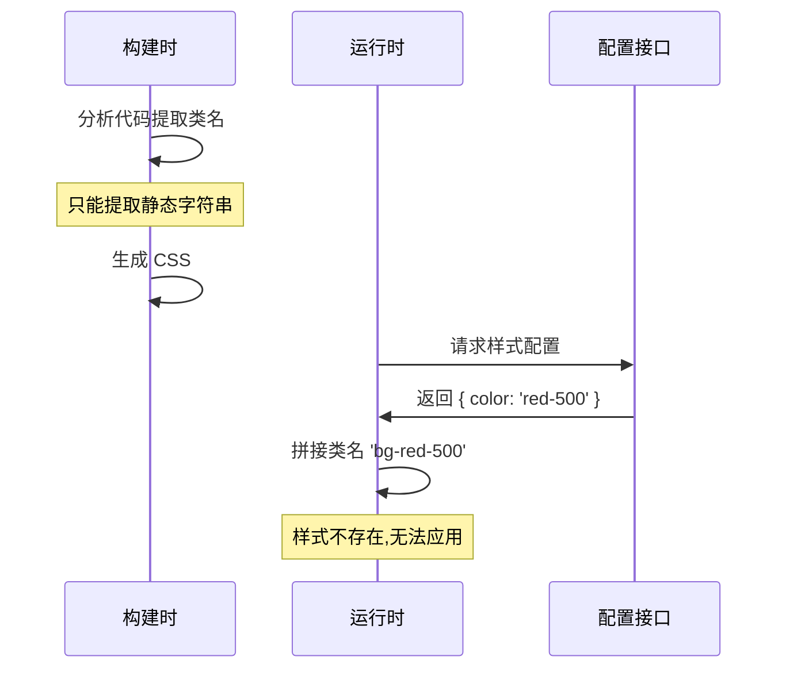
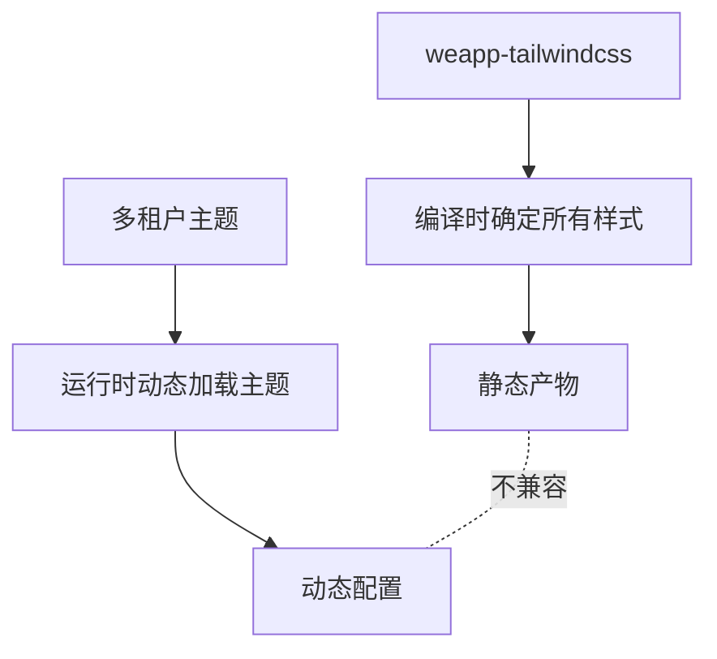
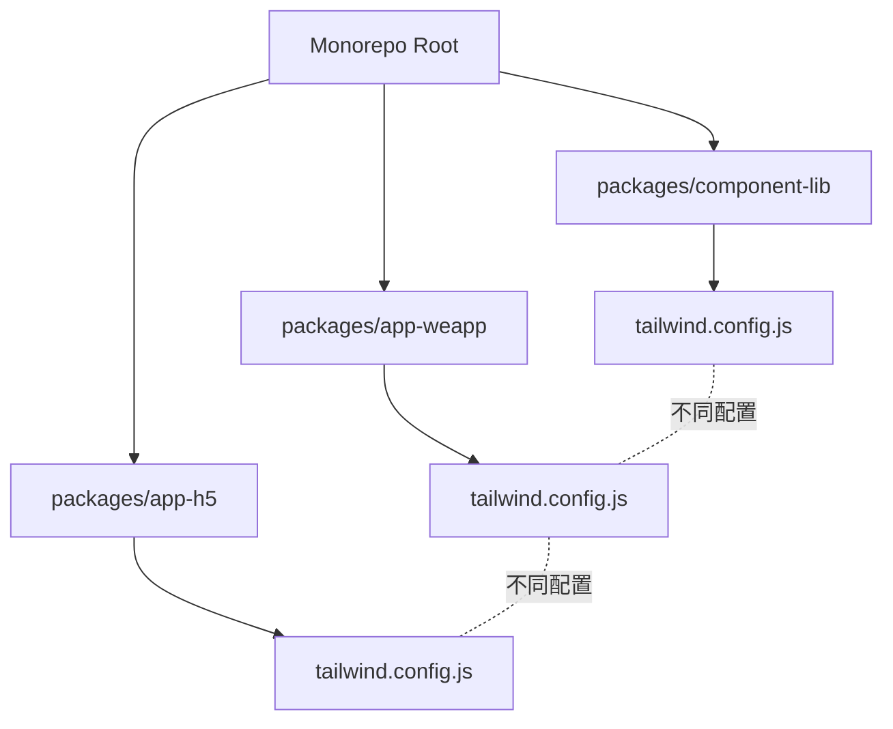
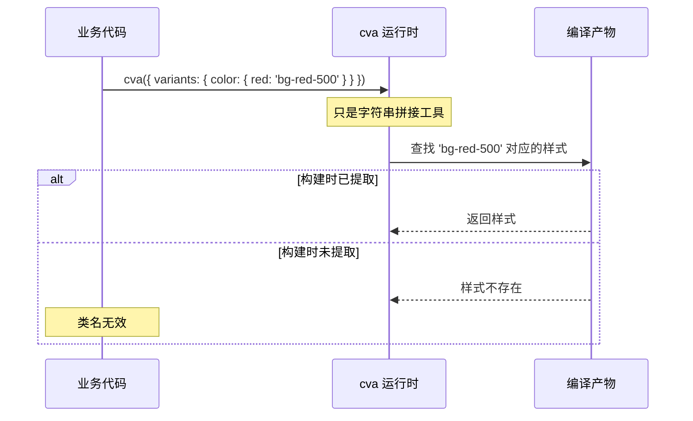
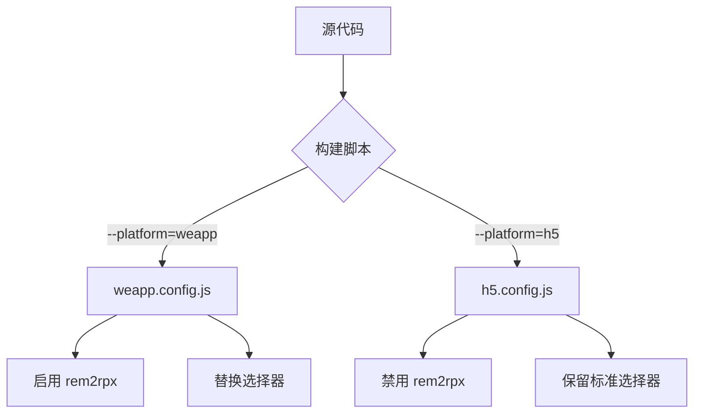
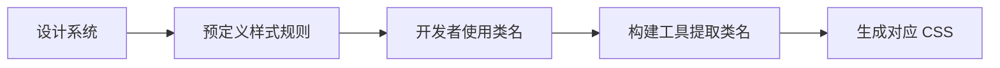
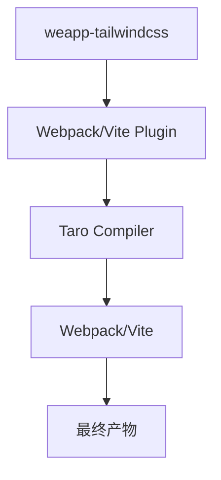
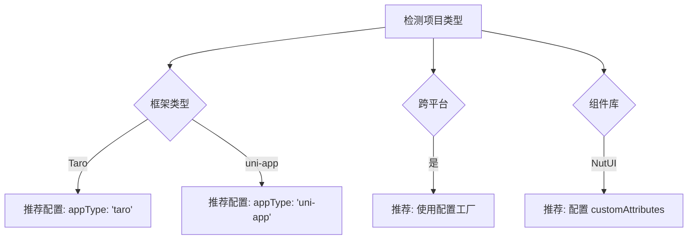

# weapp-tailwindcss 不适合使用场景的系统分析

## 文档概述

本文档诚实分析 weapp-tailwindcss 的局限性与不适用场景,旨在帮助开发者做出正确的技术选型决策。本文档不回避缺点,不营销化,基于项目架构与实际案例系统梳理风险场景。

## 核心架构带来的固有约束

### JIT 编译依赖静态分析

weapp-tailwindcss 的核心机制是在构建时通过 AST 分析提取类名,然后生成对应的 CSS。这意味着:

#### 静态分析的边界

- 系统通过 Babel 解析 JavaScript/TypeScript 文件的 AST
- 遍历字符串字面量和模板字符串节点提取类名
- 对于模板文件使用正则或 HTML 解析器提取 class 属性

#### 无法处理的场景

系统无法分析运行时动态拼接的类名:

| 场景类型     | 示例代码模式                          | 为什么失败                    |
| ------------ | ------------------------------------- | ----------------------------- |
| 变量拼接     | `'text-' + colorVar`                  | 拼接结果在运行时才确定        |
| 条件表达式   | `colors[theme]`                       | 数组索引的值无法静态推断      |
| 网络数据驱动 | `data.style`                          | 样式来自接口返回,构建时不存在 |
| 用户配置     | `config.buttonClass`                  | 用户自定义配置,构建时未知     |
| 循环生成     | `Array(n).map(i => 'grid-cols-' + i)` | 动态长度无法穷举              |

### rem 转 rpx 的单向转换

系统会将 Tailwind 生成的 `rem` 单位自动转换为小程序的 `rpx` 单位。这个机制存在以下问题:

#### 跨端项目的单位冲突

当同一套代码需要同时输出 H5 和小程序时:

- H5 环境需要 `rem` 进行响应式适配
- 小程序环境需要 `rpx` 适配不同设备
- 自动转换会导致 H5 产物丢失 `rem`,破坏响应式布局

#### 多平台构建配置复杂度

需要为不同平台配置独立的构建流程:



这增加了配置管理的复杂度,容易在多平台发布时出现配置错误。

### 选择器替换的破坏性

系统会将标准 CSS 选择器替换为小程序兼容的形式:

| 原始选择器           | 替换结果         | 副作用               |
| -------------------- | ---------------- | -------------------- |
| `*` (通配选择器)     | `view, text`     | 无法选中所有元素类型 |
| `:root`              | `page, .tw-root` | 伪类语义改变         |
| `> *` (子元素选择器) | `> view, > text` | 未覆盖的标签被遗漏   |

#### 组件库兼容性风险

当集成第三方组件库(如 NutUI、Taroify、Wot Design)时:

- 组件库的内部样式可能使用了通配选择器或伪类选择器
- 选择器替换会破坏组件库的样式隔离
- 需要手动配置 `customAttributes` 和 `cssPreflight` 排除组件库文件

### 编译产物体积的隐性膨胀

#### Preflight 基础样式注入

Tailwind 的 Preflight 会重置浏览器默认样式。在小程序场景:

- Preflight 生成的全局样式被注入到主 CSS chunk
- 小程序原生标签默认样式与浏览器不同,部分重置规则无效
- 需要通过 `cssPreflight` 精细控制保留哪些重置规则

#### 任意值转义字符膨胀

任意值语法如 `w-[200px]` 会被转义为 `-w-_b200px_B`:

- 转义后的类名长度增加 2-3 倍
- 大量使用任意值会导致编译产物膨胀
- 配置 `mangle: true` 可压缩,但增加调试难度

## 不推荐使用的项目类型

### 高度动态配置的营销活动

#### 典型场景特征

- 样式配置来自运营后台
- 颜色、间距、字体大小由运营人员在后台配置
- 不同活动主题完全由数据驱动

#### 为什么不适合

运营配置的样式在构建时不存在,JIT 编译无法提取:



#### 替代方案

使用 CSS-in-JS 或 CSS 变量:

| 方案       | 适用场景             | 局限                         |
| ---------- | -------------------- | ---------------------------- |
| CSS 变量   | 少量主题色、间距配置 | 小程序对 CSS 变量支持有限    |
| 内联样式   | 全动态场景           | 无法使用伪类、媒体查询       |
| 预生成主题 | 主题数量有限且可穷举 | 需要预先构建所有可能的主题包 |

### 用户自定义主题的 SaaS 产品

#### 典型场景特征

- 允许用户自定义品牌色、字体、圆角等
- 不同租户有独立的视觉风格
- 主题配置保存在数据库,无法穷举

#### 风险点

每个租户的主题需要独立构建:

- 无法在一个构建产物中包含所有可能的主题样式
- 运行时切换主题需要动态加载不同的 CSS 文件
- 小程序包大小限制使得包含多套主题变得不现实

#### 核心矛盾

weapp-tailwindcss 的按需生成与多租户主题的动态性存在根本矛盾:



### 强依赖第三方 UI 组件库的项目

#### 兼容性问题矩阵

| 组件库     | 样式系统    | 冲突类型             | 解决成本 |
| ---------- | ----------- | -------------------- | -------- |
| NutUI      | CSS Modules | 选择器替换冲突       | 中等     |
| Taroify    | 全局样式    | Preflight 覆盖       | 高       |
| Wot Design | 主题变量    | CSS 变量转换         | 高       |
| Vant Weapp | 原生 WXSS   | externalClasses 失效 | 高       |

#### 需要手动处理的问题

- 配置 `customAttributes` 识别组件库的自定义 class 属性
- 调整 `cssPreflight` 避免覆盖组件库的基础样式
- 排除组件库文件避免选择器替换破坏组件内部样式
- 处理组件库与 Tailwind 的样式优先级冲突

#### 何时放弃 weapp-tailwindcss

当项目中组件库占比超过 50% 时,引入 weapp-tailwindcss 的收益低于配置成本。此时建议:

- 直接使用组件库的主题定制能力
- 业务样式使用 SCSS/LESS 编写
- 仅在独立开发的页面中使用原子化 CSS

### 需要精确像素级控制的设计还原

#### 设计稿还原的精度损失

Tailwind 的设计理念是基于设计系统的约束:

- 间距刻度固定(如 4px 的倍数)
- 字体大小离散(不是连续的)
- 颜色来自预定义调色板

#### 与像素级还原的冲突

当设计稿要求:

- 间距为 13px、17px 等非标准值
- 大量使用任意值 `p-[13px]`、`text-[17px]`
- 设计稿中每个元素都有独特的数值

#### 任意值的负面影响

使用任意值会抵消原子化 CSS 的优势:

| 原子化优势 | 任意值的影响         | 后果                    |
| ---------- | -------------------- | ----------------------- |
| 类名复用   | 每个任意值都是唯一的 | 无法复用,失去原子化意义 |
| 体积优化   | 转义后类名更长       | 产物体积增大            |
| 设计约束   | 绕过设计系统         | 视觉不一致              |

#### 适用场景判断

如果项目中任意值占比超过 30%,说明项目不适合使用原子化 CSS,应该:

- 使用传统 CSS 或预处理器
- 建立项目自己的设计 token 系统
- 考虑使用 CSS-in-JS 处理动态样式

## 项目规模与复杂度的临界点

### 小型项目的工程化负担

#### 配置成本与项目规模不匹配

对于简单的 H5 或单页小程序:

| 项目特征     | 配置需求                            | 性价比 |
| ------------ | ----------------------------------- | ------ |
| 页面数 < 5   | 需要配置构建工具、PostCSS、Tailwind | 低     |
| 样式复杂度低 | 大部分样式可以直接写内联            | 低     |
| 迭代周期短   | 学习成本大于开发收益                | 低     |
| 无设计系统   | Tailwind 的设计约束带不来价值       | 低     |

#### 初始化成本

引入 weapp-tailwindcss 需要:

- 安装 3-5 个 npm 包
- 配置 Webpack/Vite 插件
- 配置 PostCSS
- 配置 Tailwind
- 学习任意值、变体、响应式等概念

对于简单项目,这些成本远大于直接写 CSS。

### 大型项目的构建时间膨胀

#### JIT 编译的性能瓶颈

随着项目规模增大:

| 项目规模 | 文件数量 | JIT 分析耗时 | 风险 |
| -------- | -------- | ------------ | ---- |
| 小型     | < 50     | < 1s         | 低   |
| 中型     | 50-200   | 1-5s         | 中等 |
| 大型     | 200-1000 | 5-20s        | 高   |
| 超大型   | > 1000   | > 20s        | 极高 |

#### AST 解析的计算成本

对每个 JS/TS 文件:


当项目包含数百个文件时,每次构建都要完整执行这个流程。

#### 缓存失效场景

缓存会在以下情况失效:

- 修改 Tailwind 配置文件
- 修改任何包含类名的源文件
- 升级 weapp-tailwindcss 版本
- 清理 node_modules

#### 何时考虑替代方案

当增量构建时间超过 10 秒时,应该评估:

- 是否可以拆分子包降低单次构建规模
- 是否可以预编译部分基础样式
- 是否引入了过多的样式动态性

### Monorepo 架构的配置地狱

#### 多包管理的复杂度

Monorepo 中每个包可能需要独立的 Tailwind 配置:



#### 配置同步问题

- 设计 token 需要在多个 Tailwind 配置间同步
- 插件和预设需要在多个包间复用
- 构建流程需要确保配置的一致性

#### 依赖解析冲突

不同子包可能依赖不同版本的:

- tailwindcss (v2/v3/v4)
- weapp-tailwindcss
- PostCSS 及其插件

这会导致:

- Pnpm/Yarn workspace 的幽灵依赖问题
- 构建产物的样式不一致
- 难以定位的样式 bug

#### Monorepo 使用建议

只有满足以下条件时才在 Monorepo 中使用:

- 有专职工程师负责构建工具维护
- 团队对 Tailwind 和构建工具有深入理解
- 投入时间建立配置共享机制
- 有完善的 E2E 测试覆盖样式回归

## 常见"用错方式"的模式

### 模式一: 过度依赖动态类名

#### 错误用法

开发者习惯性地使用模板字符串拼接类名:

| 代码模式               | 问题                     | 正确做法                 |
| ---------------------- | ------------------------ | ------------------------ |
| `\`text-\${size}\``    | size 是变量,无法静态分析 | 使用 cva 或枚举完整类名  |
| `colors[theme]`        | 动态索引                 | 使用条件语句列举所有可能 |
| `className.split(' ')` | 字符串操作               | 直接写完整类名字符串     |

#### 运行时 cva 的误区

虽然 `@weapp-tailwindcss/cva` 提供了运行时类名组合,但它不能凭空生成样式:



#### 正确使用 cva

必须确保所有可能的类名在代码中以静态字符串形式出现:

**错误示例:**

运行时才确定颜色值。

**正确示例:**

所有可能的类名都以字符串字面量形式存在,可被静态分析。

### 模式二: 忽略任意值的性能影响

#### 滥用任意值

开发者看到任意值语法后,将所有样式都改为任意值:

| 使用方式   | 编译产物                          | 问题                     |
| ---------- | --------------------------------- | ------------------------ |
| `p-4`      | `.p-4 { padding: 1rem; }`         | 可复用,体积小            |
| `p-[16px]` | `.-p-_b16px_B { padding: 16px; }` | 转义后类名长,无法复用    |
| `p-[1rem]` | `.-p-_b1rem_B { padding: 1rem; }` | 与 p-4 功能重复,浪费体积 |

#### 体积膨胀示例

一个包含 100 个组件的项目,每个组件使用 10 个任意值:

- 原子类方式: 100 _ 10 _ 15 字符 = 15KB
- 任意值方式: 100 _ 10 _ 40 字符 = 40KB (转义后)

体积增长 2.67 倍。

#### 最佳实践

| 场景             | 推荐做法           | 理由            |
| ---------------- | ------------------ | --------------- |
| 设计系统内的值   | 使用标准类名 `p-4` | 复用性高,体积小 |
| 偶尔的特殊值     | 任意值 `p-[13px]`  | 可接受的代价    |
| 频繁使用的特殊值 | 扩展 Tailwind 配置 | 转为标准类名    |

### 模式三: 在生产环境未配置压缩保留

#### 问题背景

weapp-tailwindcss 的运行时库(cva、merge)依赖特定的函数名:

- `weappTwIgnore`
- `twMerge`
- `cva`

#### Terser 压缩的破坏

生产构建时,Terser 默认会混淆函数名:

```mermaid
flowchart LR
    A[源代码: weappTwIgnore()] --> B[Terser 压缩]
    B --> C[混淆: a()]
    C --> D[运行时查找 weappTwIgnore]
    D --> E[找不到,功能失效]
```

#### 典型错误现象

- 开发环境样式正常
- 生产环境部分样式丢失
- 控制台无明显错误

#### 必需的配置

Webpack/Rspack:

| 压缩器  | 配置项                  | 说明           |
| ------- | ----------------------- | -------------- |
| Terser  | `keep_fnames: true`     | 保留函数名     |
| Terser  | `keep_classnames: true` | 保留类名       |
| ESBuild | `keepNames: true`       | 保留所有标识符 |
| SWC     | `keep_fnames: true`     | 保留函数名     |

### 模式四: 跨平台项目单一配置

#### 错误假设

认为一套配置可以同时支持:

- 微信小程序
- 支付宝小程序
- H5
- APP

#### 平台差异导致的问题

| 平台         | 单位系统 | 选择器支持 | CSS 特性          |
| ------------ | -------- | ---------- | ----------------- |
| 微信小程序   | rpx      | 受限       | 部分支持 CSS 变量 |
| 支付宝小程序 | rpx      | 受限       | 不支持 @property  |
| H5           | rem/px   | 完整       | 完整支持          |
| APP          | px       | 受限       | 取决于渲染引擎    |

#### 配置分离策略

需要为不同平台维护独立配置:



#### 配置管理建议

使用配置工厂函数:

- 提取公共配置到 `base.config.js`
- 各平台配置继承并覆盖特定选项
- 通过环境变量切换配置

### 模式五: 忽略 Preflight 的副作用

#### Preflight 在小程序的问题

Tailwind 的 Preflight 会注入全局样式重置:

- `box-sizing: border-box` 应用到所有元素
- `border-width: 0` 重置所有边框
- `border-style: solid` 设置默认边框样式

#### 与小程序原生样式的冲突

小程序原生组件有自己的默认样式:

| 组件   | 原生样式     | Preflight 影响  | 后果     |
| ------ | ------------ | --------------- | -------- |
| button | 有默认边框   | border-width: 0 | 边框消失 |
| input  | 有默认内边距 | 可能被重置      | 布局错乱 |
| picker | 有默认高度   | 可能被重置      | 显示异常 |

#### 配置 cssPreflight 的原则

只保留确实需要的重置规则:

| 规则         | 是否保留 | 理由                    |
| ------------ | -------- | ----------------------- |
| box-sizing   | 是       | 统一盒模型,避免布局问题 |
| border-width | 否       | 会破坏原生组件样式      |
| margin       | 否       | 小程序组件默认无外边距  |

## 问题出现的根本原因

### 原子化 CSS 范式的固有局限

#### 编译时确定性要求

原子化 CSS 的核心假设是样式可以在编译时完全确定:



这个流程要求:

- 样式规则在设计阶段定义
- 类名使用在编码阶段确定
- 不允许运行时动态生成新样式

#### 与小程序环境的矛盾

小程序的限制加剧了这个矛盾:

| 原子化 CSS 需求 | 小程序限制     | 矛盾点                  |
| --------------- | -------------- | ----------------------- |
| 灵活的选择器    | 选择器支持有限 | 需要替换选择器,破坏语义 |
| rem 响应式      | 使用 rpx 单位  | 跨平台时单位不统一      |
| 完整 CSS 特性   | CSS 特性阉割   | 部分功能无法使用        |

### JIT 编译的静态分析困境

#### AST 分析的边界

Babel 解析 JavaScript 只能得到语法结构,无法执行代码:

| 可分析                      | 不可分析               |
| --------------------------- | ---------------------- |
| 字符串字面量 `'bg-red-500'` | 变量值 `colors[theme]` |
| 模板字符串静态部分          | 模板字符串动态部分     |
| 三元表达式的所有分支        | 函数返回值             |

#### 类型系统的缺失

JavaScript 没有类型系统,无法推断:

- 变量的可能取值范围
- 函数的返回值类型
- 对象属性的值域

即使使用 TypeScript,运行时类型信息也会被擦除。

#### 技术债务积累

为了支持更多场景,项目引入了:

- `jsPreserveClass` 手动标记保留类名
- `ignoreTaggedTemplateExpressionIdentifiers` 忽略特定模板字符串
- `customAttributes` 自定义属性识别

这些配置增加了使用复杂度,降低了开发体验。

### 小程序平台的碎片化

#### 平台差异矩阵

| 特性       | 微信   | 支付宝 | 百度   | 头条   | QQ     |
| ---------- | ------ | ------ | ------ | ------ | ------ |
| CSS 变量   | 部分   | 有限   | 部分   | 部分   | 部分   |
| @property  | 开发版 | 不支持 | 未知   | 未知   | 未知   |
| :root      | 不支持 | 不支持 | 不支持 | 不支持 | 不支持 |
| 通配选择器 | 不支持 | 不支持 | 不支持 | 不支持 | 不支持 |

#### 适配成本

要支持所有平台需要:

- 测试每个平台的 CSS 特性支持情况
- 为不同平台提供降级方案
- 维护平台特定的配置文件

#### 持续维护负担

小程序平台会:

- 不定期更新基础库
- 修改 CSS 特性支持
- 调整开发者工具行为

这要求 weapp-tailwindcss 持续跟进适配。

### 构建工具生态的复杂性

#### 插件接口的差异

不同构建工具的插件机制完全不同:

| 构建工具 | 插件模型               | 钩子时机     | 兼容成本 |
| -------- | ---------------------- | ------------ | -------- |
| Webpack  | Compiler + Compilation | 多阶段钩子   | 高       |
| Vite     | Rollup-style           | 简化钩子     | 中       |
| Gulp     | Stream                 | 管道模型     | 高       |
| Rspack   | Webpack-compatible     | 类似 Webpack | 中       |

#### 版本兼容矩盾

- Webpack 4 vs 5 插件 API 不兼容
- PostCSS 7 vs 8 语法差异
- Tailwind v2/v3/v4 配置格式变化

维护多版本兼容需要:

- 提供多个入口文件
- 运行时检测版本
- 条件性应用不同逻辑

#### 框架层的封装

Taro、uni-app 等框架在构建工具基础上又封装了一层:



每一层都可能引入:

- 配置转换
- 文件处理顺序变化
- 缓存策略差异

## 文档与工具层面的预警机制

### 技术选型阶段的决策树

#### 前置评估清单

在决定使用 weapp-tailwindcss 之前,评估以下维度:

| 评估维度   | 评分标准                 | 权重 | 通过阈值  |
| ---------- | ------------------------ | ---- | --------- |
| 样式动态性 | 静态类名占比 > 70%       | 30%  | > 21 分   |
| 项目规模   | 页面数 < 100             | 20%  | > 14 分   |
| 团队技术栈 | 熟悉 Tailwind 和构建工具 | 25%  | > 17.5 分 |
| 跨平台需求 | 只输出小程序或配置可分离 | 15%  | > 10.5 分 |
| 组件库依赖 | 自研组件 > 50%           | 10%  | > 7 分    |

总分 > 70 分可考虑使用,< 50 分不推荐。

#### 决策流程图

```mermaid
flowchart TD
    A[开始评估] --> B{样式是否高度动态?}
    B --> |是| C[不推荐使用]
    B --> |否| D{是否强依赖第三方组件库?}
    D --> |是| C
    D --> |否| E{团队是否熟悉 Tailwind?}
    E --> |否| F{是否愿意投入学习?}
    F --> |否| C
    F --> |是| G[可以使用,需培训]
    E --> |是| H{项目规模如何?}
    H --> |超大型| I[需要专人负责构建}
    H --> |中大型| J[推荐使用]
    H --> |小型| K[收益不明显,自行权衡]
```

### 构建时的智能诊断

#### 静态分析警告

在构建过程中检测并警告潜在问题:

| 检测项       | 触发条件             | 警告级别 | 建议                     |
| ------------ | -------------------- | -------- | ------------------------ |
| 动态类名模式 | 检测到模板字符串拼接 | Warning  | 重构为静态枚举或使用 cva |
| 任意值占比   | 任意值 > 30%         | Warning  | 考虑扩展 Tailwind 配置   |
| 产物体积     | CSS 大小 > 100KB     | Error    | 检查是否引入了无用样式   |
| 未使用类名   | 类名在代码中未出现   | Info     | 可能是清理残留           |

#### 运行时错误上报

在开发环境提供辅助:

- 检测到动态拼接但样式缺失时,在控制台打印具体的缺失类名
- 提示可能的修复方式(添加到 jsPreserveClass 或改为静态)
- 收集常见错误模式,提供针对性文档链接

### 配置验证与推荐

#### 配置合理性检查

在插件初始化时验证配置:

| 配置项          | 检查规则               | 不合理时的提示             |
| --------------- | ---------------------- | -------------------------- |
| rem2rpx         | 跨平台项目中全局启用   | 建议为不同平台使用不同配置 |
| cssPreflight    | 保留了 border-width: 0 | 可能破坏原生组件样式       |
| mangle          | 生产环境未启用         | 产物体积较大,建议启用      |
| jsPreserveClass | 返回 true 对所有类名   | 失去了静态分析的意义       |

#### 最佳实践推荐

根据项目特征推荐配置:



### 文档改进建议

#### 场景化文档组织

按使用场景而非功能组织文档:

| 当前章节 | 改进方向     | 新增内容                  |
| -------- | ------------ | ------------------------- |
| 快速开始 | 添加前置条件 | 适用项目类型评估          |
| 配置参考 | 场景化示例   | 不同场景的推荐配置        |
| 常见问题 | 根因分析     | 不仅说怎么解决,还说为什么 |
| 最佳实践 | 反模式说明   | 明确列出不推荐的用法      |

#### 反模式专题

创建专门的"不要这样做"文档:

- 动态类名拼接的错误示例
- 任意值滥用的性能影响
- 生产环境配置缺失导致的问题
- 跨平台项目的配置陷阱

每个反模式包含:

- 错误代码示例
- 为什么会出问题
- 正确的做法
- 相关配置项

#### 迁移路径指南

为不适合的项目提供退出路径:

| 从 weapp-tailwindcss 迁移到 | 适用场景                  | 迁移成本 |
| --------------------------- | ------------------------- | -------- |
| UnoCSS                      | 需要更灵活的动态性        | 中等     |
| SCSS/LESS                   | 传统项目,团队不熟悉原子化 | 低       |
| CSS-in-JS                   | 高度动态,组件库场景       | 高       |
| 原生 CSS + 变量             | 简单项目,不需要工具链     | 低       |

### CLI 工具的交互式诊断

#### 健康检查命令

提供 CLI 命令扫描项目:

执行流程:

1. 扫描所有源文件
2. 检测动态类名模式
3. 分析配置合理性
4. 生成诊断报告
5. 给出优化建议

#### 报告示例

```
=== weapp-tailwindcss 健康检查报告 ===

项目统计:
- 总文件数: 156
- 包含类名的文件: 89
- 检测到的类名: 1,247

潜在问题:
⚠️  发现 23 处动态类名拼接 (src/components/Button.tsx:12)
⚠️  任意值占比 38%,高于推荐的 30%
⚠️  生产配置未启用 mangle,产物体积可优化

建议:
1. 重构 src/components/Button.tsx 使用 cva
2. 将高频任意值添加到 Tailwind 配置
3. 在 webpack.config.js 中启用 Terser mangle

评分: 65/100 (及格,有优化空间)
```

#### 交互式修复

对于一些问题提供自动修复:

- 生成推荐的 Tailwind 配置
- 重构动态类名为 cva 声明
- 添加必要的 jsPreserveClass 配置

## 总结与决策指南

### 明确不推荐的场景

以下场景明确不推荐使用 weapp-tailwindcss:

#### 绝对不推荐

- 样式完全由后台配置驱动的运营活动
- 允许用户自定义主题的 SaaS 平台
- 需要像素级精确还原且大量使用非标准值
- 项目中第三方组件库占比 > 70%
- 团队无人熟悉构建工具且不愿学习

#### 谨慎考虑

- 超大型项目(> 500 个页面)且无专人负责构建
- 需要同时支持 5+ 个小程序平台
- Monorepo 架构且子包间配置差异大
- 遗留项目改造,原有样式系统复杂

#### 可以尝试

- 中小型项目(< 100 个页面)
- 团队熟悉 Tailwind 或愿意学习
- 主要使用自研组件,第三方组件可控
- 有明确的设计系统和规范

### 替代方案对比

当 weapp-tailwindcss 不适用时,考虑以下方案:

| 方案        | 适用场景             | 优势                  | 劣势                        |
| ----------- | -------------------- | --------------------- | --------------------------- |
| UnoCSS      | 需要更强的动态性     | 支持动态规则,配置灵活 | 小程序适配成熟度低          |
| Windi CSS   | 类似 Tailwind 但更轻 | 启动快,按需编译       | 社区较小,维护不活跃         |
| SCSS/LESS   | 传统项目,团队熟悉    | 成熟稳定,学习成本低   | 无原子化优势,体积优化靠手动 |
| CSS Modules | 组件库开发           | 样式隔离,可发布       | 需要构建工具支持            |
| 内联样式    | 高度动态场景         | 完全灵活              | 无法使用伪类、媒体查询      |

### 决策矩阵

根据项目特征选择方案:

| 项目特征            | 推荐方案            | 理由                 |
| ------------------- | ------------------- | -------------------- |
| 样式静态,有设计系统 | weapp-tailwindcss   | 最大化原子化优势     |
| 样式动态,无设计约束 | 内联样式 + CSS 变量 | 灵活性优先           |
| 组件库开发          | CSS Modules         | 隔离性和可发布性     |
| 传统团队,求稳       | SCSS/LESS           | 学习成本低,风险小    |
| 需要极致灵活性      | UnoCSS(需自行适配)  | 权衡适配成本和灵活性 |

### 最终建议

weapp-tailwindcss 是一个优秀的工具,但不是银弹。它最适合:

- 中小型规模的小程序项目
- 有清晰设计系统和规范
- 样式以静态为主,动态部分可枚举
- 团队愿意接受原子化 CSS 的理念
- 有一定构建工具基础

对于不符合这些条件的项目,诚实评估后选择更合适的方案,比强行使用 weapp-tailwindcss 更明智。

技术选型的核心是匹配,而非追逐潮流。
