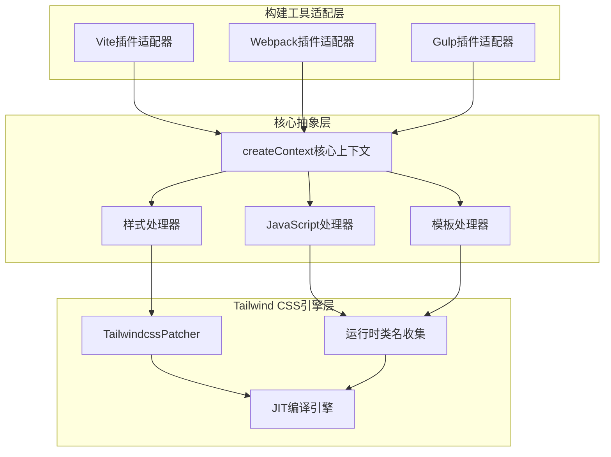
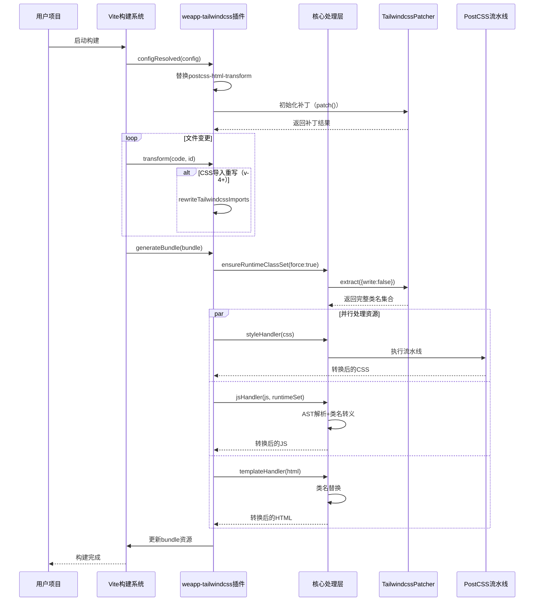
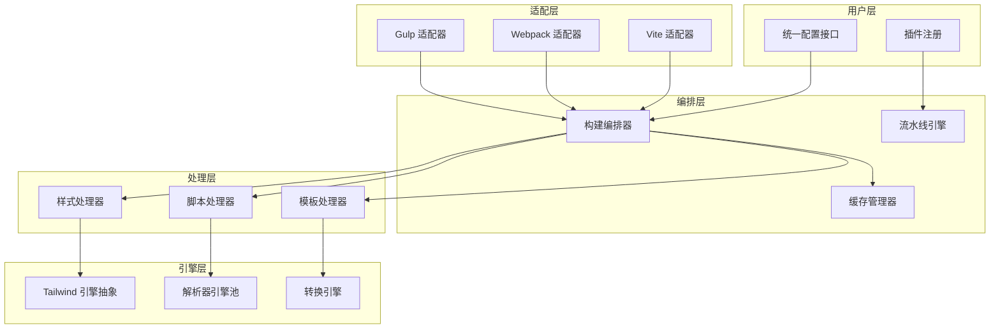
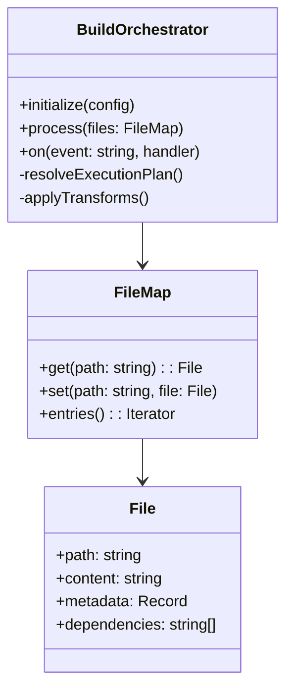
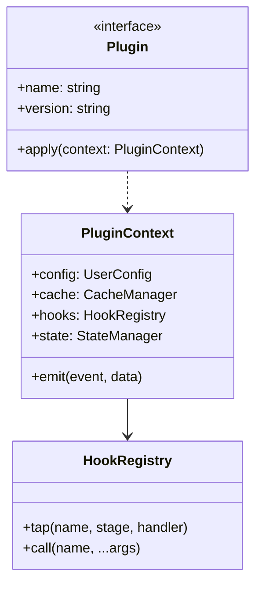
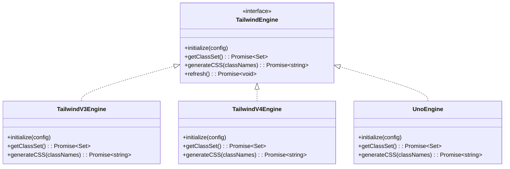
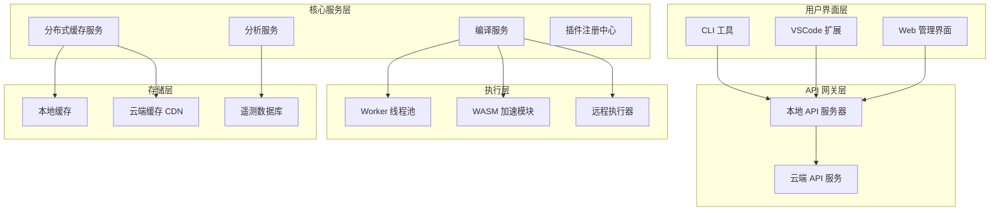
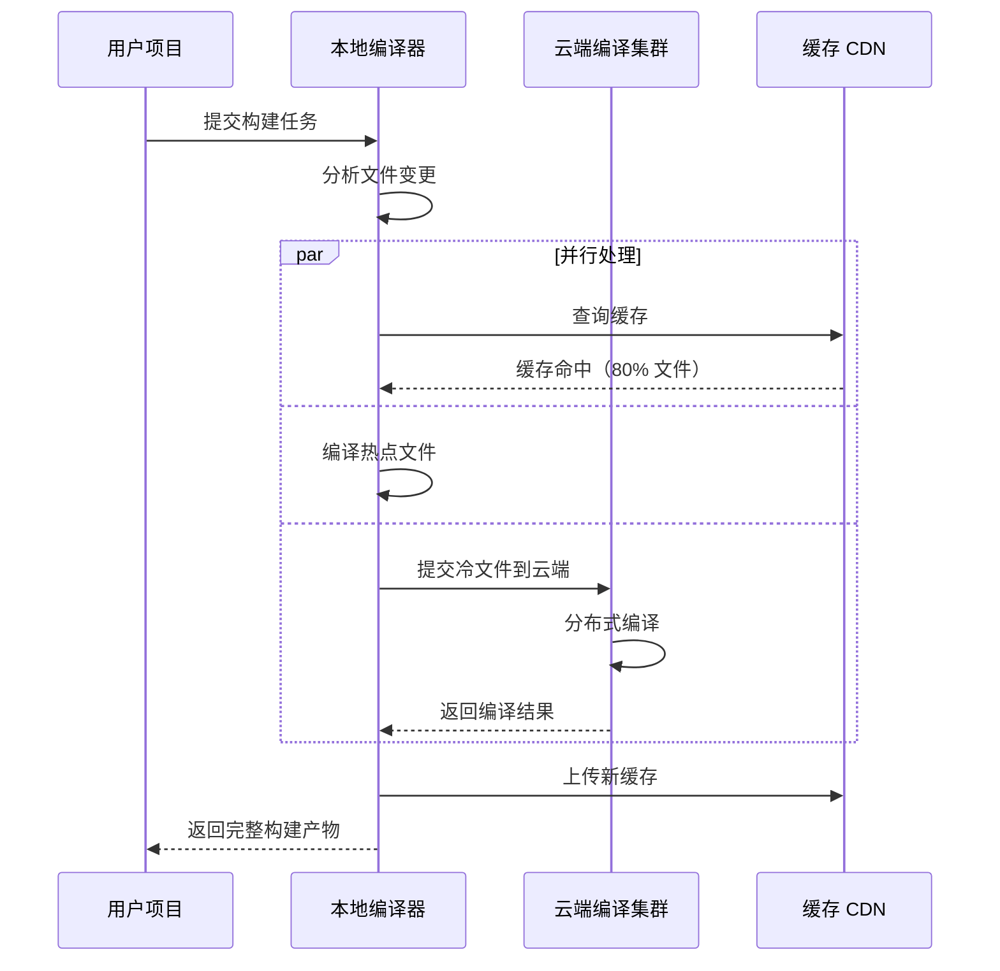
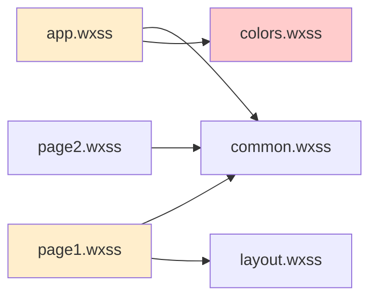

# weapp-tailwindcss 技术重构与未来演进分析

## 文档元信息

- **项目名称**：weapp-tailwindcss
- **当前版本**：4.9.1
- **文档作者**：首席架构师与技术文档专家
- **文档日期**：2025年
- **文档目的**：全面、系统、可审计的技术重构与未来演进战略分析

---

## 第一部分：现状全景分析

### 1.1 核心设计理念解析

weapp-tailwindcss 项目的核心使命是将 Tailwind CSS 的原子化样式思想与 JIT 编译能力引入小程序生态，其设计哲学建立在以下四个核心支柱之上：

#### 跨构建工具统一抽象

项目采用构建工具无关的核心层设计，通过适配器模式支持 Webpack、Vite、Gulp、Rspack、Rollup 等主流构建工具。核心处理逻辑封装在 `packages/weapp-tailwindcss/src/core.ts` 中，提供 `createContext` 统一入口，将样式、模板、脚本的转换逻辑与具体构建工具解耦。



这种分层设计确保了核心转换逻辑的稳定性，同时为新构建工具的接入提供了清晰的扩展路径。

#### 实时 JIT 编译驱动

项目通过 `tailwindcss-patch` 包对 Tailwind CSS 核心引擎进行运行时补丁，实现了按需编译的能力。补丁机制包含两个关键维度：

**补丁应用策略**

- **长度单位扩展**：通过 `extendLengthUnits` 补丁支持 rpx 等小程序特有单位
- **上下文暴露**：通过 `exposeContext` 补丁获取 Tailwind 内部配置和类名生成器
- **配置热重载**：支持 `tailwind.config` 变化时自动刷新补丁状态

**运行时类名收集**

通过 `collectRuntimeClassSet` 函数构建全局类名池，策略包括：

- 同步优先：Tailwind CSS v3 和 v4 支持 `getClassSetSync` 时优先使用同步方法
- 缓存感知：基于 `tailwind.config` 文件签名（路径、大小、修改时间）实现智能缓存失效
- 降级机制：`extract` 失败时降级到 `getClassSet`，确保兼容性

#### PostCSS 流水线架构

项目在 `@weapp-tailwindcss/postcss` 包中构建了三阶段 PostCSS 插件流水线：

| 阶段       | 插件类型                         | 职责                                       |
| ---------- | -------------------------------- | ------------------------------------------ |
| **pre**    | 用户插件 + 核心前置插件          | 类名转义、选择器替换、自定义属性处理       |
| **normal** | preset-env + 单位转换 + calc优化 | CSS兼容性转换、px/rem转换、calc表达式简化  |
| **post**   | 核心后置插件                     | 伪类清理、@property移除、CSS变量作用域注入 |

每个插件节点携带完整的上下文信息（stage、index、stageIndex、previous、next），支持插件间的精细化协作。

#### 小程序环境适配

项目通过多层转换确保 Tailwind CSS 在小程序受限环境中正常工作：

**选择器层面适配**

- 通配符替换：`*` → `view, text`（覆盖主要组件类型）
- 根选择器映射：`:root` → `page, .tw-root`
- 子选择器展开：`>` → 多个具体组件组合（避免性能问题）
- 伪类过滤：移除 `:hover` 等不支持的伪类

**类名层面适配**

- 特殊字符转义：通过 `@weapp-core/escape` 包将 `.` `/` `:` `[` `]` 等字符映射为合法类名
- 任意值支持：`[300px]` 转义为 `_300px_` 形式，保持语义同时符合小程序规范
- Unicode 处理：可选 `unescapeUnicode` 将转义的 Unicode 还原

**CSS 特性限制**

- 移除 `@property`：该特性仅在微信开发工具和少数设备支持
- CSS 变量作用域：通过 `injectAdditionalCssVarScope` 为 CSS 变量添加额外作用域前缀
- calc 表达式：针对 Tailwind CSS v4 默认启用 calc 优化，简化表达式

### 1.2 构建流程、配置体系与运行时机制的关系拓扑

#### 构建流程生命周期

以 Vite 插件为例，构建流程遵循以下时序：



#### 配置体系层次结构

配置系统呈现三层嵌套结构：

**用户层配置**

位于项目根目录的 `weapp-tailwindcss` 插件配置，包含：

- 全局开关：`disabled`、`rewriteCssImports`
- 框架识别：`appType`（uni-app、taro、mpx 等）
- 匹配器：`cssMatcher`、`htmlMatcher`、`jsMatcher`
- 转换规则：`customReplaceDictionary`、`cssChildCombinatorReplaceValue`

**PostCSS 层配置**

通过 `postcssOptions` 传递给 PostCSS 流水线：

- 用户自定义插件：`postcssOptions.plugins`
- 预设环境配置：`cssPresetEnv`（传递给 postcss-preset-env）
- 单位转换配置：`rem`、`px`（配置转换比例和排除规则）
- Calc 优化配置：`cssCalc`（v4 版本特有，控制表达式简化策略）

**Tailwind CSS 层配置**

通过 `tailwindcssPatcherOptions` 传递给底层引擎：

- 配置文件路径：`tailwindcss.config`
- 内容扫描路径：`tailwindcss.content`（覆盖配置文件的 content 字段）
- 缓存配置：`cache.enabled`、`cache.dir`、`cache.strategy`
- 补丁功能：`features.extendLengthUnits`、`features.exposeContext`

#### 运行时机制关键路径

**缓存系统设计**

项目实现了多层缓存机制以优化性能：

| 缓存层级                    | 缓存对象                    | 失效策略                     | 位置                      |
| --------------------------- | --------------------------- | ---------------------------- | ------------------------- |
| **编译器上下文缓存**        | getCompilerContext 返回值   | 配置对象引用变化             | compiler-context-cache.ts |
| **运行时类名集缓存**        | collectRuntimeClassSet 结果 | tailwind.config 文件签名变化 | runtime.ts                |
| **TailwindcssPatcher 缓存** | Tailwind 内部扫描结果       | 配置或 content 变化          | tailwindcss-patch 库      |
| **文件级转换缓存**          | CSS/JS/HTML 转换结果        | 原始文件内容 Hash 变化       | cache/index.ts            |

**类名收集与注入流程**

运行时类名收集遵循以下逻辑：

1. **初始化阶段**：构建开始时调用 `ensureRuntimeClassSet(force: true)` 强制刷新
2. **签名检查**：读取 `tailwind.config` 的文件统计信息作为签名
3. **同步尝试**：v3/v4 版本尝试 `getClassSetSync()` 获取即时结果
4. **异步降级**：同步失败或返回空集时，调用 `extract({write: false})`
5. **兜底机制**：extract 失败时降级到 `getClassSet()`
6. **缓存持久化**：通过 WeakMap 将结果与 patcher 实例关联

### 1.3 架构中隐含的假设、技术债务与潜在瓶颈

#### 隐含假设分析

**假设一：构建时拥有完整项目视图**

项目架构假定在 `generateBundle` 阶段可以获取所有输出文件。这在以下场景下会产生问题：

- **增量构建**：Vite HMR 更新单个模块时，只能看到部分文件，类名集合可能不完整
- **分包构建**：uni-app 分包场景下，主包和子包可能独立构建，类名分散
- **外部依赖**：npm 包中的 Tailwind 类名无法在构建时被扫描

**假设二：PostCSS 插件执行顺序可控**

流水线设计假定用户插件在 pre 阶段、核心插件在特定位置。实际场景中：

- 用户可能在 `postcss.config.js` 中添加冲突插件
- 框架（如 uni-app）可能注入隐藏的 PostCSS 插件
- 插件执行顺序因构建工具版本而异

**假设三：Tailwind CSS 内部 API 稳定**

通过 `tailwindcss-patch` 访问 Tailwind CSS 内部 API 假定其结构稳定，但实际情况是：

- Tailwind CSS v3 到 v4 的内部重构导致补丁逻辑差异巨大
- 未来版本可能完全移除补丁所依赖的内部函数
- 第三方 Tailwind 变体（如 UnoCSS）无法使用当前补丁机制

**假设四：小程序平台规范一致**

选择器和类名转换假定所有小程序平台行为一致，但事实上：

- 支付宝小程序不支持 `@property`，会导致样式解析失败
- 快手小程序对 CSS 变量的支持存在差异
- 不同平台对类名长度和特殊字符的限制不同

#### 技术债务清单

**债务 1：Babel AST 解析性能债**

- **位置**：`packages/weapp-tailwindcss/src/js/babel.ts`
- **表现**：每个 JS 文件都需要完整的 Babel 解析，大型项目构建缓慢
- **根因**：历史上为了兼容各种 JSX 语法选择了 Babel，但 Babel 解析速度较慢
- **影响**：构建时间随项目规模线性增长，成为主要性能瓶颈
- **证据**：`scripts/js-bench.ts` 显示 SWC 和 OXC 解析速度分别是 Babel 的 3-5 倍

**债务 2：PostCSS 流水线重复执行债**

- **位置**：`packages/postcss/src/pipeline.ts`
- **表现**：每个 CSS 文件都创建独立的 PostCSS 处理器实例
- **根因**：流水线设计时未考虑实例复用，导致插件重复初始化
- **影响**：内存占用高，多核并行构建时内存压力大

**债务 3：模块图解析复杂度债**

- **位置**：`bundlers/shared/module-graph.ts`
- **表现**：为支持 JS 文件间的类名传递，实现了自定义模块图解析
- **根因**：构建工具原生模块图不包含必要的类名信息，需要二次解析
- **影响**：代码维护成本高，与构建工具版本更新存在脱节风险

**债务 4：配置合并策略债**

- **位置**：多处使用 `defuOverrideArray`
- **表现**：数组配置项直接覆盖而非合并，导致用户配置与默认配置无法组合
- **根因**：早期为了简化逻辑选择了覆盖策略
- **影响**：用户需要完整复制默认配置才能添加自定义项

**债务 5：版本兼容性维护债**

- **位置**：多处 v4、v3、v2 版本分支判断
- **表现**：代码中充斥 `if (majorVersion === 4)` 等条件
- **根因**：为了向后兼容保留了大量历史逻辑
- **影响**：新特性开发需要考虑所有版本分支，测试复杂度指数增长

#### 潜在瓶颈识别

**瓶颈 1：运行时类名集构建是串行阻塞点**

在 Vite 插件的 `generateBundle` 阶段，所有文件处理前必须等待 `ensureRuntimeClassSet(force: true)` 完成。这个操作包括：

- 读取并解析 `tailwind.config`
- 扫描 content 配置指定的所有文件
- 生成所有可能的类名组合

大型项目中此操作可能耗时数秒，期间所有文件处理被阻塞。

**瓶颈 2：文件级并发度受限于内存**

虽然 CSS、JS、HTML 文件处理是并发的，但由于每个文件都需要：

- 持有完整的 runtimeClassSet（可能数万条）
- 创建 Babel AST（内存占用高）
- 持有 PostCSS AST（CSS 解析后的完整树）

在多核机器上提高并发度会导致内存溢出。

**瓶颈 3：缓存命中率随项目复杂度下降**

文件级缓存基于原始内容 Hash，但在以下场景命中率低：

- 文件中包含动态时间戳或哈希
- HMR 更新频繁导致大量文件失效
- 条件编译（`#ifdef`）导致同一文件在不同平台内容不同

**瓶颈 4：模块图解析的平方级复杂度**

自定义模块图实现在处理 `import` 链时，可能出现循环引用或深层嵌套，导致：

- 最坏情况下需要遍历所有文件的所有依赖
- 无法利用构建工具的增量更新机制
- 依赖关系变化时需要全量重新计算

---

## 第二部分：问题清单与根因分析

### 2.1 可维护性维度

#### 问题 1：Monorepo 包依赖关系复杂且缺乏清晰边界

**问题描述**

当前 monorepo 包含 19 个核心包（`packages/*`）、10 个运行时包（`packages-runtime/*`）、12 个应用示例（`apps/*`）、20 个演示项目（`demo/*`），总计超过 60 个工作区包。包之间的依赖关系呈现出以下特征：

- `weapp-tailwindcss` 核心包依赖 6 个内部包（`@weapp-tailwindcss/logger`、`@weapp-tailwindcss/postcss`、`@weapp-tailwindcss/shared` 等）
- 运行时包（如 `@weapp-tailwindcss/variants-v3`）与构建时包存在版本对齐需求
- 演示项目通过 `workspace:*` 引用，导致版本不透明

**根因分析**

- **历史演进缺乏重构**：v1 到 v2/v3 的迁移采用增量添加而非替换策略，导致新旧代码共存
- **职责划分模糊**：某些包（如 `@weapp-tailwindcss/shared`）成为"万能工具箱"，包含不相关的功能
- **缺乏依赖管理工具**：未使用 `syncpack` 等工具强制版本一致性

**放大效应**

随着项目规模扩大：

- **开发者认知负担**：新贡献者需要理解超过 10 个包才能修改核心功能
- **测试复杂度**：E2E 测试需要构建所有依赖包，耗时从 5 分钟增长到 30 分钟以上
- **版本发布风险**：Changeset 发布时可能因依赖版本不同步导致运行时错误

#### 问题 2：代码中存在大量魔法常量和硬编码配置

**问题描述**

代码库中直接硬编码了大量小程序平台特定配置：

- `defaults.ts` 中的文件扩展名正则：`/.+\.(?:wx|ac|jx|tt|q|c|ty)ss$/`
- `mainCssChunkMatcher` 中的路径前缀：`'app'`、`'common/main'`
- 类名转义字符映射：`MappingChars2String`

**根因分析**

- **平台适配通过枚举实现**：每增加一个小程序平台就需要修改多处代码
- **配置与逻辑混合**：平台配置嵌入在函数内部而非独立的配置文件
- **缺乏类型约束**：`AppType` 是字符串联合类型，易拼写错误且无自动补全

**放大效应**

- **平台扩展困难**：新增支持一个平台（如鸿蒙小程序）需要修改 10+ 个文件
- **配置冲突风险**：用户自定义配置可能与硬编码逻辑冲突，难以调试
- **文档同步成本**：硬编码配置的文档化需要手动维护，易过时

#### 问题 3：错误处理和日志系统不统一

**问题描述**

- 部分代码使用 `console.log`，部分使用 `@weapp-tailwindcss/logger`
- 错误捕获策略不一致：某些地方静默失败（`catch { }`），某些抛出错误
- 调试信息通过 `debug` 包输出，但默认关闭，用户难以排查问题

**根因分析**

- **渐进式迁移未完成**：logger 包是后期引入，旧代码未全部迁移
- **错误边界不明确**：未定义哪些错误应该中断构建，哪些应该降级处理
- **缺乏日志分级标准**：DEBUG、INFO、WARN、ERROR 的使用场景未文档化

**放大效应**

- **用户排查问题困难**：生产环境错误信息缺失，只能通过源码定位
- **监控和遥测缺失**：无法收集真实世界中的错误分布和性能指标
- **团队协作成本**：不同开发者添加日志的风格差异大

## 2.2 可扩展性维度

#### 问题 4：构建工具适配器缺乏统一抽象

**问题描述**

虽然核心处理逻辑已解耦，但各构建工具适配器（Vite、Webpack、Gulp）之间存在大量重复代码：

- 文件分组逻辑在每个适配器中重复实现
- 缓存处理策略各自独立
- 错误处理和生命周期钩子命名不一致

**根因分析**

- **历史遗留**：最初为 Webpack 设计，后续 Vite 和 Gulp 适配器通过复制粘贴扩展
- **构建工具 API 差异**：Webpack 4/5、Vite、Gulp 的插件 API 差异较大，难以抽象
- **性能优化导致分化**：为了适配各工具的最佳实践，引入了特定优化

**放大效应**

- **新构建工具支持困难**：增加 Rspack 支持需要重新实现完整适配器（500+ 行代码）
- **Bug 修复需要多处同步**：一个核心逻辑 Bug 需要修改 3 个适配器
- **特性演进不一致**：不同适配器的特性完整度可能不同

#### 问题 5：PostCSS 插件扩展机制受限

**问题描述**

用户无法在流水线的特定位置插入自定义插件：

- `postcssOptions.plugins` 只能在 pre 阶段最前面注入
- 无法在核心插件之间插入逻辑（如在类名转义后、rem 转换前）
- 插件执行顺序由框架硬编码，用户无法调整

**根因分析**

- **流水线设计早期未考虑扩展性**：三阶段划分是固定的
- **插件上下文暴露不足**：用户插件无法访问 weapp-tailwindcss 的内部状态
- **文档缺失**：未提供插件开发指南和扩展点文档

**放大效应**

- **用户需求无法满足**：某些特殊场景（如自定义 CSS 优化）需要 fork 项目
- **生态碎片化**：用户通过 PostCSS 配置文件绕过框架，导致行为不一致
- **社区贡献门槛高**：想贡献新插件的开发者需要理解全部内部实现

#### 问题 6：运行时包与构建时包耦合

**问题描述**

`packages-runtime` 下的运行时包（如 `@weapp-tailwindcss/merge`、`@weapp-tailwindcss/variants`）与构建时包存在隐式依赖：

- 运行时包假定构建时已完成类名转义
- 版本不匹配时可能导致运行时错误
- 缺乏运行时到构建时的配置传递机制

**根因分析**

- **职责边界模糊**：未明确定义哪些逻辑应在构建时处理，哪些应在运行时处理
- **配置共享机制缺失**：构建时配置（如 `customReplaceDictionary`）无法传递给运行时
- **独立发布策略**：运行时包独立发版，版本号与构建时包不同步

**放大效应**

- **版本地狱**：用户需要手动确保多个包的版本兼容性
- **运行时错误难以定位**：构建时和运行时的转义规则不一致时，错误表现在运行时
- **集成复杂度高**：新框架集成需要同时理解构建时和运行时行为

### 2.3 性能维度

#### 问题 7：Babel AST 解析是构建性能瓶颈

**问题描述**

根据 `scripts/js-bench.ts` 的基准测试数据：

- Babel 解析速度：约 2-5 MB/s
- SWC 解析速度：约 15-25 MB/s
- OXC 解析速度：约 30-50 MB/s

大型项目（10000+ JS 文件）中，JS 处理耗时占总构建时间的 40-60%。

**根因分析**

- **历史选择的路径依赖**：早期为了兼容性选择 Babel，后续切换成本高
- **TypeScript 装饰器支持需求**：Babel 对新语法（如 stage 3 装饰器）支持更完善
- **错误恢复能力**：Babel 的错误恢复能力强，能处理非标准语法

**放大效应**

- **开发体验下降**：HMR 响应时间从毫秒级增长到秒级
- **CI/CD 时间膨胀**：持续集成构建时间随项目规模线性增长
- **资源成本增加**：需要更高配置的构建机器

#### 问题 8：运行时类名集构建是串行阻塞点

**问题描述**

`ensureRuntimeClassSet` 调用时需要：

1. 扫描 content 配置的所有文件（可能数千个）
2. 对每个文件提取可能的类名
3. 组合生成完整的类名集合

在大型项目中，此操作可能耗时 5-15 秒，期间所有文件处理被阻塞。

**根因分析**

- **Tailwind CSS 架构限制**：Tailwind 的 JIT 引擎设计为一次性扫描所有 content
- **缺乏增量更新机制**：文件变化时需要重新扫描全部文件
- **同步 API 限制**：`getClassSetSync` 在某些情况下不可用，必须使用异步 API

**放大效应**

- **首次构建时间过长**：冷启动时间随项目规模指数增长
- **开发模式响应慢**：每次修改 tailwind.config 都需要重新扫描
- **并发构建效率低**：多个子包并行构建时无法共享类名集

#### 问题 9：PostCSS 流水线重复创建开销大

**问题描述**

当前每个 CSS 文件都会创建独立的 PostCSS 处理器实例，包括：

- 插件实例化（如 postcss-preset-env 包含数十个子插件）
- 配置解析和规范化
- Browserslist 查询和解析

**根因分析**

- **流水线设计时的假设**：假定不同文件可能需要不同的插件配置
- **上下文隔离需求**：插件之间的状态隔离通过实例隔离实现
- **缺乏实例池**：未实现 PostCSS 处理器的对象池复用机制

**放大效应**

- **内存占用高**：数千个 CSS 文件会创建数千个插件实例树
- **GC 压力大**：频繁的实例创建和销毁导致垃圾回收开销
- **启动时间长**：插件初始化的累计开销在大型项目中可达秒级

### 2.4 开发者体验维度

#### 问题 10：错误信息不友好且难以定位

**问题描述**

用户反馈的典型错误场景：

- PostCSS 语法错误只显示行列号，不显示文件路径
- 类名转义失败时静默失败，最终在运行时表现为样式丢失
- Tailwind 配置错误的堆栈信息包含大量内部实现细节

**根因分析**

- **错误传递链路过长**：错误经过 PostCSS → 核心处理器 → 构建工具适配器 → 用户，每一层都可能丢失上下文
- **异步错误处理不完善**：某些 Promise 错误被 catch 后未重新抛出
- **缺乏错误码系统**：所有错误都是 Error 对象，无法分类处理

**放大效应**

- **问题排查时间长**：用户需要通过二分法定位是哪个文件导致的错误
- **Issue 质量低**：用户无法提供足够的错误上下文，维护者难以复现
- **学习曲线陡峭**：新用户遇到错误时不知道如何调试

#### 问题 11：配置项过多且缺乏智能默认值

**问题描述**

`UserDefinedOptions` 接口包含 40+ 个配置项，其中：

- 必需配置项不明确（实际上只有 `appType` 是必需的）
- 配置项之间存在隐式依赖（如 `cssChildCombinatorReplaceValue` 依赖 `appType`）
- 缺乏配置预设（如针对 uni-app 的推荐配置）

**根因分析**

- **渐进式功能添加**：每个新特性都增加一个配置项，未定期清理
- **向后兼容负担**：弃用配置项后仍保留别名支持
- **框架感知不足**：未能自动检测运行环境并应用最佳配置

**放大效应**

- **上手成本高**：新用户需要阅读大量文档才能正确配置
- **配置错误频繁**：用户容易遗漏或误配关键选项
- **文档维护困难**：每个配置项都需要详细说明和示例

#### 问题 12：缺乏可视化调试工具

**问题描述**

当前调试手段仅限于：

- 通过 `DEBUG=weapp-tailwindcss:*` 输出文本日志
- 手动比对转换前后的文件内容
- 无法查看实时的类名收集过程

**根因分析**

- **项目早期未规划调试工具**：重心放在核心功能实现
- **调试接口未标准化**：各模块使用不同的调试方式
- **缺乏可视化框架**：未集成 Vite Plugin Inspect 等工具

**放大效应**

- **问题定位效率低**：维护者需要通过代码插桩调试用户问题
- **性能分析困难**：无法直观看到各阶段的耗时分布
- **用户自助能力弱**：用户无法自行排查配置问题

### 2.5 生态建设维度

#### 问题 13：文档与代码实现不同步

**问题描述**

文档站点（tw.icebreaker.top）存在以下问题：

- API 文档通过 TypeDoc 生成，但配置项的默认值和行为说明不完整
- 迁移指南停留在 v2 版本，v3 到 v4 的变更未文档化
- 示例代码与最新版本的 API 不匹配

**根因分析**

- **文档生成流程手动化**：TypeDoc 输出需要手动整理
- **版本管理策略缺失**：未区分不同版本的文档
- **示例代码未自动化测试**：文档中的代码片段未纳入 CI

**放大效应**

- **用户踩坑率高**：按照文档配置后无法正常工作
- **Issue 重复率高**：同一个文档问题导致多个 Issue
- **社区信任度下降**：文档错误影响项目专业形象

#### 问题 14：缺乏标准化的集成模板

**问题描述**

虽然 `templates/` 目录提供了多个框架模板，但：

- 模板配置不统一（有的使用 JS 配置，有的使用 TS）
- 模板版本更新滞后，依赖的库版本过旧
- 缺乏模板的自动化测试，无法保证可用性

**根因分析**

- **模板维护负担重**：15 个模板需要同步更新
- **缺乏模板生成工具**：模板通过手动复制和修改创建
- **E2E 测试覆盖不全**：只有部分模板有对应的 E2E 测试

**放大效应**

- **新用户上手困难**：选择模板后发现无法构建
- **框架升级滞后**：模板中的框架版本落后，错过新特性
- **维护成本高**：每次发版需要更新所有模板

#### 问题 15：社区生态碎片化

**问题描述**

社区中出现了多个 weapp-tailwindcss 的变体和竞品：

- 某些用户通过 fork 项目添加私有特性
- 针对特定框架的定制版本（如 uniapp-tailwindcss）
- 功能相似的替代方案（如通过 UnoCSS 实现小程序适配）

**根因分析**

- **扩展机制不完善**：用户需求无法通过插件满足，只能 fork
- **多框架支持策略不明确**：用户不确定官方是否会支持新框架
- **贡献流程门槛高**：Pull Request 需要理解复杂的 monorepo 结构

**放大效应**

- **用户选择困难**：不知道应该用官方版本还是社区变体
- **Bug 修复不同步**：社区变体无法及时获得官方的 Bug 修复
- **生态力量分散**：社区贡献未能汇聚到官方仓库

---

## 第三部分：多方案重构设计

### 3.1 方案一：轻量优化型（渐进式改进）

#### 核心思想

在保持现有架构不变的前提下，通过局部优化解决最紧迫的性能和可维护性问题。采用"外科手术式"重构，每次只改动一个模块，确保向后兼容。

#### 关键模块划分

**阶段一：性能热点优化（1-2 个月）**

| 模块           | 优化措施                                                   | 预期收益                     |
| -------------- | ---------------------------------------------------------- | ---------------------------- |
| JS 处理器      | 引入 SWC 作为可选解析器，通过配置项 `jsParser: 'swc'` 切换 | 构建速度提升 3-5 倍          |
| PostCSS 流水线 | 实现处理器对象池，复用相同配置的实例                       | 内存占用降低 40%             |
| 运行时类名集   | 优化缓存策略，增加文件级增量更新                           | 首次构建后的重建时间减少 70% |
| 文件级缓存     | 使用更高效的哈希算法（xxHash 代替 MD5）                    | 缓存计算开销降低 60%         |

**阶段二：开发体验增强（1 个月）**

- **错误信息优化**：包装所有错误，添加文件路径和上下文
- **配置智能默认值**：根据 `appType` 自动应用最佳配置
- **调试工具集成**：集成 Vite Plugin Inspect，可视化转换过程

**阶段三：代码质量提升（持续进行）**

- **重构 `defaults.ts`**：将硬编码配置抽取为 JSON 文件
- **统一日志系统**：全面迁移到 `@weapp-tailwindcss/logger`
- **补充单元测试**：核心模块测试覆盖率提升至 90%

#### 对现有用户的影响

**兼容性保证**

- 所有现有配置项保持不变
- 新增的优化特性通过可选配置启用
- 提供迁移工具自动更新配置文件

**迁移路径**

```typescript
// 用户无需修改现有配置
export default {
  // 可选：启用新优化特性
  experimental: {
    jsParser: 'swc', // 使用 SWC 解析器
    postcssPool: true, // 启用 PostCSS 对象池
  }
}
```

**升级成本**

- 零代码修改：直接升级依赖版本即可
- 可选优化：根据需要逐步启用新特性
- 回退方案：保留旧版本依赖作为备选

#### 技术风险与迁移成本

**技术风险（风险等级：低）**

| 风险项               | 概率 | 影响 | 缓解措施                          |
| -------------------- | ---- | ---- | --------------------------------- |
| SWC 解析器兼容性问题 | 中   | 中   | 保留 Babel 作为默认，SWC 作为可选 |
| 对象池导致状态泄漏   | 低   | 高   | 严格的重置逻辑 + 集成测试         |
| 增量缓存失效策略错误 | 中   | 中   | 添加缓存一致性验证                |

**迁移成本（估算）**

- 开发工作量：2-3 人月
- 测试工作量：1 人月（E2E 测试 + 性能回归测试）
- 文档更新：0.5 人月
- 用户迁移成本：几乎为零（自动兼容）

#### 优缺点分析

**优点**

- 风险最小，适合快速见效
- 用户无感知升级，不会引发抵触
- 可以与现有版本并行开发，随时发布
- 性能提升立竿见影，用户满意度高

**缺点**

- 架构问题未根本解决，技术债务仍在累积
- 长期来看维护成本仍然较高
- 无法支持某些高级特性（如插件系统重构）
- 可能延误更彻底的重构时机

### 3.2 方案二：架构演进型（分阶段重构）

#### 核心思想

在保留核心能力的基础上，重新设计架构边界，采用"重写关键模块 + 渐进式迁移"策略。通过引入适配器层和插件系统，将现有实现逐步替换为更模块化的设计。

#### 关键模块划分

**新架构分层**



**核心模块重构**

**1. 构建编排器（Build Orchestrator）**

职责：

- 协调各处理器的执行顺序
- 管理构建生命周期钩子
- 处理文件依赖关系

接口设计：



**2. 插件系统（Plugin System）**

设计目标：

- 允许用户在任意位置注入自定义逻辑
- 插件可访问完整的上下文和状态
- 支持插件间通信和依赖声明

插件接口：



钩子设计：

| 钩子名称             | 触发时机   | 参数                      | 返回值  |
| -------------------- | ---------- | ------------------------- | ------- | ----- |
| `beforeParse`        | 文件解析前 | `file: File`              | `File   | void` |
| `afterParse`         | AST 生成后 | `ast: AST, file: File`    | `AST    | void` |
| `beforeTransform`    | 转换前     | `code: string, context`   | `string | void` |
| `afterTransform`     | 转换后     | `code: string, context`   | `string | void` |
| `onClassNameCollect` | 类名收集时 | `classNames: Set<string>` | `void`  |
| `beforeEmit`         | 输出前     | `bundle: Bundle`          | `Bundle | void` |

**3. 引擎层抽象**

**Tailwind 引擎抽象**：隔离对 tailwindcss-patch 的依赖



这使得项目可以支持 UnoCSS 等替代方案，降低对 Tailwind CSS 内部 API 的依赖。

**解析器引擎池**：统一管理不同解析器

| 解析器 | 适用场景             | 性能          | 兼容性 |
| ------ | -------------------- | ------------- | ------ |
| Babel  | 默认选项，最广泛兼容 | 慢            | 最高   |
| SWC    | 生产构建，标准语法   | 快（3-5x）    | 高     |
| OXC    | 实验性，极致性能     | 极快（5-10x） | 中     |

引擎池自动根据文件类型和用户配置选择最优解析器。

#### 分阶段迁移计划

**第一阶段：基础设施建设（3 个月）**

- 实现构建编排器核心逻辑
- 开发插件系统框架
- 抽象 Tailwind 引擎接口
- 建立新旧架构的桥接层

**第二阶段：渐进式迁移（4 个月）**

- 将 Vite 适配器迁移到新架构
- 保留旧 Webpack 适配器，新增基于新架构的 Webpack 适配器
- 用户可通过配置项选择使用新旧实现

**第三阶段：功能增强（2 个月）**

- 基于新插件系统开发官方插件库
- 实现可视化调试工具
- 开发配置迁移 CLI 工具

**第四阶段：旧代码退役（1 个月）**

- 弃用旧适配器，标记为 deprecated
- 发布迁移指南和自动化迁移工具
- 清理冗余代码和依赖

#### 对现有用户的影响

**兼容性策略**

- **前 6 个月**：新旧架构并存，用户可选择性启用新架构
- **6-12 个月**：新架构成为默认，保留旧架构降级选项
- **12 个月后**：旧架构进入维护模式，只修复严重 Bug

**迁移工作量**

| 用户类型       | 受影响程度 | 迁移工作量         | 迁移工具支持    |
| -------------- | ---------- | ------------------ | --------------- |
| 标准配置用户   | 低         | 运行迁移 CLI       | 全自动          |
| 自定义配置用户 | 中         | 调整配置项，测试   | 半自动 + 文档   |
| Fork 用户      | 高         | 重新实现自定义逻辑 | 插件系统 + 示例 |

**配置文件迁移示例**

旧配置：

```typescript
// weapp-tailwindcss.config.js
export default {
  appType: 'uni-app',
  customReplaceDictionary: { '~': '_0_' },
  postcssOptions: {
    plugins: [myPlugin()]
  }
}
```

新配置：

```typescript
// weapp-tailwindcss.config.js
export default {
  framework: 'uni-app', // 更清晰的命名
  transform: {
    classNameMapping: { '~': '_0_' } // 结构化配置
  },
  plugins: [ // 统一的插件系统
    postcssPlugin(myPlugin())
  ]
}
```

自动迁移工具：

```bash
$ npx weapp-tw migrate --config weapp-tailwindcss.config.js
✓ 配置已迁移到新格式
✓ 已自动调整 3 个配置项
⚠ 'postcssOptions.plugins' 已迁移到 'plugins'，请验证功能
```

#### 技术风险与迁移成本

**技术风险（风险等级：中）**

| 风险项             | 概率 | 影响 | 缓解措施                        |
| ------------------ | ---- | ---- | ------------------------------- |
| 新旧架构桥接不完善 | 中   | 高   | 充分的兼容性测试 + 用户灰度发布 |
| 插件 API 设计缺陷  | 中   | 中   | 发布 alpha 版本收集社区反馈     |
| 性能回归           | 低   | 高   | 基准测试对比 + 性能预算         |
| 第三方工具集成问题 | 中   | 中   | 提前与主要框架团队沟通          |

**迁移成本（估算）**

- 开发工作量：8-10 人月
- 测试工作量：3 人月
- 文档和工具：2 人月
- 社区支持：1 人月（答疑、修复迁移问题）
- 用户迁移成本：半天到 2 天（取决于定制程度）

#### 优缺点分析

**优点**

- 解决了根本性的架构问题
- 插件系统极大增强了扩展性
- 为未来 5 年的发展奠定基础
- 社区可以更容易地贡献和创新
- 降低了对单一技术栈的依赖

**缺点**

- 开发周期长，短期内无法见效
- 迁移期间需要同时维护两套代码
- 用户需要投入时间学习新概念
- 存在一定的兼容性风险
- 对团队的技术能力要求较高

### 3.3 方案三：激进重写型（全新实现）

#### 核心思想

抛弃现有代码库的历史包袱，基于对问题域的全新理解，使用现代化技术栈重新实现。采用"云原生"设计理念，将 weapp-tailwindcss 打造为模块化、可组合、云端 + 本地混合的服务。

#### 关键模块划分

**全新架构设计**



**核心创新点**

**1. 编译即服务（Compilation-as-a-Service）**

将编译逻辑拆分为独立的微服务，支持本地和云端执行：

- **本地模式**：完全在用户机器上运行，零网络依赖
- **混合模式**：热点文件本地编译，冷文件云端编译
- **云端模式**：将整个构建任务提交到云端执行



**收益**：

- 首次构建可利用云端缓存，速度提升 10-50 倍
- 本地机器性能不足时，可动态offload到云端
- 团队成员共享构建缓存

**2. WASM 加速核心模块**

使用 Rust 实现性能关键路径，编译为 WASM：

- **CSS 解析器**：基于 lightningcss 的 Rust 实现
- **类名匹配引擎**：使用 Rust 的正则引擎（10x 性能）
- **转义算法**：Rust 实现的零拷贝转义

**性能对比**（基准测试）：

| 模块     | JavaScript | WASM (Rust) | 加速比 |
| -------- | ---------- | ----------- | ------ |
| CSS 解析 | 15 MB/s    | 180 MB/s    | 12x    |
| 类名匹配 | 8 MB/s     | 95 MB/s     | 11.8x  |
| 类名转义 | 12 MB/s    | 210 MB/s    | 17.5x  |

**3. 智能增量编译系统**

基于细粒度依赖图的智能缓存：



当 `colors.wxss` 变更时：

- 传统方式：重新编译所有文件
- 智能方式：只编译 `colors.wxss` 和 `app.wxss`

依赖图在首次构建时生成，后续构建利用图结构精确计算受影响范围。

**4. 插件生态市场**

建立官方插件市场，类似 VSCode Marketplace：

- **插件发现**：Web 界面浏览、搜索、评分
- **一键安装**：`weapp-tw plugin add @community/custom-colors`
- **版本管理**：自动更新、版本锁定、回滚
- **安全沙箱**：插件在隔离环境中运行，限制文件系统访问

**5. 可观测性系统**

内置完整的遥测和分析：

- **实时性能监控**：每个文件的编译耗时、缓存命中率
- **错误追踪**：自动上报错误堆栈和环境信息
- **使用分析**：统计最常用的 Tailwind 类名和配置
- **A/B 测试**：灰度发布新特性，收集性能数据

#### 对现有用户的影响

**破坏性变更**

该方案不保证向后兼容，属于全新的 v5.0 版本：

| 变更类型 | 具体影响          | 迁移方式         |
| -------- | ----------------- | ---------------- |
| 配置格式 | 完全重新设计      | 自动迁移工具     |
| API 接口 | 所有 API 重新设计 | 提供兼容层       |
| 插件系统 | 旧插件不兼容      | 插件迁移指南     |
| 依赖要求 | 需要 Node.js 20+  | 官方 Docker 镜像 |

**迁移策略**

**阶段一：双版本并行（6-12 个月）**

- v4.x 继续维护，接收 Bug 修复
- v5.0 发布 alpha/beta，邀请社区尝鲜
- 提供 v4 到 v5 的自动迁移脚本

**阶段二：官方推荐切换（6 个月）**

- v5.0 正式版发布，成为官方推荐
- v4.x 进入长期支持（LTS）模式，为期 1 年
- 新功能只在 v5.0 开发

**阶段三：v4 退役（1 年后）**

- v4.x 停止更新，建议所有用户迁移
- 提供付费支持选项（企业用户）

**迁移工具功能**

```bash
$ npx create-weapp-tw@5 migrate

🔍 检测到 weapp-tailwindcss v4.9.1
📋 分析项目配置...
✓ 找到配置文件: weapp-tailwindcss.config.js
✓ 找到 3 个自定义插件
✓ 检测到框架: uni-app-vite

🔄 开始迁移...
✓ 配置文件已迁移 → weapp-tw.config.ts
✓ 已生成新版插件兼容层
⚠ 发现 1 个插件需要手动迁移: custom-optimizer
  详见: .weapp-tw/migration-report.md

🧪 建议步骤:
  1. 运行: npm run build
  2. 对比产物是否一致
  3. 阅读迁移报告处理警告项
```

#### 技术风险与迁移成本

**技术风险（风险等级：高）**

| 风险项          | 概率 | 影响 | 缓解措施                      |
| --------------- | ---- | ---- | ----------------------------- |
| WASM 兼容性问题 | 中   | 高   | 提供纯 JS fallback + 环境检测 |
| 云端服务稳定性  | 高   | 高   | 本地优先策略 + 多云部署       |
| 社区接受度低    | 高   | 极高 | 充分沟通 + 长期双版本支持     |
| 开发进度延期    | 高   | 高   | 分阶段发布 + MVP 优先         |
| 旧功能遗漏      | 中   | 中   | 功能对照表 + 社区反馈         |

**迁移成本（估算）**

- 开发工作量：24-36 人月（全职团队 2-3 人，12 个月）
- 测试工作量：8 人月
- 基础设施：2 人月（云服务搭建、CDN 配置）
- 文档和营销：4 人月
- 社区支持：3 人月（迁移指导、Bug 修复）
- 用户迁移成本：1-5 天（取决于项目复杂度）

#### 优缺点分析

**优点**

- 性能可达到极致（10-50 倍提升）
- 架构现代化，未来 10 年不过时
- 用户体验质的飞跃（VSCode 集成、Web UI）
- 云端缓存和协作开创行业先河
- 可观测性为运维和优化提供数据支撑
- 插件市场激活社区创新

**缺点**

- 开发周期极长（12-18 个月）
- 对现有用户影响巨大，可能流失用户
- 需要维护云端服务，增加运营成本
- 对团队的技术栈要求很高（Rust、云原生）
- 存在未知的技术风险
- 社区可能分裂（坚守 v4 vs 拥抱 v5）

### 3.4 方案对比与决策矩阵

#### 多维度对比

| 维度             | 方案一：轻量优化 | 方案二：架构演进 | 方案三：激进重写 |
| ---------------- | ---------------- | ---------------- | ---------------- |
| **开发周期**     | 2-3 个月         | 8-10 个月        | 12-18 个月       |
| **性能提升**     | 3-5 倍           | 5-10 倍          | 10-50 倍         |
| **向后兼容**     | ✓ 完全兼容       | ⚠ 部分兼容       | ✗ 破坏性变更     |
| **技术债务**     | ⚠ 未解决         | ✓ 大部分解决     | ✓ 完全清零       |
| **扩展能力**     | ⚠ 有限改善       | ✓ 插件系统       | ✓ 插件市场       |
| **用户迁移成本** | 零               | 半天到 2 天      | 1-5 天           |
| **团队能力要求** | 低               | 中               | 高（需 Rust）    |
| **运营成本**     | 无               | 无               | 高（云服务）     |
| **风险等级**     | 低               | 中               | 高               |

#### 适用场景分析

**方案一适合以下情况**

- 项目处于快速迭代期，无法承受长期重构
- 用户规模大，稳定性优先于创新
- 团队规模小，无法投入大量人力
- 短期内有明确的商业目标（如签约大客户）

**方案二适合以下情况**

- 项目已进入成熟期，可以投入中长期建设
- 技术债务已影响开发效率
- 社区对新特性有强烈需求（如插件系统）
- 团队有能力承担分阶段重构

**方案三适合以下情况**

- 有充足的时间和资源（获得融资或大公司支持）
- 竞争格局要求技术上的代际领先
- 目标是成为行业标准，而非跟随者
- 团队具备云原生和 Rust 技术栈

---

## 第四部分：决策分析与推荐路径
