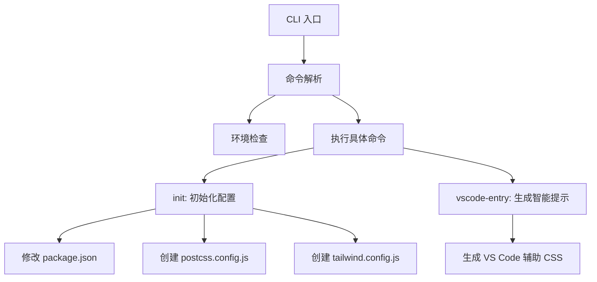
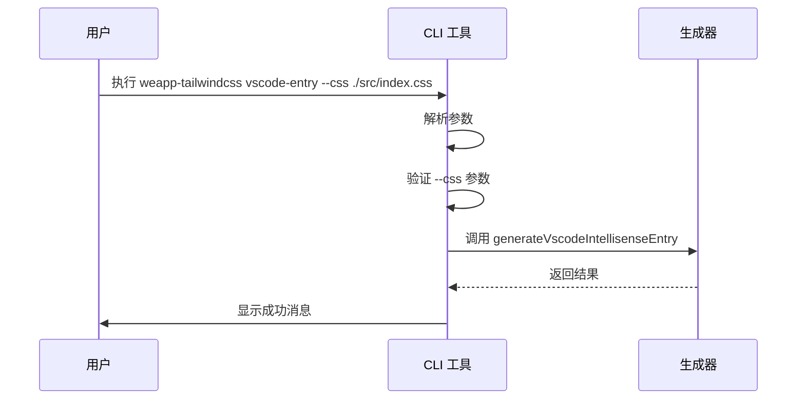

# CLI API

<cite>
**本文档中引用的文件**  
- [init.ts](file://packages/init/src/index.ts)
- [weapp-tailwindcss.js](file://packages/weapp-tailwindcss/bin/weapp-tailwindcss.js)
- [cli.ts](file://packages/weapp-tailwindcss/src/cli.ts)
- [package.json](file://packages/weapp-tailwindcss/package.json)
</cite>

## 目录
1. [简介](#简介)
2. [项目结构](#项目结构)
3. [核心组件](#核心组件)
4. [架构概述](#架构概述)
5. [详细组件分析](#详细组件分析)
6. [依赖分析](#依赖分析)
7. [性能考虑](#性能考虑)
8. [故障排除指南](#故障排除指南)
9. [结论](#结论)

## 简介
`weapp-tailwindcss` 是一个为小程序开发者提供 Tailwind CSS 原子化样式支持的完整解决方案。本 CLI 工具旨在简化项目初始化、开发构建和生产部署流程，支持多种主流框架（如 Taro、uni-app、Vite、Webpack 等），并集成智能提示、自动配置生成功能，提升开发效率。

本文档详细记录了 `init`、`build`、`dev` 等命令的使用方法、参数选项、配置文件格式及执行流程，并提供实际示例、错误代码说明、常见问题解决方案和最佳实践建议。

## 项目结构
该 CLI 工具作为 `weapp-tailwindcss` 包的一部分，主要包含以下结构：

- `bin/weapp-tailwindcss.js`：CLI 入口文件，负责启动命令行工具
- `src/cli.ts`：CLI 主逻辑实现，使用 `cac` 框架定义命令和选项
- `packages/init/src/index.ts`：`init` 命令的核心实现，用于初始化项目配置
- `dist/`：编译后的 CLI 可执行文件目录

CLI 通过 `package.json` 中的 `bin` 字段注册为可执行命令：`weapp-tailwindcss`、`weapp-tw` 和 `weapp-tailwindcss-webpack-plugin`。

**Section sources**
- [package.json](file://packages/weapp-tailwindcss/package.json#L142-L146)

## 核心组件
CLI 的核心功能由以下几个部分组成：

- **命令解析**：基于 `cac` 库实现，支持 `vscode-entry` 等子命令
- **环境检查**：在启动时检查 Node.js 版本是否满足最低要求（>= v18.17.0 或 >= v20.5.0）
- **配置生成**：通过 `@weapp-tailwindcss/init` 包实现 `init` 功能，自动生成 `postcss.config.js` 和 `tailwind.config.js`
- **智能提示支持**：提供 `vscode-entry` 命令，为 VS Code 的 Tailwind IntelliSense 生成辅助 CSS 文件

这些组件协同工作，确保开发者能够快速搭建支持 Tailwind CSS 的小程序项目。

**Section sources**
- [cli.ts](file://packages/weapp-tailwindcss/src/cli.ts#L1-L78)
- [init.ts](file://packages/init/src/index.ts#L1-L107)

## 架构概述
CLI 工具采用模块化设计，其架构可分为三层：

1. **入口层**：`bin/weapp-tailwindcss.js` 负责加载并执行编译后的 CLI 主文件
2. **命令层**：`src/cli.ts` 使用 `cac` 定义命令行接口，解析用户输入
3. **功能层**：调用 `@weapp-tailwindcss/init`、`tailwindcss-patch` 等内部模块完成具体任务

CLI 还集成了日志系统（`@weapp-tailwindcss/logger`）和路径处理工具（`pathe`），确保跨平台兼容性和良好的用户体验。



**Diagram sources**
- [weapp-tailwindcss.js](file://packages/weapp-tailwindcss/bin/weapp-tailwindcss.js#L1-L9)
- [cli.ts](file://packages/weapp-tailwindcss/src/cli.ts#L1-L78)
- [init.ts](file://packages/init/src/index.ts#L1-L107)

## 详细组件分析

### init 命令分析
`init` 命令用于初始化项目，自动创建必要的配置文件并修改 `package.json`。

#### 功能说明
- 检查当前目录是否存在 `package.json`
- 自动添加 `weapp-tw patch` 到 `postinstall` 脚本
- 安装必要的开发依赖
- 创建 `postcss.config.js` 和 `tailwind.config.js` 文件

#### 配置文件模板
`postcss.config.js` 默认内容：
```js
module.exports = {
  plugins: {
    tailwindcss: {},
    autoprefixer: {},
  },
}
```

`tailwind.config.js` 默认内容：
```js
/** @type {import('tailwindcss').Config} */
module.exports = {
  content: ['./public/index.html', './src/**/*.{wxml,html,js,ts,jsx,tsx,vue}'],
  corePlugins: {
    preflight: false,
    container: false,
  },
}
```

**Section sources**
- [init.ts](file://packages/init/src/index.ts#L43-L80)

### vscode-entry 命令分析
该命令为 VS Code 的 Tailwind IntelliSense 提供支持，生成一个包含所有 Tailwind 类的辅助 CSS 文件。

#### 命令参数
| 参数 | 描述 | 默认值 |
|------|------|--------|
| `--cwd` | 工作目录 | 当前目录 |
| `--css` | 导入 weapp-tailwindcss 的 CSS 文件路径 | 必需 |
| `--output` | 输出路径 | `.vscode/weapp-tailwindcss.css` |
| `--source` | 额外的 @source glob 模式 | 无 |
| `--force` | 是否覆盖已存在的文件 | false |

#### 执行流程
1. 解析工作目录
2. 验证 `--css` 参数
3. 生成智能提示入口文件
4. 输出成功信息



**Diagram sources**
- [cli.ts](file://packages/weapp-tailwindcss/src/cli.ts#L41-L73)

## 依赖分析
CLI 工具依赖多个内部和外部包，形成一个完整的生态系统。

```mermaid
graph LR
A[weapp-tailwindcss CLI] --> B[@weapp-tailwindcss/init]
A --> C[@weapp-tailwindcss/logger]
A --> D[@weapp-tailwindcss/shared]
A --> E[tailwindcss-patch]
A --> F[cac]
B --> G[fs-extra]
B --> H[pathe]
C --> I[debug]
D --> J[defu]
```

**Diagram sources**
- [package.json](file://packages/weapp-tailwindcss/package.json#L188-L212)

**Section sources**
- [package.json](file://packages/weapp-tailwindcss/package.json#L188-L212)

## 性能考虑
CLI 工具在设计时考虑了以下性能因素：

- 使用 `lru-cache` 缓存频繁访问的数据
- 通过 `fast-glob` 高效匹配文件路径
- 采用 `magic-string` 优化字符串操作
- 最小化依赖包体积，确保快速启动

建议在项目根目录执行 CLI 命令，避免跨目录操作带来的性能损耗。

## 故障排除指南
### 常见问题及解决方案

#### 1. Node.js 版本不兼容
**错误信息**：`You are using Node.js X.X.X. For weapp-tailwindcss, Node.js version >= v18.17.0 is required.`  
**解决方案**：升级 Node.js 到 v18.17.0 或更高版本。

#### 2. package.json 不存在
**错误信息**：`当前目录下不存在 `package.json` 文件，初始化脚本将被跳过`  
**解决方案**：在项目根目录执行 `npm init` 或手动创建 `package.json`。

#### 3. 权限错误
**错误信息**：`EACCES: permission denied`  
**解决方案**：使用 `sudo` 执行命令，或修复 npm 全局目录权限。

### 错误代码说明
| 错误代码 | 含义 | 建议操作 |
|---------|------|----------|
| 30404 | 文件不存在 | 检查文件路径是否正确 |
| SEMVER | 版本不兼容 | 升级 Node.js 或 CLI 版本 |
| CONFIG | 配置文件错误 | 检查配置语法和路径 |

**Section sources**
- [cli.ts](file://packages/weapp-tailwindcss/src/cli.ts#L30-L34)
- [init.ts](file://packages/init/src/index.ts#L37-L38)

## 结论
`weapp-tailwindcss` CLI 工具为小程序开发者提供了一套完整的 Tailwind CSS 集成方案。通过 `init` 命令可快速初始化项目，`vscode-entry` 命令增强了开发体验。工具设计合理，依赖清晰，性能优良，是开发小程序项目的理想选择。

建议开发者遵循最佳实践：保持 Node.js 版本更新、在项目根目录执行命令、定期更新 CLI 工具以获取最新功能和修复。