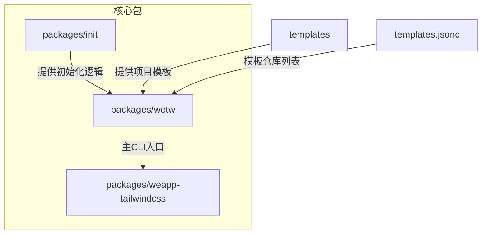
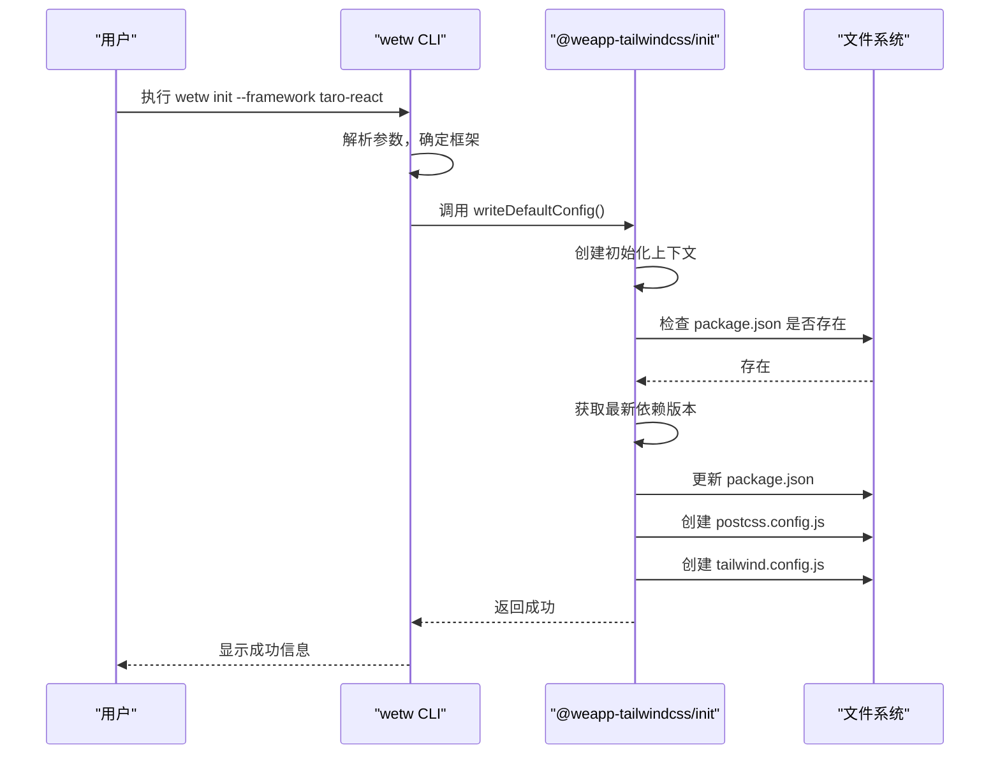
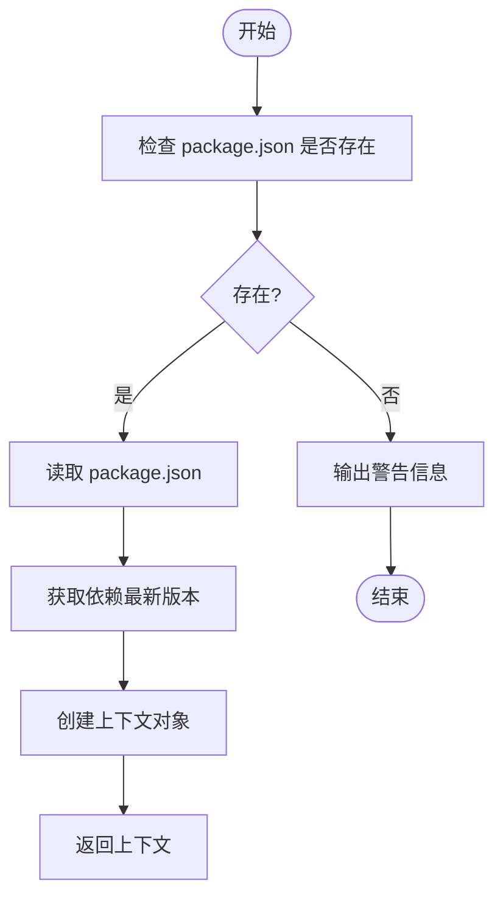
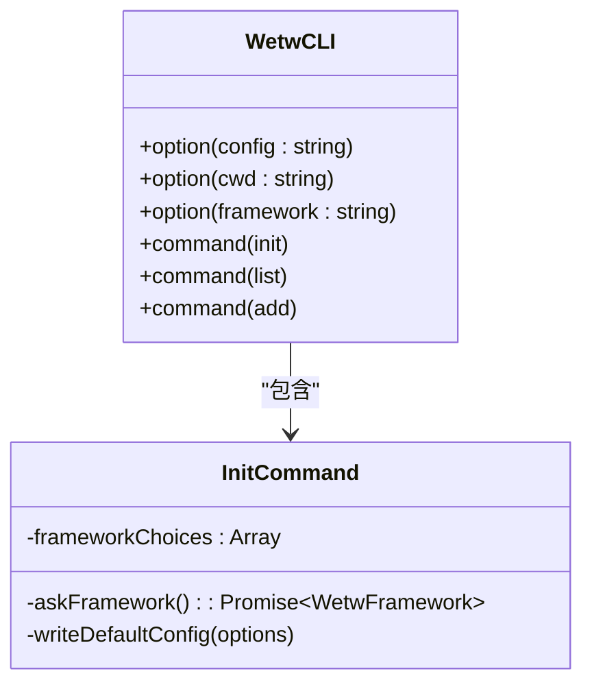

# 初始化命令

<cite>
**本文档引用文件**  
- [index.ts](file://packages/init/src/index.ts)
- [npm.ts](file://packages/init/src/npm.ts)
- [cli.ts](file://packages/wetw/src/cli.ts)
- [templates.jsonc](file://templates.jsonc)
- [package.json](file://packages/init/package.json)
</cite>

## 目录
1. [简介](#简介)
2. [项目结构](#项目结构)
3. [核心组件](#核心组件)
4. [架构概述](#架构概述)
5. [详细组件分析](#详细组件分析)
6. [依赖分析](#依赖分析)
7. [性能考虑](#性能考虑)
8. [故障排除指南](#故障排除指南)
9. [结论](#结论)

## 简介
`weapp-tailwindcss` 是一个为小程序开发者提供 Tailwind CSS 原子化样式能力的工具。其初始化命令 `init` 用于快速配置项目所需的开发依赖和配置文件，支持多种小程序框架。本文档深入解析 `init` 命令的实现逻辑、参数解析、模板应用机制及错误处理。

## 项目结构
`weapp-tailwindcss` 项目采用 Monorepo 结构，主要包含多个功能包。与初始化命令直接相关的包位于 `packages/` 目录下。



**Diagram sources**
- [packages/init/src/index.ts](file://packages/init/src/index.ts)
- [packages/wetw/src/cli.ts](file://packages/wetw/src/cli.ts)
- [templates.jsonc](file://templates.jsonc)

**Section sources**
- [packages/init/src/index.ts](file://packages/init/src/index.ts)
- [packages/wetw/src/cli.ts](file://packages/wetw/src/cli.ts)

## 核心组件
`init` 命令的核心功能由 `@weapp-tailwindcss/init` 包实现，主要负责创建和更新项目配置文件。`wetw` CLI 则作为用户交互的入口，处理命令行参数并调用初始化逻辑。

**Section sources**
- [packages/init/src/index.ts](file://packages/init/src/index.ts)
- [packages/wetw/src/cli.ts](file://packages/wetw/src/cli.ts)

## 架构概述
`init` 命令的执行流程分为两个主要部分：CLI 参数解析和配置文件生成。CLI 部分负责接收用户输入并确定目标框架，而初始化逻辑部分则根据上下文生成或更新必要的配置文件。



**Diagram sources**
- [packages/wetw/src/cli.ts](file://packages/wetw/src/cli.ts)
- [packages/init/src/index.ts](file://packages/init/src/index.ts)

## 详细组件分析

### 初始化逻辑分析
`@weapp-tailwindcss/init` 包是初始化功能的核心，它不直接处理用户交互，而是提供了一套可编程的 API 来完成配置文件的创建和更新。

#### 初始化上下文创建
`createContext` 函数是初始化流程的起点。它检查当前工作目录下是否存在 `package.json` 文件。如果存在，则读取其内容并获取所需开发依赖的最新版本；如果不存在，则输出警告信息并终止流程。



**Diagram sources**
- [packages/init/src/index.ts](file://packages/init/src/index.ts#L18-L39)

#### 依赖版本获取
`getDevDepsVersions` 函数负责查询 NPM 仓库，获取指定依赖的最新版本。它使用 `npm-registry-fetch` 库，并默认配置为国内镜像源 `https://registry.npmmirror.com` 以提高下载速度。该函数会根据 `defaultDevDeps` 对象中定义的版本范围（如 `"3"`）来查找匹配的最新版本。

**Section sources**
- [packages/init/src/npm.ts](file://packages/init/src/npm.ts#L39-L55)

#### 配置文件生成
初始化过程会生成或更新三个关键文件：
1.  **`package.json`**: 通过 `updatePackageJson` 函数，在 `devDependencies` 中添加 `tailwindcss`、`postcss`、`autoprefixer` 和 `weapp-tailwindcss` 等依赖，并添加 `postinstall` 脚本。
2.  **`postcss.config.js`**: 通过 `touchPostcssConfig` 函数创建，配置 PostCSS 插件，启用 `tailwindcss` 和 `autoprefixer`。
3.  **`tailwind.config.js`**: 通过 `touchTailwindConfig` 函数创建，提供 Tailwind CSS 的基础配置，包括 `content` 字段的示例和禁用 `preflight` 等核心插件。

**Section sources**
- [packages/init/src/index.ts](file://packages/init/src/index.ts#L43-L80)

### CLI 命令分析
`wetw` CLI 是用户与初始化功能交互的接口，它提供了 `init`、`list` 和 `add` 等命令。

#### init 命令参数解析
`init` 命令支持以下选项：
- **`--config <path>`**: 指定配置文件的路径，默认为 `wetw.config.ts`。
- **`--cwd <path>`**: 指定工作目录，默认为当前目录。
- **`--framework <name>`**: 指定目标框架，可选值包括 `mp-weixin`、`uni-app-vue3`、`taro-react`。如果未指定，CLI 会通过交互式菜单让用户选择。



**Diagram sources**
- [packages/wetw/src/cli.ts](file://packages/wetw/src/cli.ts#L12-L64)

#### 模板应用机制
虽然 `@weapp-tailwindcss/init` 包本身不直接处理模板，但 `wetw` CLI 的 `init` 命令通过 `writeDefaultConfig` 函数间接关联了模板系统。`templates.jsonc` 文件定义了一个模板仓库的列表，这些模板为不同的框架（如 uni-app、Taro）提供了完整的项目结构示例。当用户初始化项目时，CLI 可以根据选择的框架，从这些模板仓库中克隆或参考其结构。

**Section sources**
- [templates.jsonc](file://templates.jsonc)
- [packages/wetw/src/cli.ts](file://packages/wetw/src/cli.ts#L53-L58)

## 依赖分析
`init` 命令的实现依赖于多个内部和外部包。

```mermaid
graph LR
A[@weapp-tailwindcss/init] --> B[@weapp-tailwindcss/logger]
A --> C[@weapp-tailwindcss/shared]
A --> D[fs-extra]
A --> E[npm-registry-fetch]
A --> F[pathe]
G[wetw] --> A
G --> H[@inquirer/prompts]
G --> I[cac]
```

**Diagram sources**
- [packages/init/package.json](file://packages/init/package.json)
- [packages/wetw/src/cli.ts](file://packages/wetw/src/cli.ts)

**Section sources**
- [packages/init/package.json](file://packages/init/package.json)

## 性能考虑
`init` 命令的性能主要受网络请求影响，因为需要从 NPM 仓库查询依赖的最新版本。通过默认使用国内镜像源 `https://registry.npmmirror.com`，可以显著减少网络延迟，提高初始化速度。此外，所有文件操作都是同步的，确保了流程的线性执行。

## 故障排除指南
以下是使用 `init` 命令时可能遇到的常见问题及其解决方案。

**Section sources**
- [packages/init/src/index.ts](file://packages/init/src/index.ts#L37-L38)
- [packages/wetw/src/cli.ts](file://packages/wetw/src/cli.ts#L30-L32)

### 常见问题

1.  **问题**: `当前目录下不存在 'package.json' 文件，初始化脚本将被跳过...`
    *   **原因**: `createContext` 函数在工作目录中未找到 `package.json` 文件。
    *   **解决方案**: 在执行 `wetw init` 命令前，先运行 `npm init` 或 `pnpm init` 来创建一个 `package.json` 文件。

2.  **问题**: 依赖安装缓慢或失败。
    *   **原因**: 网络问题或 NPM 源不稳定。
    *   **解决方案**: 确保网络连接正常。`init` 命令本身不安装依赖，它只更新 `package.json`。安装依赖需要用户手动运行 `npm install` 或 `pnpm install`。可以配置 NPM 使用更快的镜像源。

3.  **问题**: 交互式选择框架时被取消。
    *   **原因**: 用户在 `select` 提示中按下了 Ctrl+C。
    *   **解决方案**: 重新运行 `wetw init` 命令，并在提示时做出选择，或直接使用 `--framework` 参数指定框架。

## 结论
`weapp-tailwindcss` 的 `init` 命令通过 `@weapp-tailwindcss/init` 和 `wetw` 两个包的协作，实现了高效、灵活的项目初始化。它通过自动查询最新依赖版本、生成标准配置文件，并结合可扩展的模板系统，极大地简化了为不同小程序框架集成 Tailwind CSS 的流程。理解其内部实现有助于开发者更好地使用该工具，并在遇到问题时进行有效排查。