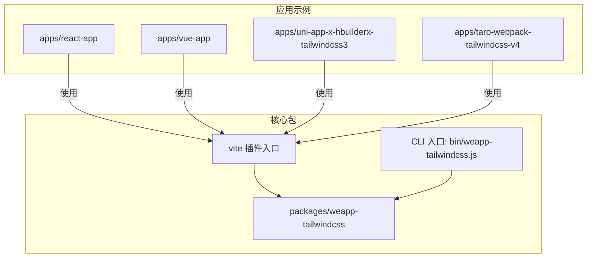
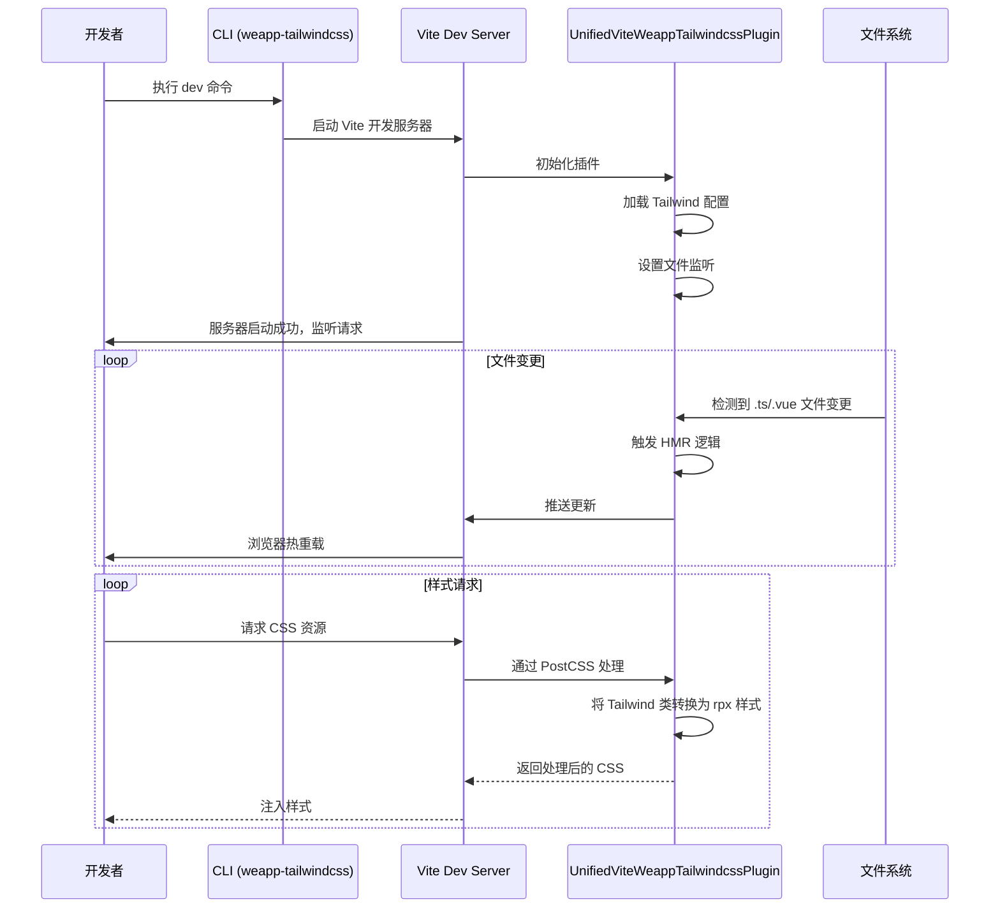
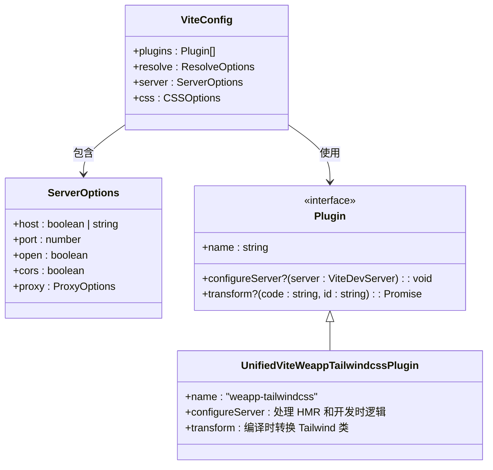

# 开发服务器

<cite>
**本文档中引用的文件**  
- [weapp-tailwindcss.js](file://packages/weapp-tailwindcss/bin/weapp-tailwindcss.js)
- [vite.config.ts](file://apps/react-app/vite.config.ts)
- [vite.config.ts](file://apps/vue-app/vite.config.ts)
- [vite.config.ts](file://apps/uni-app-x-hbuilderx-tailwindcss3/vite.config.ts)
- [index.ts](file://packages/weapp-tailwindcss/src/index.ts)
- [package.json](file://packages/weapp-tailwindcss/package.json)
</cite>

## 目录

1. [简介](#简介)
2. [项目结构](#项目结构)
3. [核心组件](#核心组件)
4. [架构概述](#架构概述)
5. [详细组件分析](#详细组件分析)
6. [依赖分析](#依赖分析)
7. [性能考虑](#性能考虑)
8. [故障排除指南](#故障排除指南)
9. [结论](#结论)

## 简介
本文档详细描述了 `weapp-tailwindcss` 项目中开发服务器功能的实现机制。重点涵盖 `dev` 命令的执行流程、热重载（HMR）原理、开发环境配置选项（如 `--port` 和 `--host`）的使用方法与默认行为。同时，文档展示了如何启动开发服务器并进行实时调试，解析了开发服务器的中间件架构、请求处理流程和错误拦截机制，并解释了开发模式下的 CSS 注入方式、HMR 实现及性能优化策略。

## 项目结构

本项目是一个包含多个小程序框架集成示例的 monorepo，核心功能由 `packages/weapp-tailwindcss` 提供。开发服务器功能主要通过 Vite 构建工具集成实现，配置文件分散在各个应用示例中。



**图示来源**
- [weapp-tailwindcss.js](file://packages/weapp-tailwindcss/bin/weapp-tailwindcss.js)
- [vite.config.ts](file://apps/react-app/vite.config.ts)
- [vite.config.ts](file://apps/uni-app-x-hbuilderx-tailwindcss3/vite.config.ts)

**本节来源**
- [weapp-tailwindcss.js](file://packages/weapp-tailwindcss/bin/weapp-tailwindcss.js)
- [vite.config.ts](file://apps/react-app/vite.config.ts)

## 核心组件

`weapp-tailwindcss` 的开发服务器功能并非独立实现，而是深度集成于 Vite 的生态系统中。其核心组件包括：
- **CLI 入口**：`bin/weapp-tailwindcss.js`，负责解析命令行参数并启动相应流程。
- **Vite 插件**：通过 `weapp-tailwindcss/vite` 导出，作为 Vite 插件被应用配置加载，是实现 Tailwind CSS 到小程序样式转换的核心。
- **配置驱动**：`vite.config.ts` 文件中的 `server` 配置对象，直接控制开发服务器的主机、端口等行为。

**本节来源**
- [weapp-tailwindcss.js](file://packages/weapp-tailwindcss/bin/weapp-tailwindcss.js)
- [index.ts](file://packages/weapp-tailwindcss/src/index.ts)
- [vite.config.ts](file://apps/react-app/vite.config.ts)

## 架构概述

开发服务器的架构基于 Vite 的高效开发体验，并通过 `weapp-tailwindcss` 插件进行增强，以支持小程序的 Tailwind CSS 开发。



**图示来源**
- [vite.config.ts](file://apps/uni-app-x-hbuilderx-tailwindcss3/vite.config.ts)
- [index.ts](file://packages/weapp-tailwindcss/src/index.ts)

## 详细组件分析

### CLI 命令实现分析

CLI 的主要职责是作为命令行接口的入口。`bin/weapp-tailwindcss.js` 文件是一个简单的 Node.js 脚本，它检查编译后的 `cli.js` 是否存在，如果存在则直接加载并执行。这表明实际的命令行逻辑（如 `dev`, `build`, `patch` 等）是在 `dist/cli.js` 中实现的，该文件由 TypeScript 源码编译而来。

**本节来源**
- [weapp-tailwindcss.js](file://packages/weapp-tailwindcss/bin/weapp-tailwindcss.js)
- [package.json](file://packages/weapp-tailwindcss/package.json#L142-L146)

### Vite 开发服务器配置分析

Vite 开发服务器的配置是通过 `vite.config.ts` 文件中的 `server` 对象完成的。以 `react-app` 和 `uni-app-x` 为例，其配置具有共性：



**图示来源**
- [vite.config.ts](file://apps/react-app/vite.config.ts#L20-L23)
- [vite.config.ts](file://apps/uni-app-x-hbuilderx-tailwindcss3/vite.config.ts)

**本节来源**
- [vite.config.ts](file://apps/react-app/vite.config.ts)
- [vite.config.ts](file://apps/vue-app/vite.config.ts)
- [vite.config.ts](file://apps/uni-app-x-hbuilderx-tailwindcss3/vite.config.ts)

### 热重载（HMR）与 CSS 注入机制

热重载和 CSS 注入是开发服务器的核心功能，由 `UnifiedViteWeappTailwindcssPlugin` 插件实现。
- **HMR 原理**：插件通过 Vite 的插件 API 监听项目文件（如 `.ts`, `.vue`, `.wxml`）的变化。当文件被修改并保存时，Vite 会触发 HMR 事件，插件捕获此事件并通知客户端（浏览器或小程序开发工具）进行局部更新，无需刷新整个页面。
- **CSS 注入方式**：在开发模式下，插件利用 PostCSS 在 Vite 的构建流程中拦截和处理 CSS。它读取 `tailwind.config.js` 配置，将源代码中的 Tailwind CSS 类名（如 `text-red-500`）实时编译并转换为适用于小程序的内联样式或 CSS 规则，然后注入到最终的样式表中。

**本节来源**
- [vite.config.ts](file://apps/uni-app-x-hbuilderx-tailwindcss3/vite.config.ts#L12-L25)
- [vite.config.ts](file://apps/uni-app-x-hbuilderx-tailwindcss3/vite.config.ts#L31-L37)

## 依赖分析

```mermaid
graph LR
A[开发者] --> B[Vite Dev Server]
B --> C[weapp-tailwindcss/vite 插件]
C --> D[Tailwind CSS]
C --> E[PostCSS]
C --> F[@babel/parser]
C --> G[magic-string]
D --> H[tailwind.config.js]
E --> H
B --> I[浏览器/小程序开发工具]
style A fill:#f9f,stroke:#333
style I fill:#ccf,stroke:#333
```

**图示来源**
- [package.json](file://packages/weapp-tailwindcss/package.json#L189-L212)
- [vite.config.ts](file://apps/uni-app-x-hbuilderx-tailwindcss3/vite.config.ts)

**本节来源**
- [package.json](file://packages/weapp-tailwindcss/package.json)

## 性能考虑

`weapp-tailwindcss` 的开发服务器性能优化主要体现在：
1.  **Vite 的原生优势**：基于 ESBuild 和原生 ES 模块，实现极快的冷启动和热更新。
2.  **按需编译**：插件只处理项目中实际使用的 Tailwind CSS 类，避免了全量编译的开销。
3.  **缓存机制**：利用 `lru-cache` 等工具对解析和转换结果进行缓存，减少重复计算。
4.  **高效的文件监听**：使用 `fast-glob` 进行快速的文件模式匹配，确保 HMR 的及时性。

## 故障排除指南

当开发服务器出现问题时，可参考以下步骤：
1.  **检查端口占用**：确认 `--port` 指定的端口未被其他程序占用。
2.  **验证配置文件**：确保 `tailwind.config.js` 和 `vite.config.ts` 语法正确且路径无误。
3.  **查看 CLI 输出**：运行命令时观察终端输出的错误日志，定位问题源头。
4.  **检查依赖安装**：确保 `weapp-tailwindcss` 及其对等依赖（peer dependencies）已正确安装。

**本节来源**
- [weapp-tailwindcss.js](file://packages/weapp-tailwindcss/bin/weapp-tailwindcss.js)
- [vite.config.ts](file://apps/react-app/vite.config.ts)

## 结论

`weapp-tailwindcss` 的开发服务器功能通过与 Vite 深度集成，为小程序开发者提供了现代化的开发体验。它利用 Vite 的高性能开发服务器作为基础，通过自定义插件实现了 Tailwind CSS 的实时编译、HMR 和 CSS 注入。开发者可以通过简单的 `vite.config.ts` 配置来定制服务器行为（如端口和主机），并享受快速的构建和热重载带来的高效开发流程。其架构清晰，依赖明确，是连接现代前端工具链与小程序生态的重要桥梁。