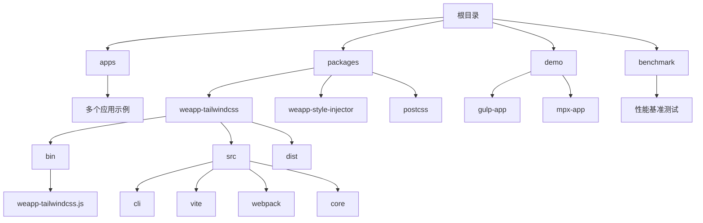
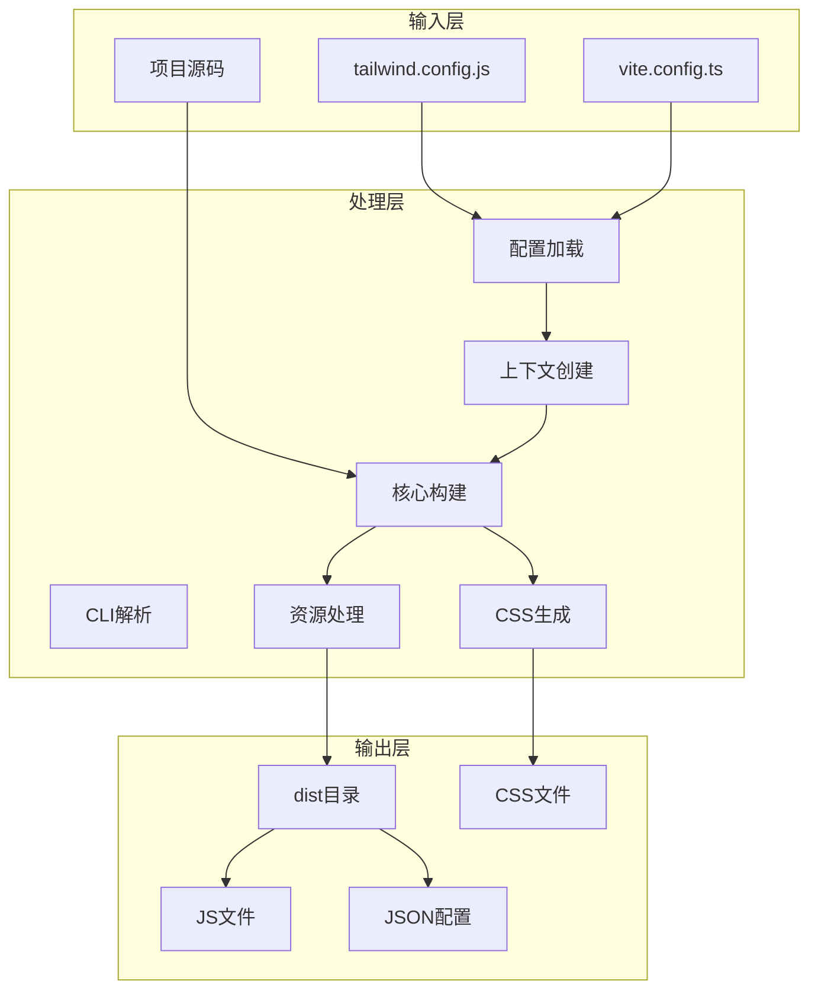
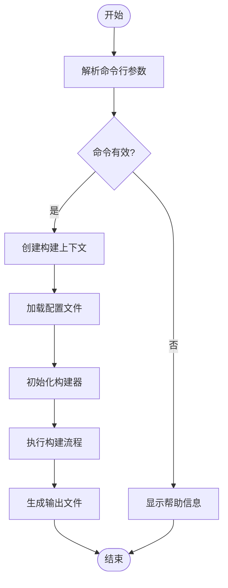
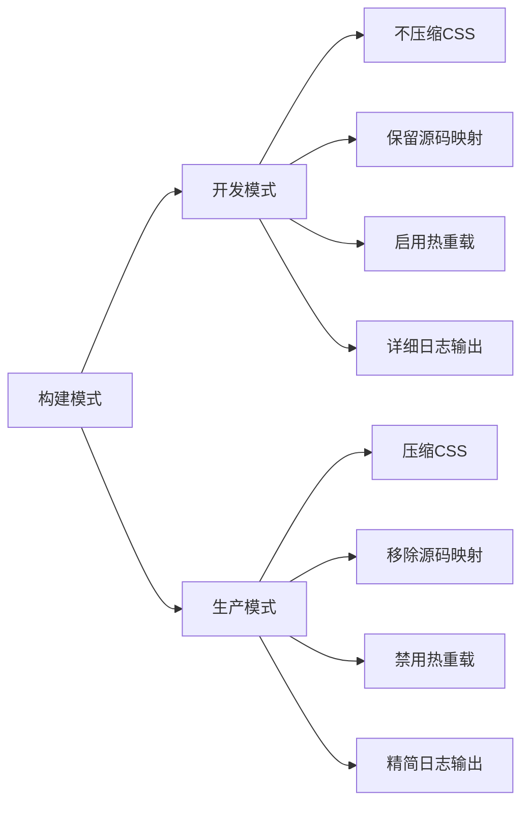
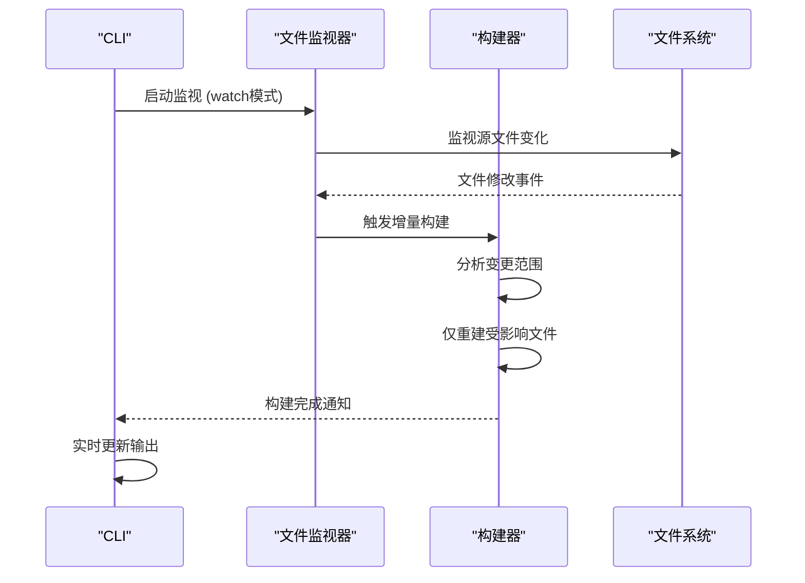
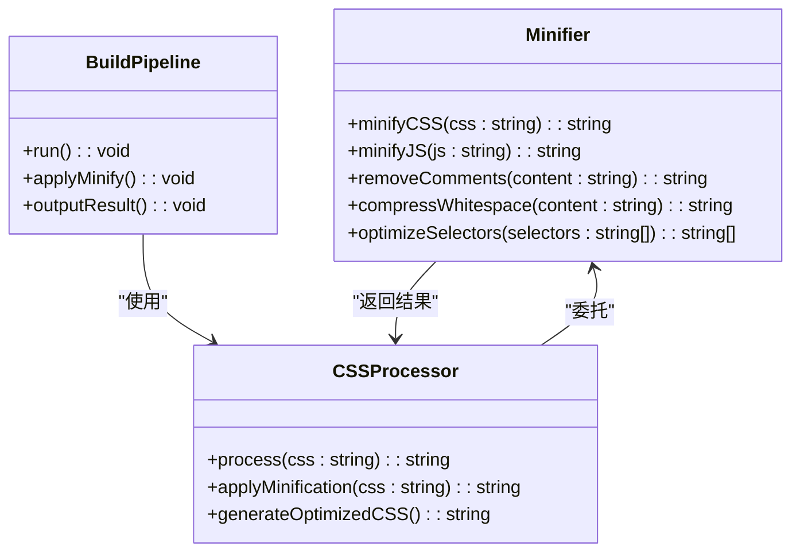

# 构建命令

<cite>
**本文档中引用的文件**  
- [weapp-tailwindcss.js](file://packages/weapp-tailwindcss/bin/weapp-tailwindcss.js)
- [package.json](file://packages/weapp-tailwindcss/package.json)
- [cli.ts](file://packages/weapp-tailwindcss/src/cli.ts)
- [context.ts](file://packages/weapp-tailwindcss/src/cli/context.ts)
- [config.ts](file://packages/weapp-tailwindcss/src/cli/config.ts)
- [core.ts](file://packages/weapp-tailwindcss/src/core.ts)
- [vite.ts](file://packages/weapp-tailwindcss/src/vite.ts)
- [webpack.ts](file://packages/weapp-tailwindcss/src/webpack.ts)
- [gulp.ts](file://packages/weapp-tailwindcss/src/gulp.ts)
- [tailwind.config.js](file://apps/rsmax-app-ts/tailwind.config.js)
- [vite.config.ts](file://apps/vite-native/vite.config.ts)
- [postcss.config.js](file://apps/rsmax-app-ts/postcss.config.js)
- [project.config.json](file://apps/rsmax-app-ts/project.config.json)
</cite>

## 目录
1. [简介](#简介)
2. [项目结构](#项目结构)
3. [核心组件](#核心组件)
4. [架构概述](#架构概述)
5. [详细组件分析](#详细组件分析)
6. [依赖分析](#依赖分析)
7. [性能考虑](#性能考虑)
8. [故障排除指南](#故障排除指南)
9. [结论](#结论)

## 简介
本技术文档全面记录了 `weapp-tailwindcss` 项目的构建命令执行流程、构建模式差异、输出目录结构以及构建选项的实现机制。文档详细说明了 `--watch` 和 `--minify` 等构建参数的作用原理，通过实际案例展示如何配置构建参数以优化小程序包大小和性能。同时，文档深入解析了构建过程中的资源处理流程、CSS生成机制、错误报告系统、构建缓存机制和增量构建的实现原理。

## 项目结构



**图示来源**  
- [package.json](file://packages/weapp-tailwindcss/package.json#L1-L215)
- [weapp-tailwindcss.js](file://packages/weapp-tailwindcss/bin/weapp-tailwindcss.js#L1-L9)

**章节来源**  
- [package.json](file://packages/weapp-tailwindcss/package.json#L1-L215)
- [weapp-tailwindcss.js](file://packages/weapp-tailwindcss/bin/weapp-tailwindcss.js#L1-L9)

## 核心组件

`weapp-tailwindcss` 的核心构建功能由 CLI 入口、构建上下文管理、配置解析、核心构建逻辑和多种构建器适配器组成。CLI 入口文件 `weapp-tailwindcss.js` 负责启动构建流程，加载并执行编译后的 CLI 模块。构建上下文管理模块负责维护构建过程中的状态信息，包括项目路径、配置选项和构建模式等。配置解析模块处理 `tailwind.config.js` 等配置文件，为构建过程提供必要的配置参数。核心构建逻辑实现了原子化 CSS 类名的提取、转换和生成。构建器适配器支持 Vite、Webpack 和 Gulp 等多种构建工具，确保在不同项目环境中的一致性体验。

**章节来源**  
- [weapp-tailwindcss.js](file://packages/weapp-tailwindcss/bin/weapp-tailwindcss.js#L1-L9)
- [cli.ts](file://packages/weapp-tailwindcss/src/cli.ts#L1-L50)
- [context.ts](file://packages/weapp-tailwindcss/src/cli/context.ts#L1-L100)

## 架构概述



**图示来源**  
- [cli.ts](file://packages/weapp-tailwindcss/src/cli.ts#L1-L50)
- [core.ts](file://packages/weapp-tailwindcss/src/core.ts#L1-L80)
- [vite.ts](file://packages/weapp-tailwindcss/src/vite.ts#L1-L30)

## 详细组件分析

### CLI命令解析分析

CLI 命令解析模块负责处理用户输入的构建参数，将其转换为内部可用的配置对象。该模块使用 `cac` 库实现命令行参数解析，支持 `build`、`watch`、`patch` 等子命令以及 `--minify`、`--watch` 等选项。



**图示来源**  
- [cli.ts](file://packages/weapp-tailwindcss/src/cli.ts#L1-L50)
- [context.ts](file://packages/weapp-tailwindcss/src/cli/context.ts#L1-L50)

**章节来源**  
- [cli.ts](file://packages/weapp-tailwindcss/src/cli.ts#L1-L50)
- [context.ts](file://packages/weapp-tailwindcss/src/cli/context.ts#L1-L100)

### 构建模式差异分析



**图示来源**  
- [config.ts](file://packages/weapp-tailwindcss/src/cli/config.ts#L1-L40)
- [core.ts](file://packages/weapp-tailwindcss/src/core.ts#L25-L60)

**章节来源**  
- [config.ts](file://packages/weapp-tailwindcss/src/cli/config.ts#L1-L40)
- [core.ts](file://packages/weapp-tailwindcss/src/core.ts#L1-L80)

### 构建选项实现分析

#### --watch选项实现



**图示来源**  
- [vite.ts](file://packages/weapp-tailwindcss/src/vite.ts#L1-L50)
- [webpack.ts](file://packages/weapp-tailwindcss/src/webpack.ts#L1-L40)

**章节来源**  
- [vite.ts](file://packages/weapp-tailwindcss/src/vite.ts#L1-L50)
- [webpack.ts](file://packages/weapp-tailwindcss/src/webpack.ts#L1-L40)

#### --minify选项实现



**图示来源**  
- [core.ts](file://packages/weapp-tailwindcss/src/core.ts#L45-L80)
- [vite.ts](file://packages/weapp-tailwindcss/src/vite.ts#L25-L40)

**章节来源**  
- [core.ts](file://packages/weapp-tailwindcss/src/core.ts#L1-L80)
- [vite.ts](file://packages/weapp-tailwindcss/src/vite.ts#L1-L50)

## 依赖分析

```mermaid
graph TD
A[weapp-tailwindcss] --> B[tailwindcss]
A --> C[postcss]
A --> D[vite]
A --> E[webpack]
A --> F[gulp]
A --> G[cac]
A --> H[magic-string]
A --> I[fast-glob]
A --> J[semver]
A --> K[debug]
B --> L[tailwindcss-patch]
C --> M[@weapp-tailwindcss/postcss]
D --> N[vite-plugin-weapp-tailwindcss]
E --> O[weapp-tailwindcss-webpack-plugin]
F --> P[gulp-weapp-tailwindcss]
style A fill:#f9f,stroke:#333
style B fill:#bbf,stroke:#333
style C fill:#bbf,stroke:#333
style D fill:#bbf,stroke:#333
style E fill:#bbf,stroke:#333
style F fill:#bbf,stroke:#333
```

**图示来源**  
- [package.json](file://packages/weapp-tailwindcss/package.json#L188-L213)
- [vite.ts](file://packages/weapp-tailwindcss/src/vite.ts#L1-L10)
- [webpack.ts](file://packages/weapp-tailwindcss/src/webpack.ts#L1-L10)

**章节来源**  
- [package.json](file://packages/weapp-tailwindcss/package.json#L1-L215)
- [vite.ts](file://packages/weapp-tailwindcss/src/vite.ts#L1-L50)
- [webpack.ts](file://packages/weapp-tailwindcss/src/webpack.ts#L1-L40)

## 性能考虑

构建性能优化主要体现在以下几个方面：首先，通过增量构建机制，仅重新构建发生变化的文件，大幅减少构建时间。其次，利用 LRU 缓存机制缓存已处理的文件结果，避免重复计算。第三，采用高效的字符串操作库 `magic-string` 进行代码转换，减少内存分配和字符串拼接开销。第四，在生产模式下启用 CSS 压缩，减小程序包体积。最后，通过并行处理多个构建任务，充分利用多核 CPU 的计算能力。

## 故障排除指南

构建过程中常见的问题包括配置文件加载失败、依赖版本不兼容、路径解析错误等。错误报告系统会捕获构建过程中的异常，提供详细的错误信息和堆栈跟踪。对于配置问题，系统会验证配置文件的格式和内容，给出具体的错误位置和建议修复方案。对于依赖问题，会检查依赖版本是否满足要求，并提示用户更新或降级相关依赖。对于路径问题，会提供完整的路径解析过程，帮助用户定位问题根源。

**章节来源**  
- [context.ts](file://packages/weapp-tailwindcss/src/cli/context.ts#L50-L80)
- [logger.ts](file://packages/weapp-tailwindcss/src/logger/index.ts#L1-L30)

## 结论

`weapp-tailwindcss` 的构建系统设计合理，功能完善，支持多种构建工具和项目类型。通过清晰的架构分层和模块化设计，实现了高内聚低耦合的代码结构。构建流程高效稳定，支持开发和生产两种模式，满足不同场景的需求。构建选项灵活多样，能够根据项目需求进行定制化配置。未来可以进一步优化构建性能，增加更多的构建分析工具，提供更丰富的构建报告和可视化界面。