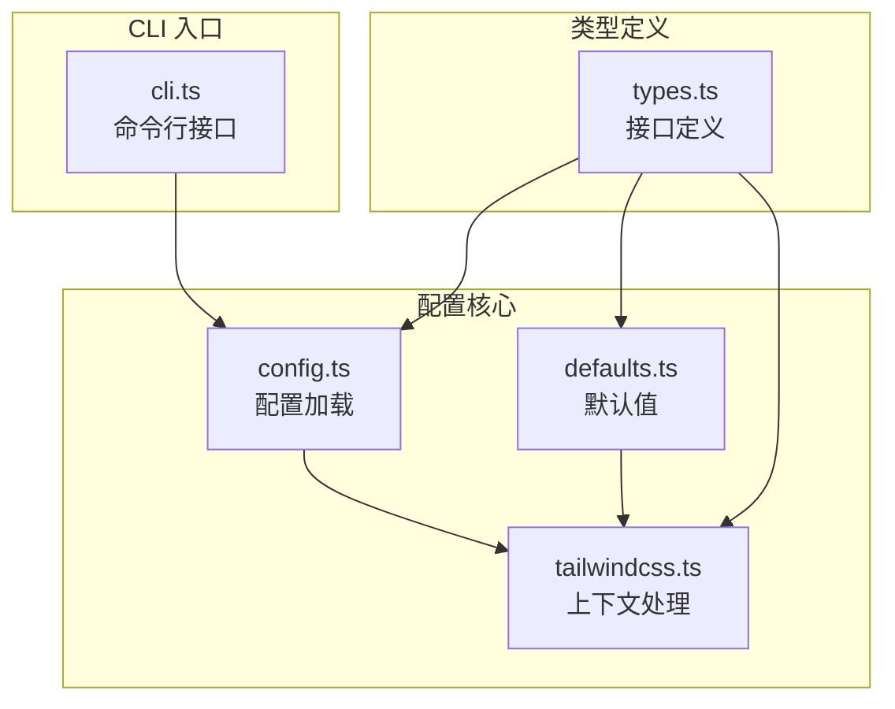
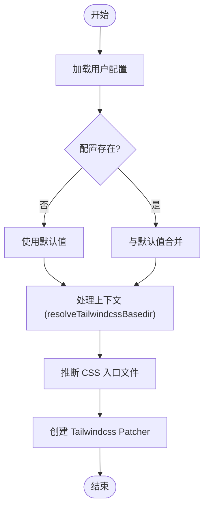
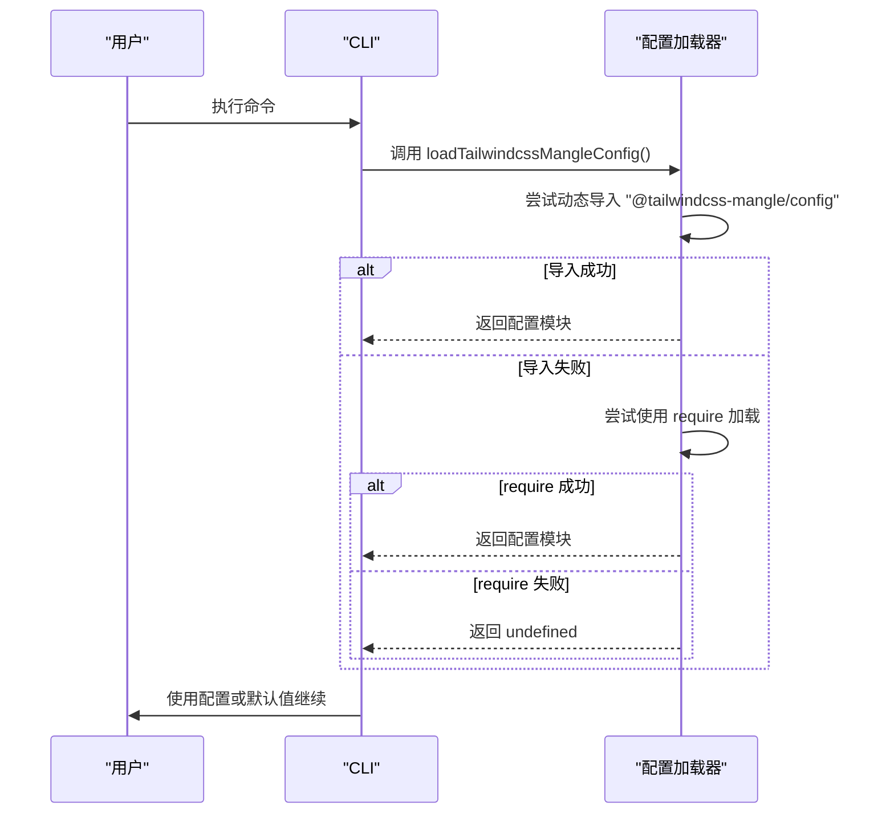
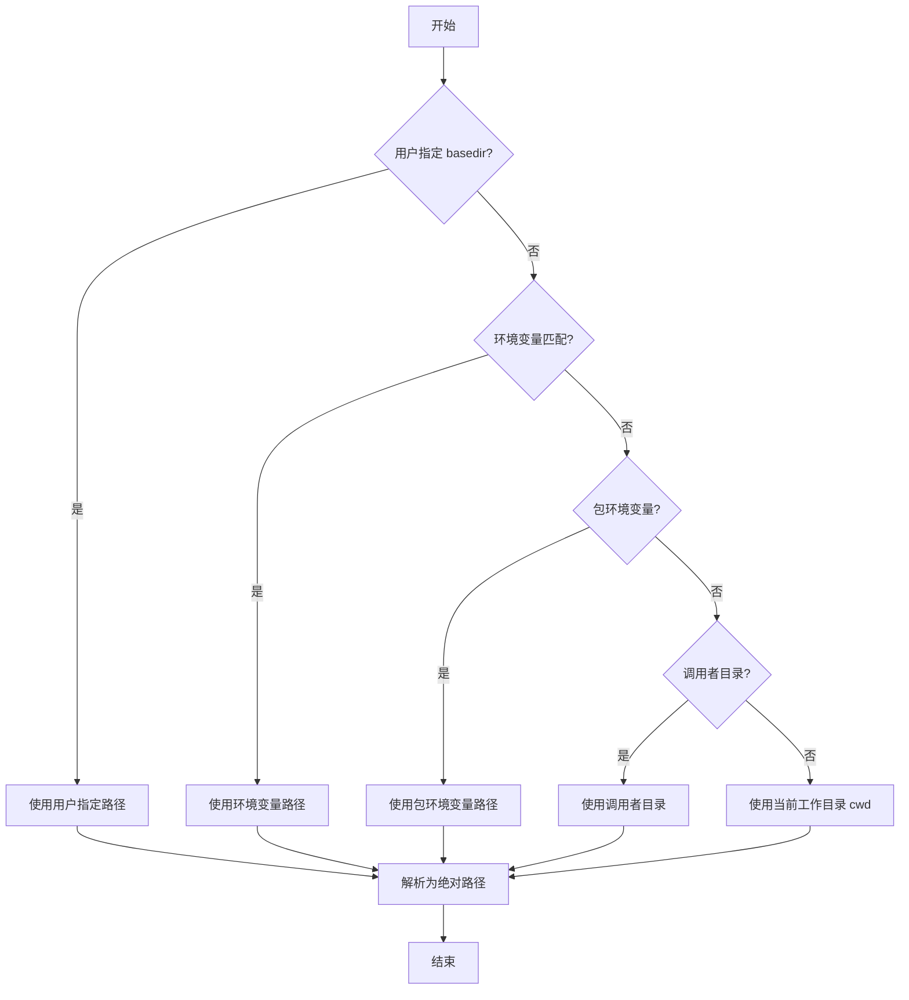
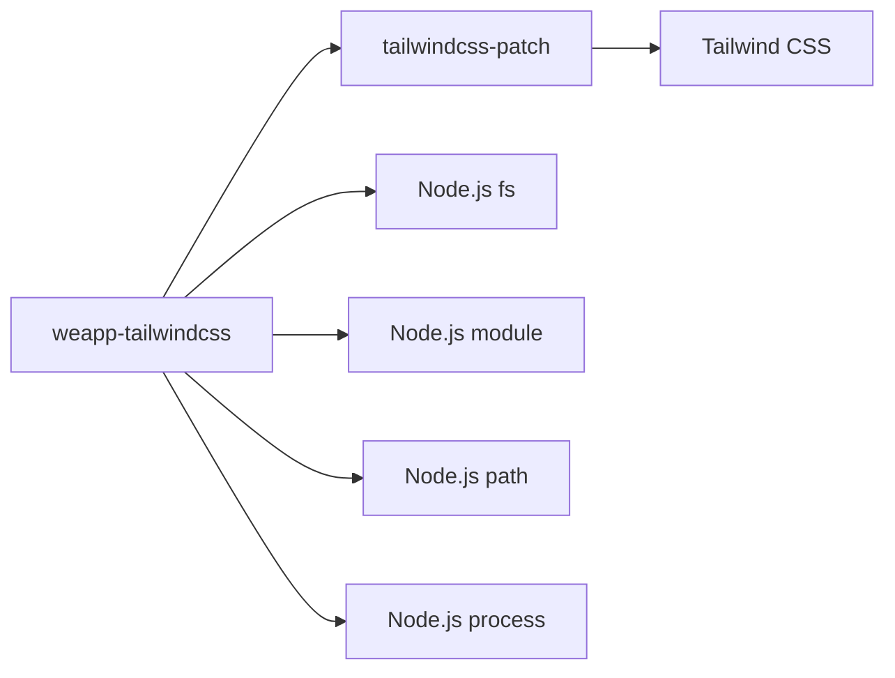

# 配置文件

<cite>
**本文档中引用的文件**
- [config.ts](file://packages/weapp-tailwindcss/src/cli/config.ts)
- [defaults.ts](file://packages/weapp-tailwindcss/src/defaults.ts)
- [tailwindcss.ts](file://packages/weapp-tailwindcss/src/context/tailwindcss.ts)
- [types.ts](file://packages/weapp-tailwindcss/src/types/index.ts)
- [cli.ts](file://packages/weapp-tailwindcss/src/cli.ts)
</cite>

## 目录
1. [简介](#简介)
2. [项目结构](#项目结构)
3. [核心组件](#核心组件)
4. [架构概述](#架构概述)
5. [详细组件分析](#详细组件分析)
6. [依赖分析](#依赖分析)
7. [性能考虑](#性能考虑)
8. [故障排除指南](#故障排除指南)
9. [结论](#结论)
10. [附录](#附录)（如有必要）

## 简介
本文档旨在为 `weapp-tailwindcss` 项目的 CLI 配置系统提供全面的参考。该系统支持通过配置文件和环境变量自定义构建流程，适用于多种小程序框架（如 uni-app、Taro 等）。文档将详细说明配置文件的结构、加载机制、核心配置项以及最佳实践。

## 项目结构
`weapp-tailwindcss` 是一个用于小程序的 Tailwind CSS 构建工具，其配置系统主要位于 `packages/weapp-tailwindcss/src` 目录下。核心配置逻辑分散在 `cli`、`context` 和 `defaults` 等模块中，通过预设（presets）支持不同框架的特定需求。

**图源**
- [config.ts](file://packages/weapp-tailwindcss/src/cli/config.ts)
- [defaults.ts](file://packages/weapp-tailwindcss/src/defaults.ts)
- [tailwindcss.ts](file://packages/weapp-tailwindcss/src/context/tailwindcss.ts)
- [types.ts](file://packages/weapp-tailwindcss/src/types/index.ts)

**节源**
- [config.ts](file://packages/weapp-tailwindcss/src/cli/config.ts)
- [defaults.ts](file://packages/weapp-tailwindcss/src/defaults.ts)

## 核心组件
核心组件包括配置加载器、默认选项管理器和基于上下文的补丁生成器。这些组件协同工作，解析用户配置，合并默认值，并为 Tailwind CSS 处理流程创建一个统一的选项对象。

**节源**
- [config.ts](file://packages/weapp-tailwindcss/src/cli/config.ts#L7-L67)
- [defaults.ts](file://packages/weapp-tailwindcss/src/defaults.ts#L44-L137)
- [tailwindcss.ts](file://packages/weapp-tailwindcss/src/context/tailwindcss.ts#L257-L320)

## 架构概述
系统的配置架构遵循“用户配置 + 默认值 + 上下文推断”的模式。CLI 或构建工具首先加载用户定义的配置文件，然后与内置的默认值合并。最后，系统根据运行时上下文（如工作目录、环境变量）推断出最终的配置，用于驱动 Tailwind CSS 的处理流程。

**图源**
- [config.ts](file://packages/weapp-tailwindcss/src/cli/config.ts)
- [defaults.ts](file://packages/weapp-tailwindcss/src/defaults.ts)
- [tailwindcss.ts](file://packages/weapp-tailwindcss/src/context/tailwindcss.ts)

## 详细组件分析

### 配置加载与解析
该组件负责从文件系统加载配置模块。它使用动态导入（`import()`）和 `require` 两种方式来加载名为 `@tailwindcss-mangle/config` 的模块，确保在不同 Node.js 环境下都能正常工作。

#### 配置加载流程

**图源**
- [config.ts](file://packages/weapp-tailwindcss/src/cli/config.ts#L36-L66)

**节源**
- [config.ts](file://packages/weapp-tailwindcss/src/cli/config.ts#L1-L67)

### 默认配置系统
该系统定义了所有可配置选项的默认行为。`getDefaultOptions()` 函数返回一个包含各种匹配器（matcher）、预设样式（preflight）和回调函数的完整选项对象。

#### 核心配置项
| 配置项 | 类型 | 描述 | 默认值 |
| :--- | :--- | :--- | :--- |
| `cssMatcher` | 函数 | 用于识别 CSS 样式文件的正则匹配器 | 匹配 `.wxss`, `.acss` 等 |
| `htmlMatcher` | 函数 | 用于识别 HTML 模板文件的正则匹配器 | 匹配 `.wxml`, `.axml` 等 |
| `jsMatcher` | 函数 | 用于识别 JavaScript 文件的正则匹配器 | 匹配 `.js`, `.cjs`, `.mjs` |
| `mainCssChunkMatcher` | 函数 | 识别主 CSS 入口文件（如 app.wxss） | 基于 `appType` 的特定规则 |
| `cssPreflight` | 对象 | 应用于所有元素的默认 CSS 样式 | `box-sizing: border-box` 等 |
| `appType` | 字符串 | 指定小程序框架类型 | `undefined` |
| `logLevel` | 字符串 | 日志输出级别 | `'info'` |

**节源**
- [defaults.ts](file://packages/weapp-tailwindcss/src/defaults.ts#L44-L137)

### 预设（Presets）系统
预设系统允许为特定框架（如 uni-app、uni-app-x）提供定制化的配置。虽然代码中存在 `presets` 目录，但当前实现似乎通过 `appType` 参数来区分不同框架的行为，而不是通过独立的预设模块。

**节源**
- [presets/index.ts](file://packages/weapp-tailwindcss/src/presets/index.ts)
- [types.ts](file://packages/weapp-tailwindcss/src/types/index.ts#L22)

### 配置继承与环境变量
系统通过多种方式确定配置的根目录（`basedir`），形成一个优先级链。环境变量在配置继承中扮演重要角色。

#### 基目录（basedir）解析流程

**图源**
- [tailwindcss.ts](file://packages/weapp-tailwindcss/src/context/tailwindcss.ts#L107-L188)

**节源**
- [tailwindcss.ts](file://packages/weapp-tailwindcss/src/context/tailwindcss.ts#L18-L188)

## 依赖分析
`weapp-tailwindcss` 的配置系统依赖于 Node.js 的模块系统（`import`/`require`）和文件系统 API。它与 `tailwindcss-patch` 库紧密集成，通过 `createTailwindcssPatchCli` 创建 CLI，并通过 `TailwindcssPatcher` 接口与 Tailwind CSS 核心进行交互。

**图源**
- [cli.ts](file://packages/weapp-tailwindcss/src/cli.ts#L4)
- [tailwindcss.ts](file://packages/weapp-tailwindcss/src/context/tailwindcss.ts#L1-L8)

**节源**
- [cli.ts](file://packages/weapp-tailwindcss/src/cli.ts)
- [tailwindcss.ts](file://packages/weapp-tailwindcss/src/context/tailwindcss.ts)

## 性能考虑
配置系统的性能主要体现在配置加载和路径解析上。系统通过缓存 `require` 函数和预计算 `babelParserOptions` 的 `cacheKey` 来优化性能。对于大型项目，建议明确指定 `basedir` 以避免耗时的调用栈分析。

## 故障排除指南
- **配置未生效**：检查 `@tailwindcss-mangle/config` 模块是否正确安装和导出。确保 `CONFIG_NAME` 和 `initConfig` 方法存在。
- **路径解析错误**：检查环境变量（如 `WEAPP_TAILWINDCSS_BASEDIR`）是否设置正确。确认 `package.json` 的路径无误。
- **日志无输出**：将 `logLevel` 设置为 `'debug'` 以获取更详细的调试信息，特别是 `WEAPP_TW_DEBUG_STACK=1` 可以输出调用栈。

**节源**
- [tailwindcss.ts](file://packages/weapp-tailwindcss/src/context/tailwindcss.ts#L70-L72)
- [defaults.ts](file://packages/weapp-tailwindcss/src/defaults.ts#L135)

## 结论
`weapp-tailwindcss` 的配置系统设计灵活，通过环境变量、用户配置和智能推断相结合的方式，适应了多种小程序框架的构建需求。其核心在于 `resolveTailwindcssBasedir` 函数，它确保了无论在何种环境下都能找到正确的项目根目录。开发者可以通过实现 `@tailwindcss-mangle/config` 模块来深度定制构建流程。