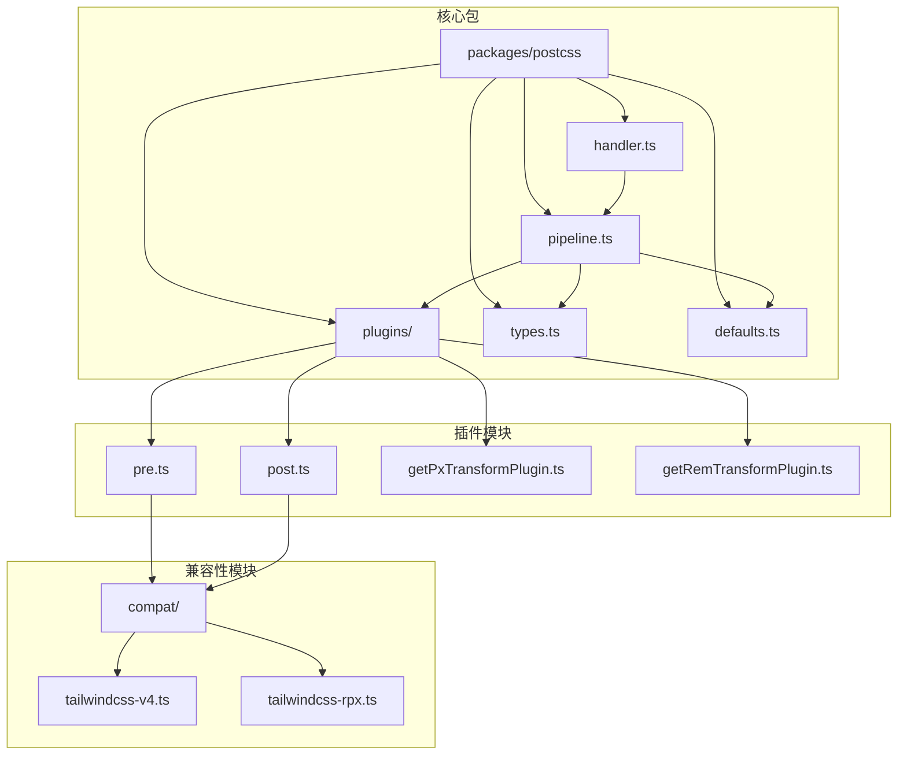
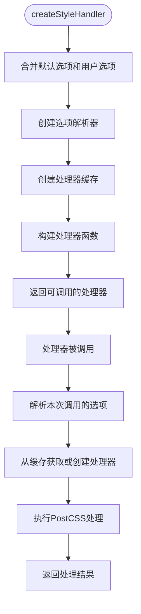
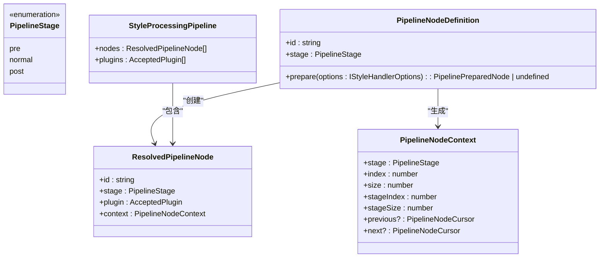
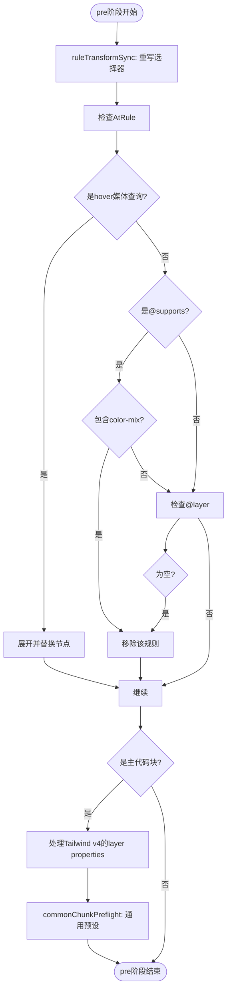
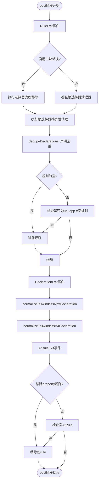
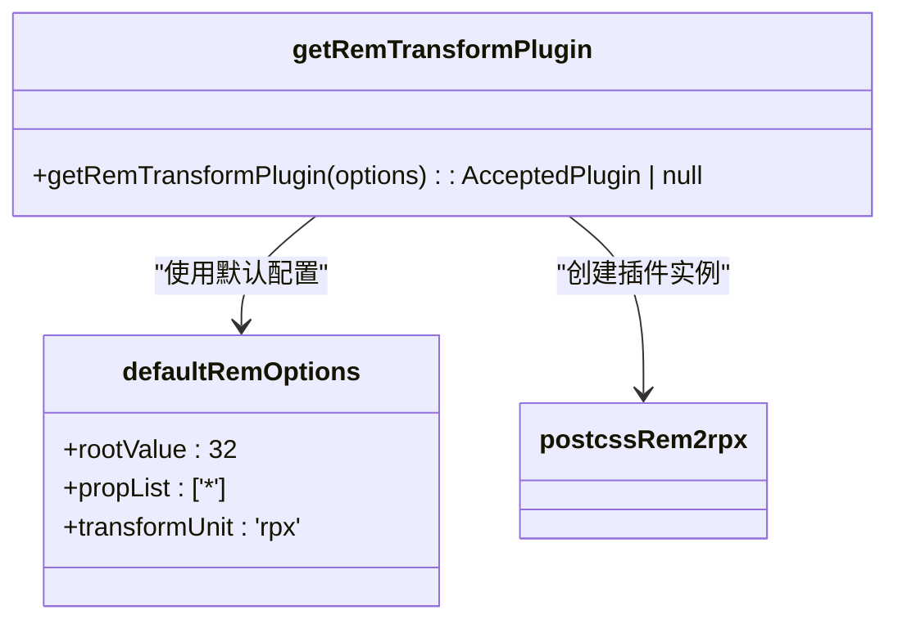

# PostCSS API

<cite>
**本文档中引用的文件**  
- [index.ts](file://packages/postcss/src/index.ts)
- [handler.ts](file://packages/postcss/src/handler.ts)
- [pipeline.ts](file://packages/postcss/src/pipeline.ts)
- [types.ts](file://packages/postcss/src/types.ts)
- [plugins/pre.ts](file://packages/postcss/src/plugins/pre.ts)
- [plugins/post.ts](file://packages/postcss/src/plugins/post.ts)
- [defaults.ts](file://packages/postcss/src/defaults.ts)
- [plugins/getPxTransformPlugin.ts](file://packages/postcss/src/plugins/getPxTransformPlugin.ts)
- [plugins/getRemTransformPlugin.ts](file://packages/postcss/src/plugins/getRemTransformPlugin.ts)
- [compat/tailwindcss-v4.ts](file://packages/postcss/src/compat/tailwindcss-v4.ts)
- [compat/tailwindcss-rpx.ts](file://packages/postcss/src/compat/tailwindcss-rpx.ts)
</cite>

## 目录
1. [简介](#简介)
2. [项目结构](#项目结构)
3. [核心组件](#核心组件)
4. [架构概述](#架构概述)
5. [详细组件分析](#详细组件分析)
6. [依赖分析](#依赖分析)
7. [性能考虑](#性能考虑)
8. [故障排除指南](#故障排除指南)
9. [结论](#结论)

## 简介
本文档为 `weapp-tailwindcss` 项目中的 PostCSS 处理器提供全面的 API 文档，重点说明 `postcssWeappTailwindcss` 插件的接口定义、处理流程和扩展机制。文档详细阐述了如何通过插件系统自定义 CSS 处理行为，包括预处理、后处理和转换规则。涵盖插件注册、执行顺序、上下文传递等关键概念，并提供实际代码示例展示如何创建自定义插件和修改默认处理流程。同时，文档还解释了与 Tailwind CSS 核心的集成方式和数据交换格式。

## 项目结构
`weapp-tailwindcss` 项目是一个用于将 Tailwind CSS 原子化样式应用于小程序开发的工具链。其 PostCSS 处理能力主要集中在 `packages/postcss` 包中，该包提供了核心的样式处理管线和插件系统。



**Diagram sources**
- [handler.ts](file://packages/postcss/src/handler.ts)
- [pipeline.ts](file://packages/postcss/src/pipeline.ts)
- [plugins/pre.ts](file://packages/postcss/src/plugins/pre.ts)
- [plugins/post.ts](file://packages/postcss/src/plugins/post.ts)

**Section sources**
- [handler.ts](file://packages/postcss/src/handler.ts)
- [pipeline.ts](file://packages/postcss/src/pipeline.ts)

## 核心组件
本项目的核心是围绕 PostCSS 构建的样式处理管线。`createStyleHandler` 函数是主要的入口点，它返回一个可调用的处理器函数，用于处理原始 CSS 源码。该处理器基于 `createStylePipeline` 函数构建的插件管线，并通过 `StyleProcessorCache` 进行缓存以提高性能。

**Section sources**
- [handler.ts](file://packages/postcss/src/handler.ts)
- [pipeline.ts](file://packages/postcss/src/pipeline.ts)

## 架构概述
系统的架构遵循一个清晰的管线（Pipeline）模式，将 CSS 处理过程分解为多个阶段。每个阶段包含一系列插件，这些插件按顺序执行，对 CSS AST（抽象语法树）进行转换。

```mermaid
graph LR
A[原始CSS源码] --> B[createStyleHandler]
B --> C[createOptionsResolver]
C --> D[ResolvedOptions]
D --> E[StyleProcessorCache]
E --> F{缓存命中?}
F --> |是| G[返回缓存的Processor]
F --> |否| H[createStylePipeline]
H --> I[ResolvedPipelineNode[]]
I --> J[PostCSS Processor]
J --> K[处理结果]
G --> K
```

**Diagram sources**
- [handler.ts](file://packages/postcss/src/handler.ts)
- [pipeline.ts](file://packages/postcss/src/pipeline.ts)
- [options-resolver.ts](file://packages/postcss/src/options-resolver.ts)
- [processor-cache.ts](file://packages/postcss/src/processor-cache.ts)

## 详细组件分析

### 处理器与管线分析
`createStyleHandler` 函数是整个处理流程的起点。它接收用户选项，通过 `getDefaultOptions` 和 `createOptionsResolver` 合并和解析配置，然后利用 `StyleProcessorCache` 来缓存和复用已创建的处理器实例，避免重复构建管线。

#### 处理器创建流程


**Diagram sources**
- [handler.ts](file://packages/postcss/src/handler.ts)
- [defaults.ts](file://packages/postcss/src/defaults.ts)
- [options-resolver.ts](file://packages/postcss/src/options-resolver.ts)
- [processor-cache.ts](file://packages/postcss/src/processor-cache.ts)

### 插件管线与执行阶段
`createStylePipeline` 函数负责构建实际的 PostCSS 插件管线。它将处理过程分为三个明确的阶段：`pre` (预处理)、`normal` (正常处理) 和 `post` (后处理)。

#### 管线阶段与插件


**Diagram sources**
- [pipeline.ts](file://packages/postcss/src/pipeline.ts)

### 预处理插件分析
`postcssWeappTailwindcssPrePlugin` 在 `pre` 阶段执行，主要负责选择器的重写和不兼容规则的清理。

#### 预处理流程


**Diagram sources**
- [plugins/pre.ts](file://packages/postcss/src/plugins/pre.ts)
- [selectorParser.ts](file://packages/postcss/src/selectorParser.ts)
- [mp.ts](file://packages/postcss/src/mp.ts)

### 后处理插件分析
`postcssWeappTailwindcssPostPlugin` 在 `post` 阶段执行，负责最终的清理、去重和兼容性修复。

#### 后处理流程


**Diagram sources**
- [plugins/post.ts](file://packages/postcss/src/plugins/post.ts)
- [compat/tailwindcss-rpx.ts](file://packages/postcss/src/compat/tailwindcss-rpx.ts)
- [compat/tailwindcss-v4.ts](file://packages/postcss/src/compat/tailwindcss-v4.ts)

### 转换插件分析
该项目集成了 `postcss-pxtrans` 和 `postcss-rem-to-responsive-pixel` 等外部插件来处理单位转换。

#### px到rpx转换插件
```mermaid
classDiagram
class getPxTransformPlugin {
+getPxTransformPlugin(options) : AcceptedPlugin | null
}
class defaultPxTransformOptions {
+platform : 'weapp'
+targetUnit : 'rpx'
+designWidth : 750
+deviceRatio : {750 : 1, ...}
}
getPxTransformPlugin --> defaultPxTransformOptions : "使用默认配置"
getPxTransformPlugin --> postcssPxtrans : "创建插件实例"
```

**Diagram sources**
- [plugins/getPxTransformPlugin.ts](file://packages/postcss/src/plugins/getPxTransformPlugin.ts)

#### rem到rpx转换插件


**Diagram sources**
- [plugins/getRemTransformPlugin.ts](file://packages/postcss/src/plugins/getRemTransformPlugin.ts)

### 兼容性处理分析
为了兼容不同版本的 Tailwind CSS，项目提供了专门的兼容性处理模块。

#### Tailwind CSS v4 兼容性
```mermaid
classDiagram
class tailwindcss-v4 {
+isTailwindcssV4(options) : boolean
+isTailwindcssV4ModernCheck(atRule) : boolean
+normalizeTailwindcssV4Declaration(decl) : boolean
}
tailwindcss-v4 --> cssVarsV4 : "引用CSS变量"
plugins/post.ts --> tailwindcss-v4 : "调用"
```

**Diagram sources**
- [compat/tailwindcss-v4.ts](file://packages/postcss/src/compat/tailwindcss-v4.ts)

#### rpx单位兼容性
```mermaid
classDiagram
class tailwindcss-rpx {
+normalizeTailwindcssRpxDeclaration(decl, options) : boolean
}
tailwindcss-rpx --> LENGTH_VALUE_REGEXP : "正则匹配"
plugins/post.ts --> tailwindcss-rpx : "调用"
```

**Diagram sources**
- [compat/tailwindcss-rpx.ts](file://packages/postcss/src/compat/tailwindcss-rpx.ts)

## 依赖分析
该项目依赖于多个外部库来构建其功能。

```mermaid
graph TD
A[weapp-tailwindcss/postcss] --> B[postcss]
A --> C[postcss-preset-env]
A --> D[postcss-pxtrans]
A --> E[postcss-rem-to-responsive-pixel]
A --> F[@weapp-tailwindcss/shared]
A --> G[@weapp-tailwindcss/logger]
B --> H[postcss-load-config]
C --> I[autoprefixer]
D --> J[postcss-value-parser]
E --> K[postcss-value-parser]
```

**Diagram sources**
- [package.json](file://packages/postcss/package.json)

**Section sources**
- [package.json](file://packages/postcss/package.json)

## 性能考虑
该项目通过 `StyleProcessorCache` 类实现了处理器的缓存机制。当 `createStyleHandler` 被调用时，它会根据解析后的选项生成一个唯一的键，并检查缓存中是否存在对应的处理器实例。如果存在，则直接返回缓存的实例，避免了重复创建 PostCSS 处理器和插件的开销，这对于在构建过程中频繁处理多个 CSS 文件的场景至关重要。

## 故障排除指南
当遇到样式处理问题时，可以按照以下步骤进行排查：

1.  **检查插件顺序**：确保 `postcssWeappTailwindcssPrePlugin` 在 `tailwindcss` 插件之前，而 `postcssWeappTailwindcssPostPlugin` 在其之后。
2.  **验证配置选项**：检查 `cssSelectorReplacement`、`px2rpx` 等选项是否正确配置。
3.  **查看日志**：启用 `@weapp-tailwindcss/logger` 以获取详细的处理日志。
4.  **检查缓存**：如果怀疑缓存导致问题，可以尝试清除缓存或禁用缓存进行调试。
5.  **版本兼容性**：确认使用的 Tailwind CSS 版本与 `majorVersion` 选项匹配。

**Section sources**
- [handler.ts](file://packages/postcss/src/handler.ts)
- [pipeline.ts](file://packages/postcss/src/pipeline.ts)
- [plugins/pre.ts](file://packages/postcss/src/plugins/pre.ts)
- [plugins/post.ts](file://packages/postcss/src/plugins/post.ts)

## 结论
`weapp-tailwindcss` 的 PostCSS 处理器通过一个模块化、可扩展的管线架构，有效地将 Tailwind CSS 的功能适配到小程序环境。其核心在于清晰的 `pre`、`normal`、`post` 三阶段处理流程，以及通过 `createStylePipeline` 动态构建插件管线的能力。开发者可以利用 `getPipeline` 方法来调试和扩展处理流程，也可以通过配置选项来微调其行为。该设计在保证功能强大的同时，也通过缓存机制优化了性能。