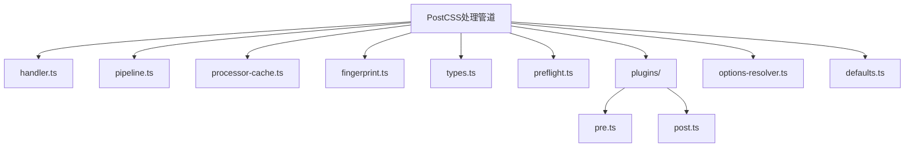
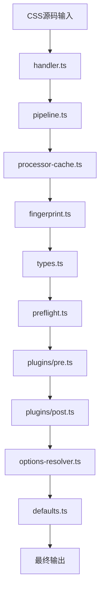
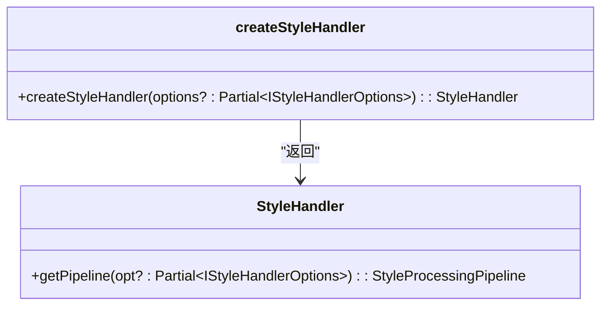
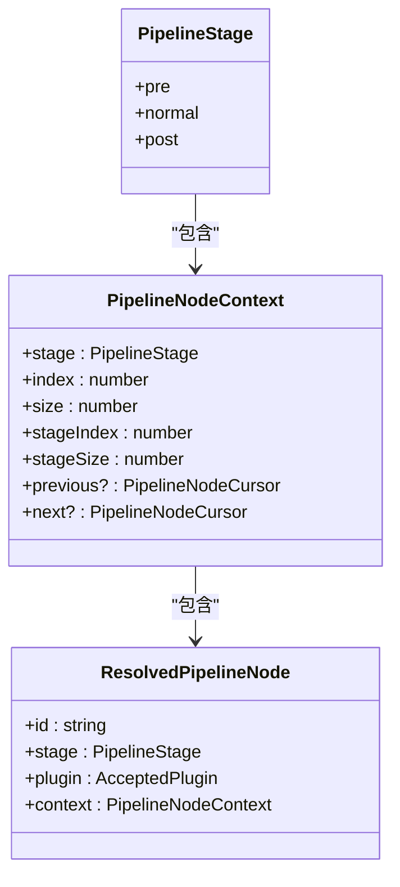
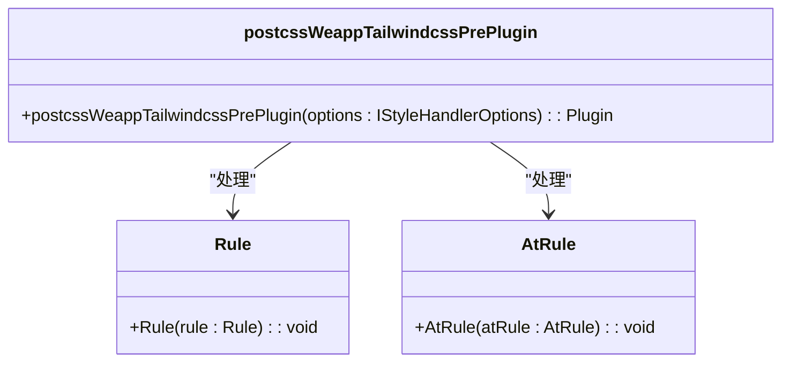
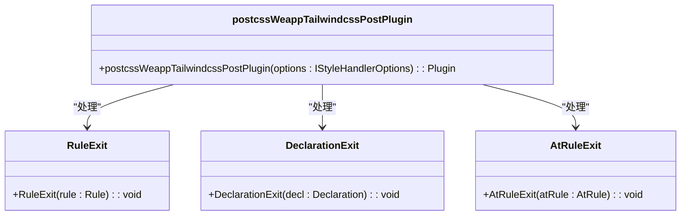
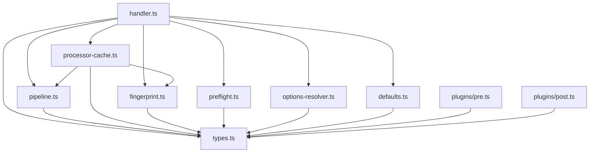

# 处理管道

<cite>
**本文档引用的文件**
- [handler.ts](file://packages/postcss/src/handler.ts)
- [pipeline.ts](file://packages/postcss/src/pipeline.ts)
- [processor-cache.ts](file://packages/postcss/src/processor-cache.ts)
- [fingerprint.ts](file://packages/postcss/src/fingerprint.ts)
- [types.ts](file://packages/postcss/src/types.ts)
- [preflight.ts](file://packages/postcss/src/preflight.ts)
- [plugins/pre.ts](file://packages/postcss/src/plugins/pre.ts)
- [plugins/post.ts](file://packages/postcss/src/plugins/post.ts)
- [options-resolver.ts](file://packages/postcss/src/options-resolver.ts)
- [defaults.ts](file://packages/postcss/src/defaults.ts)
</cite>

## 目录
1. [简介](#简介)
2. [项目结构](#项目结构)
3. [核心组件](#核心组件)
4. [架构概述](#架构概述)
5. [详细组件分析](#详细组件分析)
6. [依赖分析](#依赖分析)
7. [性能考量](#性能考量)
8. [故障排除指南](#故障排除指南)
9. [结论](#结论)

## 简介
本文档详细阐述了PostCSS处理管道的完整技术实现，涵盖从CSS源码输入到最终输出的全流程。重点解析了指纹生成、缓存机制、管道编排和错误恢复策略，以及handler如何协调各个处理阶段和pipeline如何管理异步操作与依赖关系。同时包含性能关键路径分析、内存使用优化、并发处理策略，以及监控和调试处理管道的方法。

## 项目结构
PostCSS处理管道的实现位于`packages/postcss`目录下，主要由以下几个核心模块组成：



**图示来源**
- [handler.ts](file://packages/postcss/src/handler.ts)
- [pipeline.ts](file://packages/postcss/src/pipeline.ts)
- [processor-cache.ts](file://packages/postcss/src/processor-cache.ts)
- [fingerprint.ts](file://packages/postcss/src/fingerprint.ts)
- [types.ts](file://packages/postcss/src/types.ts)
- [preflight.ts](file://packages/postcss/src/preflight.ts)
- [plugins/pre.ts](file://packages/postcss/src/plugins/pre.ts)
- [plugins/post.ts](file://packages/postcss/src/plugins/post.ts)
- [options-resolver.ts](file://packages/postcss/src/options-resolver.ts)
- [defaults.ts](file://packages/postcss/src/defaults.ts)

**章节来源**
- [handler.ts](file://packages/postcss/src/handler.ts)
- [pipeline.ts](file://packages/postcss/src/pipeline.ts)
- [processor-cache.ts](file://packages/postcss/src/processor-cache.ts)
- [fingerprint.ts](file://packages/postcss/src/fingerprint.ts)
- [types.ts](file://packages/postcss/src/types.ts)
- [preflight.ts](file://packages/postcss/src/preflight.ts)
- [plugins/pre.ts](file://packages/postcss/src/plugins/pre.ts)
- [plugins/post.ts](file://packages/postcss/src/plugins/post.ts)
- [options-resolver.ts](file://packages/postcss/src/options-resolver.ts)
- [defaults.ts](file://packages/postcss/src/defaults.ts)

## 核心组件
PostCSS处理管道的核心组件包括`handler.ts`、`pipeline.ts`、`processor-cache.ts`、`fingerprint.ts`、`types.ts`、`preflight.ts`、`plugins/pre.ts`、`plugins/post.ts`、`options-resolver.ts`和`defaults.ts`。这些组件共同协作，实现了从CSS源码输入到最终输出的完整处理流程。

**章节来源**
- [handler.ts](file://packages/postcss/src/handler.ts)
- [pipeline.ts](file://packages/postcss/src/pipeline.ts)
- [processor-cache.ts](file://packages/postcss/src/processor-cache.ts)
- [fingerprint.ts](file://packages/postcss/src/fingerprint.ts)
- [types.ts](file://packages/postcss/src/types.ts)
- [preflight.ts](file://packages/postcss/src/preflight.ts)
- [plugins/pre.ts](file://packages/postcss/src/plugins/pre.ts)
- [plugins/post.ts](file://packages/postcss/src/plugins/post.ts)
- [options-resolver.ts](file://packages/postcss/src/options-resolver.ts)
- [defaults.ts](file://packages/postcss/src/defaults.ts)

## 架构概述
PostCSS处理管道的架构设计遵循模块化和可扩展的原则，通过`handler.ts`作为入口，协调`pipeline.ts`、`processor-cache.ts`、`fingerprint.ts`等核心组件，实现高效的CSS处理流程。



**图示来源**
- [handler.ts](file://packages/postcss/src/handler.ts)
- [pipeline.ts](file://packages/postcss/src/pipeline.ts)
- [processor-cache.ts](file://packages/postcss/src/processor-cache.ts)
- [fingerprint.ts](file://packages/postcss/src/fingerprint.ts)
- [types.ts](file://packages/postcss/src/types.ts)
- [preflight.ts](file://packages/postcss/src/preflight.ts)
- [plugins/pre.ts](file://packages/postcss/src/plugins/pre.ts)
- [plugins/post.ts](file://packages/postcss/src/plugins/post.ts)
- [options-resolver.ts](file://packages/postcss/src/options-resolver.ts)
- [defaults.ts](file://packages/postcss/src/defaults.ts)

**章节来源**
- [handler.ts](file://packages/postcss/src/handler.ts)
- [pipeline.ts](file://packages/postcss/src/pipeline.ts)
- [processor-cache.ts](file://packages/postcss/src/processor-cache.ts)
- [fingerprint.ts](file://packages/postcss/src/fingerprint.ts)
- [types.ts](file://packages/postcss/src/types.ts)
- [preflight.ts](file://packages/postcss/src/preflight.ts)
- [plugins/pre.ts](file://packages/postcss/src/plugins/pre.ts)
- [plugins/post.ts](file://packages/postcss/src/plugins/post.ts)
- [options-resolver.ts](file://packages/postcss/src/options-resolver.ts)
- [defaults.ts](file://packages/postcss/src/defaults.ts)

## 详细组件分析
### handler.ts分析
`handler.ts`是PostCSS处理管道的入口文件，负责创建和复用处理管道。它通过`createStyleHandler`函数提供带缓存的高阶处理器，并暴露`getPipeline`供外部调试和扩展。



**图示来源**
- [handler.ts](file://packages/postcss/src/handler.ts)

**章节来源**
- [handler.ts](file://packages/postcss/src/handler.ts)

### pipeline.ts分析
`pipeline.ts`负责按阶段构建PostCSS插件流水线，并提供状态机式的上下文信息。它定义了`PipelineStage`、`PipelineNodeContext`、`ResolvedPipelineNode`等接口，用于描述处理管道的各个节点和阶段。



**图示来源**
- [pipeline.ts](file://packages/postcss/src/pipeline.ts)

**章节来源**
- [pipeline.ts](file://packages/postcss/src/pipeline.ts)

### processor-cache.ts分析
`processor-cache.ts`实现了处理管道的缓存机制，通过`WeakMap`存储处理管道、处理选项和处理器实例，避免重复创建和初始化，提高处理效率。

```mermaid
classDiagram
class StyleProcessorCache {
-pipelineCache : WeakMap~IStyleHandlerOptions, StyleProcessingPipeline~
-processOptionsCache : WeakMap~IStyleHandlerOptions, { value : ProcessOptions, fingerprint? : string | undefined }~
-processorCache : WeakMap~IStyleHandlerOptions, Processor~
+getPipeline(options : IStyleHandlerOptions) : StyleProcessingPipeline
+getProcessOptions(options : IStyleHandlerOptions) : ProcessOptions
+getProcessor(options : IStyleHandlerOptions) : Processor
}
```

**图示来源**
- [processor-cache.ts](file://packages/postcss/src/processor-cache.ts)

**章节来源**
- [processor-cache.ts](file://packages/postcss/src/processor-cache.ts)

### fingerprint.ts分析
`fingerprint.ts`实现了选项指纹生成功能，通过`fingerprintOptions`函数为处理选项生成唯一标识，用于缓存和比较。

```mermaid
classDiagram
class fingerprintOptions {
+fingerprintOptions(value : unknown, state : FingerprintState = { map : new WeakMap~object, string~, counter : 0 }) : string
}
class FingerprintState {
+map : WeakMap~object, string~
+counter : number
}
fingerprintOptions --> FingerprintState : "使用"
```

**图示来源**
- [fingerprint.ts](file://packages/postcss/src/fingerprint.ts)

**章节来源**
- [fingerprint.ts](file://packages/postcss/src/fingerprint.ts)

### types.ts分析
`types.ts`定义了处理管道所需的核心类型，包括`IStyleHandlerOptions`、`StyleHandler`等接口和类型别名。

```mermaid
classDiagram
class IStyleHandlerOptions {
+ctx? : PostcssContext
+postcssOptions? : LoadedPostcssOptions
+cssRemoveProperty? : boolean
+cssRemoveHoverPseudoClass? : boolean
+cssPresetEnv? : PresetEnvOptions
+cssCalc? : boolean | CssCalcOptions | (string | RegExp)[]
+atRules? : { property? : boolean, supports? : boolean, media? : boolean }
+uniAppX? : boolean
+majorVersion? : number
+isMainChunk? : boolean
+cssPreflight? : CssPreflightOptions
+cssInjectPreflight? : InjectPreflight
+escapeMap? : Record~string, string~
+cssPreflightRange? : 'all'
+cssChildCombinatorReplaceValue? : string | string[]
+injectAdditionalCssVarScope? : boolean
+cssSelectorReplacement? : { root? : string | string[] | false, universal? : string | string[] | false }
+rem2rpx? : boolean | Rem2rpxOptions
+px2rpx? : boolean | Px2rpxOptions
}
class StyleHandler {
+getPipeline(opt? : Partial~IStyleHandlerOptions~) : StyleProcessingPipeline
}
IStyleHandlerOptions --> StyleHandler : "包含"
```

**图示来源**
- [types.ts](file://packages/postcss/src/types.ts)

**章节来源**
- [types.ts](file://packages/postcss/src/types.ts)

### pre.ts分析
`pre.ts`实现了预处理阶段的插件，负责重写选择器、清理不兼容规则并注入变量。



**图示来源**
- [plugins/pre.ts](file://packages/postcss/src/plugins/pre.ts)

**章节来源**
- [plugins/pre.ts](file://packages/postcss/src/plugins/pre.ts)

### post.ts分析
`post.ts`实现了后处理阶段的插件，负责选择器兜底、声明去重与变量排序。



**图示来源**
- [plugins/post.ts](file://packages/postcss/src/plugins/post.ts)

**章节来源**
- [plugins/post.ts](file://packages/postcss/src/plugins/post.ts)

## 依赖分析
PostCSS处理管道的依赖关系如下：



**图示来源**
- [handler.ts](file://packages/postcss/src/handler.ts)
- [pipeline.ts](file://packages/postcss/src/pipeline.ts)
- [processor-cache.ts](file://packages/postcss/src/processor-cache.ts)
- [fingerprint.ts](file://packages/postcss/src/fingerprint.ts)
- [types.ts](file://packages/postcss/src/types.ts)
- [preflight.ts](file://packages/postcss/src/preflight.ts)
- [options-resolver.ts](file://packages/postcss/src/options-resolver.ts)
- [defaults.ts](file://packages/postcss/src/defaults.ts)
- [plugins/pre.ts](file://packages/postcss/src/plugins/pre.ts)
- [plugins/post.ts](file://packages/postcss/src/plugins/post.ts)

**章节来源**
- [handler.ts](file://packages/postcss/src/handler.ts)
- [pipeline.ts](file://packages/postcss/src/pipeline.ts)
- [processor-cache.ts](file://packages/postcss/src/processor-cache.ts)
- [fingerprint.ts](file://packages/postcss/src/fingerprint.ts)
- [types.ts](file://packages/postcss/src/types.ts)
- [preflight.ts](file://packages/postcss/src/preflight.ts)
- [options-resolver.ts](file://packages/postcss/src/options-resolver.ts)
- [defaults.ts](file://packages/postcss/src/defaults.ts)
- [plugins/pre.ts](file://packages/postcss/src/plugins/pre.ts)
- [plugins/post.ts](file://packages/postcss/src/plugins/post.ts)

## 性能考量
PostCSS处理管道通过以下方式优化性能：
1. **缓存机制**：使用`processor-cache.ts`中的`WeakMap`缓存处理管道、处理选项和处理器实例，避免重复创建和初始化。
2. **指纹生成**：通过`fingerprint.ts`中的`fingerprintOptions`函数为处理选项生成唯一标识，用于缓存和比较。
3. **异步处理**：在`handler.ts`中使用`async()`方法异步处理CSS源码，提高处理效率。
4. **并发处理**：通过`pipeline.ts`中的`createStylePipeline`函数并行处理多个CSS文件。

## 故障排除指南
### 常见问题
1. **处理管道缓存失效**：检查`processor-cache.ts`中的`WeakMap`是否正确存储和检索处理管道、处理选项和处理器实例。
2. **指纹生成错误**：检查`fingerprint.ts`中的`fingerprintOptions`函数是否正确生成唯一标识。
3. **预处理插件失效**：检查`plugins/pre.ts`中的`postcssWeappTailwindcssPrePlugin`是否正确重写选择器、清理不兼容规则并注入变量。
4. **后处理插件失效**：检查`plugins/post.ts`中的`postcssWeappTailwindcssPostPlugin`是否正确执行选择器兜底、声明去重与变量排序。

### 调试方法
1. **日志输出**：在关键函数中添加日志输出，跟踪处理流程和变量值。
2. **单元测试**：编写单元测试，验证各个组件的功能和性能。
3. **性能分析**：使用性能分析工具，识别性能瓶颈并进行优化。

**章节来源**
- [processor-cache.ts](file://packages/postcss/src/processor-cache.ts)
- [fingerprint.ts](file://packages/postcss/src/fingerprint.ts)
- [plugins/pre.ts](file://packages/postcss/src/plugins/pre.ts)
- [plugins/post.ts](file://packages/postcss/src/plugins/post.ts)

## 结论
PostCSS处理管道通过模块化和可扩展的设计，实现了高效的CSS处理流程。通过缓存机制、指纹生成、异步处理和并发处理等优化手段，显著提高了处理效率。同时，提供了详细的故障排除指南，帮助开发者快速定位和解决问题。