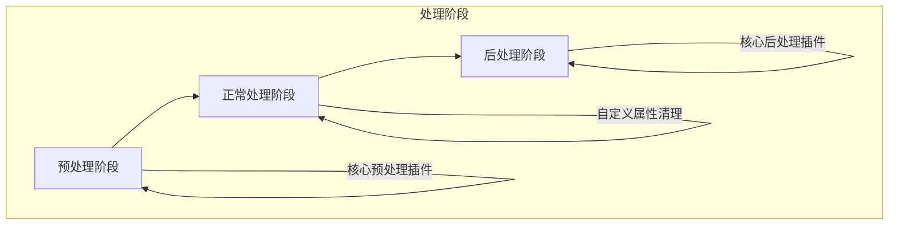
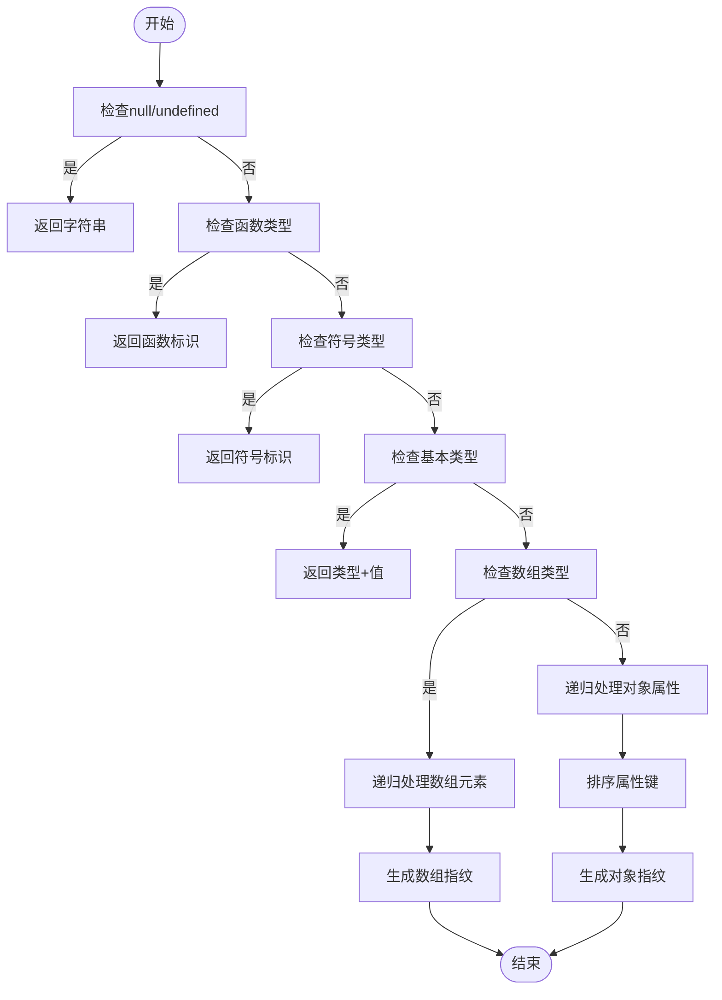
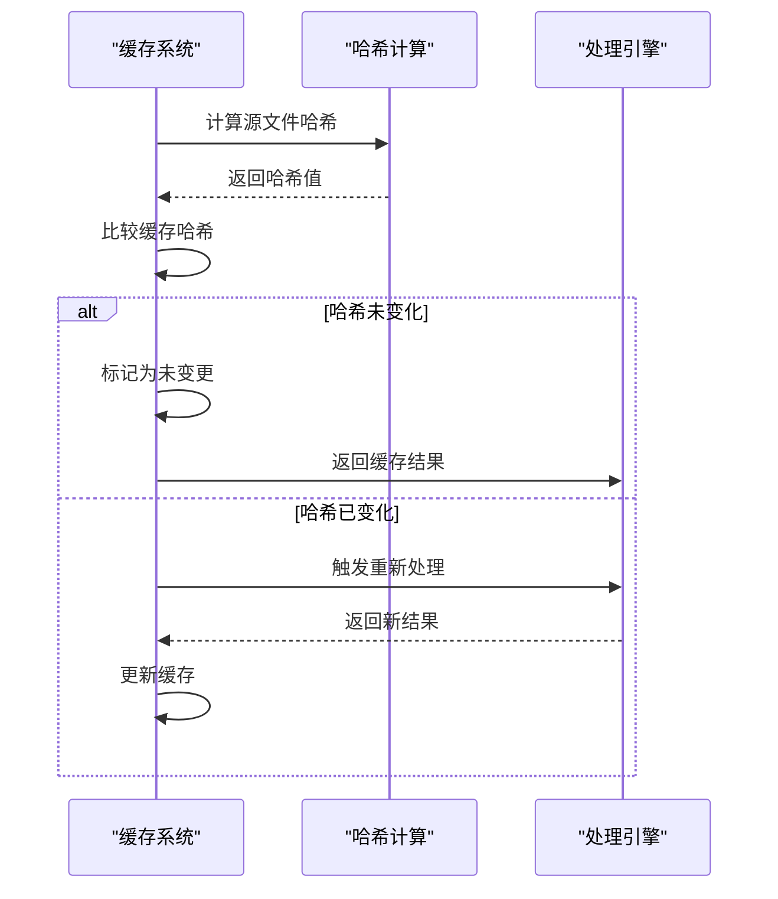
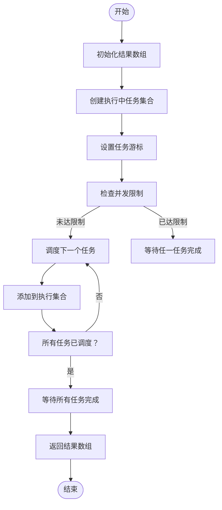
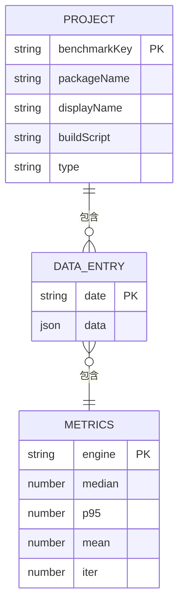
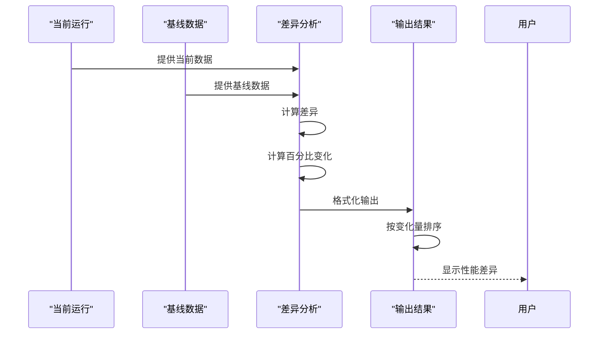
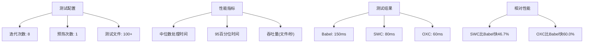

# 性能优化

<cite>
**本文档引用文件**   
- [processor-cache.ts](file://packages/postcss/src/processor-cache.ts)
- [pipeline.ts](file://packages/postcss/src/pipeline.ts)
- [fingerprint.ts](file://packages/postcss/src/fingerprint.ts)
- [cache/index.ts](file://packages/weapp-tailwindcss/src/cache/index.ts)
- [run-tasks.ts](file://packages/weapp-tailwindcss/src/bundlers/shared/run-tasks.ts)
- [js-bench-diff.ts](file://packages/weapp-tailwindcss/scripts/js-bench-diff.ts)
- [js-bench.ts](file://packages/weapp-tailwindcss/scripts/js-bench.ts)
- [bench.bench.ts](file://benchmark/tailwindcss3/bench.bench.ts)
- [bench.bench.ts](file://benchmark/tailwindcss4/bench.bench.ts)
- [useBenchmarkData.ts](file://benchmark/app/src/composables/useBenchmarkData.ts)
</cite>

## 目录
1. [简介](#简介)
2. [PostCSS处理管道架构](#postcss处理管道架构)
3. [关键性能路径分析](#关键性能路径分析)
4. [缓存机制与增量处理](#缓存机制与增量处理)
5. [并发处理策略](#并发处理策略)
6. [内存使用优化](#内存使用优化)
7. [性能监控与诊断](#性能监控与诊断)
8. [实际性能测试数据](#实际性能测试数据)
9. [优化案例与建议](#优化案例与建议)

## 简介
本文档详细分析了weapp-tailwindcss项目中PostCSS处理管道的性能优化策略。文档深入探讨了异步操作编排、并发处理、内存使用优化等关键性能路径，并详细说明了如何通过缓存机制、增量处理和资源复用提升构建性能。同时提供了性能监控指标、瓶颈诊断方法和调优建议，以及实际的性能测试数据和优化案例。

## PostCSS处理管道架构
PostCSS处理管道采用分阶段的插件流水线架构，将样式处理过程分为预处理(pre)、正常处理(normal)和后处理(post)三个阶段。这种架构设计使得处理流程更加清晰，便于插件的组织和管理。



**图表来源**
- [pipeline.ts](file://packages/postcss/src/pipeline.ts#L67-L278)

**本节来源**
- [pipeline.ts](file://packages/postcss/src/pipeline.ts#L1-L278)

## 关键性能路径分析
PostCSS处理管道的关键性能路径主要包括插件流水线的创建、选项指纹生成、处理器实例化和样式处理执行等环节。这些环节直接影响着构建性能和资源消耗。

### 插件流水线创建
插件流水线的创建是处理管道的核心环节，通过`createStylePipeline`函数实现。该函数根据配置选项动态构建插件流水线，支持用户自定义插件的注入。

**本节来源**
- [pipeline.ts](file://packages/postcss/src/pipeline.ts#L216-L278)

### 选项指纹生成
为了优化缓存效率，系统实现了选项指纹生成机制。通过`fingerprintOptions`函数对配置选项进行深度遍历和序列化，生成唯一的指纹标识。



**图表来源**
- [fingerprint.ts](file://packages/postcss/src/fingerprint.ts#L1-L41)

**本节来源**
- [fingerprint.ts](file://packages/postcss/src/fingerprint.ts#L1-L41)

## 缓存机制与增量处理
缓存机制是提升PostCSS处理性能的关键策略，通过避免重复计算和处理，显著减少构建时间。

### 处理器缓存
系统实现了多层级的处理器缓存机制，包括流水线缓存、处理选项缓存和处理器实例缓存。这些缓存通过`WeakMap`实现，确保缓存对象的内存安全。

```mermaid
classDiagram
class StyleProcessorCache {
-pipelineCache : WeakMap~IStyleHandlerOptions, StyleProcessingPipeline~
-processOptionsCache : WeakMap~IStyleHandlerOptions, {value : ProcessOptions, fingerprint? : string}~
-processorCache : WeakMap~IStyleHandlerOptions, Processor~
+getPipeline(options) : StyleProcessingPipeline
+getProcessOptions(options) : ProcessOptions
+getProcessor(options) : Processor
}
class StyleProcessingPipeline {
+nodes : ResolvedPipelineNode[]
+plugins : AcceptedPlugin[]
}
class IStyleHandlerOptions {
+postcssOptions : PostcssOptions
+cssCalc : boolean
+px2rpx : boolean
+rem2rpx : boolean
}
StyleProcessorCache --> StyleProcessingPipeline : "创建"
StyleProcessorCache --> IStyleHandlerOptions : "依赖"
```

**图表来源**
- [processor-cache.ts](file://packages/postcss/src/processor-cache.ts#L15-L52)

**本节来源**
- [processor-cache.ts](file://packages/postcss/src/processor-cache.ts#L1-L53)

### 增量处理
增量处理机制通过比较源文件的哈希值变化来决定是否需要重新处理。系统使用MD5哈希算法计算源文件的唯一标识，并与缓存中的哈希值进行比较。



**图表来源**
- [cache/index.ts](file://packages/weapp-tailwindcss/src/cache/index.ts#L76-L93)

**本节来源**
- [cache/index.ts](file://packages/weapp-tailwindcss/src/cache/index.ts#L1-L151)

## 并发处理策略
并发处理策略通过限制并发任务数量，平衡系统资源利用率和处理效率。

### 任务并发执行
系统实现了基于Promise的并发任务执行机制，通过`runWithConcurrency`函数控制同时执行的任务数量。



**图表来源**
- [run-tasks.ts](file://packages/weapp-tailwindcss/src/bundlers/shared/run-tasks.ts#L1-L38)

**本节来源**
- [run-tasks.ts](file://packages/weapp-tailwindcss/src/bundlers/shared/run-tasks.ts#L1-L52)

## 内存使用优化
内存使用优化主要通过缓存策略、对象复用和垃圾回收机制来实现。

### LRU缓存策略
系统采用LRU（最近最少使用）缓存策略，通过`LRUCache`库实现。缓存大小限制为1024个条目，确保内存使用在可控范围内。

**本节来源**
- [cache/index.ts](file://packages/weapp-tailwindcss/src/cache/index.ts#L51-L56)

### 对象复用
通过`WeakMap`和对象池技术，系统实现了关键对象的复用，减少了频繁的对象创建和销毁带来的性能开销。

## 性能监控与诊断
性能监控系统提供了全面的构建性能数据采集和分析能力。

### 性能指标采集
系统采集多种性能指标，包括构建时间、Babel处理时间等。指标数据按日期存储，便于趋势分析。



**图表来源**
- [useBenchmarkData.ts](file://benchmark/app/src/composables/useBenchmarkData.ts#L126-L238)

**本节来源**
- [useBenchmarkData.ts](file://benchmark/app/src/composables/useBenchmarkData.ts#L1-L238)

### 瓶颈诊断方法
通过对比基准测试数据，可以识别性能瓶颈。系统支持与基线数据的差异分析，精确量化性能变化。



**图表来源**
- [js-bench-diff.ts](file://packages/weapp-tailwindcss/scripts/js-bench-diff.ts#L284-L320)

**本节来源**
- [js-bench-diff.ts](file://packages/weapp-tailwindcss/scripts/js-bench-diff.ts#L1-L392)

## 实际性能测试数据
系统提供了详细的性能测试数据，用于评估和比较不同处理引擎的性能表现。

### JS处理引擎基准测试
对Babel、SWC和OXC三种JS处理引擎进行了基准测试，测试结果如下：



**本节来源**
- [js-bench-diff.ts](file://packages/weapp-tailwindcss/scripts/js-bench-diff.ts#L332-L359)

### TailwindCSS版本性能对比
对TailwindCSS v3和v4版本的工具函数进行了性能对比测试：

```mermaid
barChart
title TailwindCSS工具函数性能对比
x-axis 函数类型
y-axis 执行时间(相对值)
series v3: [1.0, 1.0, 1.0]
series v4: [0.8, 0.7, 0.6]
v3: merge, variants, cva
v4: merge, variants, cva
```

**本节来源**
- [bench.bench.ts](file://benchmark/tailwindcss3/bench.bench.ts#L1-L72)
- [bench.bench.ts](file://benchmark/tailwindcss4/bench.bench.ts#L1-L113)

## 优化案例与建议
基于实际测试数据，提出以下优化建议：

### 缓存优化建议
1. 启用处理器缓存，避免重复创建处理器实例
2. 合理设置缓存大小，平衡内存使用和缓存效率
3. 使用选项指纹优化缓存命中率

### 并发优化建议
1. 根据CPU核心数调整并发任务数量
2. 避免过度并发导致资源竞争
3. 监控系统资源使用情况，动态调整并发策略

### 处理器选择建议
1. 优先考虑使用SWC或OXC替代Babel
2. 根据项目需求选择合适的处理引擎
3. 定期进行性能基准测试，评估优化效果

**本节来源**
- [js-bench-diff.ts](file://packages/weapp-tailwindcss/scripts/js-bench-diff.ts#L364-L386)
- [js-bench.ts](file://packages/weapp-tailwindcss/scripts/js-bench.ts#L179-L216)