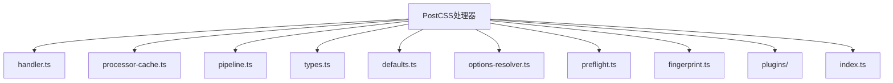
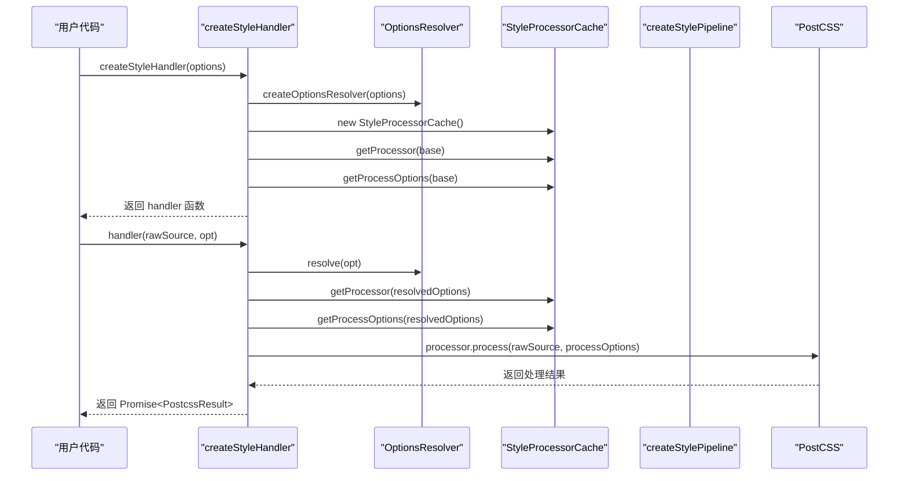
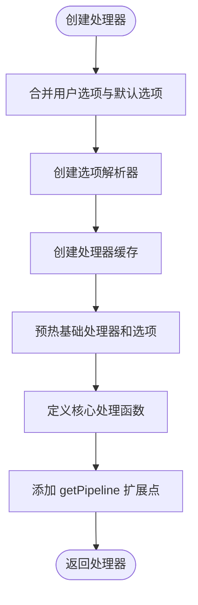
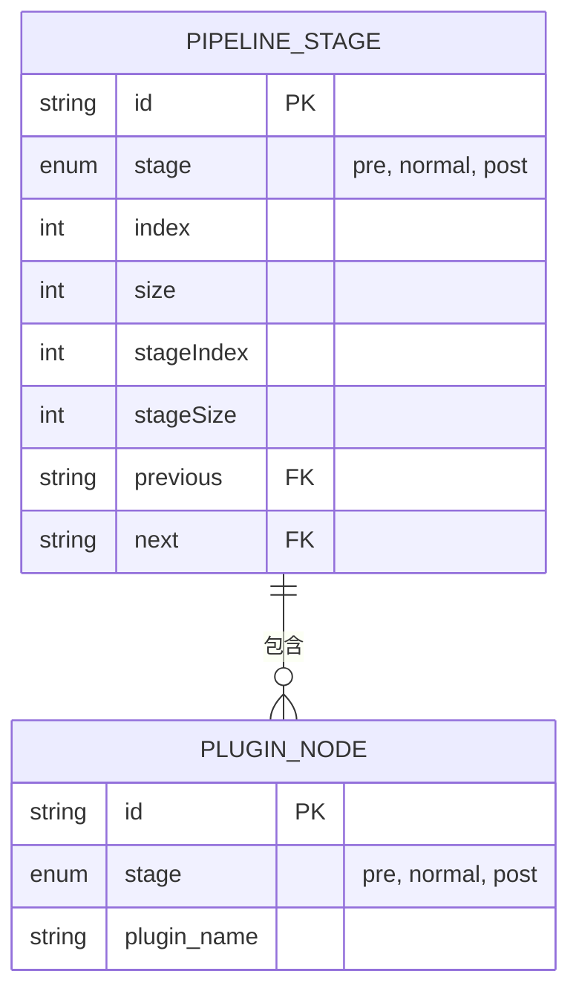
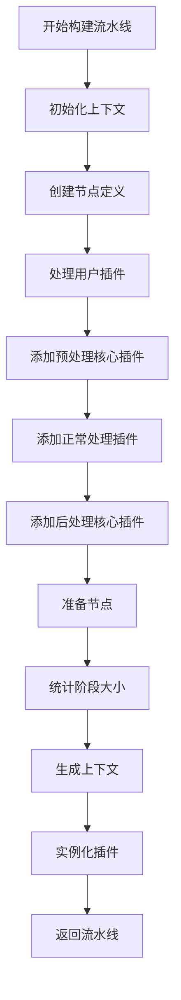
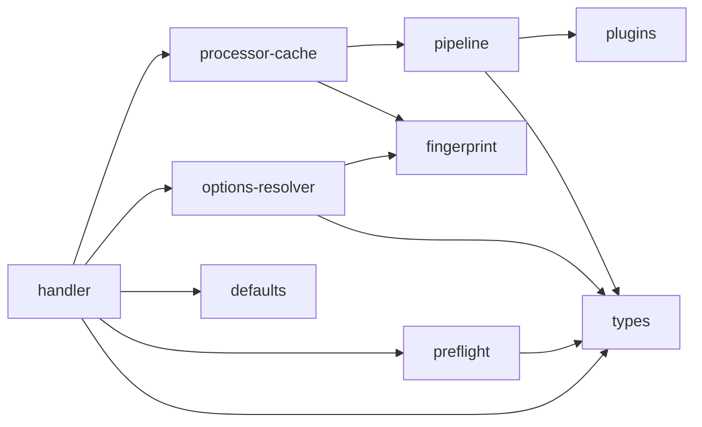

# 核心处理器

<cite>
**本文档中引用的文件**  
- [handler.ts](file://packages/postcss/src/handler.ts)
- [processor-cache.ts](file://packages/postcss/src/processor-cache.ts)
- [pipeline.ts](file://packages/postcss/src/pipeline.ts)
- [types.ts](file://packages/postcss/src/types.ts)
- [defaults.ts](file://packages/postcss/src/defaults.ts)
- [options-resolver.ts](file://packages/postcss/src/options-resolver.ts)
- [preflight.ts](file://packages/postcss/src/preflight.ts)
- [fingerprint.ts](file://packages/postcss/src/fingerprint.ts)
- [index.ts](file://packages/postcss/src/index.ts)
</cite>

## 目录
1. [简介](#简介)
2. [项目结构](#项目结构)
3. [核心组件](#核心组件)
4. [架构概述](#架构概述)
5. [详细组件分析](#详细组件分析)
6. [依赖分析](#依赖分析)
7. [性能考虑](#性能考虑)
8. [故障排除指南](#故障排除指南)
9. [结论](#结论)

## 简介
本文档深入解析 `weapp-tailwindcss` 项目中 PostCSS 核心处理器的设计与实现。该处理器是整个 CSS 处理流程的中枢，负责协调输入解析、阶段调度和输出生成。文档详细说明了 `handler` 模块如何与 `pipeline`、`processor-cache` 等组件交互，处理不同类型的 CSS 转换任务，并阐述其错误处理、异常恢复和扩展点设计。

## 项目结构
PostCSS 核心处理器位于 `packages/postcss/src` 目录下，其结构清晰，职责分明。



**图示来源**
- [handler.ts](file://packages/postcss/src/handler.ts)
- [processor-cache.ts](file://packages/postcss/src/processor-cache.ts)
- [pipeline.ts](file://packages/postcss/src/pipeline.ts)

**章节来源**
- [handler.ts](file://packages/postcss/src/handler.ts)
- [processor-cache.ts](file://packages/postcss/src/processor-cache.ts)

## 核心组件
核心处理器由多个关键组件构成，共同完成 CSS 处理任务。

**章节来源**
- [handler.ts](file://packages/postcss/src/handler.ts#L10-L43)
- [types.ts](file://packages/postcss/src/types.ts#L94-L98)
- [processor-cache.ts](file://packages/postcss/src/processor-cache.ts#L15-L52)

## 架构概述
核心处理器采用高阶函数和缓存机制，构建了一个高效、可复用的处理流程。



**图示来源**
- [handler.ts](file://packages/postcss/src/handler.ts#L10-L43)
- [processor-cache.ts](file://packages/postcss/src/processor-cache.ts#L15-L52)
- [options-resolver.ts](file://packages/postcss/src/options-resolver.ts#L15-L58)

## 详细组件分析
本节深入分析处理器的各个核心组件。

### 处理器创建分析
`createStyleHandler` 函数是整个处理器的入口，它返回一个可调用的 `handler` 函数。

#### 处理器创建流程


**图示来源**
- [handler.ts](file://packages/postcss/src/handler.ts#L10-L43)
- [defaults.ts](file://packages/postcss/src/defaults.ts#L5-L36)
- [options-resolver.ts](file://packages/postcss/src/options-resolver.ts#L15-L58)

#### 选项解析机制
```mermaid
classDiagram
class OptionsResolver {
+resolve(overrides : Partial~IStyleHandlerOptions~) : IStyleHandlerOptions
}
class StyleProcessorCache {
-pipelineCache : WeakMap~IStyleHandlerOptions, StyleProcessingPipeline~
-processOptionsCache : WeakMap~IStyleHandlerOptions, {value : ProcessOptions}~
-processorCache : WeakMap~IStyleHandlerOptions, Processor~
+getPipeline(options : IStyleHandlerOptions) : StyleProcessingPipeline
+getProcessOptions(options : IStyleHandlerOptions) : ProcessOptions
+getProcessor(options : IStyleHandlerOptions) : Processor
}
class StyleHandler {
<<function>>
(rawSource : string, opt? : Partial~IStyleHandlerOptions~) : Promise~PostcssResult~
+getPipeline(opt? : Partial~IStyleHandlerOptions~) : StyleProcessingPipeline
}
OptionsResolver --> StyleProcessorCache : "使用"
StyleProcessorCache --> StyleHandler : "构成"
```

**图示来源**
- [options-resolver.ts](file://packages/postcss/src/options-resolver.ts#L11-L58)
- [processor-cache.ts](file://packages/postcss/src/processor-cache.ts#L15-L52)
- [types.ts](file://packages/postcss/src/types.ts#L94-L98)

**章节来源**
- [handler.ts](file://packages/postcss/src/handler.ts#L10-L43)
- [options-resolver.ts](file://packages/postcss/src/options-resolver.ts#L15-L58)
- [processor-cache.ts](file://packages/postcss/src/processor-cache.ts#L15-L52)

### 流水线构建分析
`pipeline` 模块负责按阶段构建 PostCSS 插件流水线。

#### 流水线阶段设计


**图示来源**
- [pipeline.ts](file://packages/postcss/src/pipeline.ts#L14-L65)

#### 流水线构建流程


**图示来源**
- [pipeline.ts](file://packages/postcss/src/pipeline.ts#L100-L277)

**章节来源**
- [pipeline.ts](file://packages/postcss/src/pipeline.ts#L100-L277)
- [types.ts](file://packages/postcss/src/types.ts#L62-L66)

### 缓存机制分析
`processor-cache` 模块实现了基于 `WeakMap` 的三级缓存策略。

#### 缓存结构
```mermaid
classDiagram
class StyleProcessorCache {
-pipelineCache : WeakMap~IStyleHandlerOptions, StyleProcessingPipeline~
-processOptionsCache : WeakMap~IStyleHandlerOptions, {value : ProcessOptions, fingerprint : string}~
-processorCache : WeakMap~IStyleHandlerOptions, Processor~
+getPipeline(options) : StyleProcessingPipeline
+getProcessOptions(options) : ProcessOptions
+getProcessor(options) : Processor
}
class fingerprintOptions {
+fingerprintOptions(value : unknown) : string
}
StyleProcessorCache --> fingerprintOptions : "用于"
```

**图示来源**
- [processor-cache.ts](file://packages/postcss/src/processor-cache.ts#L15-L52)
- [fingerprint.ts](file://packages/postcss/src/fingerprint.ts#L6-L41)

**章节来源**
- [processor-cache.ts](file://packages/postcss/src/processor-cache.ts#L15-L52)
- [fingerprint.ts](file://packages/postcss/src/fingerprint.ts#L6-L41)

## 依赖分析
核心处理器依赖于多个内部和外部模块。



**图示来源**
- [handler.ts](file://packages/postcss/src/handler.ts)
- [processor-cache.ts](file://packages/postcss/src/processor-cache.ts)
- [pipeline.ts](file://packages/postcss/src/pipeline.ts)

**章节来源**
- [handler.ts](file://packages/postcss/src/handler.ts)
- [processor-cache.ts](file://packages/postcss/src/processor-cache.ts)

## 性能考虑
处理器通过多种机制优化性能：
- **缓存复用**：使用 `WeakMap` 缓存流水线、处理器和处理选项，避免重复创建。
- **指纹识别**：通过 `fingerprintOptions` 函数为配置生成唯一指纹，确保缓存的准确性。
- **懒加载**：仅在需要时才创建和实例化处理器。
- **预热机制**：在处理器创建时预热基础配置的缓存。

## 故障排除指南
常见问题及解决方案：

**章节来源**
- [handler.cache.test.ts](file://packages/postcss/test/handler.cache.test.ts#L36-L62)
- [style-handler.bench.ts](file://packages/postcss/test/bench/style-handler.bench.ts#L20-L41)

## 结论
PostCSS 核心处理器通过精心设计的架构，实现了高效、灵活的 CSS 处理能力。其模块化设计、缓存机制和扩展点使其能够适应各种复杂的处理需求，为小程序环境下的 Tailwind CSS 集成提供了坚实的基础。