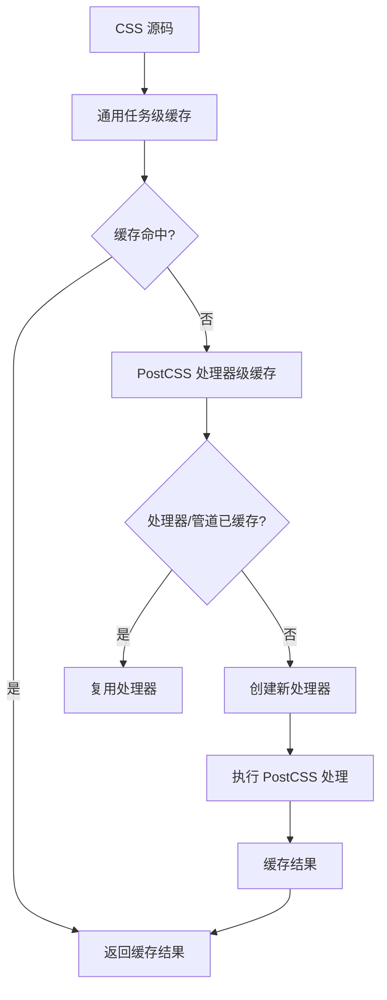
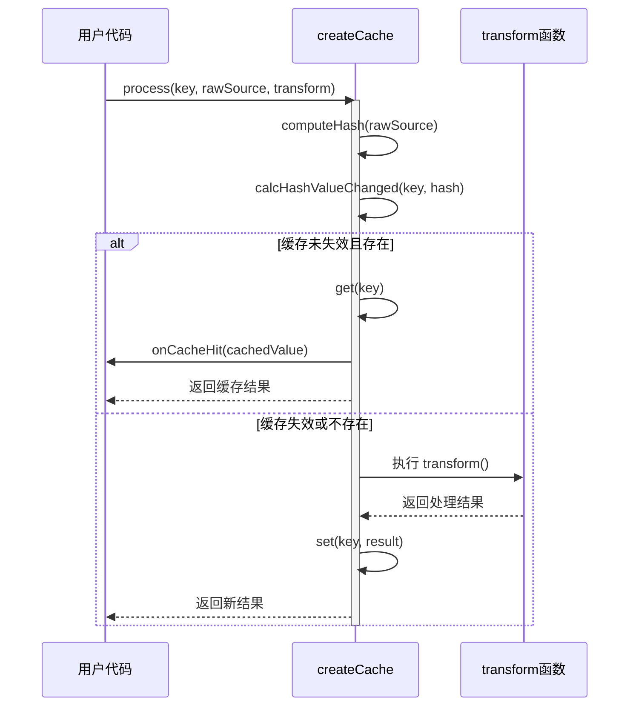

# 缓存机制

<cite>
**本文档引用文件**  
- [processor-cache.ts](file://packages/postcss/src/processor-cache.ts)
- [fingerprint.ts](file://packages/postcss/src/fingerprint.ts)
- [cache/index.ts](file://packages/weapp-tailwindcss/src/cache/index.ts)
- [cache.md5.ts](file://packages/weapp-tailwindcss/src/cache/md5.ts)
- [pipeline.ts](file://packages/postcss/src/pipeline.ts)
- [handler.ts](file://packages/postcss/src/handler.ts)
- [cache.test.ts](file://packages/weapp-tailwindcss/test/cache.test.ts)
- [bundlers.cache-helper.test.ts](file://packages/weapp-tailwindcss/test/bundlers.cache-helper.test.ts)
</cite>

## 目录
1. [引言](#引言)
2. [缓存架构概览](#缓存架构概览)
3. [指纹生成算法](#指纹生成算法)
4. [缓存键设计与存储策略](#缓存键设计与存储策略)
5. [缓存失效机制](#缓存失效机制)
6. [内存管理策略](#内存管理策略)
7. [增量构建性能优势](#增量构建性能优势)
8. [缓存命中率优化建议](#缓存命中率优化建议)
9. [多进程环境下的缓存同步问题](#多进程环境下的缓存同步问题)
10. [调试缓存行为的方法](#调试缓存行为的方法)
11. [总结](#总结)

## 引言

本文档详细阐述了 `weapp-tailwindcss` 项目中 PostCSS 处理器的缓存机制。该机制通过指纹识别技术实现高效的 CSS 处理结果缓存，旨在提升构建性能，特别是在增量构建场景下。文档深入解析了缓存的核心组件，包括指纹生成、缓存键设计、失效策略、内存管理，并提供了优化和调试的实用建议。

## 缓存架构概览

PostCSS 缓存机制由两个核心部分构成：**处理器级缓存**（`StyleProcessorCache`）和 **通用任务级缓存**（`createCache`）。前者针对 PostCSS 处理器实例、处理选项和处理管道进行缓存，后者则提供了一个通用的、基于 LRU（最近最少使用）算法的缓存框架，用于缓存具体的处理任务结果。

**Diagram sources**
- [processor-cache.ts](file://packages/postcss/src/processor-cache.ts)
- [cache/index.ts](file://packages/weapp-tailwindcss/src/cache/index.ts)

**Section sources**
- [processor-cache.ts](file://packages/postcss/src/processor-cache.ts)
- [cache/index.ts](file://packages/weapp-tailwindcss/src/cache/index.ts)

## 指纹生成算法

缓存机制的核心在于准确识别配置的变化。`fingerprintOptions` 函数负责为 PostCSS 的配置对象生成一个唯一的指纹字符串。

该算法具有以下特点：
- **递归遍历**：深度遍历对象和数组的所有属性。
- **类型区分**：对 `null`、`undefined`、`function`、`symbol` 和基本类型进行特殊处理。
- **引用标记**：使用 `WeakMap` 和递增计数器为每个对象引用生成唯一的 `ref:N` 标记，有效处理循环引用。
- **排序确定性**：对对象的键进行排序，确保相同内容的对象生成相同的指纹。
- **结构化输出**：最终指纹由对象的键值对和其引用标记共同构成，格式为 `{key1:value1,key2:value2}@ref:N`。

此算法确保了即使配置对象的内存地址不同，只要其内容和结构一致，生成的指纹就完全相同，从而保证了缓存的准确性。

**Section sources**
- [fingerprint.ts](file://packages/postcss/src/fingerprint.ts)

## 缓存键设计与存储策略

缓存键的设计是区分不同缓存条目的关键。

1.  **处理器级缓存键**：`StyleProcessorCache` 使用 `WeakMap<IStyleHandlerOptions, T>`。这里的键是 `IStyleHandlerOptions` 配置对象本身。`WeakMap` 的特性是当配置对象被垃圾回收时，其对应的缓存也会被自动清理，避免了内存泄漏。
2.  **任务级缓存键**：`createCache` 使用 `LRUCache<string, CacheValue>`。这里的键是用户通过 `CacheProcessOptions.key` 显式指定的字符串（如文件路径），值是处理后的结果。

存储策略方面，`LRUCache` 实例被配置为最大容量 1024 项，无过期时间（`ttl: 0`），并禁用自动清除（`ttlAutopurge: false`）。这表明缓存主要依赖 LRU 策略来管理内存，当缓存项超过 1024 个时，最久未使用的项将被自动淘汰。

**Section sources**
- [processor-cache.ts](file://packages/postcss/src/processor-cache.ts)
- [cache/index.ts](file://packages/weapp-tailwindcss/src/cache/index.ts)

## 缓存失效机制

缓存失效是通过比较内容哈希来实现的。

1.  **内容哈希计算**：当调用 `cache.process()` 时，如果提供了 `rawSource`（原始源码）或 `hash`，系统会计算一个 MD5 哈希值。
2.  **变更状态追踪**：系统维护一个 `hashMap`，用于存储每个 `hashKey` 对应的上一次哈希值和变更状态（`changed: boolean`）。
3.  **状态更新**：`calcHashValueChanged` 函数会比较新计算的哈希值与 `hashMap` 中存储的旧值。如果两者不同，则将 `changed` 标记为 `true`；否则标记为 `false`。
4.  **缓存决策**：在 `process` 函数中，如果 `hasChanged` 为 `false`，并且缓存中存在对应 `key` 的结果，则直接返回缓存结果并触发 `onCacheHit` 回调；否则，执行 `transform` 函数进行处理，并将新结果存入缓存。

这种机制确保了只有当源码或配置真正发生变化时，才会重新执行耗时的处理过程。

**Section sources**
- [cache/index.ts](file://packages/weapp-tailwindcss/src/cache/index.ts)

## 内存管理策略

系统采用了多层内存管理策略来平衡性能和资源消耗：

1.  **LRU 缓存**：主缓存使用 `lru-cache` 库，通过 `max: 1024` 限制了缓存条目的最大数量，防止内存无限增长。
2.  **弱引用缓存**：`StyleProcessorCache` 内部使用 `WeakMap` 来缓存处理器实例和处理管道。这使得当外部不再持有配置对象的引用时，这些配置对象及其关联的缓存可以被垃圾回收器安全地回收，从根本上避免了因缓存导致的内存泄漏。
3.  **哈希状态分离**：`hashMap` 专门用于存储哈希值和变更状态，与主缓存分离，使得状态管理更加清晰和高效。

**Section sources**
- [processor-cache.ts](file://packages/postcss/src/processor-cache.ts)
- [cache/index.ts](file://packages/weapp-tailwindcss/src/cache/index.ts)

## 增量构建性能优势

该缓存机制在增量构建中展现出显著的性能优势：

- **处理器复用**：PostCSS 处理器的创建（`postcss(plugins)`）是一个相对昂贵的操作。`StyleProcessorCache` 通过缓存处理器实例，使得在配置不变的情况下，多次处理不同文件时无需重复创建处理器，极大地减少了开销。
- **结果复用**：对于内容未发生变化的 CSS 文件，`createCache` 可以直接从内存中返回已处理的结果，完全跳过了 PostCSS 的解析、转换和序列化过程。
- **管道缓存**：处理管道（`StyleProcessingPipeline`）的构建也经过缓存，避免了每次处理时都重新解析配置和生成插件列表。

综合来看，这些缓存层共同作用，使得增量构建的速度接近于文件系统 I/O 的极限，显著提升了开发体验。

**Section sources**
- [processor-cache.ts](file://packages/postcss/src/processor-cache.ts)
- [cache/index.ts](file://packages/weapp-tailwindcss/src/cache/index.ts)

## 缓存命中率优化建议

为了最大化缓存命中率，提升构建性能，建议：

1.  **稳定配置**：确保 `IStyleHandlerOptions` 中的对象引用尽可能稳定。避免在每次构建时创建新的配置对象，而应复用同一个实例。
2.  **合理设置缓存键**：在使用 `processCachedTask` 或 `cache.process` 时，为 `key` 参数提供稳定且唯一的标识符，通常使用文件的绝对路径。
3.  **避免不必要的配置变更**：频繁修改 PostCSS 插件配置或选项会改变 `fingerprint`，导致处理器缓存失效。应将不常变动的配置固化。
4.  **监控缓存大小**：虽然默认的 1024 容量适用于大多数项目，但对于超大型项目，可能需要根据实际内存情况调整 `max` 值。

**Section sources**
- [processor-cache.ts](file://packages/postcss/src/processor-cache.ts)
- [cache/index.ts](file://packages/weapp-tailwindcss/src/cache/index.ts)

## 多进程环境下的缓存同步问题

当前的缓存机制是**纯内存级**的，这意味着：

- **进程隔离**：每个 Node.js 进程都拥有自己独立的内存空间。一个进程中的缓存无法被另一个进程访问或共享。
- **无同步机制**：该实现不包含任何跨进程的缓存同步或持久化功能。

因此，在使用多进程构建工具（如 Webpack 的 `thread-loader` 或 Vite 的多线程模式）时，每个工作进程都会维护自己的一份缓存副本。这可能导致：
- **缓存冗余**：相同的内容在多个进程中被重复处理和缓存，占用更多内存。
- **首次构建无优势**：每个进程的首次构建都无法利用其他进程的缓存。

**解决方案**：若需在多进程环境下实现缓存共享，需要引入外部持久化存储（如 Redis）或文件系统缓存，并设计相应的同步协议。但当前实现并未包含这些功能。

**Section sources**
- [cache/index.ts](file://packages/weapp-tailwindcss/src/cache/index.ts)

## 调试缓存行为的方法

可以通过以下方法来调试和验证缓存的行为：

1.  **启用 `onCacheHit` 回调**：在调用 `cache.process` 或 `processCachedTask` 时，提供 `onCacheHit` 回调函数。当缓存命中时，此函数会被调用，可用于记录日志或触发其他调试动作。
2.  **检查 `changed` 状态**：通过 `cache.getHashValue(hashKey)` 获取哈希状态，检查 `changed` 字段的值，可以判断文件内容是否被认为发生了变化。
3.  **单元测试验证**：项目中的 `cache.test.ts` 和 `bundlers.cache-helper.test.ts` 文件提供了丰富的测试用例，例如 `process reuses cached value when hash unchanged`，这些测试是理解缓存逻辑的绝佳参考。
4.  **监控缓存实例**：直接访问 `cache.instance`（`LRUCache` 实例）的 `size` 属性，可以监控当前缓存中的条目数量，判断缓存是否正常工作。

**Diagram sources**
- [cache/index.ts](file://packages/weapp-tailwindcss/src/cache/index.ts)

**Section sources**
- [cache/index.ts](file://packages/weapp-tailwindcss/src/cache/index.ts)
- [cache.test.ts](file://packages/weapp-tailwindcss/test/cache.test.ts)

## 总结

`weapp-tailwindcss` 的 PostCSS 缓存机制是一个高效且健壮的设计。它通过 `fingerprint` 算法精确识别配置变化，利用 `WeakMap` 和 `LRUCache` 分别实现处理器级和任务级的内存缓存，并通过哈希比较实现智能的缓存失效。这套机制在单进程的增量构建中能带来巨大的性能提升。然而，其内存级的特性也意味着在多进程环境下存在缓存无法共享的局限。开发者应理解其工作原理，合理配置以优化缓存命中率，并利用提供的调试工具来确保缓存按预期工作。