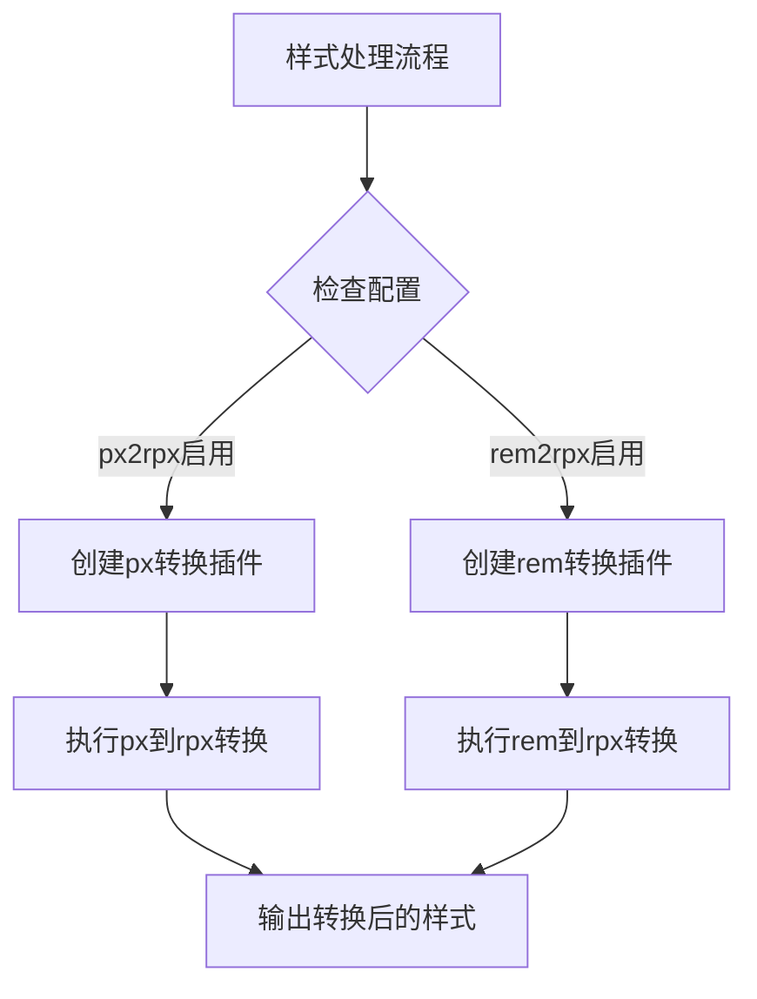
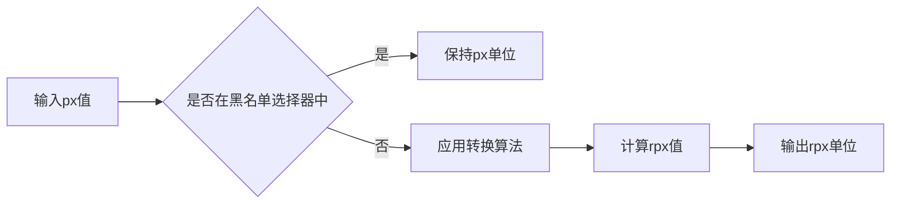
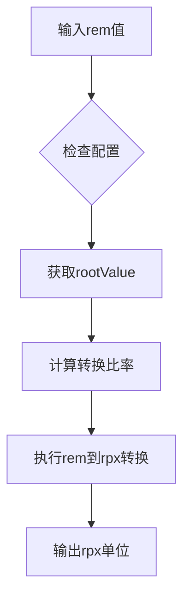
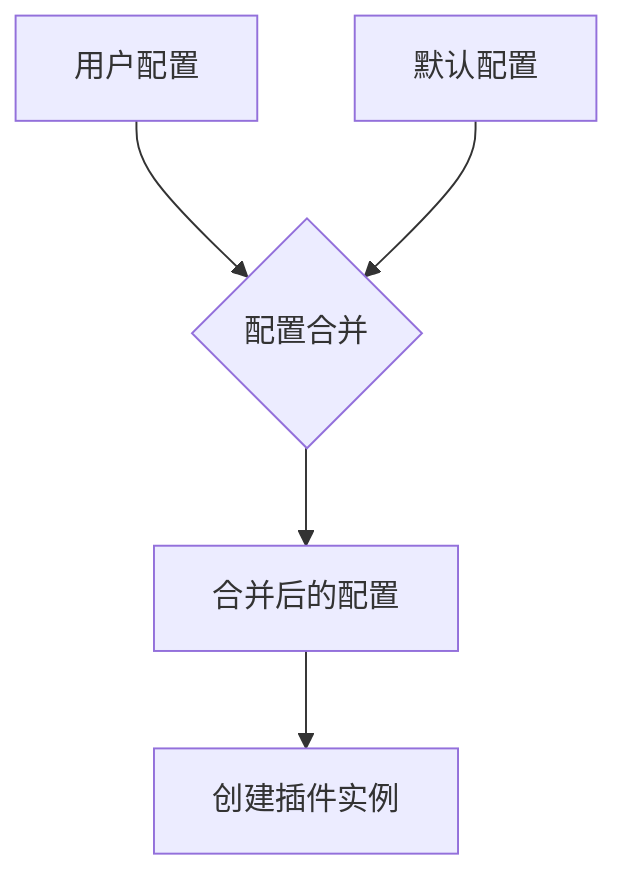
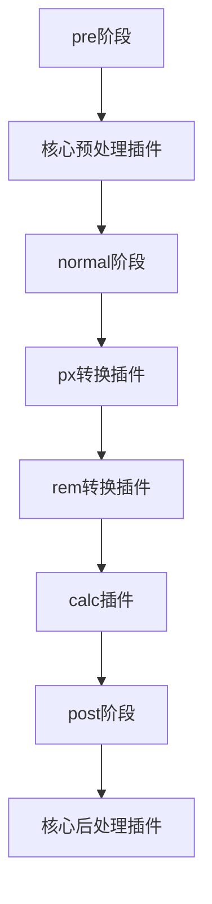

# 单位转换插件

<cite>
**本文档引用的文件**
- [getPxTransformPlugin.ts](file://packages/postcss/src/plugins/getPxTransformPlugin.ts)
- [getRemTransformPlugin.ts](file://packages/postcss/src/plugins/getRemTransformPlugin.ts)
- [types.ts](file://packages/postcss/src/types.ts)
- [pipeline.ts](file://packages/postcss/src/pipeline.ts)
- [pluginHelpers.test.ts](file://packages/postcss/test/pluginHelpers.test.ts)
- [rem2rpx.md](file://website/build/quick-start/rem2rpx.md)
</cite>

## 目录
1. [介绍](#介绍)
2. [核心插件实现机制](#核心插件实现机制)
3. [px到rpx转换算法](#px到rpx转换算法)
4. [rem单位转换策略](#rem单位转换策略)
5. [配置选项与控制机制](#配置选项与控制机制)
6. [配置示例与使用场景](#配置示例与使用场景)
7. [插件流水线集成](#插件流水线集成)

## 介绍

单位转换插件系统是为小程序开发环境设计的核心功能，旨在解决响应式布局中的单位适配问题。该系统通过PostCSS插件机制，实现了px到rpx和rem到rpx的自动转换，确保样式在不同设备上保持一致的视觉效果。本文档详细说明getPxTransformPlugin和getRemTransformPlugin的实现机制，以及它们如何适应小程序的响应式布局需求。

## 核心插件实现机制

单位转换插件系统由两个核心插件组成：getPxTransformPlugin和getRemTransformPlugin。这两个插件通过PostCSS的插件架构，在样式处理流水线中执行单位转换任务。

getPxTransformPlugin负责将px单位转换为rpx单位，而getRemTransformPlugin则处理rem到rpx的转换。两个插件都遵循相同的实现模式：检查配置选项，合并用户配置与默认配置，然后返回相应的PostCSS插件实例。



**插件来源**
- [getPxTransformPlugin.ts](file://packages/postcss/src/plugins/getPxTransformPlugin.ts)
- [getRemTransformPlugin.ts](file://packages/postcss/src/plugins/getRemTransformPlugin.ts)

**本节来源**
- [getPxTransformPlugin.ts](file://packages/postcss/src/plugins/getPxTransformPlugin.ts#L1-L41)
- [getRemTransformPlugin.ts](file://packages/postcss/src/plugins/getRemTransformPlugin.ts#L1-L33)

## px到rpx转换算法

px到rpx的转换算法是为适应小程序的响应式布局需求而设计的。该算法基于设计稿宽度和设备比率，将固定的px值转换为相对的rpx值，确保在不同屏幕尺寸上保持一致的视觉比例。

转换算法的核心是`postcss-pxtrans`插件，它根据以下参数进行转换：
- `designWidth`: 设计稿宽度，通常为750px
- `deviceRatio`: 不同设备宽度对应的转换比率
- `targetUnit`: 目标单位，固定为rpx

当`designWidth`设置为750时，1px等于1rpx。对于其他设计稿宽度，系统会自动计算相应的转换比率。例如，如果设计稿宽度为1080px，则转换比率会相应调整，确保视觉效果的一致性。



**插件来源**
- [getPxTransformPlugin.ts](file://packages/postcss/src/plugins/getPxTransformPlugin.ts)
- [pluginHelpers.test.ts](file://packages/postcss/test/pluginHelpers.test.ts)

**本节来源**
- [getPxTransformPlugin.ts](file://packages/postcss/src/plugins/getPxTransformPlugin.ts#L8-L24)
- [pluginHelpers.test.ts](file://packages/postcss/test/pluginHelpers.test.ts#L58-L83)

## rem单位转换策略

rem单位的转换策略基于根元素字体大小的计算。系统默认将1rem设置为32rpx，这基于微信小程序的设计标准：iPhone6作为视觉稿标准，1px等于2rpx，而默认情况下1rem等于16px，因此1rem等于32rpx。

getRemTransformPlugin插件的实现包含以下关键特性：
- 默认`rootValue`为32，对应1rem=32rpx
- `propList`设置为['*']，表示所有属性都进行转换
- `transformUnit`固定为'rpx'
- 处理阶段设置为'OnceExit'，确保在流水线的最后阶段执行

这种策略确保了rem单位能够正确转换为rpx，同时保持了与小程序响应式布局的兼容性。



**插件来源**
- [getRemTransformPlugin.ts](file://packages/postcss/src/plugins/getRemTransformPlugin.ts)
- [rem2rpx.md](file://website/build/quick-start/rem2rpx.md)

**本节来源**
- [getRemTransformPlugin.ts](file://packages/postcss/src/plugins/getRemTransformPlugin.ts#L8-L12)
- [rem2rpx.md](file://website/build/quick-start/rem2rpx.md#L27-L69)

## 配置选项与控制机制

单位转换插件提供了丰富的配置选项，允许开发者精确控制转换行为。这些配置通过`IStyleHandlerOptions`接口定义，主要包括：

### px转换配置
- `px2rpx`: 布尔值或配置对象，控制px到rpx的转换
- `designWidth`: 设计稿宽度，默认750
- `deviceRatio`: 设备比率映射
- `selectorBlackList`: 选择器黑名单，指定不进行转换的选择器
- `replace`: 是否替换原单位，默认true

### rem转换配置
- `rem2rpx`: 布尔值或配置对象，控制rem到rpx的转换
- `rootValue`: 根元素值，默认32
- `propList`: 属性列表，指定哪些属性进行转换
- `processorStage`: 处理阶段，默认'OnceExit'

配置合并机制使用`defuOverrideArray`函数，确保用户配置优先于默认配置，同时保留未覆盖的默认值。



**本节来源**
- [types.ts](file://packages/postcss/src/types.ts#L69-L85)
- [getPxTransformPlugin.ts](file://packages/postcss/src/plugins/getPxTransformPlugin.ts#L8-L24)
- [getRemTransformPlugin.ts](file://packages/postcss/src/plugins/getRemTransformPlugin.ts#L8-L16)

## 配置示例与使用场景

以下是一些常见的配置示例，展示如何在不同小程序平台间调整转换参数，以及如何处理特殊场景下的单位转换需求。

### 基本配置
```javascript
// vite.config.js
UnifiedViteWeappTailwindcssPlugin({
  px2rpx: true,
  rem2rpx: true
})
```

### 自定义px转换
```javascript
// 自定义设计稿宽度和设备比率
{
  px2rpx: {
    designWidth: 1080,
    deviceRatio: {
      375: 2,
      750: 1,
      1080: 1
    },
    selectorBlackList: ['.no-convert']
  }
}
```

### 自定义rem转换
```javascript
// 自定义根元素值和属性列表
{
  rem2rpx: {
    rootValue: 16,
    propList: ['font-size', 'margin*', 'padding*']
  }
}
```

### 特殊场景处理
```javascript
// 针对特定平台的配置
{
  px2rpx: process.env.PLATFORM === 'alipay' ? {
    designWidth: 750,
    replace: false
  } : false
}
```

这些配置示例展示了如何灵活调整单位转换参数，以适应不同的设计需求和平台特性。

**本节来源**
- [rem2rpx.md](file://website/build/quick-start/rem2rpx.md#L29-L58)
- [pluginHelpers.test.ts](file://packages/postcss/test/pluginHelpers.test.ts#L68-L82)

## 插件流水线集成

单位转换插件被集成到PostCSS处理流水线中，作为样式处理流程的一部分。在`pipeline.ts`文件中，插件被添加到normal阶段，确保在预处理和后处理之间执行。

流水线的构建过程如下：
1. 创建插件定义
2. 根据配置准备插件实例
3. 生成包含上下文信息的解析节点
4. 组装最终的插件流水线

getPxTransformPlugin和getRemTransformPlugin都被添加到normal阶段，确保它们在CSS预设环境处理之后，但在后处理之前执行。这种顺序保证了单位转换能够正确处理经过前序插件处理的样式。



**插件来源**
- [pipeline.ts](file://packages/postcss/src/pipeline.ts)

**本节来源**
- [pipeline.ts](file://packages/postcss/src/pipeline.ts#L142-L169)