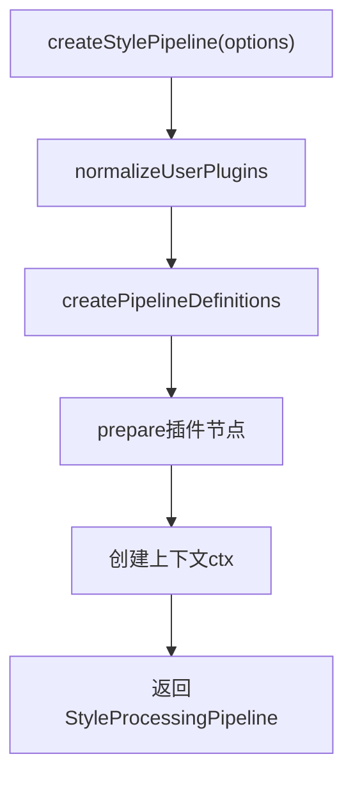
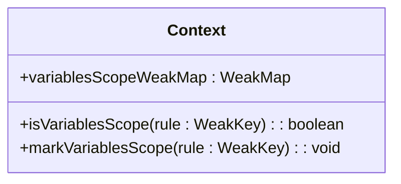
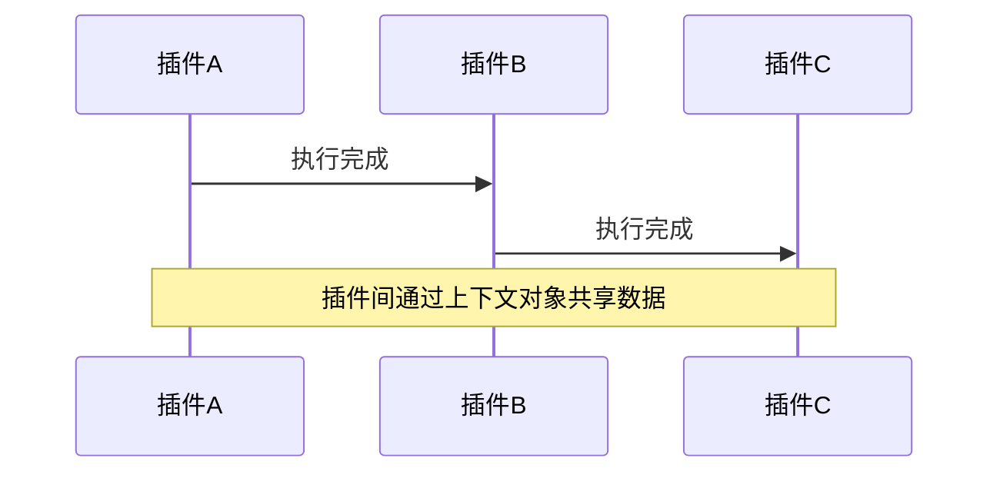
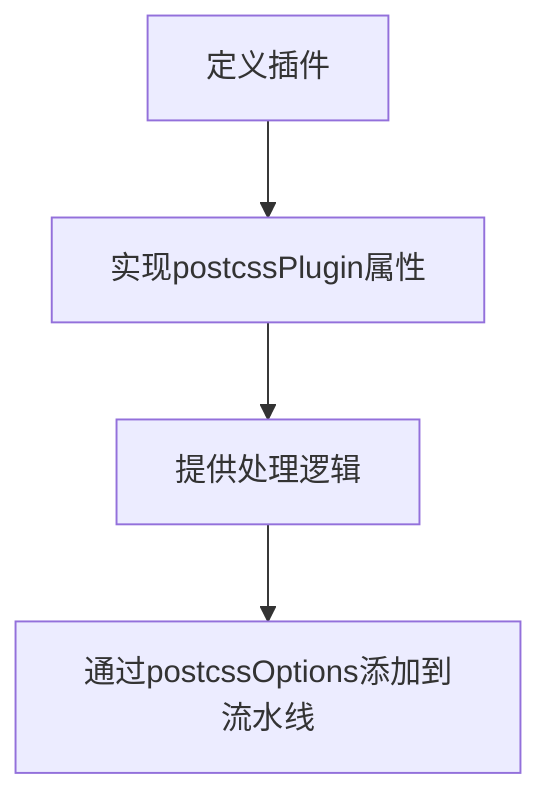
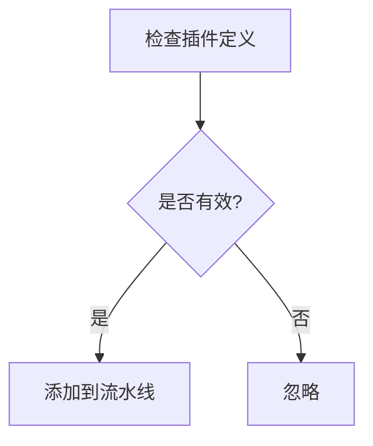
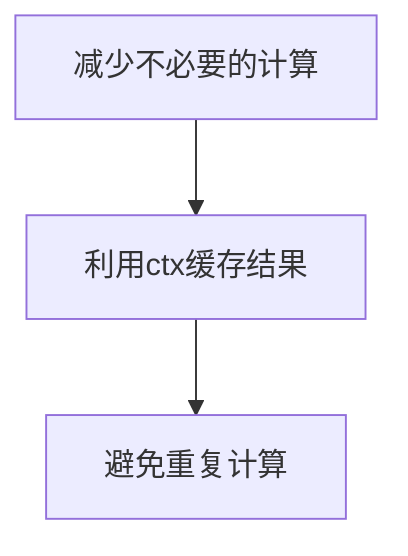

# 插件架构与扩展

<cite>
**本文档引用的文件**   
- [pipeline.ts](file://packages/postcss/src/pipeline.ts)
- [types.ts](file://packages/postcss/src/types.ts)
- [ctx.ts](file://packages/postcss/src/plugins/ctx.ts)
- [pre.ts](file://packages/postcss/src/plugins/pre.ts)
- [post.ts](file://packages/postcss/src/plugins/post.ts)
- [getPxTransformPlugin.ts](file://packages/postcss/src/plugins/getPxTransformPlugin.ts)
- [getRemTransformPlugin.ts](file://packages/postcss/src/plugins/getRemTransformPlugin.ts)
- [getCalcPlugin.ts](file://packages/postcss/src/plugins/getCalcPlugin.ts)
- [getCustomPropertyCleaner.ts](file://packages/postcss/src/plugins/getCustomPropertyCleaner.ts)
- [colorFunctionalFallback.ts](file://packages/postcss/src/plugins/colorFunctionalFallback.ts)
- [postcss.config.js](file://apps/rsmax-app-ts/postcss.config.js)
- [postcss.config.mjs](file://demo/taro-vite-tailwindcss-v4/postcss.config.mjs)
</cite>

## 目录
1. [介绍](#介绍)
2. [插件注册系统](#插件注册系统)
3. [插件流水线执行流程](#插件流水线执行流程)
4. [上下文对象(ctx)共享机制](#上下文对象ctx共享机制)
5. [插件依赖与协调](#插件依赖与协调)
6. [自定义插件开发指南](#自定义插件开发指南)
7. [错误处理策略](#错误处理策略)
8. [性能优化建议](#性能优化建议)
9. [结论](#结论)

## 介绍
本文档详细阐述了PostCSS插件系统的整体架构和扩展机制。通过分析插件注册系统、流水线执行流程、上下文共享机制以及插件间的依赖协调，为开发者提供创建自定义插件的完整指南。

## 插件注册系统
PostCSS插件系统通过`createStylePipeline`函数构建插件流水线。该函数接收配置选项，并根据这些选项创建一个包含多个插件节点的流水线。每个插件节点都有一个唯一的ID和所属阶段（pre、normal、post）。用户自定义插件被统一处理并插入到pre阶段。

**插件来源**
- [pipeline.ts](file://packages/postcss/src/pipeline.ts#L216-L277)
- [types.ts](file://packages/postcss/src/types.ts#L51-L67)

## 插件流水线执行流程
插件流水线按阶段顺序执行，分为pre、normal和post三个阶段。每个阶段内的插件按照定义的顺序依次执行。流水线的执行流程包括初始化上下文、准备插件节点、统计各阶段节点数量、生成上下文信息等步骤。

**插件来源**
- [pipeline.ts](file://packages/postcss/src/pipeline.ts#L216-L277)
- [pre.ts](file://packages/postcss/src/plugins/pre.ts#L63-L139)
- [post.ts](file://packages/postcss/src/plugins/post.ts#L273-L334)

## 上下文对象(ctx)共享机制
上下文对象(ctx)用于在插件之间共享数据和状态。通过`createContext`函数创建一个包含`variablesScopeWeakMap`、`isVariablesScope`和`markVariablesScope`方法的对象。插件可以通过这些方法来标记和检查变量作用域。

**插件来源**
- [ctx.ts](file://packages/postcss/src/plugins/ctx.ts#L1-L19)
- [pipeline.ts](file://packages/postcss/src/pipeline.ts#L218)

## 插件依赖与协调
插件之间的依赖和协调通过上下文对象(ctx)和流水线的执行顺序来实现。每个插件节点在执行时可以访问前一个和后一个节点的信息，从而实现插件间的协调。

**插件来源**
- [pipeline.ts](file://packages/postcss/src/pipeline.ts#L249-L260)
- [pre.ts](file://packages/postcss/src/plugins/pre.ts#L63-L139)
- [post.ts](file://packages/postcss/src/plugins/post.ts#L273-L334)

## 自定义插件开发指南
开发自定义插件需要遵循PostCSS插件的接口定义。插件应实现`postcssPlugin`属性，并提供相应的处理逻辑。可以通过`postcssOptions`配置项将自定义插件添加到流水线中。

**插件来源**
- [pipeline.ts](file://packages/postcss/src/pipeline.ts#L70-L84)
- [postcss.config.js](file://apps/rsmax-app-ts/postcss.config.js#L1-L11)
- [postcss.config.mjs](file://demo/taro-vite-tailwindcss-v4/postcss.config.mjs#L1-L6)

## 错误处理策略
插件系统通过`normalizeUserPlugins`函数处理无效的插件定义。如果插件定义无效，则会被忽略，不会影响整个流水线的执行。

**插件来源**
- [pipeline.ts](file://packages/postcss/src/pipeline.ts#L70-L84)
- [coverage-extra.test.ts](file://packages/postcss/test/coverage-extra.test.ts#L280-L289)

## 性能优化建议
为了提高性能，建议在插件中尽量减少不必要的计算和DOM操作。可以利用上下文对象(ctx)缓存计算结果，避免重复计算。

**插件来源**
- [pipeline.ts](file://packages/postcss/src/pipeline.ts#L218)
- [ctx.ts](file://packages/postcss/src/plugins/ctx.ts#L1-L19)

## 结论
本文档详细介绍了PostCSS插件系统的架构和扩展机制，包括插件注册、流水线执行、上下文共享、插件协调、自定义插件开发、错误处理和性能优化等方面。希望这些信息能帮助开发者更好地理解和使用PostCSS插件系统。