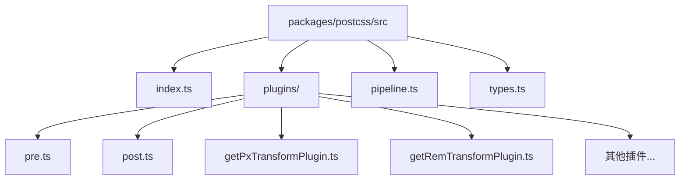
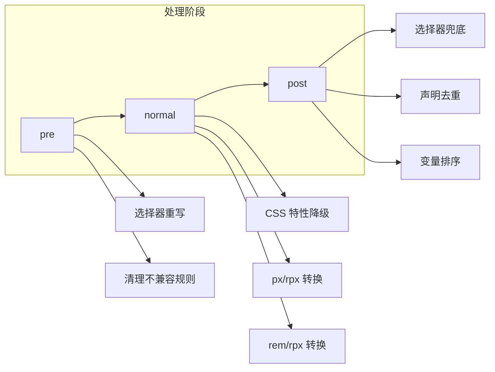
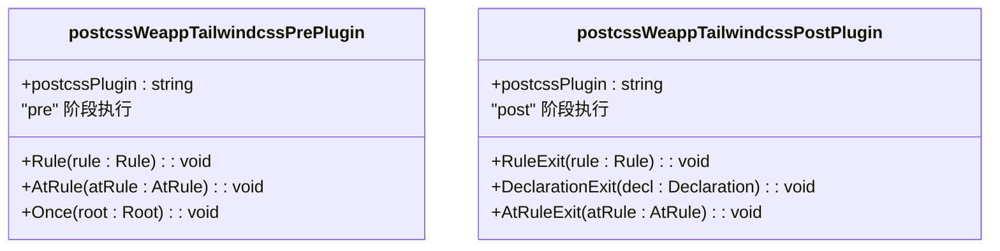
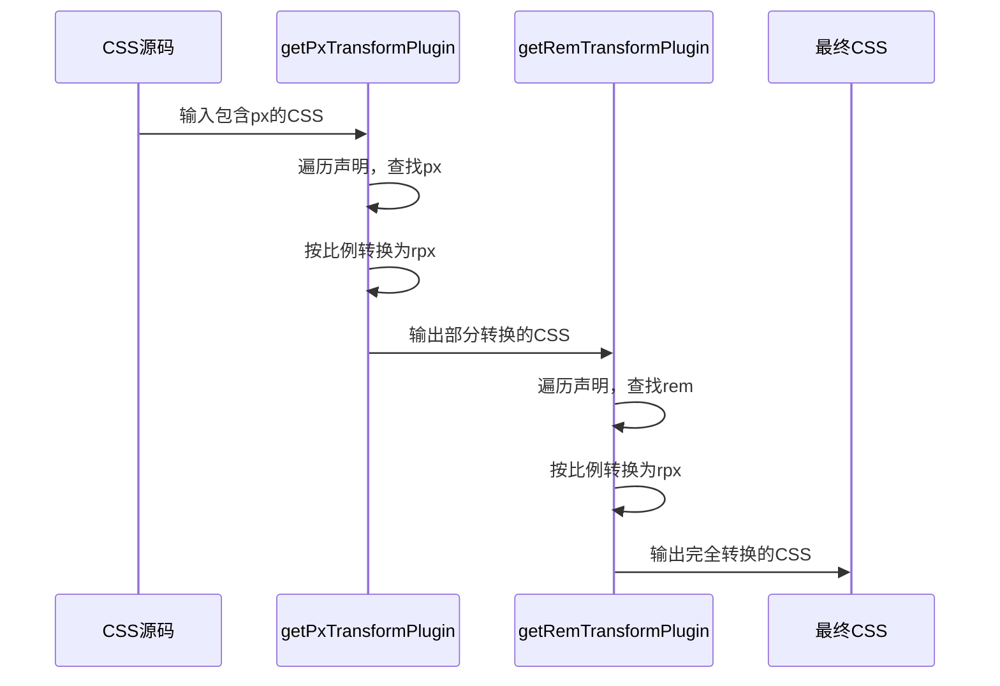
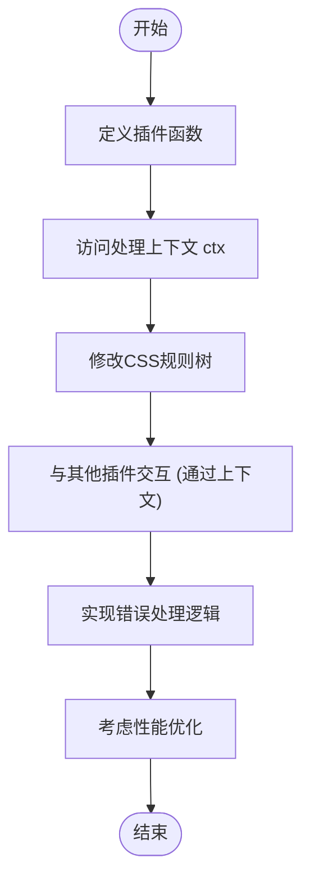
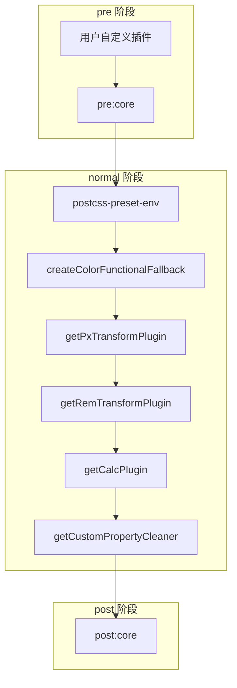

# 插件系统

<cite>
**本文档中引用的文件**  
- [index.ts](file://packages/postcss/src/index.ts)
- [plugins/index.ts](file://packages/postcss/src/plugins/index.ts)
- [plugins/pre.ts](file://packages/postcss/src/plugins/pre.ts)
- [plugins/post.ts](file://packages/postcss/src/plugins/post.ts)
- [pipeline.ts](file://packages/postcss/src/pipeline.ts)
- [types.ts](file://packages/postcss/src/types.ts)
- [getPxTransformPlugin.ts](file://packages/postcss/src/plugins/getPxTransformPlugin.ts)
- [getRemTransformPlugin.ts](file://packages/postcss/src/plugins/getRemTransformPlugin.ts)
</cite>

## 目录
1. [简介](#简介)
2. [项目结构](#项目结构)
3. [核心组件](#核心组件)
4. [架构概述](#架构概述)
5. [详细组件分析](#详细组件分析)
6. [依赖分析](#依赖分析)
7. [性能考虑](#性能考虑)
8. [故障排除指南](#故障排除指南)
9. [结论](#结论)

## 简介
本文档详细描述了 `weapp-tailwindcss` 项目中 PostCSS 插件系统的架构与实现机制。该系统专为小程序环境优化 Tailwind CSS 的输出，通过预处理（pre）和后处理（post）阶段的插件流水线，解决选择器兼容性、单位转换、声明去重等问题。文档将深入解析 `pre` 和 `post` 插件的执行时机与作用域，阐述 `getPxTransformPlugin` 和 `getRemTransformPlugin` 等核心转换插件的工作原理，并说明插件间的依赖关系和执行顺序控制机制。此外，文档还提供创建自定义插件的完整示例，涵盖插件生命周期、上下文访问、错误处理和性能优化建议。

## 项目结构
PostCSS 插件系统的核心代码位于 `packages/postcss/src` 目录下，采用模块化设计，各组件职责分明。

**Diagram sources**
- [index.ts](file://packages/postcss/src/index.ts)
- [plugins/index.ts](file://packages/postcss/src/plugins/index.ts)

**Section sources**
- [index.ts](file://packages/postcss/src/index.ts)
- [pipeline.ts](file://packages/postcss/src/pipeline.ts)

## 核心组件
本系统的核心组件包括预处理插件 (`pre`)、后处理插件 (`post`)、插件流水线管理器 (`pipeline`) 以及一系列功能转换插件（如 `getPxTransformPlugin`）。这些组件共同协作，确保生成的 CSS 代码在小程序环境中高效、兼容地运行。

**Section sources**
- [plugins/pre.ts](file://packages/postcss/src/plugins/pre.ts)
- [plugins/post.ts](file://packages/postcss/src/plugins/post.ts)
- [pipeline.ts](file://packages/postcss/src/pipeline.ts)

## 架构概述
系统采用分阶段的插件流水线（Pipeline）架构，将 CSS 处理过程划分为 `pre`（预处理）、`normal`（正常处理）和 `post`（后处理）三个阶段。这种设计确保了处理逻辑的有序性和可扩展性。

**Diagram sources**
- [pipeline.ts](file://packages/postcss/src/pipeline.ts)
- [plugins/pre.ts](file://packages/postcss/src/plugins/pre.ts)
- [plugins/post.ts](file://packages/postcss/src/plugins/post.ts)

## 详细组件分析

### 预处理与后处理插件分析

#### pre 和 post 插件的执行时机与作用域
`pre` 和 `post` 插件是系统的核心，分别在流水线的首尾阶段执行，承担着关键的兼容性处理任务。

- **`postcssWeappTailwindcssPrePlugin` (pre 阶段)**:
  - **执行时机**: 在 `pre` 阶段，作为流水线的早期处理环节。
  - **作用域**: 主要处理 CSS 规则（Rule）和 `@` 规则（AtRule）。
  - **核心功能**:
    1.  **选择器重写**: 通过 `ruleTransformSync` 函数，利用 `selectorParser` 模块统一处理选择器，以适应小程序的限制。
    2.  **清理 `@media(hover: hover)`**: 识别并移除或展开 `@media(hover: hover)` 查询，因为小程序不支持此特性。
    3.  **移除 `color-mix` 支持查询**: 删除包含 `color-mix` 函数的 `@supports` 规则，避免解析错误。
    4.  **处理 `@layer` 规则**: 清理空的 `@layer` 规则，并针对 Tailwind CSS v4 的特定结构进行优化，确保生成的 CSS 结构正确。

- **`postcssWeappTailwindcssPostPlugin` (post 阶段)**:
  - **执行时机**: 在 `post` 阶段，作为流水线的最终处理环节。
  - **作用域**: 主要处理规则（Rule）、声明（Declaration）和 `@` 规则（AtRule）的退出阶段（Exit）。
  - **核心功能**:
    1.  **选择器兜底**: 对于 `root` 选择器，移除由 `postcss-preset-env` 生成的多余的 `:not()` 包裹，简化选择器。
    2.  **声明去重与优化**: 通过 `dedupeDeclarations` 函数，合并逻辑属性（如 `margin-inline-start`）与物理属性（如 `margin-left`）的重复定义，保留最优组合，并确保字面量值在变量引用之前。
    3.  **单位与声明标准化**: 调用 `normalizeTailwindcssRpxDeclaration` 和 `normalizeTailwindcssV4Declaration` 对特定声明进行标准化处理。
    4.  **清理空规则**: 移除选择器为空或已被清空的规则，以及空的 `@property` 规则。

**Diagram sources**
- [plugins/pre.ts](file://packages/postcss/src/plugins/pre.ts)
- [plugins/post.ts](file://packages/postcss/src/plugins/post.ts)

**Section sources**
- [plugins/pre.ts](file://packages/postcss/src/plugins/pre.ts#L63-L140)
- [plugins/post.ts](file://packages/postcss/src/plugins/post.ts#L273-L334)

### 核心转换插件工作原理

#### `getPxTransformPlugin` 和 `getRemTransformPlugin` 分析
这两个插件是 `normal` 阶段的关键组成部分，负责将 CSS 中的 `px` 和 `rem` 单位转换为小程序通用的 `rpx` 单位。

- **`getPxTransformPlugin`**:
  - **功能**: 将 CSS 中的 `px` 值转换为 `rpx` 值。
  - **实现**: 该插件会遍历 CSS 规则中的所有声明，识别值中包含的 `px` 单位，并根据配置的转换比例（如 `designWidth`）将其乘以一个系数后替换为 `rpx`。例如，`16px` 在 `designWidth=750` 的配置下会转换为 `32rpx`。
  - **作用域**: 在 `normal` 阶段执行，位于 `postcss-preset-env` 之后，确保降级后的 CSS 也能被正确转换。

- **`getRemTransformPlugin`**:
  - **功能**: 将 CSS 中的 `rem` 值转换为 `rpx` 值。
  - **实现**: 与 `px` 转换类似，但需要考虑 `rem` 是相对于根元素字体大小的。该插件会根据配置的 `rootFontSize` 和 `designWidth` 计算出转换比例，将 `rem` 值转换为等效的 `rpx` 值。
  - **作用域**: 同样在 `normal` 阶段执行，与 `getPxTransformPlugin` 协同工作。

**Diagram sources**
- [pipeline.ts](file://packages/postcss/src/pipeline.ts#L142-L155)
- [plugins/getPxTransformPlugin.ts](file://packages/postcss/src/plugins/getPxTransformPlugin.ts)
- [plugins/getRemTransformPlugin.ts](file://packages/postcss/src/plugins/getRemTransformPlugin.ts)

**Section sources**
- [pipeline.ts](file://packages/postcss/src/pipeline.ts#L142-L170)
- [plugins/getPxTransformPlugin.ts](file://packages/postcss/src/plugins/getPxTransformPlugin.ts)
- [plugins/getRemTransformPlugin.ts](file://packages/postcss/src/plugins/getRemTransformPlugin.ts)

### 插件生命周期与自定义插件开发

#### 创建自定义插件
开发者可以通过 `createStylePipeline` API 创建自定义的插件流水线。系统提供了访问处理上下文（`ctx`）的机制，允许插件在不同处理阶段共享状态。

**Diagram sources**
- [pipeline.ts](file://packages/postcss/src/pipeline.ts#L216-L278)
- [types.ts](file://packages/postcss/src/types.ts#L51-L99)

**Section sources**
- [pipeline.ts](file://packages/postcss/src/pipeline.ts#L216-L278)
- [types.ts](file://packages/postcss/src/types.ts)

## 依赖分析
插件系统通过 `pipeline.ts` 中的 `createPipelineDefinitions` 函数精确控制插件的依赖关系和执行顺序。所有插件被明确分配到 `pre`、`normal`、`post` 三个阶段，并按数组顺序执行。

**Diagram sources**
- [pipeline.ts](file://packages/postcss/src/pipeline.ts#L100-L213)

**Section sources**
- [pipeline.ts](file://packages/postcss/src/pipeline.ts#L100-L213)

## 性能考虑
- **流水线优化**: 通过 `createStylePipeline` 预先构建插件实例，避免在每次处理时重复创建，提升性能。
- **条件执行**: 许多插件（如 `getPxTransformPlugin`）在配置为 `false` 时会返回 `undefined`，从而被流水线跳过，减少不必要的处理开销。
- **高效遍历**: 使用 PostCSS 提供的 `walk` API 高效遍历 AST，避免深度递归带来的性能问题。
- **去重与清理**: `post` 阶段的去重和清理操作减少了最终 CSS 文件的体积，提升了小程序的加载和渲染性能。

## 故障排除指南
- **选择器未正确转换**: 检查 `pre` 阶段插件是否正常执行，确认 `cssSelectorReplacement` 配置是否正确。
- **单位转换未生效**: 确认 `px2rpx` 或 `rem2rpx` 配置已启用，并检查 `normal` 阶段的转换插件是否被正确加载。
- **生成的 CSS 体积过大**: 检查 `post` 阶段的去重和清理功能是否开启，确认 `cssRemoveProperty` 等配置项。
- **出现解析错误**: 查看是否包含不兼容的 CSS 特性（如 `color-mix`），`pre` 插件应已处理此类问题。

**Section sources**
- [plugins/pre.ts](file://packages/postcss/src/plugins/pre.ts)
- [plugins/post.ts](file://packages/postcss/src/plugins/post.ts)

## 结论
`weapp-tailwindcss` 的 PostCSS 插件系统通过精心设计的分阶段流水线架构，有效地解决了 Tailwind CSS 在小程序环境中的兼容性问题。`pre` 和 `post` 插件分别负责前期的兼容性修复和后期的优化清理，而 `normal` 阶段的转换插件则完成了核心的单位转换任务。该系统不仅功能强大，而且具有良好的可扩展性，开发者可以基于此架构轻松创建自定义插件，满足特定的项目需求。