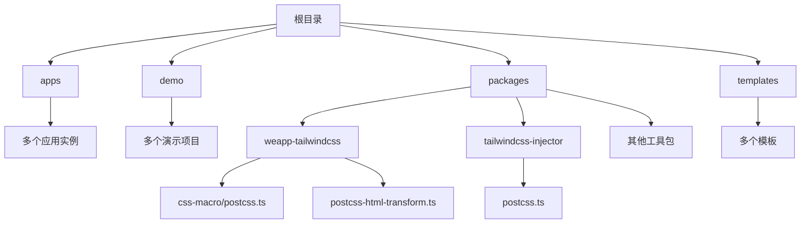
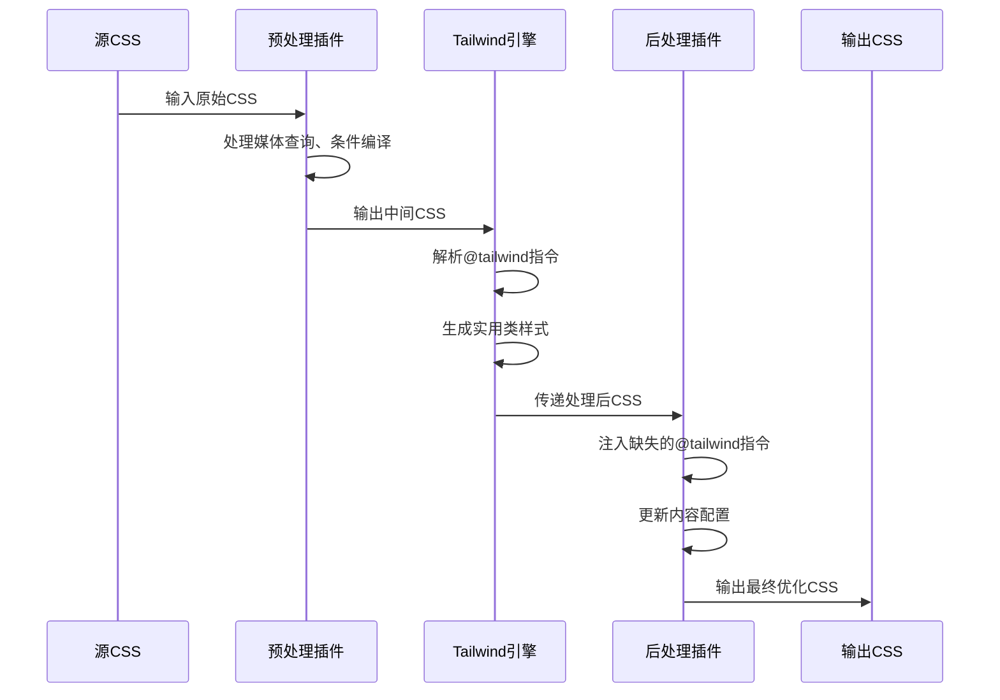
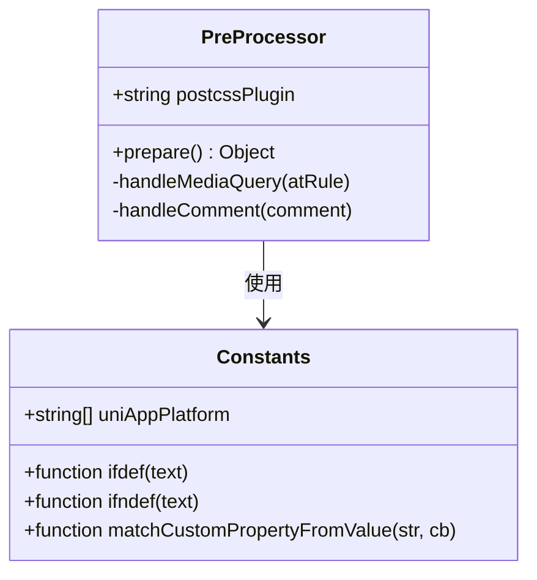
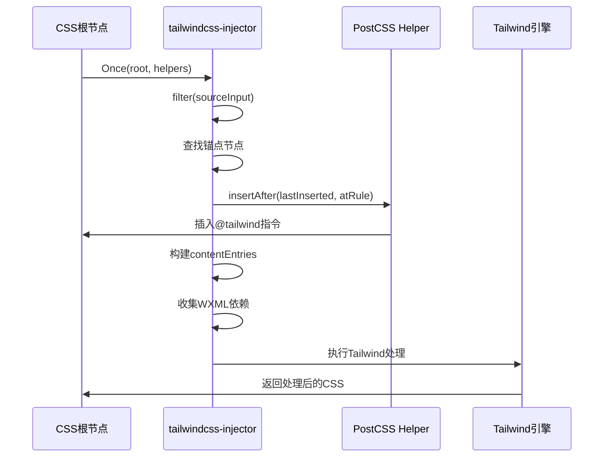

# 预处理与后处理插件

<cite>
**本文档中引用的文件**  
- [postcss.ts](file://packages/weapp-tailwindcss/src/css-macro/postcss.ts)
- [constants.ts](file://packages/weapp-tailwindcss/src/css-macro/constants.ts)
- [postcss.ts](file://packages/tailwindcss-injector/src/postcss.ts)
- [postcss.config.js](file://apps/vite-native/postcss.config.js)
- [postcss-html-transform.ts](file://packages/weapp-tailwindcss/src/postcss-html-transform.ts)
</cite>

## 目录
1. [简介](#简介)
2. [项目结构](#项目结构)
3. [核心组件](#核心组件)
4. [架构概述](#架构概述)
5. [详细组件分析](#详细组件分析)
6. [依赖分析](#依赖分析)
7. [性能考虑](#性能考虑)
8. [故障排除指南](#故障排除指南)
9. [结论](#结论)

## 简介
本文档详细说明了在PostCSS插件系统中预处理（pre）和后处理（post）插件的设计与实现机制。重点阐述了pre插件在CSS处理流水线中的早期执行时机，如何处理原始CSS源码、进行语法转换和前置优化；同时解释了post插件在处理流程末期的作用，包括最终样式优化、压缩和兼容性处理。文档还描述了这些插件之间的协作关系以及它们在处理上下文（ctx）中的数据共享机制，并通过实际代码示例展示如何在pre阶段进行CSS变量提取，在post阶段进行样式压缩。

## 项目结构
本项目是一个基于PostCSS的Tailwind CSS集成解决方案，主要用于小程序环境下的样式处理。其结构围绕多个应用模板、插件包和构建工具展开，核心功能集中在`packages`目录下的`weapp-tailwindcss`和`tailwindcss-injector`模块。



**Diagram sources**  
- [postcss.ts](file://packages/weapp-tailwindcss/src/css-macro/postcss.ts)
- [postcss.ts](file://packages/tailwindcss-injector/src/postcss.ts)
- [postcss-html-transform.ts](file://packages/weapp-tailwindcss/src/postcss-html-transform.ts)

**Section sources**
- [postcss.ts](file://packages/weapp-tailwindcss/src/css-macro/postcss.ts)
- [postcss.ts](file://packages/tailwindcss-injector/src/postcss.ts)

## 核心组件
系统的核心组件包括两个关键的PostCSS插件：`css-macro`插件用于预处理阶段的条件编译和宏替换，`tailwindcss-injector`插件负责在后处理阶段注入Tailwind指令并执行Tailwind处理流程。此外，`postcss-html-transform`插件用于HTML模板的样式关联处理。

**Section sources**
- [postcss.ts](file://packages/weapp-tailwindcss/src/css-macro/postcss.ts)
- [postcss.ts](file://packages/tailwindcss-injector/src/postcss.ts)
- [postcss-html-transform.ts](file://packages/weapp-tailwindcss/src/postcss-html-transform.ts)

## 架构概述
整个PostCSS处理流水线采用分阶段处理模式，分为预处理、核心处理和后处理三个阶段。预处理插件在最前端运行，负责解析和转换原始CSS源码；中间由Tailwind CSS引擎进行类名到样式的转换；后处理插件在最后执行，完成样式优化和压缩。



**Diagram sources**  
- [postcss.ts](file://packages/weapp-tailwindcss/src/css-macro/postcss.ts)
- [postcss.ts](file://packages/tailwindcss-injector/src/postcss.ts)

## 详细组件分析

### 预处理插件分析
预处理插件主要负责在CSS处理流水线的早期阶段对原始源码进行语法转换和结构优化。该插件实现了条件编译功能，能够识别特定的媒体查询并将其转换为平台相关的条件注释。

#### 对于对象导向组件：


**Diagram sources**  
- [postcss.ts](file://packages/weapp-tailwindcss/src/css-macro/postcss.ts)
- [constants.ts](file://packages/weapp-tailwindcss/src/css-macro/constants.ts)

### 后处理插件分析
后处理插件在处理流水线的末期运行，主要职责是确保所有必要的Tailwind指令都被正确注入，并更新Tailwind的配置以包含当前文件的依赖关系。

#### 对于API/服务组件：


**Diagram sources**  
- [postcss.ts](file://packages/tailwindcss-injector/src/postcss.ts)

**Section sources**
- [postcss.ts](file://packages/tailwindcss-injector/src/postcss.ts)

### 协作关系与数据共享
预处理和后处理插件通过PostCSS的处理上下文（ctx）进行协作。预处理插件修改后的CSS结构会被传递给后续插件，而后处理插件则依赖于预处理阶段产生的结构信息来决定如何注入指令。

```mermaid
flowchart TD
A[原始CSS] --> B{预处理插件}
B --> C[转换媒体查询]
C --> D[添加条件注释]
D --> E{Tailwind处理}
E --> F[生成基础样式]
F --> G{后处理插件}
G --> H[注入@tailwind指令]
H --> I[更新内容配置]
I --> J[处理依赖文件]
J --> K[最终CSS输出]
style B fill:#f9f,stroke:#333
style G fill:#bbf,stroke:#333
```

**Diagram sources**  
- [postcss.ts](file://packages/weapp-tailwindcss/src/css-macro/postcss.ts)
- [postcss.ts](file://packages/tailwindcss-injector/src/postcss.ts)

**Section sources**
- [postcss.ts](file://packages/weapp-tailwindcss/src/css-macro/postcss.ts)
- [postcss.ts](file://packages/tailwindcss-injector/src/postcss.ts)

## 依赖分析
系统依赖关系清晰，主要依赖PostCSS生态系统和Tailwind CSS相关包。核心插件之间通过标准的PostCSS插件接口进行通信，确保了良好的解耦性。

```mermaid
erDiagram
PLUGIN1 ||--o{ PLUGIN2 : "通过PostCSS API"
PLUGIN2 ||--o{ TAILWIND : "调用处理函数"
TAILWIND ||--o{ CONFIG : "读取配置"
CONFIG ||--o{ DEPENDENCY : "包含文件依赖"
class PLUGIN1 {
postcss-weapp-tw-css-macro-plugin
}
class PLUGIN2 {
tailwindcss-injector
}
class TAILWIND {
tailwindcss
}
class CONFIG {
tailwind.config.js
}
class DEPENDENCY {
.wxml文件
}
```

**Diagram sources**  
- [postcss.config.js](file://apps/vite-native/postcss.config.js)
- [postcss.ts](file://packages/tailwindcss-injector/src/postcss.ts)

**Section sources**
- [postcss.config.js](file://apps/vite-native/postcss.config.js)
- [postcss.ts](file://packages/tailwindcss-injector/src/postcss.ts)

## 性能考虑
预处理和后处理插件都实现了缓存机制以提高性能。`tailwindcss-injector`中的配置缓存避免了重复加载Tailwind配置文件，而条件编译的正则匹配也经过优化以减少运行时开销。

## 故障排除指南
当遇到样式未正确生成的问题时，应首先检查预处理插件是否正确转换了条件编译语句，然后确认后处理插件是否成功注入了`@tailwind`指令。可以通过查看生成的中间CSS文件来验证每个处理阶段的输出。

**Section sources**
- [postcss.ts](file://packages/weapp-tailwindcss/src/css-macro/postcss.ts)
- [postcss.ts](file://packages/tailwindcss-injector/src/postcss.ts)

## 结论
本文档详细分析了PostCSS插件系统中预处理和后处理插件的工作机制。预处理插件在早期阶段处理原始CSS源码，实现语法转换和条件编译；后处理插件在末期确保Tailwind指令的正确注入和配置更新。两者通过PostCSS的标准接口协同工作，共同完成了从小程序特有语法到最终CSS样式的完整转换流程。