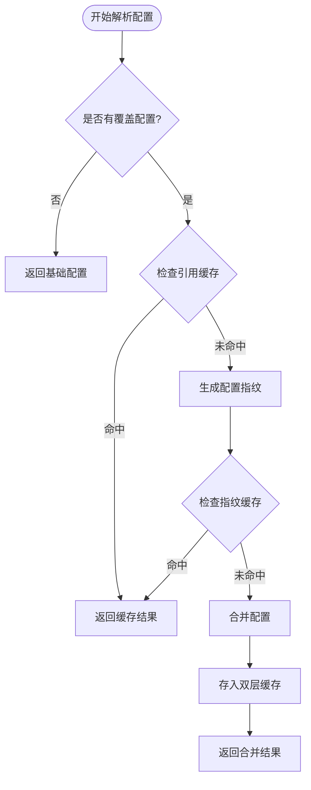
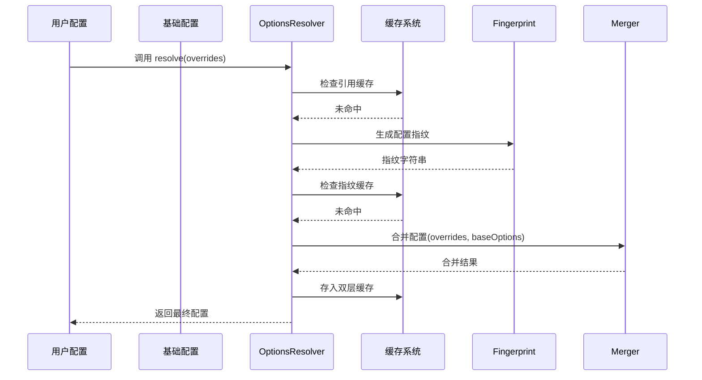
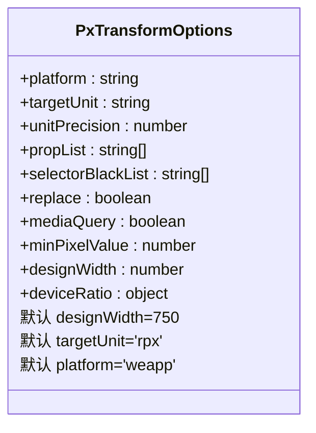
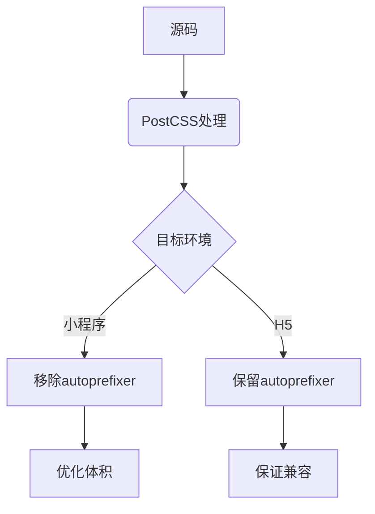
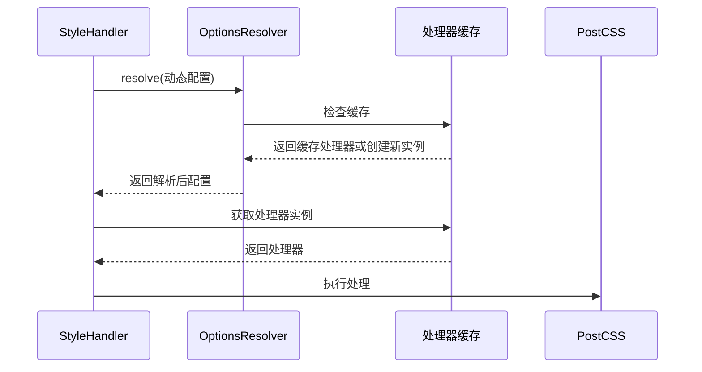
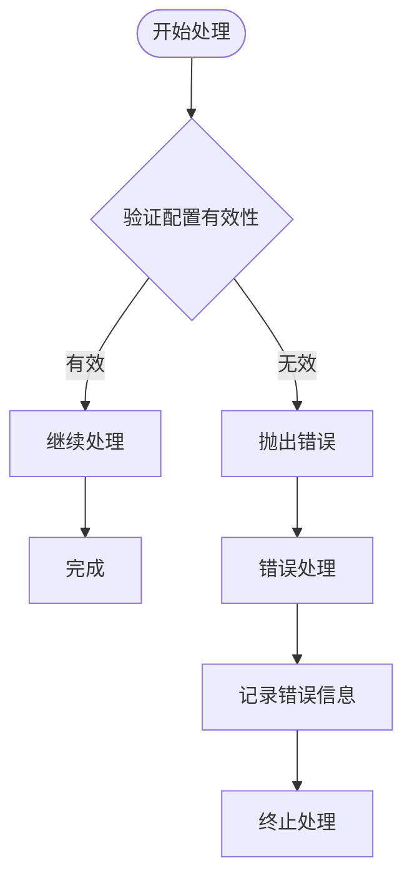

# 配置选项

<cite>
**本文档引用文件**  
- [options-resolver.ts](file://packages/postcss/src/options-resolver.ts)
- [handler.ts](file://packages/postcss/src/handler.ts)
- [types.ts](file://packages/postcss/src/types.ts)
- [defaults.ts](file://packages/postcss/src/defaults.ts)
- [fingerprint.ts](file://packages/postcss/src/fingerprint.ts)
- [pipeline.ts](file://packages/postcss/src/pipeline.ts)
- [getPxTransformPlugin.ts](file://packages/postcss/src/plugins/getPxTransformPlugin.ts)
- [postcss.config.js](file://apps/rsmax-app-ts/postcss.config.js)
- [postcss.config.js](file://demo/taro-app/postcss.config.js)
- [postcss.config.js](file://demo/native-mina/postcss.config.js)
</cite>

## 目录
1. [简介](#简介)
2. [核心配置项详解](#核心配置项详解)
3. [配置解析机制](#配置解析机制)
4. [单位转换配置](#单位转换配置)
5. [CSS变量与预设环境](#css变量与预设环境)
6. [选择器与样式处理](#选择器与样式处理)
7. [兼容性与平台适配](#兼容性与平台适配)
8. [配置继承与动态更新](#配置继承与动态更新)
9. [配置验证与错误提示](#配置验证与错误提示)
10. [最佳实践指南](#最佳实践指南)

## 简介
本项目为微信小程序等环境提供 Tailwind CSS 支持，通过 PostCSS 处理器实现样式转换。其核心在于灵活的配置系统，允许开发者根据项目需求定制样式处理行为。本文档全面解析所有配置选项及其作用机制，重点说明 `options-resolver` 如何解析和合并用户配置，涵盖单位转换、CSS 变量处理、兼容性设置等关键领域。

**Section sources**
- [types.ts](file://packages/postcss/src/types.ts#L1-L99)
- [defaults.ts](file://packages/postcss/src/defaults.ts#L1-L37)

## 核心配置项详解

### 基础配置结构
配置系统基于 `IStyleHandlerOptions` 接口定义，包含多个子模块配置。主要分为：
- 基础处理选项（如 `isMainChunk`）
- CSS 预设环境配置（`cssPresetEnv`）
- 单位转换配置（`px2rpx`, `rem2rpx`）
- 选择器替换配置（`cssSelectorReplacement`）
- 插件选项（`postcssOptions`）

```mermaid
classDiagram
class IStyleHandlerOptions {
+ctx : PostcssContext
+postcssOptions : LoadedPostcssOptions
+cssRemoveProperty : boolean
+cssRemoveHoverPseudoClass : boolean
+cssPresetEnv : PresetEnvOptions
+cssCalc : boolean | CssCalcOptions | (string | RegExp)[]
+atRules : { property : boolean, supports : boolean, media : boolean }
+uniAppX : boolean
+majorVersion : number
+isMainChunk : boolean
+cssPreflight : CssPreflightOptions
+cssInjectPreflight : InjectPreflight
+escapeMap : Record<string, string>
+cssPreflightRange : 'all'
+cssChildCombinatorReplaceValue : string | string[]
+injectAdditionalCssVarScope : boolean
+cssSelectorReplacement : { root : string | string[] | false, universal : string | string[] | false }
+rem2rpx : boolean | Rem2rpxOptions
+px2rpx : boolean | Px2rpxOptions
}
```

**Diagram sources**
- [types.ts](file://packages/postcss/src/types.ts#L51-L67)

### 默认值与有效范围
每个配置项都有明确的默认值和有效范围：

| 配置项 | 默认值 | 有效范围 | 说明 |
|-------|-------|--------|------|
| `isMainChunk` | `true` | `boolean` | 是否为主样式文件 |
| `cssRemoveProperty` | `true` | `boolean` | 是否移除不支持的 CSS 属性 |
| `cssSelectorReplacement.root` | `"page"` | `string` \| `string[]` \| `false` | 根选择器替换 |
| `cssSelectorReplacement.universal` | `["view", "text"]` | `string` \| `string[]` \| `false` | 通用选择器替换 |
| `px2rpx.designWidth` | `750` | `number` | 设计稿基准宽度 |
| `cssPresetEnv.features['custom-properties']` | 根据 `cssCalc` 决定 | `boolean` \| `{ preserve: boolean }` | 自定义属性处理 |

**Section sources**
- [defaults.ts](file://packages/postcss/src/defaults.ts#L8-L36)
- [types.ts](file://packages/postcss/src/types.ts#L69-L85)

## 配置解析机制

### options-resolver 工作流程
`createOptionsResolver` 函数创建一个解析器实例，负责合并基础配置和覆盖配置。它采用双重缓存策略提升性能：
- **引用缓存**：使用 `WeakMap` 缓存基于配置对象引用的结果
- **指纹缓存**：使用 `Map` 缓存基于配置内容指纹的结果



**Diagram sources**
- [options-resolver.ts](file://packages/postcss/src/options-resolver.ts#L15-L58)
- [fingerprint.ts](file://packages/postcss/src/fingerprint.ts#L6-L42)

### 配置合并策略
使用 `defuOverrideArray` 函数进行深度合并，优先级规则如下：
1. 用户覆盖配置优先
2. 基础配置作为后备
3. 数组类型配置采用覆盖式合并



**Diagram sources**
- [options-resolver.ts](file://packages/postcss/src/options-resolver.ts#L43-L52)
- [handler.ts](file://packages/postcss/src/handler.ts#L11-L17)

## 单位转换配置

### px 转 rpx 配置
通过 `px2rpx` 选项控制像素到 rpx 的转换行为：



**Diagram sources**
- [getPxTransformPlugin.ts](file://packages/postcss/src/plugins/getPxTransformPlugin.ts#L8-L24)
- [types.ts](file://packages/postcss/src/types.ts#L6)

### rem 转 rpx 配置
`rem2rpx` 选项用于控制 rem 单位到 rpx 的转换：

| 参数 | 默认值 | 说明 |
|------|-------|------|
| `rootValue` | 32 | 根元素字体大小 |
| `propList` | ['*'] | 需要转换的属性列表 |
| `transformUnit` | 'rpx' | 目标单位 |

**Section sources**
- [types.ts](file://packages/postcss/src/types.ts#L7)
- [getPxTransformPlugin.ts](file://packages/postcss/src/plugins/getPxTransformPlugin.ts#L26-L41)

## CSS变量与预设环境

### cssPresetEnv 配置
控制 CSS 新特性的转换行为：

```mermaid
classDiagram
class PresetEnvOptions {
+features : object
+autoprefixer : object
}
PresetEnvOptions --> Features : 包含特性开关
Features --> CascadeLayers : 'cascade-layers' : true
Features --> IsPseudoClass : 'is-pseudo-class' : { specificityMatchingName : 'weapp-tw-ig' }
Features --> ColorFunctional : 'color-functional-notation' : { preserve : false }
Features --> CustomProperties : 'custom-properties' : 根据cssCalc决定
PresetEnvOptions --> Autoprefixer : 自动前缀配置
Autoprefixer --> AddPrefixes : add : false
```

**Diagram sources**
- [defaults.ts](file://packages/postcss/src/defaults.ts#L8-L26)
- [types.ts](file://packages/postcss/src/types.ts#L5)

### cssCalc 配置
控制 calc() 函数的处理方式：

| 配置值 | 行为 |
|-------|------|
| `false` | 不处理 calc() |
| `true` | 启用 calc() 处理 |
| 对象形式 | 详细配置包括 `includeCustomProperties` |

**Section sources**
- [types.ts](file://packages/postcss/src/types.ts#L47-L49)
- [pipeline.ts](file://packages/postcss/src/pipeline.ts#L176-L184)

## 选择器与样式处理

### 选择器替换配置
`cssSelectorReplacement` 用于小程序环境的选择器适配：

```mermaid
flowchart LR
A[原始CSS] --> B{cssSelectorReplacement}
B --> |root: 'page'| C[替换根选择器]
B --> |universal: ['view','text']| D[替换通用选择器]
C --> E[适配小程序]
D --> E
E --> F[最终输出]
```

**Diagram sources**
- [defaults.ts](file://packages/postcss/src/defaults.ts#L31-L34)
- [types.ts](file://packages/postcss/src/types.ts#L75-L78)

### 伪类与属性处理
相关配置项控制特殊样式处理：

| 配置项 | 默认值 | 作用 |
|-------|-------|------|
| `cssRemoveHoverPseudoClass` | `false` | 是否移除 hover 伪类 |
| `cssRemoveProperty` | `true` | 是否移除不支持的 CSS 属性 |
| `atRules.supports` | `false` | 是否支持 @supports 规则 |
| `atRules.media` | `false` | 是否支持 @media 规则 |

**Section sources**
- [types.ts](file://packages/postcss/src/types.ts#L55-L64)

## 兼容性与平台适配

### 平台特定配置
通过 `uniAppX` 和 `majorVersion` 实现平台差异化处理：

| 配置项 | 适用场景 | 说明 |
|-------|---------|------|
| `uniAppX` | UniApp X 环境 | 启用特定兼容模式 |
| `majorVersion` | 版本兼容 | 根据主版本号调整行为 |

**Section sources**
- [types.ts](file://packages/postcss/src/types.ts#L65-L66)

### 浏览器兼容性
虽然主要面向小程序，但仍继承部分 Web 兼容性概念：



**Diagram sources**
- [defaults.ts](file://packages/postcss/src/defaults.ts#L23-L25)

## 配置继承与动态更新

### 配置继承机制
支持多层级配置继承：

```mermaid
tree
Root[基础配置]
Root --> Project[项目配置]
Project --> Package[包配置]
Package --> File[文件级配置]
File --> Dynamic[运行时动态配置]
```

**Diagram sources**
- [handler.ts](file://packages/postcss/src/handler.ts#L10-L17)

### 动态配置更新
通过 `createStyleHandler` 实现运行时配置更新：



**Diagram sources**
- [handler.ts](file://packages/postcss/src/handler.ts#L26-L35)
- [processor-cache.ts](file://packages/postcss/src/processor-cache.ts)

## 配置验证与错误提示

### 配置验证流程
系统在运行时进行基本验证：



**Diagram sources**
- [options-resolver.ts](file://packages/postcss/src/options-resolver.ts#L7-L9)

### 常见错误与提示
| 错误类型 | 错误提示 | 解决方案 |
|--------|---------|---------|
| 配置项类型错误 | "Invalid option type" | 检查配置项数据类型 |
| 不支持的特性 | "Feature not supported" | 查阅文档确认支持范围 |
| 插件加载失败 | "Plugin load failed" | 检查插件安装和配置 |

**Section sources**
- [types.ts](file://packages/postcss/src/types.ts)
- [pipeline.ts](file://packages/postcss/src/pipeline.ts)

## 最佳实践指南

### 配置组织建议
1. **分层管理**：将基础配置与项目特定配置分离
2. **环境区分**：开发与生产环境使用不同配置
3. **性能优化**：合理利用缓存机制

### 常见使用模式
```javascript
// 示例：条件性配置
module.exports = ({ options }) => ({
  plugins: {
    ...options.plugins,
    tailwindcss: {},
    autoprefixer: {},
  },
})
```

```javascript
// 示例：按文件类型配置
module.exports = function config(loaderContext) {
  return {
    plugins: {
      tailwindcss: {},
      autoprefixer: {},
    }
  }
}
```

**Section sources**
- [postcss.config.js](file://apps/rsmax-app-ts/postcss.config.js#L2-L10)
- [postcss.config.js](file://demo/taro-app/postcss.config.js#L8-L42)
- [postcss.config.js](file://demo/native-mina/postcss.config.js#L1-L11)