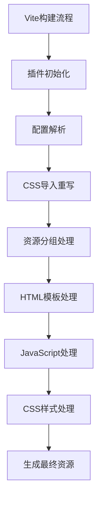
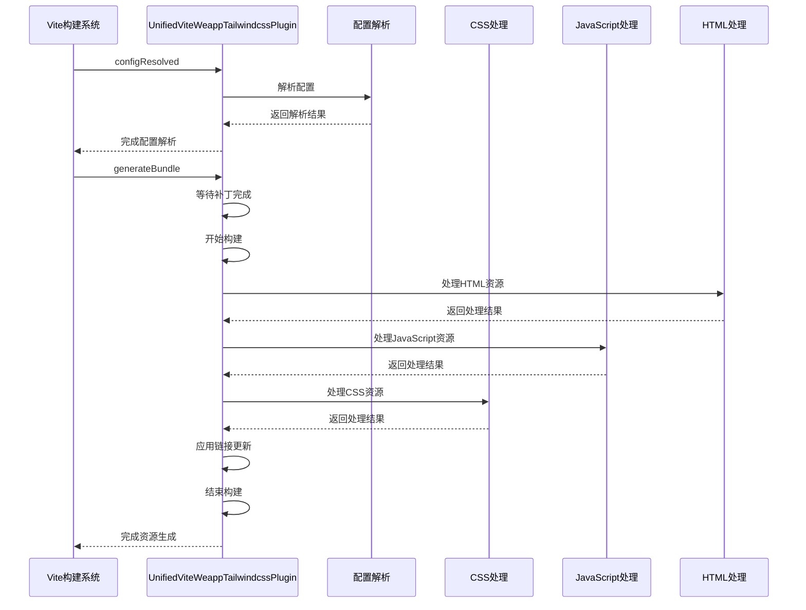
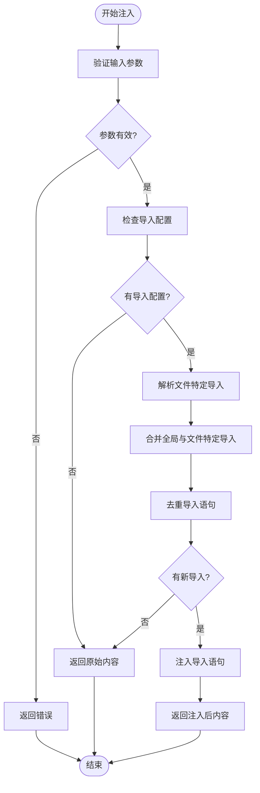
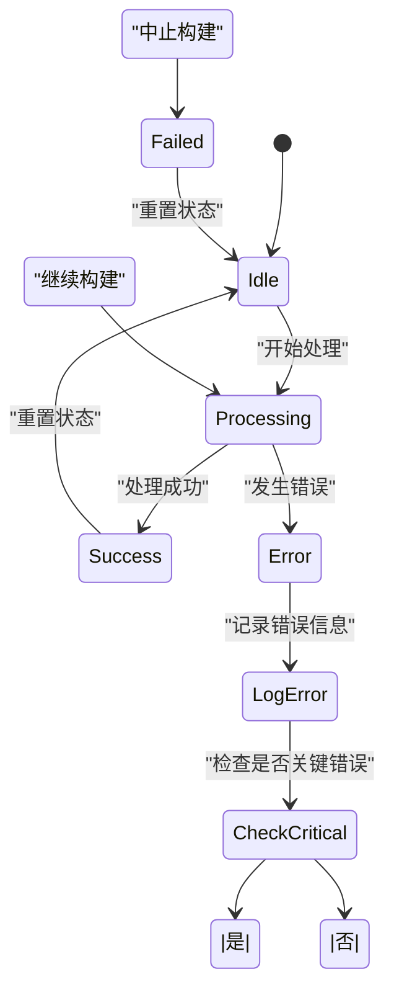
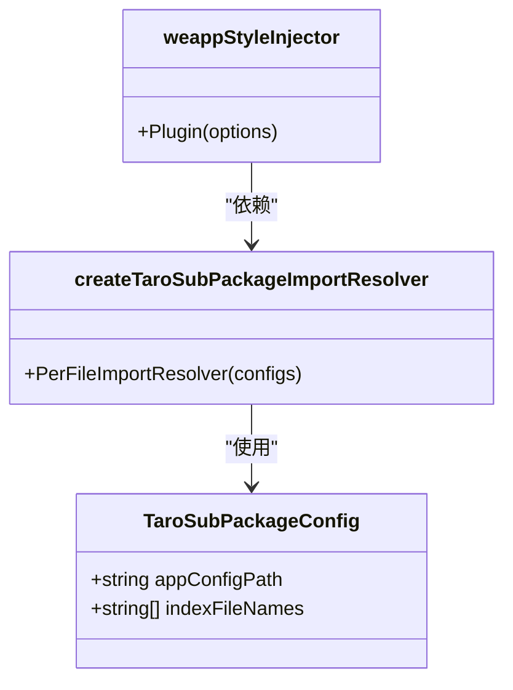
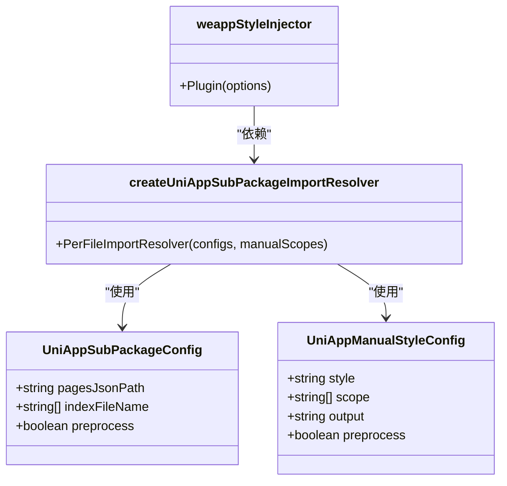
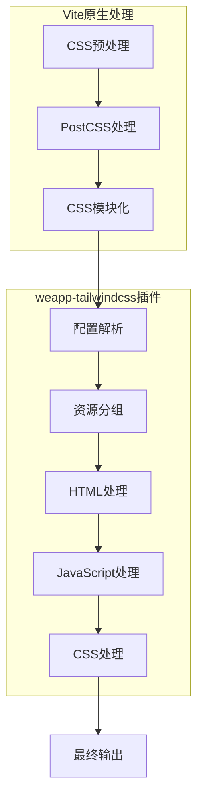

# Vite集成

<cite>
**本文档引用文件**  
- [vite.ts](file://packages/weapp-tailwindcss/src/bundlers/vite/index.ts)
- [weapp-style-injector/src/vite.ts](file://packages/weapp-style-injector/src/vite.ts)
- [weapp-style-injector/src/core.ts](file://packages/weapp-style-injector/src/core.ts)
- [weapp-style-injector/src/uni-app.ts](file://packages/weapp-style-injector/src/uni-app.ts)
- [weapp-style-injector/src/taro.ts](file://packages/weapp-style-injector/src/taro.ts)
- [weapp-tailwindcss/src/vite.ts](file://packages/weapp-tailwindcss/src/vite.ts)
- [weapp-tailwindcss/src/index.ts](file://packages/weapp-tailwindcss/src/index.ts)
</cite>

## 目录
1. [简介](#简介)
2. [Vite插件实现机制](#vite插件实现机制)
3. [核心配置参数](#核心配置参数)
4. [执行流程与生命周期](#执行流程与生命周期)
5. [样式注入机制](#样式注入机制)
6. [错误处理策略](#错误处理策略)
7. [框架集成示例](#框架集成示例)
8. [开发与生产环境配置](#开发与生产环境配置)
9. [与Vite原生CSS处理的兼容性](#与vite原生css处理的兼容性)

## 简介
本文档详细介绍了weapp-tailwindcss项目中Vite插件的实现机制和使用方法。重点分析了vitePluginWeappTailwind函数的参数配置、执行流程和生命周期钩子，以及在Vite构建流程中样式注入的时机、转换规则和错误处理策略。

## Vite插件实现机制

weapp-tailwindcss项目通过Vite插件系统实现了Tailwind CSS在小程序环境中的集成。插件主要分为两个核心部分：`UnifiedViteWeappTailwindcssPlugin`用于处理Tailwind CSS的运行时集成，`weappStyleInjector`用于实现样式文件的自动注入。



**图示来源**  
- [vite.ts](file://packages/weapp-tailwindcss/src/bundlers/vite/index.ts#L134-L478)

**本节来源**  
- [vite.ts](file://packages/weapp-tailwindcss/src/bundlers/vite/index.ts#L1-L479)

## 核心配置参数

Vite插件提供了丰富的配置选项，允许开发者根据具体需求进行定制化配置。主要配置参数包括：

| 参数 | 类型 | 描述 | 默认值 |
|------|------|------|--------|
| disabled | object | 禁用特定功能的配置 | {} |
| customAttributes | array | 自定义属性配置 | [] |
| onEnd | function | 构建结束回调 | undefined |
| onLoad | function | 插件加载回调 | undefined |
| onStart | function | 构建开始回调 | undefined |
| onUpdate | function | 资源更新回调 | undefined |
| templateHandler | function | 模板处理函数 | required |
| styleHandler | function | 样式处理函数 | required |
| jsHandler | function | JavaScript处理函数 | required |
| mainCssChunkMatcher | function | 主CSS块匹配器 | required |
| appType | string | 应用类型 | 'unknown' |
| cache | object | 缓存配置 | {} |
| twPatcher | object | Tailwind补丁配置 | required |
| refreshTailwindcssPatcher | function | 刷新Tailwind补丁函数 | required |
| uniAppX | boolean | uni-app X模式 | false |
| disabledDefaultTemplateHandler | boolean | 禁用默认模板处理器 | false |

**本节来源**  
- [vite.ts](file://packages/weapp-tailwindcss/src/bundlers/vite/index.ts#L134-L154)

## 执行流程与生命周期

Vite插件的执行流程遵循Vite的构建生命周期，主要在`generateBundle`阶段进行资源处理。插件的执行流程如下：

1. 插件初始化并解析配置
2. 在`configResolved`钩子中处理PostCSS配置
3. 在`generateBundle`钩子中处理所有输出资源
4. 按类型分组处理HTML、JavaScript和CSS资源
5. 应用相应的处理器进行转换
6. 更新资源并完成构建



**图示来源**  
- [vite.ts](file://packages/weapp-tailwindcss/src/bundlers/vite/index.ts#L279-L471)

**本节来源**  
- [vite.ts](file://packages/weapp-tailwindcss/src/bundlers/vite/index.ts#L279-L471)

## 样式注入机制

样式注入器（weappStyleInjector）是Vite集成中的关键组件，负责在构建过程中自动注入必要的CSS导入语句。其主要功能包括：

- 根据配置的包含/排除模式确定需要处理的文件
- 在目标文件中注入指定的CSS导入语句
- 避免重复导入相同的样式文件
- 支持按文件自定义导入规则



**图示来源**  
- [core.ts](file://packages/weapp-style-injector/src/core.ts#L69-L155)

**本节来源**  
- [core.ts](file://packages/weapp-style-injector/src/core.ts#L1-L156)
- [vite.ts](file://packages/weapp-style-injector/src/vite.ts#L13-L61)

## 错误处理策略

Vite插件实现了多层次的错误处理机制，确保构建过程的稳定性和可预测性：

1. **配置验证**：在插件初始化时验证配置参数的有效性
2. **资源检查**：在处理每个资源前检查其类型和状态
3. **异常捕获**：在关键操作中使用try-catch捕获潜在错误
4. **日志记录**：使用调试工具记录详细的执行信息
5. **优雅降级**：在出现错误时尽可能保持构建继续进行



**本节来源**  
- [vite.ts](file://packages/weapp-tailwindcss/src/bundlers/vite/index.ts#L296-L471)
- [core.ts](file://packages/weapp-style-injector/src/core.ts#L69-L155)

## 框架集成示例

### Taro框架集成

在Taro项目中集成Vite样式注入器需要使用`createTaroSubPackageImportResolver`来处理分包配置：



**图示来源**  
- [taro.ts](file://packages/weapp-style-injector/src/taro.ts#L14-L186)

**本节来源**  
- [taro.ts](file://packages/weapp-style-injector/src/taro.ts#L1-L186)
- [vite.ts](file://packages/weapp-style-injector/src/vite.ts#L13-L61)

### uni-app框架集成

在uni-app项目中集成需要使用`createUniAppSubPackageImportResolver`来处理分包和样式范围配置：



**图示来源**  
- [uni-app.ts](file://packages/weapp-style-injector/src/uni-app.ts#L13-L349)

**本节来源**  
- [uni-app.ts](file://packages/weapp-style-injector/src/uni-app.ts#L1-L349)
- [vite.ts](file://packages/weapp-style-injector/src/vite.ts#L13-L61)

## 开发与生产环境配置

### 开发环境配置

开发环境配置侧重于快速反馈和调试能力：

```typescript
// vite.config.ts
import { defineConfig } from 'vite'
import { UnifiedViteWeappTailwindcssPlugin } from 'weapp-tailwindcss'

export default defineConfig({
  plugins: [
    UnifiedViteWeappTailwindcssPlugin({
      disabled: {
        plugin: false,
        rewriteCssImports: false
      },
      cache: {
        enabled: true,
        dir: 'node_modules/.cache/weapp-tailwindcss'
      },
      onLoad: () => console.log('插件加载'),
      onUpdate: (file, prev, next) => console.log(`文件更新: ${file}`),
      onStart: () => console.log('构建开始'),
      onEnd: () => console.log('构建结束')
    })
  ],
  // 开发环境特有配置
  server: {
    open: true,
    port: 3000
  }
})
```

### 生产环境配置

生产环境配置侧重于性能优化和代码质量：

```typescript
// vite.config.prod.ts
import { defineConfig } from 'vite'
import { UnifiedViteWeappTailwindcssPlugin } from 'weapp-tailwindcss'

export default defineConfig({
  plugins: [
    UnifiedViteWeappTailwindcssPlugin({
      disabled: {
        plugin: false,
        rewriteCssImports: false
      },
      cache: {
        enabled: true,
        dir: 'node_modules/.cache/weapp-tailwindcss'
      },
      // 生产环境关闭调试输出
      debug: false,
      // 启用更严格的错误处理
      onError: (error) => {
        console.error('构建错误:', error)
        process.exit(1)
      }
    })
  ],
  // 生产环境特有配置
  build: {
    minify: 'terser',
    sourcemap: false,
    rollupOptions: {
      output: {
        manualChunks: {
          vendor: ['react', 'react-dom']
        }
      }
    }
  }
})
```

**本节来源**  
- [vite.ts](file://packages/weapp-tailwindcss/src/bundlers/vite/index.ts#L134-L478)
- [vite.ts](file://packages/weapp-style-injector/src/vite.ts#L13-L61)

## 与Vite原生CSS处理的兼容性

Vite插件通过精心设计的钩子顺序和配置处理，确保与Vite原生CSS处理机制的兼容性：

1. **钩子顺序**：使用`enforce: 'post'`确保在Vite原生CSS处理之后执行
2. **PostCSS集成**：正确处理Vite的PostCSS配置，避免插件冲突
3. **缓存机制**：利用Vite的缓存系统提高构建效率
4. **资源类型识别**：准确识别和处理不同类型的输出资源



**图示来源**  
- [vite.ts](file://packages/weapp-tailwindcss/src/bundlers/vite/index.ts#L282-L295)

**本节来源**  
- [vite.ts](file://packages/weapp-tailwindcss/src/bundlers/vite/index.ts#L282-L295)
- [vite.ts](file://packages/weapp-tailwindcss/src/bundlers/vite/index.ts#L296-L471)