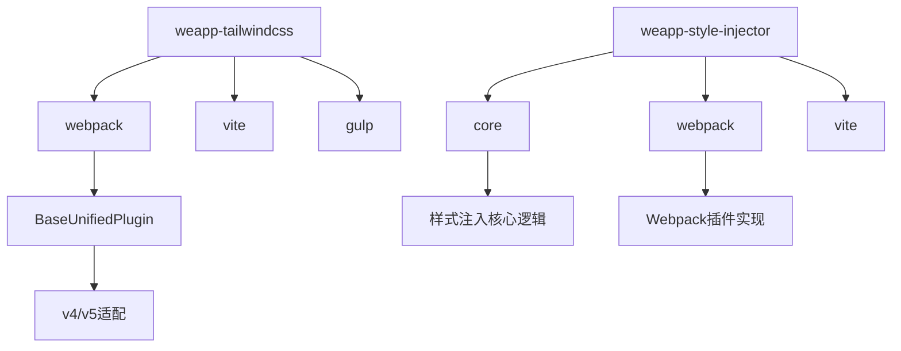
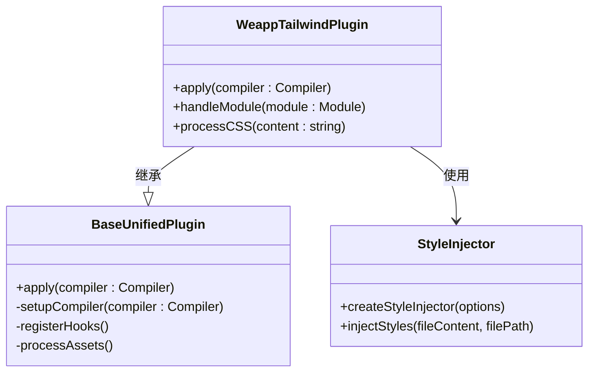
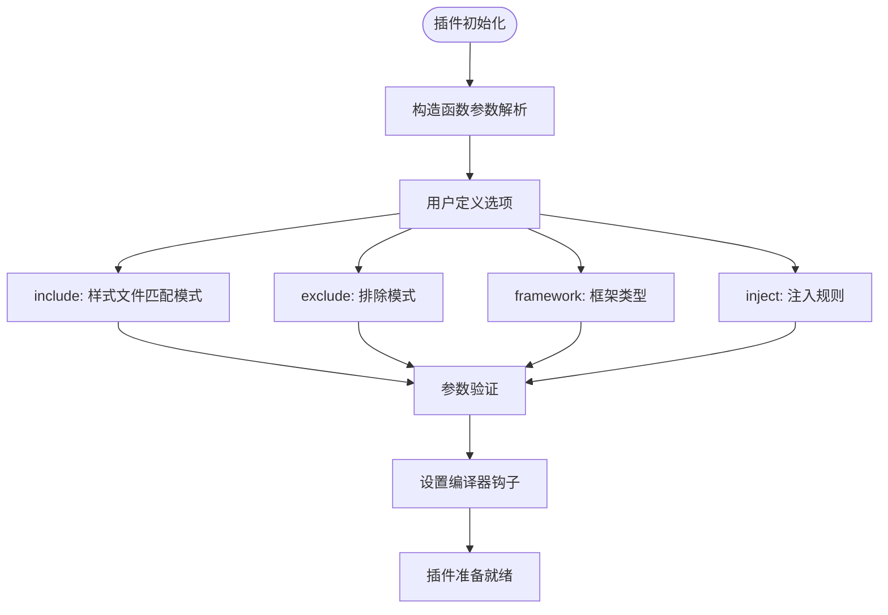
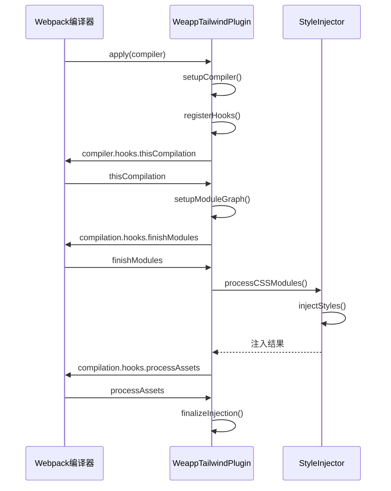
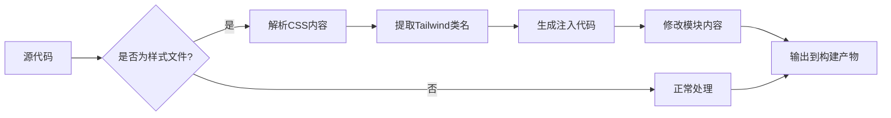
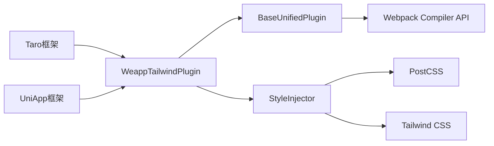

# Webpack集成

<cite>
**本文档中引用的文件**
- [webpack.ts](file://packages/weapp-tailwindcss/src/webpack.ts)
- [index.ts](file://packages/weapp-tailwindcss/src/index.ts)
- [core.ts](file://packages/weapp-style-injector/src/core.ts)
- [webpack.ts](file://packages/weapp-style-injector/src/webpack.ts)
- [v5.ts](file://packages/weapp-tailwindcss/src/bundlers/webpack/BaseUnifiedPlugin/v5.ts)
- [index.ts](file://packages/weapp-tailwindcss/src/bundlers/webpack/index.ts)
</cite>

## 目录
1. [介绍](#介绍)
2. [项目结构](#项目结构)
3. [核心组件](#核心组件)
4. [架构概述](#架构概述)
5. [详细组件分析](#详细组件分析)
6. [依赖分析](#依赖分析)
7. [性能考虑](#性能考虑)
8. [故障排除指南](#故障排除指南)
9. [结论](#结论)

## 介绍
本文档详细介绍了在小程序项目中集成Webpack与Tailwind CSS的实现机制。重点分析了WeappTailwindPlugin插件的实现原理、生命周期钩子的使用方式以及样式注入的执行时机。文档还提供了完整的配置示例和最佳实践建议。

## 项目结构
本项目采用Monorepo结构，核心Webpack集成功能位于`packages/weapp-tailwindcss`和`packages/weapp-style-injector`目录中。`weapp-tailwindcss`包提供了针对不同构建工具（Webpack、Vite、Gulp）的统一接口，而`weapp-style-injector`则实现了核心的样式注入逻辑。

**Diagram sources**
- [index.ts](file://packages/weapp-tailwindcss/src/index.ts#L1-L5)
- [webpack.ts](file://packages/weapp-style-injector/src/webpack.ts#L28-L36)

**Section sources**
- [index.ts](file://packages/weapp-tailwindcss/src/index.ts#L1-L5)
- [webpack.ts](file://packages/weapp-style-injector/src/webpack.ts#L28-L36)

## 核心组件
核心组件包括WeappTailwindPlugin类，它作为Webpack插件集成到构建流程中。该插件负责在编译过程中处理CSS样式注入，支持多种小程序框架（如Taro、UniApp）的特定需求。

**Section sources**
- [webpack.ts](file://packages/weapp-tailwindcss/src/webpack.ts#L1-L3)
- [index.ts](file://packages/weapp-tailwindcss/src/bundlers/webpack/index.ts#L1-L2)

## 架构概述
系统架构采用分层设计，上层提供针对不同构建工具的适配器，底层实现通用的样式处理逻辑。Webpack插件通过继承BaseUnifiedPlugin类来实现版本兼容性，支持Webpack v4和v5。

**Diagram sources**
- [v5.ts](file://packages/weapp-tailwindcss/src/bundlers/webpack/BaseUnifiedPlugin/v5.ts#L1-L50)
- [core.ts](file://packages/weapp-style-injector/src/core.ts#L1-L20)

## 详细组件分析

### WeappTailwindPlugin分析
WeappTailwindPlugin是核心的Webpack插件实现，负责在构建过程中处理Tailwind CSS的集成。

#### 构造函数参数
插件接受用户定义的选项，包括样式匹配模式、注入规则和框架特定配置。

**Diagram sources**
- [core.ts](file://packages/weapp-style-injector/src/core.ts#L6-L12)
- [webpack.ts](file://packages/weapp-style-injector/src/webpack.ts#L28-L31)

#### 应用生命周期
插件通过Webpack的生命周期钩子在不同阶段执行相应操作。

**Diagram sources**
- [v5.ts](file://packages/weapp-tailwindcss/src/bundlers/webpack/BaseUnifiedPlugin/v5.ts#L15-L45)
- [core.ts](file://packages/weapp-style-injector/src/core.ts#L2-L5)

### 样式注入机制
详细说明样式注入的执行时机和资源处理流程。

**Diagram sources**
- [core.ts](file://packages/weapp-style-injector/src/core.ts#L2-L20)
- [webpack.ts](file://packages/weapp-style-injector/src/webpack.ts#L28-L36)

## 依赖分析
分析核心组件之间的依赖关系和外部依赖。

**Diagram sources**
- [index.ts](file://packages/weapp-tailwindcss/src/bundlers/webpack/index.ts#L1-L2)
- [webpack.ts](file://packages/weapp-style-injector/src/webpack.ts#L28-L36)

**Section sources**
- [package.json](file://packages/weapp-tailwindcss/package.json#L1-L20)
- [package.json](file://packages/weapp-style-injector/package.json#L1-L20)

## 性能考虑
插件设计考虑了性能优化，包括缓存机制、增量构建支持和资源预处理。

**Section sources**
- [shared/cache.ts](file://packages/weapp-tailwindcss/src/bundlers/shared/cache.ts#L1-L30)
- [core.ts](file://packages/weapp-style-injector/src/core.ts#L1-L50)

## 故障排除指南
常见问题及解决方案，包括配置错误、样式未注入和构建性能问题。

**Section sources**
- [v5.ts](file://packages/weapp-tailwindcss/src/bundlers/webpack/BaseUnifiedPlugin/v5.ts#L1-L50)
- [core.ts](file://packages/weapp-style-injector/src/core.ts#L1-L50)

## 结论
WeappTailwindPlugin提供了一套完整的Webpack集成方案，通过合理的架构设计和生命周期管理，实现了高效的小程序样式处理。开发者可以根据具体需求进行配置和扩展。