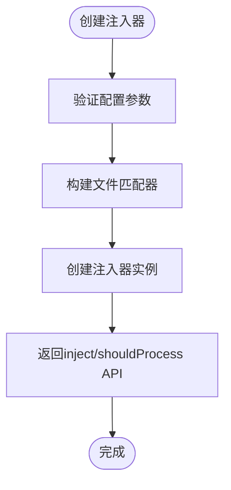

# 样式注入器API

<cite>
**本文档中引用的文件**  
- [core.ts](file://packages/weapp-style-injector/src/core.ts)
- [vite.ts](file://packages/weapp-style-injector/src/vite.ts)
- [webpack.ts](file://packages/weapp-style-injector/src/webpack.ts)
- [uni-app.ts](file://packages/weapp-style-injector/src/uni-app.ts)
- [taro.ts](file://packages/weapp-style-injector/src/taro.ts)
- [utils.ts](file://packages/weapp-style-injector/src/utils.ts)
</cite>

## 目录
1. [简介](#简介)
2. [核心功能](#核心功能)
3. [注入生命周期与执行时机](#注入生命周期与执行时机)
4. [配置选项详解](#配置选项详解)
5. [构建工具集成](#构建工具集成)
6. [错误处理策略](#错误处理策略)
7. [实际应用示例](#实际应用示例)
8. [性能优化建议](#性能优化建议)

## 简介
样式注入器API是一个专为小程序和跨平台框架设计的样式管理工具，旨在自动化处理样式文件之间的导入关系。该API支持多种构建工具（如Vite、Webpack）和开发框架（如Taro、uni-app），通过智能分析项目结构和配置文件，自动在目标样式文件中注入必要的`@import`语句，确保样式正确继承和作用域隔离。

**本文档中引用的文件**  
- [core.ts](file://packages/weapp-style-injector/src/core.ts)
- [vite.ts](file://packages/weapp-style-injector/src/vite.ts)

## 核心功能

### injectStyles函数
`injectStyles`功能通过`createStyleInjector`函数实现，负责创建样式注入器实例。该函数接收配置选项并返回一个包含`inject`方法的对象，用于执行实际的样式注入操作。



**图示来源**  
- [core.ts](file://packages/weapp-style-injector/src/core.ts#L69-L155)

### transform与process机制
样式注入器通过`transform`钩子在构建过程中处理样式文件。`process`逻辑在`generateBundle`阶段执行，遍历所有资源文件并应用注入规则。


**图示来源**  
- [vite.ts](file://packages/weapp-style-injector/src/vite.ts#L35-L57)
- [webpack.ts](file://packages/weapp-style-injector/src/webpack.ts#L61-L114)

**本节来源**  
- [core.ts](file://packages/weapp-style-injector/src/core.ts#L115-L148)
- [vite.ts](file://packages/weapp-style-injector/src/vite.ts#L31-L59)
- [webpack.ts](file://packages/weapp-style-injector/src/webpack.ts#L36-L118)

## 注入生命周期与执行时机

### Vite构建流程
在Vite构建中，样式注入器作为插件运行，其执行时机严格遵循Vite的构建生命周期。


**图示来源**  
- [vite.ts](file://packages/weapp-style-injector/src/vite.ts#L31-L59)

### Webpack构建流程
在Webpack中，样式注入器通过`thisCompilation`钩子注册资产处理逻辑，兼容不同版本的Webpack。


**图示来源**  
- [webpack.ts](file://packages/weapp-style-injector/src/webpack.ts#L61-L114)

**本节来源**  
- [vite.ts](file://packages/weapp-style-injector/src/vite.ts#L31-L59)
- [webpack.ts](file://packages/weapp-style-injector/src/webpack.ts#L36-L118)

## 配置选项详解

### 基础配置选项
样式注入器提供了一系列配置选项来控制注入行为：

| 配置项 | 类型 | 默认值 | 描述 |
|-------|------|-------|------|
| include | 字符串或字符串数组 | ['**/*.wxss', '**/*.css'] | 包含的文件模式 |
| exclude | 字符串或字符串数组 | 无 | 排除的文件模式 |
| imports | 字符串数组 | 无 | 全局导入的样式文件 |
| perFileImports | 函数 | 无 | 按文件定制导入规则 |
| dedupe | 布尔值 | true | 是否去重导入语句 |

**本节来源**  
- [core.ts](file://packages/weapp-style-injector/src/core.ts#L9-L15)

### 作用域控制配置
针对不同框架提供了特定的作用域控制配置：

#### uni-app配置
```typescript
interface UniAppSubPackageConfig {
  pagesJsonPath: string
  indexFileName?: string | string[]
  preprocess?: boolean
}

interface UniAppManualStyleConfig {
  style: string
  scope: string | string[]
  output?: string
  preprocess?: boolean
}
```

#### Taro配置
```typescript
interface TaroSubPackageConfig {
  appConfigPath: string
  indexFileNames?: string | string[]
}
```

**本节来源**  
- [uni-app.ts](file://packages/weapp-style-injector/src/uni-app.ts#L13-L24)
- [taro.ts](file://packages/weapp-style-injector/src/taro.ts#L14-L17)

## 构建工具集成

### Vite集成
通过`weappStyleInjector`函数将样式注入器集成到Vite配置中：


**图示来源**  
- [vite.ts](file://packages/weapp-style-injector/src/vite.ts#L13-L61)

### Webpack集成
通过`weappStyleInjectorWebpack`函数或`WeappStyleInjectorWebpackPlugin`类集成：


**图示来源**  
- [webpack.ts](file://packages/weapp-style-injector/src/webpack.ts#L36-L126)

**本节来源**  
- [vite.ts](file://packages/weapp-style-injector/src/vite.ts#L13-L61)
- [webpack.ts](file://packages/weapp-style-injector/src/webpack.ts#L36-L126)

## 错误处理策略

### 文件读取错误处理
在处理`pages.json`或`app.config`等配置文件时，采用安全的读取方式：


**图示来源**  
- [uni-app.ts](file://packages/weapp-style-injector/src/uni-app.ts#L89-L97)
- [taro.ts](file://packages/weapp-style-injector/src/taro.ts#L38-L91)

### 构建过程错误处理
在预处理CSS时，对可能的错误进行捕获和包装：


**图示来源**  
- [vite/uni-app.ts](file://packages/weapp-style-injector/src/vite/uni-app.ts#L169-L174)

**本节来源**  
- [uni-app.ts](file://packages/weapp-style-injector/src/uni-app.ts#L89-L97)
- [taro.ts](file://packages/weapp-style-injector/src/taro.ts#L38-L91)
- [vite/uni-app.ts](file://packages/weapp-style-injector/src/vite/uni-app.ts#L169-L174)

## 实际应用示例

### 基本使用
```typescript
import { weappStyleInjector } from 'weapp-style-injector'

export default {
  plugins: [
    weappStyleInjector({
      imports: ['@/styles/tailwind.css'],
      include: ['**/*.wxss', '**/*.css']
    })
  ]
}
```

### Taro框架集成
```typescript
import { StyleInjector } from 'weapp-style-injector/vite/taro'

export default {
  plugins: [
    StyleInjector({
      appConfigPath: 'src/app.config.ts',
      imports: ['@/styles/tailwind.css']
    })
  ]
}
```

### uni-app框架集成
```typescript
import { StyleInjector } from 'weapp-style-injector/vite/uni-app'

export default {
  plugins: [
    StyleInjector({
      pagesJsonPath: 'src/pages.json',
      styleScopes: [
        {
          style: '@/styles/global.scss',
          scope: 'sub-pages'
        }
      ]
    })
  ]
}
```

**本节来源**  
- [vite/taro.ts](file://packages/weapp-style-injector/src/vite/taro.ts#L29-L59)
- [vite/uni-app.ts](file://packages/weapp-style-injector/src/vite/uni-app.ts#L203-L249)

## 性能优化建议

### 缓存机制
样式注入器实现了多层缓存机制以提高性能：


**图示来源**  
- [core.ts](file://packages/weapp-style-injector/src/core.ts#L75-L113)

### 批量处理优化
在处理大量文件时，建议合理配置include/exclude模式以减少不必要的处理：

```typescript
// 推荐：精确指定需要处理的文件
weappStyleInjector({
  include: ['src/pages/**/*.wxss', 'src/components/**/*.wxss']
})

// 避免：过于宽泛的模式可能导致性能问题
weappStyleInjector({
  include: ['**/*.wxss']
})
```

**本节来源**  
- [core.ts](file://packages/weapp-style-injector/src/core.ts#L77-L85)
- [utils.ts](file://packages/weapp-style-injector/src/utils.ts#L10-L20)