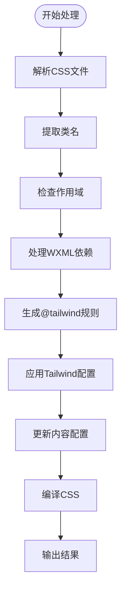
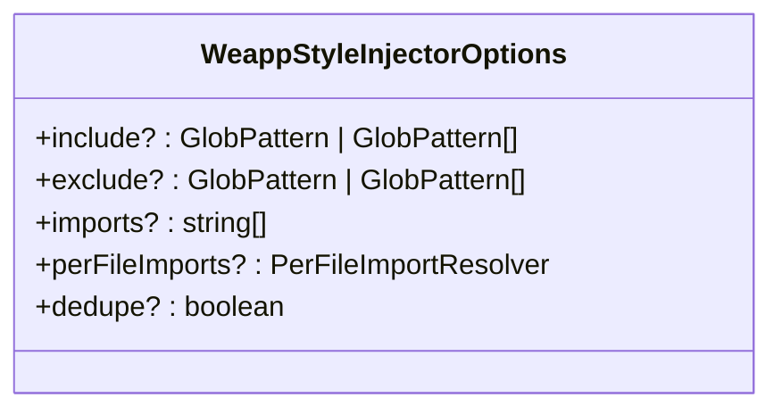
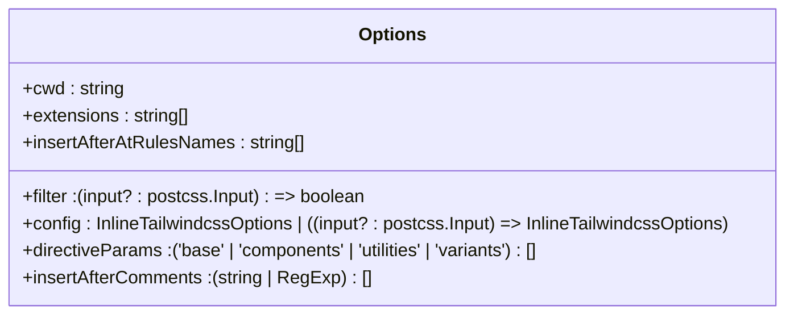
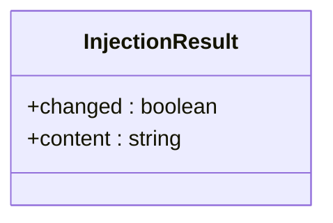
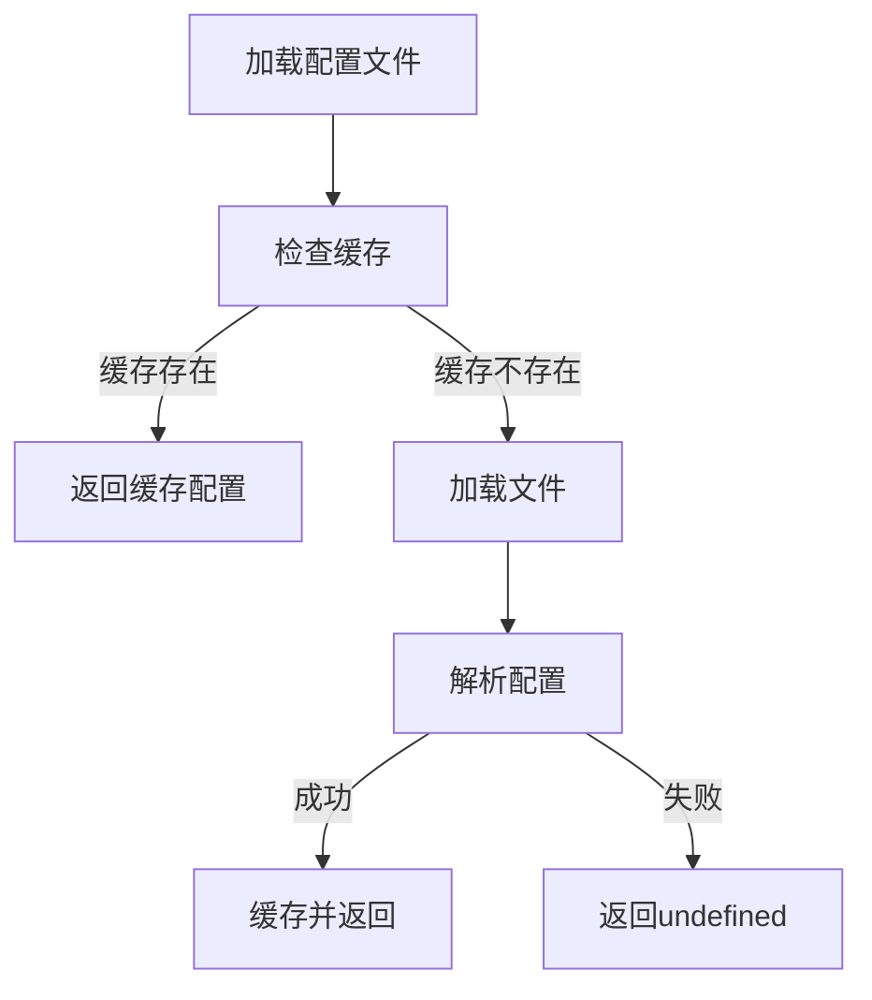

# 核心API

<cite>
**本文档中引用的文件**  
- [core.ts](file://packages/weapp-style-injector/src/core.ts)
- [postcss.ts](file://packages/tailwindcss-injector/src/postcss.ts)
- [config.ts](file://packages/tailwindcss-injector/src/config.ts)
- [types.ts](file://packages/tailwindcss-injector/src/types.ts)
- [wxml.ts](file://packages/tailwindcss-injector/src/wxml.ts)
- [utils.ts](file://packages/tailwindcss-injector/src/utils.ts)
- [constants.ts](file://packages/tailwindcss-injector/src/constants.ts)
</cite>

## 目录
1. [简介](#简介)
2. [核心函数接口定义](#核心函数接口定义)
3. [样式处理管道工作流程](#样式处理管道工作流程)
4. [类型定义说明](#类型定义说明)
5. [代码示例与集成方式](#代码示例与集成方式)
6. [异常处理机制](#异常处理机制)

## 简介
本API文档详细说明了WeApp TailwindCSS项目中样式注入器的核心功能，包括`injectStyles`、`transform`、`process`等核心函数的接口定义和实现原理。文档涵盖了样式处理管道的内部工作流程，包括CSS解析、类名提取、作用域处理和结果生成等关键环节。

## 核心函数接口定义

### createStyleInjector 函数
该函数用于创建样式注入器实例，接收配置选项并返回一个包含`shouldProcess`和`inject`方法的对象。

**参数类型**:
- `options`: `WeappStyleInjectorOptions` 类型，包含include、exclude、imports、perFileImports和dedupe等可选配置项

**返回值**:
- `StyleInjector` 接口对象，包含以下方法：
  - `hasImports`: 布尔值，表示是否有导入语句
  - `shouldProcess(fileName: string)`: 判断指定文件是否需要处理
  - `inject(fileName: string, source: string | Uint8Array)`: 执行样式注入，返回注入结果

**Section sources**
- [core.ts](file://packages/weapp-style-injector/src/core.ts#L69-L156)

### postcss插件处理函数
位于`postcss.ts`文件中的插件创建函数，负责处理TailwindCSS的注入和转换。

**参数类型**:
- `options`: 部分`Options`类型，包含cwd、filter、config、directiveParams等配置

**返回值**:
- PostCSS插件对象，包含`postcssPlugin`属性和插件处理逻辑

**Section sources**
- [postcss.ts](file://packages/tailwindcss-injector/src/postcss.ts#L60-L158)

## 样式处理管道工作流程



**Diagram sources**
- [postcss.ts](file://packages/tailwindcss-injector/src/postcss.ts#L70-L149)
- [wxml.ts](file://packages/tailwindcss-injector/src/wxml.ts#L34-L81)

### CSS解析与类名提取
样式处理管道首先解析CSS文件，通过PostCSS遍历AST节点，识别并提取所有类名。系统会检查文件是否包含`@tailwind`指令，如果没有则在适当位置插入。

### 作用域处理
系统通过`getDepFiles`函数分析WXML文件的依赖关系，递归查找所有相关的WXML文件，并基于文件路径生成相应的作用域。使用`hashMap`和`depsMap`缓存机制来提高性能。

### 结果生成
最终处理结果通过`postcss.process()`方法生成，将TailwindCSS配置应用到原始CSS上，并返回编译后的CSS内容。

**Section sources**
- [postcss.ts](file://packages/tailwindcss-injector/src/postcss.ts#L70-L149)
- [wxml.ts](file://packages/tailwindcss-injector/src/wxml.ts#L83-L114)

## 类型定义说明

### WeappStyleInjectorOptions 接口
定义样式注入器的配置选项：



**Diagram sources**
- [core.ts](file://packages/weapp-style-injector/src/core.ts#L9-L15)

### Options 接口
定义TailwindCSS注入器的主要配置：



**Diagram sources**
- [types.ts](file://packages/tailwindcss-injector/src/types.ts#L6-L15)

### InjectionResult 接口
定义样式注入的结果：



**Diagram sources**
- [core.ts](file://packages/weapp-style-injector/src/core.ts#L17-L20)

## 代码示例与集成方式

### 基本使用示例
```typescript
import { createStyleInjector } from '@weapp-tailwindcss/weapp-style-injector'

const injector = createStyleInjector({
  imports: ['shared/common.wxss'],
  include: ['**/*.wxss', '**/*.css'],
  exclude: ['node_modules/**']
})

// 处理文件
const result = injector.inject('pages/index.wxss', '.btn { color: red; }')
```

### Vite集成方式
```typescript
import { weappStyleInjector } from '@weapp-tailwindcss/weapp-style-injector/vite'

export default {
  plugins: [
    weappStyleInjector({
      imports: ['@/styles/tailwind.wxss'],
      uniAppSubPackages: {
        pagesJsonPath: 'src/pages.json'
      }
    })
  ]
}
```

### Webpack集成方式
```typescript
import { weappStyleInjectorWebpack } from '@weapp-tailwindcss/weapp-style-injector/webpack'

module.exports = {
  plugins: [
    weappStyleInjectorWebpack({
      imports: ['@/styles/tailwind.wxss'],
      dedupe: true
    })
  ]
}
```

**Section sources**
- [core.ts](file://packages/weapp-style-injector/src/core.ts#L69-L156)
- [vite/index.ts](file://packages/weapp-style-injector/src/vite/index.ts)
- [webpack/index.ts](file://packages/weapp-style-injector/src/webpack/index.ts)

## 异常处理机制

### 配置加载异常处理
系统在加载TailwindCSS配置时使用缓存机制，避免重复加载。如果配置文件不存在或格式错误，系统会返回undefined并继续处理。



**Diagram sources**
- [postcss.ts](file://packages/tailwindcss-injector/src/postcss.ts#L14-L25)

### 文件处理异常处理
在处理文件时，系统会检查文件是否存在，如果不存在则跳过处理。对于编码问题，系统会使用Buffer进行安全转换。

**Section sources**
- [wxml.ts](file://packages/tailwindcss-injector/src/wxml.ts#L84-L114)
- [core.ts](file://packages/weapp-style-injector/src/core.ts#L60-L67)