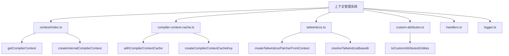
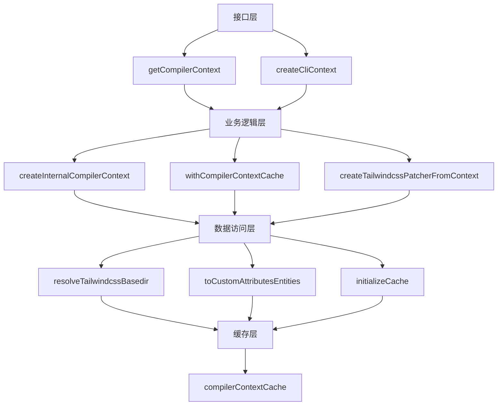
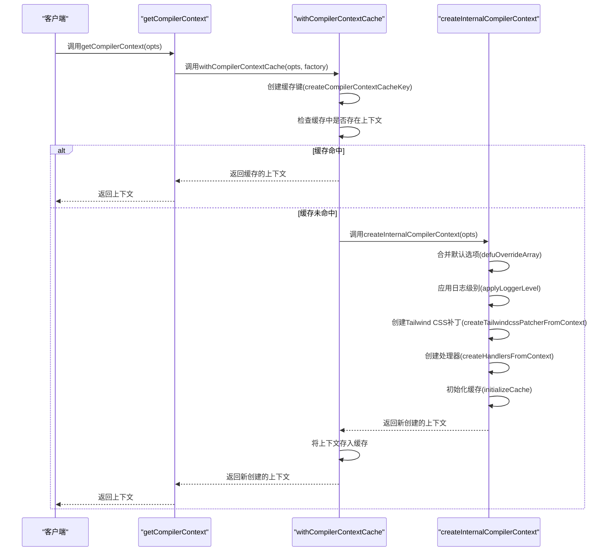
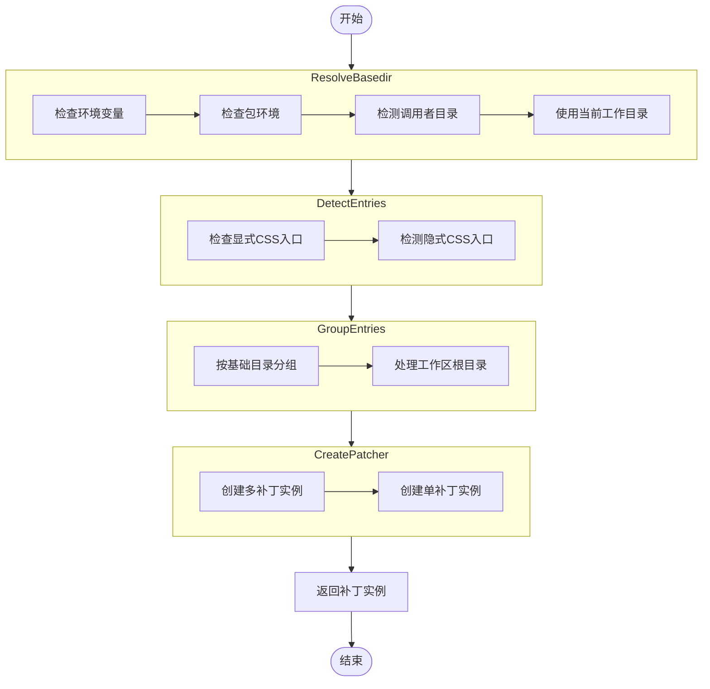

# 上下文管理

<cite>
**本文档引用的文件**
- [context.ts](file://packages/weapp-tailwindcss/src/cli/context.ts)
- [compiler-context-cache.ts](file://packages/weapp-tailwindcss/src/context/compiler-context-cache.ts)
- [index.ts](file://packages/weapp-tailwindcss/src/context/index.ts)
- [types/index.ts](file://packages/weapp-tailwindcss/src/types/index.ts)
- [tailwindcss.ts](file://packages/weapp-tailwindcss/src/context/tailwindcss.ts)
- [custom-attributes.ts](file://packages/weapp-tailwindcss/src/context/custom-attributes.ts)
- [cache/index.ts](file://packages/weapp-tailwindcss/src/cache/index.ts)
</cite>

## 目录
1. [简介](#简介)
2. [项目结构](#项目结构)
3. [核心组件](#核心组件)
4. [架构概述](#架构概述)
5. [详细组件分析](#详细组件分析)
6. [依赖分析](#依赖分析)
7. [性能考虑](#性能考虑)
8. [故障排除指南](#故障排除指南)
9. [结论](#结论)

## 简介
本文档详细介绍了weapp-tailwindcss项目的上下文管理系统，重点阐述了`createContext`函数的实现细节和使用模式。文档深入解析了`Context`类的属性和方法，包括配置解析、缓存管理、插件注册等核心功能。通过TypeScript类型定义，解释了`ContextOptions`、`ContextState`等核心数据结构的设计和用途。提供了实际代码示例，展示如何初始化上下文、获取配置、管理缓存等操作。文档涵盖了上下文生命周期管理、错误处理机制以及与其他组件的协作关系，并说明了在不同构建环境下的上下文管理策略。

## 项目结构
weapp-tailwindcss项目的上下文管理系统主要位于`packages/weapp-tailwindcss/src/context`目录下，包含多个模块文件，分别负责不同的功能。系统通过模块化设计，实现了高内聚低耦合的架构，便于维护和扩展。



**图示来源**
- [index.ts](file://packages/weapp-tailwindcss/src/context/index.ts)
- [compiler-context-cache.ts](file://packages/weapp-tailwindcss/src/context/compiler-context-cache.ts)
- [tailwindcss.ts](file://packages/weapp-tailwindcss/src/context/tailwindcss.ts)
- [custom-attributes.ts](file://packages/weapp-tailwindcss/src/context/custom-attributes.ts)

**章节来源**
- [index.ts](file://packages/weapp-tailwindcss/src/context/index.ts)
- [compiler-context-cache.ts](file://packages/weapp-tailwindcss/src/context/compiler-context-cache.ts)

## 核心组件
上下文管理系统的核心组件包括`getCompilerContext`函数、`withCompilerContextCache`函数、`createTailwindcssPatcherFromContext`函数等。这些组件共同协作，实现了上下文的创建、缓存和管理。

**章节来源**
- [index.ts](file://packages/weapp-tailwindcss/src/context/index.ts)
- [compiler-context-cache.ts](file://packages/weapp-tailwindcss/src/context/compiler-context-cache.ts)
- [tailwindcss.ts](file://packages/weapp-tailwindcss/src/context/tailwindcss.ts)

## 架构概述
上下文管理系统的架构设计遵循了模块化和分层的原则，通过清晰的职责划分，实现了高内聚低耦合的架构。系统主要由以下几个层次组成：接口层、业务逻辑层、数据访问层和缓存层。



**图示来源**
- [index.ts](file://packages/weapp-tailwindcss/src/context/index.ts)
- [compiler-context-cache.ts](file://packages/weapp-tailwindcss/src/context/compiler-context-cache.ts)
- [tailwindcss.ts](file://packages/weapp-tailwindcss/src/context/tailwindcss.ts)
- [custom-attributes.ts](file://packages/weapp-tailwindcss/src/context/custom-attributes.ts)
- [cache/index.ts](file://packages/weapp-tailwindcss/src/cache/index.ts)

## 详细组件分析
### getCompilerContext 函数分析
`getCompilerContext`函数是上下文管理系统的入口点，负责创建和返回编译器上下文。该函数通过`withCompilerContextCache`函数实现了上下文的缓存机制，避免了重复创建相同的上下文实例。

#### 函数调用流程


**图示来源**
- [index.ts](file://packages/weapp-tailwindcss/src/context/index.ts)
- [compiler-context-cache.ts](file://packages/weapp-tailwindcss/src/context/compiler-context-cache.ts)

**章节来源**
- [index.ts](file://packages/weapp-tailwindcss/src/context/index.ts)
- [compiler-context-cache.ts](file://packages/weapp-tailwindcss/src/context/compiler-context-cache.ts)

### createTailwindcssPatcherFromContext 函数分析
`createTailwindcssPatcherFromContext`函数负责根据上下文创建Tailwind CSS补丁。该函数通过解析上下文中的配置，动态生成相应的补丁实例。

#### 配置解析流程


**图示来源**
- [tailwindcss.ts](file://packages/weapp-tailwindcss/src/context/tailwindcss.ts)

**章节来源**
- [tailwindcss.ts](file://packages/weapp-tailwindcss/src/context/tailwindcss.ts)

### ContextOptions 和 ContextState 数据结构分析
`ContextOptions`和`ContextState`是上下文管理系统中的核心数据结构，定义了上下文的配置选项和状态信息。

#### ContextOptions 结构
| 属性 | 类型 | 描述 |
|------|------|------|
| cssEntries | string[] | CSS入口文件列表 |
| cssChildCombinatorReplaceValue | string[] | 子选择器替换值 |
| customAttributes | ICustomAttributes | 自定义属性映射 |
| logLevel | string | 日志级别 |
| cache | boolean | 是否启用缓存 |
| tailwindcssBasedir | string | Tailwind CSS基础目录 |
| tailwindcssPatcherOptions | TailwindcssPatchOptions | Tailwind CSS补丁选项 |

#### ContextState 结构
| 属性 | 类型 | 描述 |
|------|------|------|
| styleHandler | function | 样式处理器 |
| jsHandler | function | JavaScript处理器 |
| templateHandler | function | 模板处理器 |
| twPatcher | TailwindcssPatcherLike | Tailwind CSS补丁实例 |
| refreshTailwindcssPatcher | function | 刷新Tailwind CSS补丁函数 |
| cache | ICreateCacheReturnType | 缓存实例 |

**章节来源**
- [types/index.ts](file://packages/weapp-tailwindcss/src/types/index.ts)

## 依赖分析
上下文管理系统依赖于多个外部模块和内部模块，通过清晰的依赖关系，实现了功能的解耦和复用。

```mermaid
graph TD
A[上下文管理系统] --> B[@weapp-tailwindcss/logger]
A --> C[tailwindcss-patch]
A --> D[@babel/parser]
A --> E[postcss]
A --> F[lru-cache]
A --> G[node:fs/promises]
A --> H[node:path]
A --> I[node:process]
A --> J[node:url]
B --> K[日志记录]
C --> L[Tailwind CSS补丁]
D --> M[JavaScript解析]
E --> N[CSS处理]
F --> O[缓存管理]
G --> P[文件系统操作]
H --> Q[路径处理]
I --> R[进程管理]
J --> S[URL处理]
```

**图示来源**
- [index.ts](file://packages/weapp-tailwindcss/src/context/index.ts)
- [tailwindcss.ts](file://packages/weapp-tailwindcss/src/context/tailwindcss.ts)
- [cache/index.ts](file://packages/weapp-tailwindcss/src/cache/index.ts)

**章节来源**
- [index.ts](file://packages/weapp-tailwindcss/src/context/index.ts)
- [tailwindcss.ts](file://packages/weapp-tailwindcss/src/context/tailwindcss.ts)
- [cache/index.ts](file://packages/weapp-tailwindcss/src/cache/index.ts)

## 性能考虑
上下文管理系统通过多种机制优化性能，包括缓存机制、懒加载和高效的配置解析。

### 缓存机制
系统使用`compilerContextCache`全局缓存来存储已创建的上下文实例。通过`createCompilerContextCacheKey`函数生成唯一的缓存键，确保相同配置的上下文只会被创建一次。

### 懒加载
系统采用懒加载策略，只有在需要时才创建和初始化相关组件。例如，`styleHandler`、`jsHandler`和`templateHandler`都是在`createInternalCompilerContext`函数中按需创建的。

### 高效配置解析
系统通过`defuOverrideArray`函数高效地合并默认选项和用户选项，避免了不必要的对象复制和属性遍历。

## 故障排除指南
### 缓存问题
如果遇到缓存相关的问题，可以尝试清除缓存。系统提供了`clearTailwindcssPatcherCache`函数来清除Tailwind CSS补丁的缓存。

### 配置解析问题
如果配置解析出现问题，可以检查`tailwindcssBasedir`的设置是否正确。系统会按照以下顺序解析`tailwindcssBasedir`：
1. 检查环境变量
2. 检查包环境
3. 检测调用者目录
4. 使用当前工作目录

### 依赖问题
如果遇到依赖相关的问题，可以检查`package.json`文件中的依赖项是否正确安装。特别是`tailwindcss-patch`和`@weapp-tailwindcss/logger`等关键依赖。

**章节来源**
- [index.ts](file://packages/weapp-tailwindcss/src/context/index.ts)
- [tailwindcss.ts](file://packages/weapp-tailwindcss/src/context/tailwindcss.ts)
- [cache/index.ts](file://packages/weapp-tailwindcss/src/cache/index.ts)

## 结论
weapp-tailwindcss的上下文管理系统通过模块化设计和高效的缓存机制，实现了高性能的上下文管理。系统提供了清晰的API和灵活的配置选项，能够满足不同场景下的需求。通过深入理解系统的架构和实现细节，开发者可以更好地利用该系统，提高开发效率和应用性能。