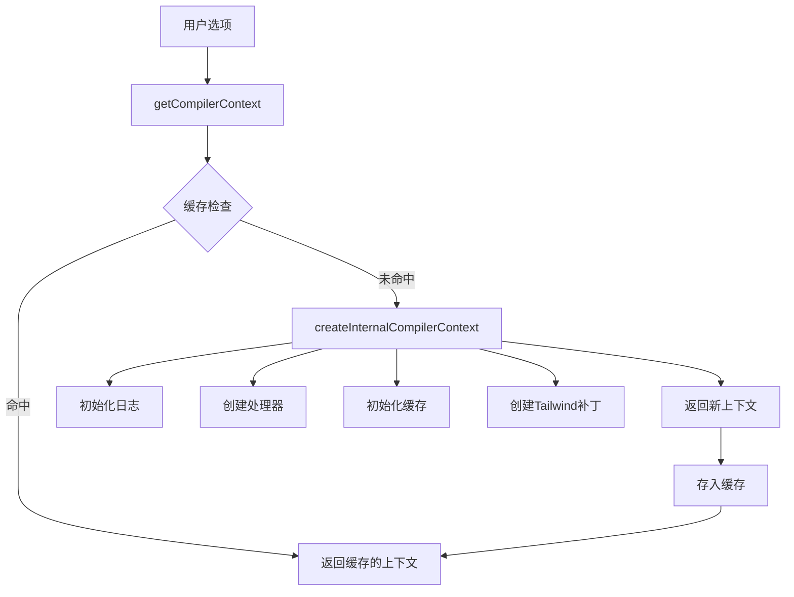
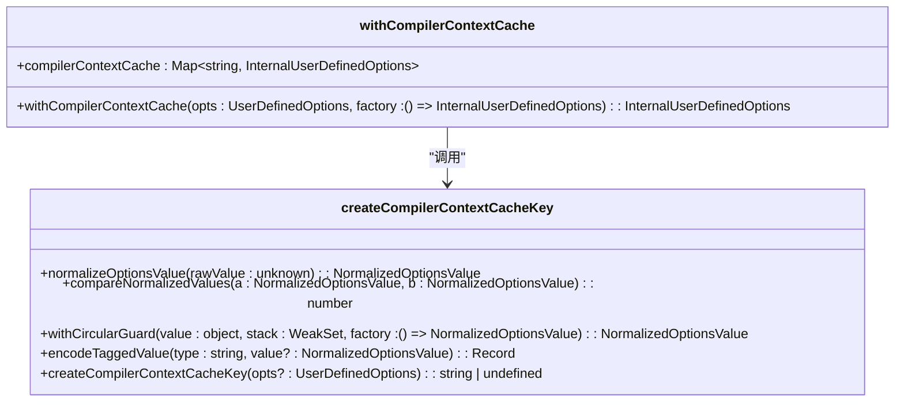
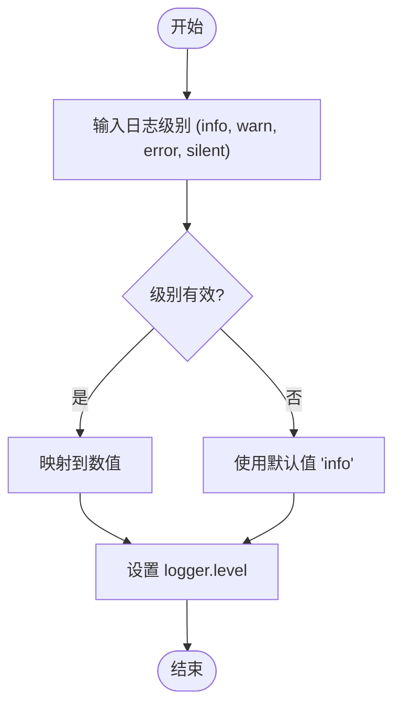

# 状态管理

<cite>
**本文档中引用的文件**  
- [index.ts](file://packages/weapp-tailwindcss/src/context/index.ts)
- [compiler-context-cache.ts](file://packages/weapp-tailwindcss/src/context/compiler-context-cache.ts)
- [logger.ts](file://packages/weapp-tailwindcss/src/context/logger.ts)
- [workspace.ts](file://packages/weapp-tailwindcss/src/context/workspace.ts)
- [index.ts](file://packages/weapp-tailwindcss/src/cache/index.ts)
- [counter.uts](file://templates/uni-app-x-hbuilderx/stores/counter.uts)
- [counter.ts](file://templates/uni-app-vite-vue3-tailwind-vscode-template/src/stores/counter.ts)
- [index.ts](file://tailwindcss-weapp/src/stores/index.ts)
- [documentation.ts](file://tailwindcss-weapp/src/stores/documentation.ts)
</cite>

## 目录
1. [简介](#简介)
2. [项目结构](#项目结构)
3. [核心组件](#核心组件)
4. [架构概述](#架构概述)
5. [详细组件分析](#详细组件分析)
6. [依赖分析](#依赖分析)
7. [性能考虑](#性能考虑)
8. [故障排除指南](#故障排除指南)
9. [结论](#结论)

## 简介
本文档深入解析 weapp-tailwindcss 项目的上下文状态管理系统。该系统负责管理编译过程中的配置、缓存、日志级别和运行时状态，确保构建过程的高效性与一致性。文档将详细阐述状态的初始化、更新、同步机制，以及状态持久化和共享策略，并结合实际代码示例说明其在复杂应用中的最佳实践。

## 项目结构
weapp-tailwindcss 的状态管理主要分布在 `packages/weapp-tailwindcss/src/context` 和 `src/cache` 目录下，同时在应用模板中通过 Pinia 实现了前端组件的状态管理。`context` 目录下的文件定义了编译器上下文的创建、缓存和生命周期管理，而 `cache` 目录则提供了底层的缓存机制。

```mermaid
graph TB
subgraph "状态管理"
Context[context/]
Cache[cache/]
Stores[stores/]
end
Context --> Cache : "依赖"
Stores --> Pinia[Pinia] : "使用"
Context --> Logger[logger.ts] : "配置日志"
Context --> Workspace[workspace.ts] : "查找项目根目录"
Context --> CustomAttributes[custom-attributes.ts] : "处理自定义属性"
```

**Diagram sources**
- [index.ts](file://packages/weapp-tailwindcss/src/context/index.ts)
- [workspace.ts](file://packages/weapp-tailwindcss/src/context/workspace.ts)
- [index.ts](file://packages/weapp-tailwindcss/src/cache/index.ts)

**Section sources**
- [index.ts](file://packages/weapp-tailwindcss/src/context/index.ts)
- [compiler-context-cache.ts](file://packages/weapp-tailwindcss/src/context/compiler-context-cache.ts)

## 核心组件
系统的核心是 `getCompilerContext` 函数，它负责创建和管理编译器的内部状态。该函数利用 `withCompilerContextCache` 实现了上下文的缓存，避免了重复创建和计算。`createInternalCompilerContext` 函数则负责初始化所有状态，包括日志级别、处理器（handlers）、缓存实例和 Tailwind CSS 补丁。

**Section sources**
- [index.ts](file://packages/weapp-tailwindcss/src/context/index.ts#L130-L132)
- [compiler-context-cache.ts](file://packages/weapp-tailwindcss/src/context/compiler-context-cache.ts#L191-L208)

## 架构概述
整个状态管理系统采用分层设计。最上层是用户定义的选项（`UserDefinedOptions`），通过 `getCompilerContext` 转换为内部选项（`InternalUserDefinedOptions`）。中间层是各种上下文管理器，如 `compiler-context-cache` 负责缓存整个编译上下文，`logger` 负责管理日志级别。最底层是 `cache` 模块，提供基于 LRU 的键值对存储，用于缓存文件处理结果。



**Diagram sources**
- [index.ts](file://packages/weapp-tailwindcss/src/context/index.ts#L64-L132)
- [compiler-context-cache.ts](file://packages/weapp-tailwindcss/src/context/compiler-context-cache.ts#L191-L208)

## 详细组件分析

### 编译上下文缓存分析
`compiler-context-cache` 模块是状态一致性的关键。它通过 `createCompilerContextCacheKey` 函数为用户选项生成一个唯一的 MD5 哈希值作为缓存键。该函数会深度遍历并规范化所有选项，包括处理函数、正则表达式、Set、Map 等复杂类型，确保相同的配置总是生成相同的键。



**Diagram sources**
- [compiler-context-cache.ts](file://packages/weapp-tailwindcss/src/context/compiler-context-cache.ts#L179-L209)

**Section sources**
- [compiler-context-cache.ts](file://packages/weapp-tailwindcss/src/context/compiler-context-cache.ts#L1-L209)

### 日志级别管理分析
`logger` 模块实现了简单的日志级别状态管理。它定义了一个 `loggerLevelMap` 映射表，将字符串级别的名称（如 'info', 'warn'）映射到具体的数值。`applyLoggerLevel` 函数根据用户输入的级别更新全局日志实例的 `level` 属性，从而控制日志的输出。



**Diagram sources**
- [logger.ts](file://packages/weapp-tailwindcss/src/context/logger.ts#L1-L16)

**Section sources**
- [logger.ts](file://packages/weapp-tailwindcss/src/context/logger.ts#L1-L16)

### 应用前端状态管理示例
在 `tailwindcss-weapp` 应用中，使用 Pinia 进行前端状态管理。`useSystemStore` 定义了一个名为 'system' 的 store，其状态包括核心插件列表、系统信息和主题模式。主题模式通过 `uni.setStorageSync` 持久化到本地存储。

```mermaid
classDiagram
class useSystemStore {
+state : { corePlugins, systemInfo, theme, documentationNav }
+getters : { pluginKeys }
+actions : { getPluginsById(id), setTheme(theme) }
}
useSystemStore --> UniStorage : "使用 uni.setStorageSync"
```

**Diagram sources**
- [index.ts](file://tailwindcss-weapp/src/stores/index.ts#L7-L31)
- [counter.uts](file://templates/uni-app-x-hbuilderx/stores/counter.uts#L1-L11)
- [counter.ts](file://templates/uni-app-vite-vue3-tailwind-vscode-template/src/stores/counter.ts#L1-L12)

**Section sources**
- [index.ts](file://tailwindcss-weapp/src/stores/index.ts#L1-L31)

## 依赖分析
状态管理系统依赖于多个外部包，如 `@weapp-tailwindcss/logger` 用于日志记录，`lru-cache` 用于实现缓存，`pinia` 用于前端状态管理。内部依赖关系清晰，`context` 模块依赖于 `cache` 和 `types` 模块。

```mermaid
graph TD
A[weapp-tailwindcss] --> B[@weapp-tailwindcss/logger]
A --> C[lru-cache]
A --> D[pinia]
A --> E[tailwindcss-core-plugins-extractor]
context[context/] --> cache[cache/]
context --> types[types]
stores[stores/] --> pinia[Pinia]
```

**Diagram sources**
- [package.json](file://packages/weapp-tailwindcss/package.json)
- [index.ts](file://packages/weapp-tailwindcss/src/context/index.ts)

**Section sources**
- [package.json](file://packages/weapp-tailwindcss/package.json)

## 性能考虑
系统的性能优化主要体现在缓存机制上。`compiler-context-cache` 避免了重复解析和初始化配置的开销。`cache` 模块的 `process` 方法实现了基于内容哈希的缓存，只有当文件内容发生变化时才会重新处理，极大地提升了构建速度。LRU 缓存策略确保了内存使用的合理性。

## 故障排除指南
- **状态未更新**：检查 `refreshTailwindcssPatcher` 是否被正确调用，或确认 `clearCache` 选项。
- **缓存未命中**：检查 `rawSource` 或 `hash` 是否正确传递给 `cache.process`。
- **日志级别不生效**：确认 `applyLoggerLevel` 是否在 `createInternalCompilerContext` 中被调用。
- **主题模式不持久**：检查 `uni.setStorageSync` 和 `uni.getStorageSync` 的 key 是否一致。

**Section sources**
- [index.ts](file://packages/weapp-tailwindcss/src/context/index.ts#L104-L116)
- [cache/index.ts](file://packages/weapp-tailwindcss/src/cache/index.ts#L98-L137)
- [logger.ts](file://packages/weapp-tailwindcss/src/context/logger.ts#L13-L15)
- [index.ts](file://tailwindcss-weapp/src/stores/index.ts#L25-L28)

## 结论
weapp-tailwindcss 的状态管理系统设计精巧，通过分层和缓存机制有效管理了编译过程中的各种状态。它不仅保证了构建过程的高效和一致性，还通过 Pinia 为前端应用提供了灵活的状态管理方案。理解其内部机制对于优化构建性能和进行深度定制至关重要。