# 缓存系统

<cite>
**本文档引用的文件**   
- [index.ts](file://packages/weapp-tailwindcss/src/cache/index.ts)
- [md5.ts](file://packages/weapp-tailwindcss/src/cache/md5.ts)
- [cache.ts](file://packages/weapp-tailwindcss/src/bundlers/shared/cache.ts)
- [vite/index.ts](file://packages/weapp-tailwindcss/src/bundlers/vite/index.ts)
- [BaseUnifiedPlugin/v4.ts](file://packages/weapp-tailwindcss/src/bundlers/webpack/BaseUnifiedPlugin/v4.ts)
- [gulp/index.ts](file://packages/weapp-tailwindcss/src/bundlers/gulp/index.ts)
- [cache.test.ts](file://packages/weapp-tailwindcss/test/cache.test.ts)
</cite>

## 目录
1. [引言](#引言)
2. [缓存机制实现原理](#缓存机制实现原理)
3. [缓存键生成策略](#缓存键生成策略)
4. [缓存数据存储结构](#缓存数据存储结构)
5. [缓存失效机制](#缓存失效机制)
6. [Cache类属性与方法详解](#cache类属性与方法详解)
7. [缓存读取、写入与清除操作](#缓存读取写入与清除操作)
8. [实际应用场景示例](#实际应用场景示例)
9. [缓存生命周期管理](#缓存生命周期管理)
10. [内存使用优化策略](#内存使用优化策略)
11. [分布式环境下的缓存处理](#分布式环境下的缓存处理)
12. [性能问题诊断与解决](#性能问题诊断与解决)

## 引言
weapp-tailwindcss的上下文缓存系统旨在通过高效的缓存机制提升小程序开发中的样式处理性能。该系统基于LRU（最近最少使用）算法实现，结合MD5哈希校验来判断资源是否发生变化，从而决定是否复用缓存结果。本文档将深入解析其核心实现原理，并提供详细的使用指南和最佳实践。

## 缓存机制实现原理
weapp-tailwindcss的缓存系统主要由`createCache`函数创建，返回一个包含多个方法的对象，用于管理缓存状态。系统使用两个主要的数据结构：`Map`用于存储哈希值及其变化状态，`LRUCache`用于存储实际的处理结果。

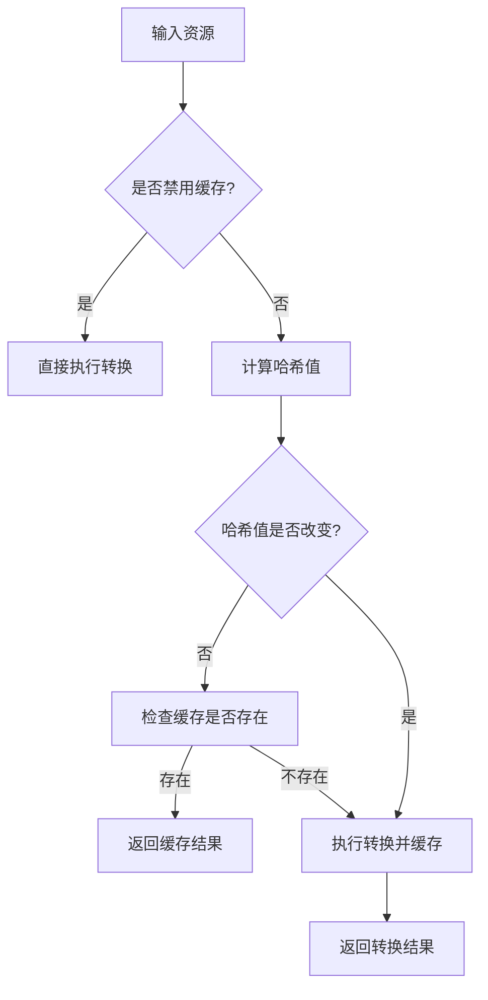

**Diagram sources**
- [index.ts](file://packages/weapp-tailwindcss/src/cache/index.ts#L48-L150)

**Section sources**
- [index.ts](file://packages/weapp-tailwindcss/src/cache/index.ts#L48-L150)

## 缓存键生成策略
缓存键的生成依赖于输入资源的内容或提供的哈希值。系统通过`computeHash`方法使用MD5算法对原始源码进行哈希计算，确保内容变化时能够生成不同的键值。

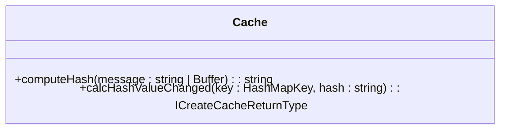

**Diagram sources**
- [index.ts](file://packages/weapp-tailwindcss/src/cache/index.ts#L76-L93)
- [md5.ts](file://packages/weapp-tailwindcss/src/cache/md5.ts#L1)

**Section sources**
- [index.ts](file://packages/weapp-tailwindcss/src/cache/index.ts#L76-L93)
- [md5.ts](file://packages/weapp-tailwindcss/src/cache/md5.ts#L1)

## 缓存数据存储结构
缓存系统采用双层存储结构：
1. **哈希映射层**：使用`Map<HashMapKey, HashMapValue>`存储每个资源的哈希值及变更状态
2. **结果缓存层**：使用`LRUCache<string, CacheValue>`存储实际处理结果

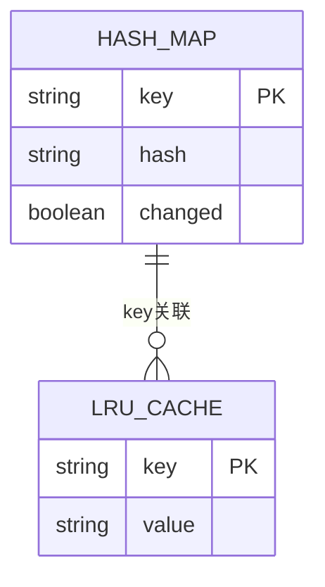

**Diagram sources**
- [index.ts](file://packages/weapp-tailwindcss/src/cache/index.ts#L50-L56)

**Section sources**
- [index.ts](file://packages/weapp-tailwindcss/src/cache/index.ts#L50-L56)

## 缓存失效机制
缓存失效通过比较新旧哈希值来判断。当资源内容发生变化时，`calcHashValueChanged`方法会更新对应键的`changed`标志位，从而触发重新处理。

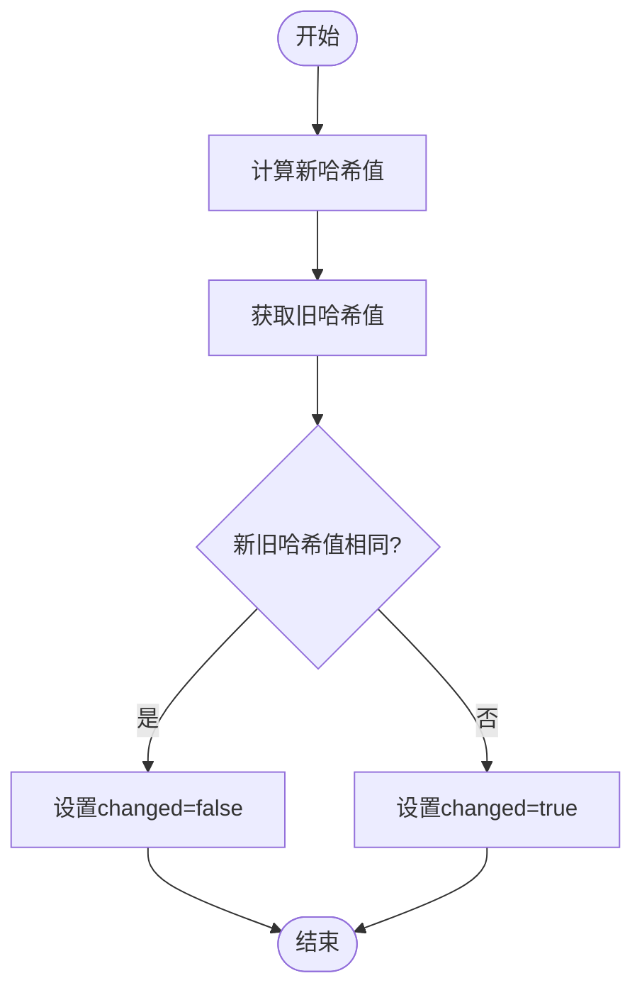

**Diagram sources**
- [index.ts](file://packages/weapp-tailwindcss/src/cache/index.ts#L79-L93)

**Section sources**
- [index.ts](file://packages/weapp-tailwindcss/src/cache/index.ts#L79-L93)

## Cache类属性与方法详解
`ICreateCacheReturnType`接口定义了缓存实例的所有属性和方法：

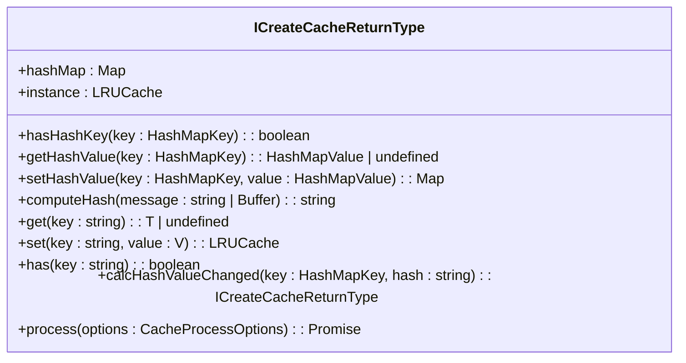

**Diagram sources**
- [index.ts](file://packages/weapp-tailwindcss/src/cache/index.ts#L30-L42)

**Section sources**
- [index.ts](file://packages/weapp-tailwindcss/src/cache/index.ts#L30-L42)

## 缓存读取、写入与清除操作
缓存的核心操作包括读取、写入和状态检查：

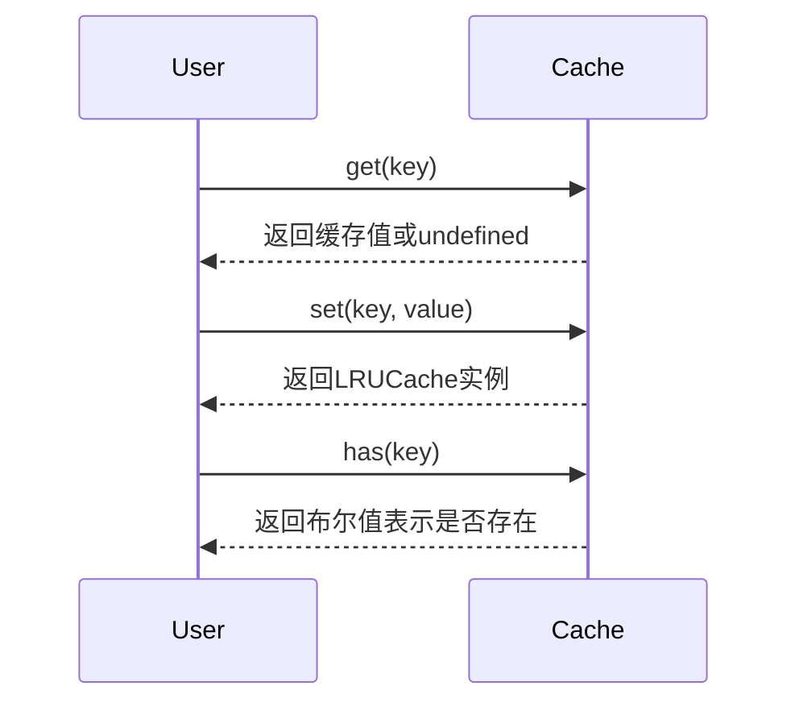

**Diagram sources**
- [index.ts](file://packages/weapp-tailwindcss/src/cache/index.ts#L70-L75)

**Section sources**
- [index.ts](file://packages/weapp-tailwindcss/src/cache/index.ts#L70-L75)

## 实际应用场景示例
在Vite、Webpack和Gulp构建工具中，缓存系统被广泛应用于CSS、JS和HTML文件的处理：

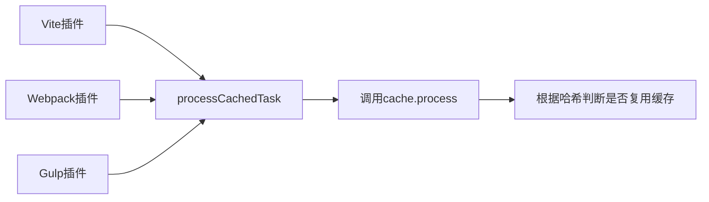

**Diagram sources**
- [vite/index.ts](file://packages/weapp-tailwindcss/src/bundlers/vite/index.ts#L350-L479)
- [BaseUnifiedPlugin/v4.ts](file://packages/weapp-tailwindcss/src/bundlers/webpack/BaseUnifiedPlugin/v4.ts#L300-L438)
- [gulp/index.ts](file://packages/weapp-tailwindcss/src/bundlers/gulp/index.ts#L140-L250)

**Section sources**
- [vite/index.ts](file://packages/weapp-tailwindcss/src/bundlers/vite/index.ts#L350-L479)
- [BaseUnifiedPlugin/v4.ts](file://packages/weapp-tailwindcss/src/bundlers/webpack/BaseUnifiedPlugin/v4.ts#L300-L438)
- [gulp/index.ts](file://packages/weapp-tailwindcss/src/bundlers/gulp/index.ts#L140-L250)

## 缓存生命周期管理
缓存的生命周期由`process`方法统一管理，包含以下阶段：
1. 检查缓存是否被禁用
2. 计算并比较哈希值
3. 判断是否需要重新处理
4. 执行转换函数并缓存结果

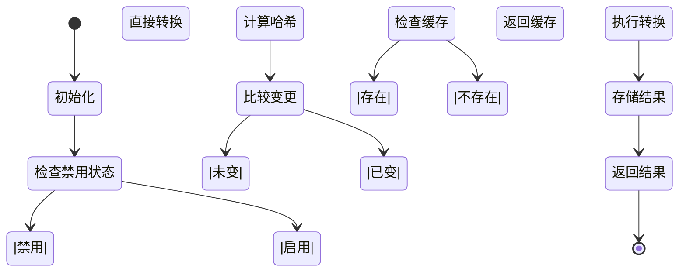

**Diagram sources**
- [index.ts](file://packages/weapp-tailwindcss/src/cache/index.ts#L98-L137)

**Section sources**
- [index.ts](file://packages/weapp-tailwindcss/src/cache/index.ts#L98-L137)

## 内存使用优化策略
系统通过以下方式优化内存使用：
- 设置最大缓存条目数为1024
- 使用LRU算法自动清理最少使用的条目
- 分离哈希状态和实际数据存储

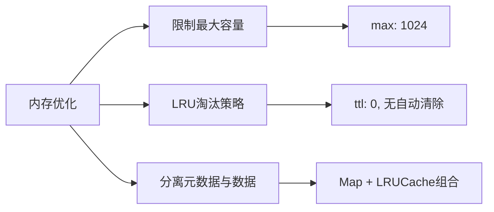

**Diagram sources**
- [index.ts](file://packages/weapp-tailwindcss/src/cache/index.ts#L52-L55)

**Section sources**
- [index.ts](file://packages/weapp-tailwindcss/src/cache/index.ts#L52-L55)

## 分布式环境下的缓存处理
虽然当前实现主要针对单机环境，但可通过扩展支持分布式场景：

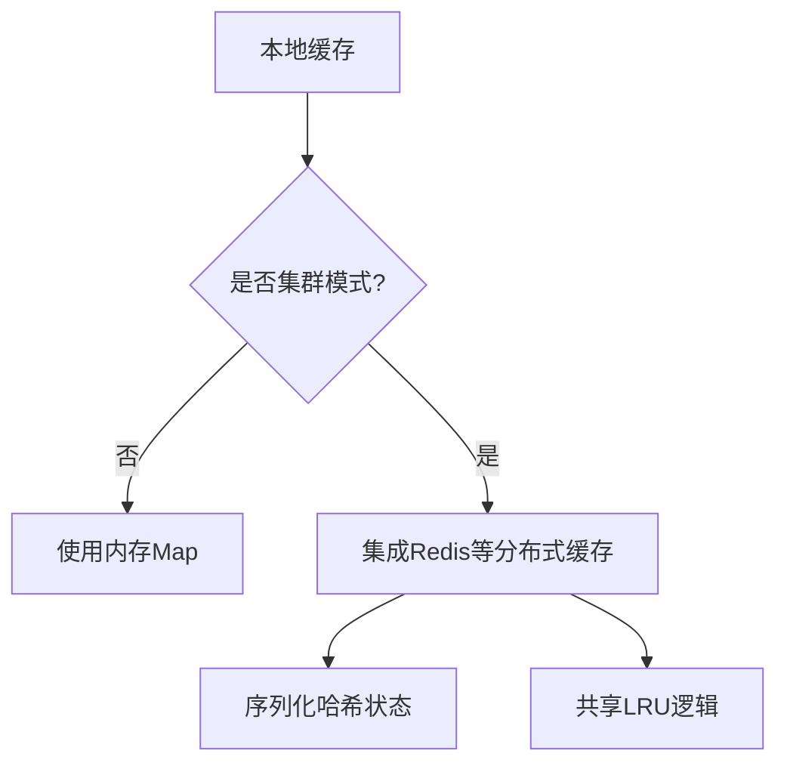

**Section sources**
- [index.ts](file://packages/weapp-tailwindcss/src/cache/index.ts#L50-L56)

## 性能问题诊断与解决
常见性能问题及解决方案：

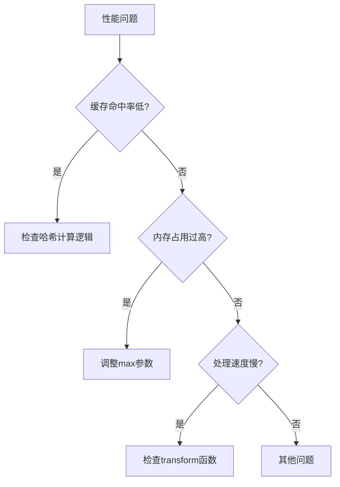

**Section sources**
- [cache.test.ts](file://packages/weapp-tailwindcss/test/cache.test.ts#L76-L117)