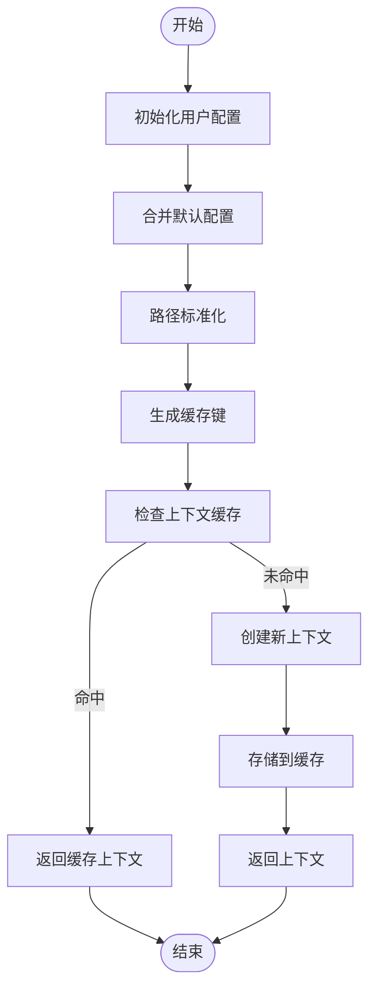
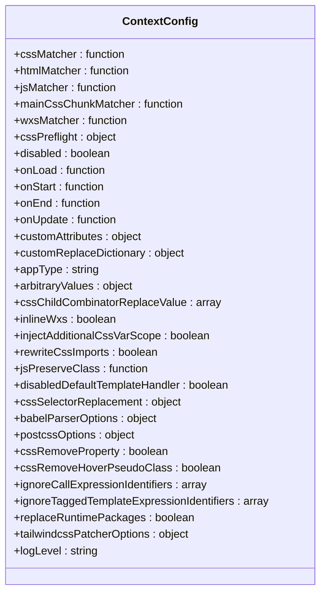
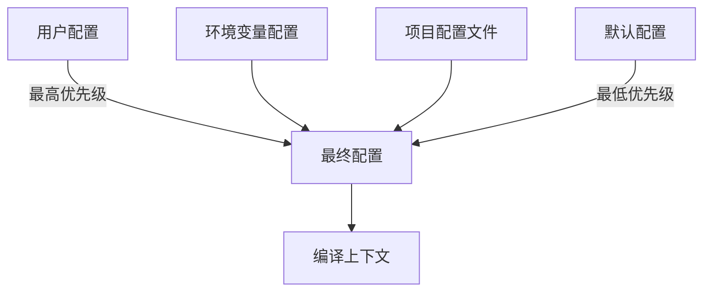

# 配置管理

<cite>
**本文档中引用的文件**  
- [context.ts](file://packages/weapp-tailwindcss/src/cli/context.ts)
- [compiler-context-cache.ts](file://packages/weapp-tailwindcss/src/context/compiler-context-cache.ts)
- [index.ts](file://packages/weapp-tailwindcss/src/context/index.ts)
- [defaults.ts](file://packages/weapp-tailwindcss/src/defaults.ts)
- [utils/index.ts](file://packages/weapp-tailwindcss/src/utils/index.ts)
- [types.ts](file://packages/weapp-tailwindcss/src/types.ts)
</cite>

## 目录
1. [简介](#简介)
2. [配置解析流程](#配置解析流程)
3. [ContextConfig 类实现细节](#contextconfig-类实现细节)
4. [配置优先级与继承机制](#配置优先级与继承机制)
5. [构建环境下的配置处理](#构建环境下的配置处理)
6. [常见配置错误排查指南](#常见配置错误排查指南)

## 简介
weapp-tailwindcss 提供了一套完整的上下文配置管理系统，用于在小程序环境中集成 Tailwind CSS。该系统通过 `ContextConfig` 类管理所有配置项，支持默认配置合并、用户自定义配置加载、环境变量处理以及配置验证等功能。本文档将深入解析其配置管理机制。

## 配置解析流程

weapp-tailwindcss 的配置解析流程遵循以下步骤：

1. **用户配置初始化**：接收用户传入的自定义配置选项
2. **默认配置合并**：将用户配置与内置默认配置进行深度合并
3. **路径解析与标准化**：对配置中的路径进行绝对化和标准化处理
4. **缓存键生成**：基于配置内容生成唯一缓存键
5. **上下文创建**：创建包含完整配置的编译上下文

该流程确保了配置的一致性和可预测性，同时通过缓存机制提升性能。

**Diagram sources**
- [context.ts](file://packages/weapp-tailwindcss/src/cli/context.ts#L51-L72)
- [index.ts](file://packages/weapp-tailwindcss/src/context/index.ts#L64-L132)
- [compiler-context-cache.ts](file://packages/weapp-tailwindcss/src/context/compiler-context-cache.ts#L179-L208)

**Section sources**
- [context.ts](file://packages/weapp-tailwindcss/src/cli/context.ts#L51-L85)
- [index.ts](file://packages/weapp-tailwindcss/src/context/index.ts#L64-L132)

## ContextConfig 类实现细节

### 配置项类型定义
`ContextConfig` 的配置项基于 `UserDefinedOptions` 接口定义，包含以下主要配置类别：
- **文件匹配器**：`cssMatcher`、`htmlMatcher`、`jsMatcher` 用于识别不同类型的文件
- **核心功能开关**：`disabled`、`rewriteCssImports`、`inlineWxs` 等控制功能启用状态
- **样式处理配置**：`cssPreflight`、`cssSelectorReplacement`、`cssRemoveProperty` 等样式相关配置
- **性能与缓存**：`cache`、`babelParserOptions`、`postcssOptions` 等性能相关配置
- **生命周期钩子**：`onLoad`、`onStart`、`onEnd`、`onUpdate` 等回调函数

### 默认值设置
系统通过 `getDefaultOptions()` 函数提供完整的默认配置，包括：

**Diagram sources**
- [defaults.ts](file://packages/weapp-tailwindcss/src/defaults.ts#L44-L137)
- [types.ts](file://packages/weapp-tailwindcss/src/types.ts)

**Section sources**
- [defaults.ts](file://packages/weapp-tailwindcss/src/defaults.ts#L1-L138)

### 环境变量处理
系统通过 `createCliContext()` 函数处理环境变量和工作目录相关的配置。当提供 `resolvedCwd` 时，会自动设置 `tailwindcssBasedir` 并合并 `cwd` 到 `tailwindcssPatcherOptions` 中，确保路径相关配置的正确性。

## 配置优先级与继承机制

### 配置优先级规则
weapp-tailwindcss 遵循以下配置优先级规则（从高到低）：

1. **用户直接传入的配置**：最高优先级，直接覆盖其他所有配置
2. **环境变量配置**：通过环境变量设置的配置
3. **项目配置文件**：如 `tailwind.config.js` 中的配置
4. **默认配置**：系统内置的默认配置，最低优先级

### 配置继承机制
系统使用 `defuOverrideArray` 工具函数进行配置合并，该函数支持：
- 深度对象合并
- 数组覆盖而非合并
- 函数配置的完全替换
- 嵌套对象的递归合并

这种合并策略确保了配置的可预测性和一致性。

**Diagram sources**
- [context.ts](file://packages/weapp-tailwindcss/src/cli/context.ts#L55-L57)
- [index.ts](file://packages/weapp-tailwindcss/src/context/index.ts#L65-L69)
- [utils/index.ts](file://packages/weapp-tailwindcss/src/utils/index.ts)

**Section sources**
- [context.ts](file://packages/weapp-tailwindcss/src/cli/context.ts#L8-L16)
- [index.ts](file://packages/weapp-tailwindcss/src/context/index.ts#L64-L70)

## 构建环境下的配置处理

### 开发环境配置
在开发环境下，系统会：
- 启用详细的日志输出（logLevel: 'info'）
- 保留完整的错误堆栈信息
- 启用缓存以提升性能
- 自动检测 Tailwind CSS 版本并显示

### 生产环境配置
在生产环境下，系统会：
- 可能调整日志级别以减少输出
- 确保所有优化选项启用
- 处理 CSS 导入重写
- 执行样式预设清理

### 多平台适配
系统通过 `appType` 配置项支持多种小程序框架，包括：
- uni-app
- taro
- mpx
- 原生小程序
- remax
- rax

每种类型都有对应的主 CSS 块匹配器，确保正确识别入口样式文件。

## 常见配置错误排查指南

### 路径相关问题
**问题**：配置文件路径无法解析  
**解决方案**：
- 确保使用绝对路径或相对于工作目录的相对路径
- 检查 `resolvedCwd` 是否正确设置
- 使用 `resolveEntry()` 工具函数进行路径解析

### 缓存问题
**问题**：配置更改未生效  
**解决方案**：
- 清除编译上下文缓存
- 检查 `createCompilerContextCacheKey()` 是否正确生成缓存键
- 确认配置变更确实影响了序列化结果

### 文件匹配问题
**问题**：特定文件未被正确处理  
**解决方案**：
- 检查对应的匹配器配置（cssMatcher、htmlMatcher 等）
- 确认文件路径模式是否正确
- 验证正则表达式模式

### 性能问题
**问题**：构建性能低下  
**解决方案**：
- 确保缓存机制正常工作
- 检查 `babelParserOptions.cache` 是否启用
- 优化文件匹配器的正则表达式

**Section sources**
- [compiler-context-cache.ts](file://packages/weapp-tailwindcss/src/context/compiler-context-cache.ts)
- [context.ts](file://packages/weapp-tailwindcss/src/cli/context.ts)
- [defaults.ts](file://packages/weapp-tailwindcss/src/defaults.ts)