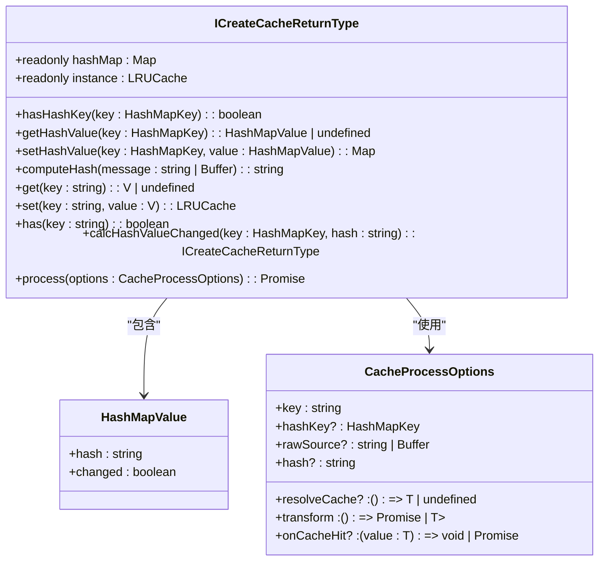
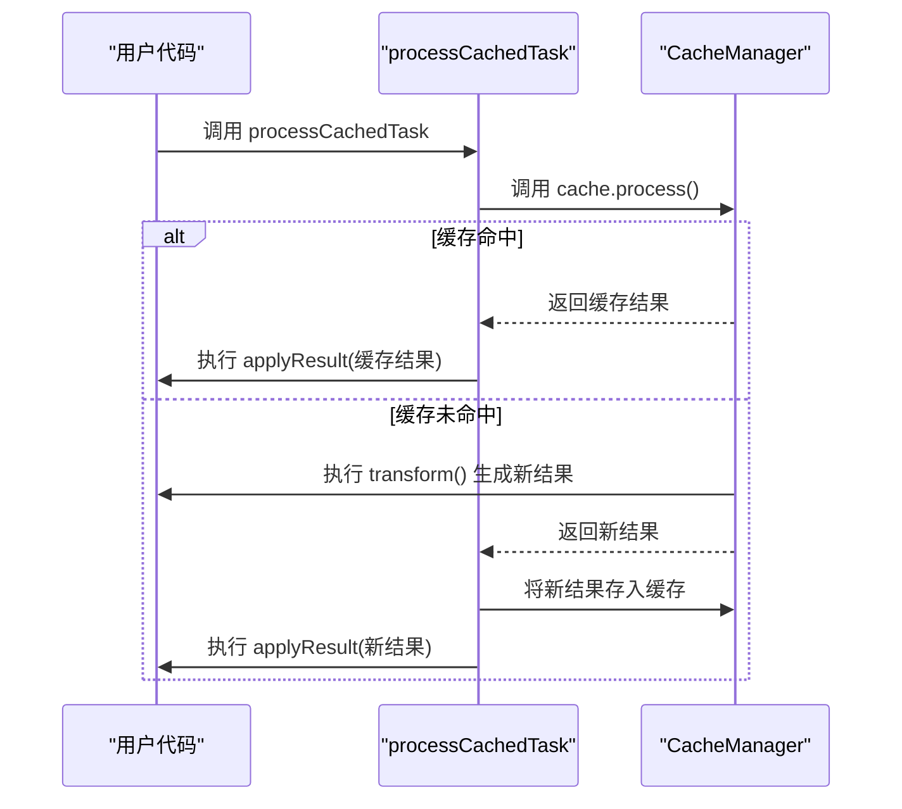
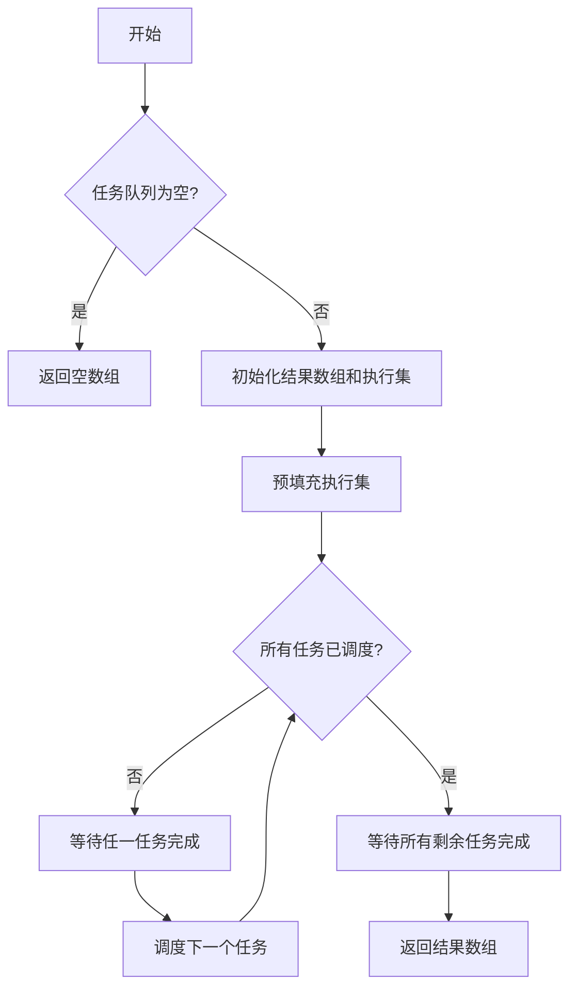
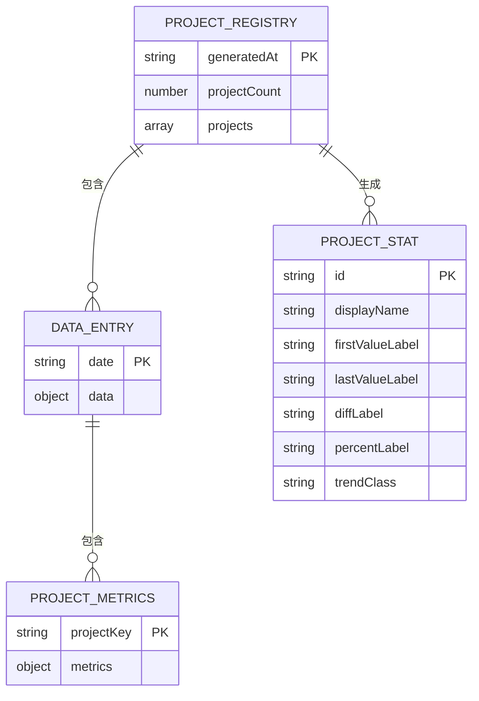

# 构建优化

<cite>
**本文档引用的文件**  
- [index.ts](file://packages/weapp-tailwindcss/src/index.ts)
- [cache/index.ts](file://packages/weapp-tailwindcss/src/cache/index.ts)
- [bundlers/shared/run-tasks.ts](file://packages/weapp-tailwindcss/src/bundlers/shared/run-tasks.ts)
- [bundlers/shared/cache.ts](file://packages/weapp-tailwindcss/src/bundlers/shared/cache.ts)
- [md5.ts](file://packages/weapp-tailwindcss/src/cache/md5.ts)
- [vite.config.ts](file://packages/minify-preserve/examples/vite.config.ts)
- [webpack.config.cjs](file://packages/minify-preserve/examples/webpack.config.cjs)
- [swc.config.json](file://packages/minify-preserve/examples/swc.config.json)
</cite>

## 目录
1. [简介](#简介)
2. [缓存机制](#缓存机制)
3. [增量构建](#增量构建)
4. [并行处理](#并行处理)
5. [性能跟踪与监控](#性能跟踪与监控)
6. [配置选项与最佳实践](#配置选项与最佳实践)
7. [大型项目优化策略](#大型项目优化策略)
8. [结论](#结论)

## 简介

weapp-tailwindcss 是一个专为微信小程序设计的 Tailwind CSS 集成解决方案，其构建系统经过深度优化，旨在提升大型项目的构建性能。本文档详细介绍了其核心优化技术，包括缓存机制、增量构建、并行处理和性能监控。通过分析 `CacheManager`、`PerformanceTracker` 等核心组件的 TypeScript 类型定义和实现，为开发者提供配置和使用这些优化功能的全面指南。

**本文档引用的文件**
- [index.ts](file://packages/weapp-tailwindcss/src/index.ts)

## 缓存机制

weapp-tailwindcss 的缓存机制是其性能优化的核心，通过 `CacheManager` 组件实现。该组件基于 `lru-cache` 库，并结合自定义的哈希计算，确保了高效且可靠的缓存管理。

### CacheManager 核心设计

`CacheManager` 的核心是一个返回 `ICreateCacheReturnType` 接口的 `createCache` 函数。该接口定义了缓存实例和哈希映射的完整操作集。



**Diagram sources**
- [cache/index.ts](file://packages/weapp-tailwindcss/src/cache/index.ts#L30-L42)

**关键组件说明：**

- **`hashMap`**: 一个 `Map`，用于存储文件或任务的哈希值 (`hash`) 和变更状态 (`changed`)。`calcHashValueChanged` 方法会根据新旧哈希值比较，更新 `changed` 标志。
- **`instance`**: 基于 `LRUCache` 的内存缓存实例，用于存储实际的处理结果（如生成的 CSS 源码）。
- **`process` 方法**: 这是缓存逻辑的入口。它接收一个 `CacheProcessOptions` 对象，执行以下流程：
  1.  **计算哈希**: 如果提供了 `rawSource` 或 `hash`，则计算或使用给定的哈希值。
  2.  **检查变更**: 调用 `calcHashValueChanged` 更新 `hashMap` 中的记录，并判断内容是否已更改。
  3.  **缓存命中**: 如果内容未更改 (`hasChanged` 为 `false`)，则从 `instance` 中读取缓存结果，并触发 `onCacheHit` 回调。
  4.  **缓存未命中**: 如果内容已更改或无缓存，则执行 `transform` 函数生成新结果，将结果存入 `instance`，并返回。

### 缓存辅助函数

为了简化在不同构建器（如 Gulp、Webpack、Vite）中使用缓存的流程，项目提供了 `processCachedTask` 辅助函数。



**Diagram sources**
- [bundlers/shared/cache.ts](file://packages/weapp-tailwindcss/src/bundlers/shared/cache.ts#L17-L45)
- [cache/index.ts](file://packages/weapp-tailwindcss/src/cache/index.ts#L98-L137)

该函数封装了 `applyResult`（应用结果）和 `onCacheHit` 的逻辑，使得调用者只需关注 `transform`（转换逻辑）的实现，极大地简化了增量构建的代码。

**缓存机制章节来源**
- [cache/index.ts](file://packages/weapp-tailwindcss/src/cache/index.ts#L1-L151)
- [bundlers/shared/cache.ts](file://packages/weapp-tailwindcss/src/bundlers/shared/cache.ts#L1-L45)
- [md5.ts](file://packages/weapp-tailwindcss/src/cache/md5.ts#L1-L2)

## 增量构建

增量构建是 weapp-tailwindcss 性能优化的关键。它依赖于上述的缓存机制，通过精确判断文件内容是否变更来决定是否重新处理。

### 实现原理

增量构建的实现依赖于 `rawSource` 和 `hashKey` 参数。当一个文件被处理时：
1.  系统会读取文件的原始内容 (`rawSource`)。
2.  使用 `md5Hash` 函数计算其 MD5 哈希值。
3.  将此哈希值与 `hashMap` 中存储的上一次哈希值进行比较。
4.  如果哈希值相同，则 `changed` 标志为 `false`，`process` 方法直接返回缓存结果，跳过耗时的转换过程。
5.  如果哈希值不同，则 `changed` 标志为 `true`，系统会重新执行 `transform` 函数，并更新缓存。

这种方式确保了只有真正发生变化的文件才会被重新编译，从而在大型项目中显著缩短了构建时间。

**增量构建章节来源**
- [cache/index.ts](file://packages/weapp-tailwindcss/src/cache/index.ts#L115-L120)
- [bundlers/shared/cache.ts](file://packages/weapp-tailwindcss/src/bundlers/shared/cache.ts#L21-L22)

## 并行处理

为了最大化利用多核 CPU 的性能，weapp-tailwindcss 实现了并行处理机制，可以同时处理多个独立的构建任务。

### 并行处理核心

并行处理的核心是 `runWithConcurrency` 函数，它实现了经典的“并发控制”模式。



**Diagram sources**
- [bundlers/shared/run-tasks.ts](file://packages/weapp-tailwindcss/src/bundlers/shared/run-tasks.ts#L1-L38)

该函数的工作流程如下：
1.  **限制并发数**: 通过 `limit` 参数控制同时运行的最大任务数（默认为 4 或任务总数，取较小值）。
2.  **调度任务**: 使用一个 `cursor` 指针遍历所有任务工厂函数 (`factories`)。
3.  **维护执行集**: 使用一个 `Set` 来跟踪所有正在执行的 `Promise`。
4.  **动态调度**: 首先预填充执行集，然后在每次有任务完成时（通过 `Promise.race` 检测），立即调度下一个待处理的任务，直到所有任务都被调度。
5.  **等待完成**: 最后，使用 `Promise.all` 等待所有任务最终完成。

此外，`pushConcurrentTaskFactories` 函数提供了一个便捷方式，将一组并发任务包装成一个 `Promise<void>` 并推入一个队列，便于在更复杂的构建流程中管理。

**并行处理章节来源**
- [bundlers/shared/run-tasks.ts](file://packages/weapp-tailwindcss/src/bundlers/shared/run-tasks.ts#L1-L52)

## 性能跟踪与监控

weapp-tailwindcss 项目内置了性能基准测试 (`benchmark`) 系统，用于监控构建性能的变化。

### 性能监控实现

项目根目录下的 `benchmark/app` 是一个 Vue 应用，用于可视化构建性能数据。其核心逻辑在 `useBenchmarkData.ts` 中。



**Diagram sources**
- [useBenchmarkData.ts](file://benchmark/app/src/composables/useBenchmarkData.ts#L4-L238)

- **数据结构**: 系统每天生成一个 JSON 文件，记录所有注册项目的构建耗时等指标。
- **注册机制**: 通过 `pnpm --filter benchmark sync:projects` 命令扫描 `demo/*` 和 `apps/*` 目录，自动生成项目注册清单，确保监控范围的透明和完整。
- **前端展示**: 前端应用会计算每个项目的平均构建时间、变化量和变化率，并通过图表直观展示性能趋势，帮助开发者及时发现性能退化。

**性能跟踪与监控章节来源**
- [useBenchmarkData.ts](file://benchmark/app/src/composables/useBenchmarkData.ts#L1-L238)
- [benchmark/app/README.md](file://benchmark/app/README.md#L1-L36)

## 配置选项与最佳实践

### 构建器配置

为了确保 `weappTwIgnore`、`twMerge` 等关键函数名在压缩后不被混淆，必须在构建配置中保留函数名。

#### Vite 配置
```typescript
// vite.config.ts
export default defineConfig({
  build: {
    minify: 'esbuild',
    esbuild: {
      keepNames: true, // 保留函数名
      mangleProps: false, // 可选：禁用属性混淆
    },
  },
})
```
**代码片段来源**: [packages/minify-preserve/examples/vite.config.ts](file://packages/minify-preserve/examples/vite.config.ts#L1-L15)

#### Webpack/Rspack 配置
```javascript
// webpack.config.cjs
module.exports = {
  optimization: {
    minimizer: [
      new TerserPlugin({
        terserOptions: {
          compress: {
            keep_fnames: true, // 保留函数名
          },
          mangle: {
            keep_fnames: true, // 保留函数名
            keep_classnames: true, // 保留类名
          },
        },
      }),
    ],
  },
}
```
**代码片段来源**: [packages/minify-preserve/examples/webpack.config.cjs](file://packages/minify-preserve/examples/webpack.config.cjs#L1-L26)

#### SWC 配置
```json
// swc.config.json
{
  "jsc": {
    "minify": {
      "compress": {
        "keep_fnames": true
      },
      "mangle": {
        "keep_fnames": true,
        "keep_classnames": true
      }
    }
  }
}
```
**代码片段来源**: [packages/minify-preserve/examples/swc.config.json](file://packages/minify-preserve/examples/swc.config.json#L1-L13)

### 最佳实践

1.  **启用缓存**: 确保在开发和生产环境中都正确配置和启用缓存。
2.  **合理设置并发数**: `runWithConcurrency` 的 `limit` 参数应根据目标机器的 CPU 核心数进行调整，通常设置为 CPU 核心数的 1-2 倍。
3.  **监控性能**: 定期运行基准测试，监控构建时间，及时发现性能瓶颈。
4.  **保留关键函数名**: 在生产构建的压缩配置中，务必设置 `keepNames` 或等效选项，防止关键函数被混淆。

**配置选项与最佳实践章节来源**
- [vite.config.ts](file://packages/minify-preserve/examples/vite.config.ts#L1-L15)
- [webpack.config.cjs](file://packages/minify-preserve/examples/webpack.config.cjs#L1-L26)
- [swc.config.json](file://packages/minify-preserve/examples/swc.config.json#L1-L13)

## 大型项目优化策略

对于大型项目，应综合运用以下策略：
- **分层缓存**: 利用 `CacheManager` 的 `hashKey` 机制，对不同粒度的任务（如单个文件、整个页面）进行分层缓存。
- **并行化独立任务**: 将可以独立处理的任务（如处理不同页面的 CSS）放入 `runWithConcurrency` 中并行执行。
- **增量构建**: 依赖文件哈希变更检测，确保只重新构建修改过的部分。
- **性能基线**: 建立性能基线，通过 `benchmark` 系统持续监控，避免因代码变更导致构建性能劣化。

**大型项目优化策略章节来源**
- [cache/index.ts](file://packages/weapp-tailwindcss/src/cache/index.ts)
- [bundlers/shared/run-tasks.ts](file://packages/weapp-tailwindcss/src/bundlers/shared/run-tasks.ts)
- [benchmark/app](file://benchmark/app)

## 结论

weapp-tailwindcss 通过精心设计的 `CacheManager`、`runWithConcurrency` 等核心组件，构建了一套高效、可靠的构建优化体系。其缓存机制基于内容哈希，确保了增量构建的准确性；并行处理机制充分利用了现代 CPU 的多核能力；内置的性能监控系统则为持续优化提供了数据支持。开发者通过合理配置构建工具并遵循最佳实践，可以显著提升大型微信小程序项目的开发效率和构建性能。