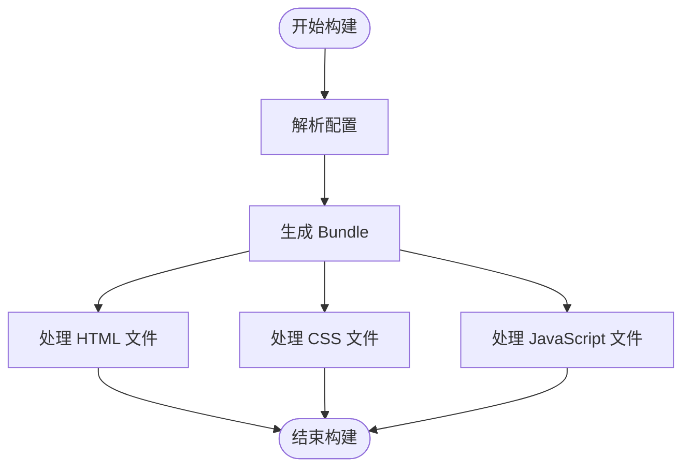
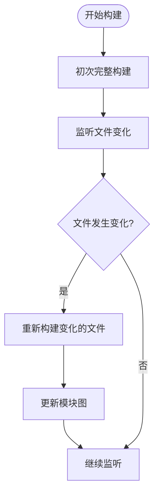
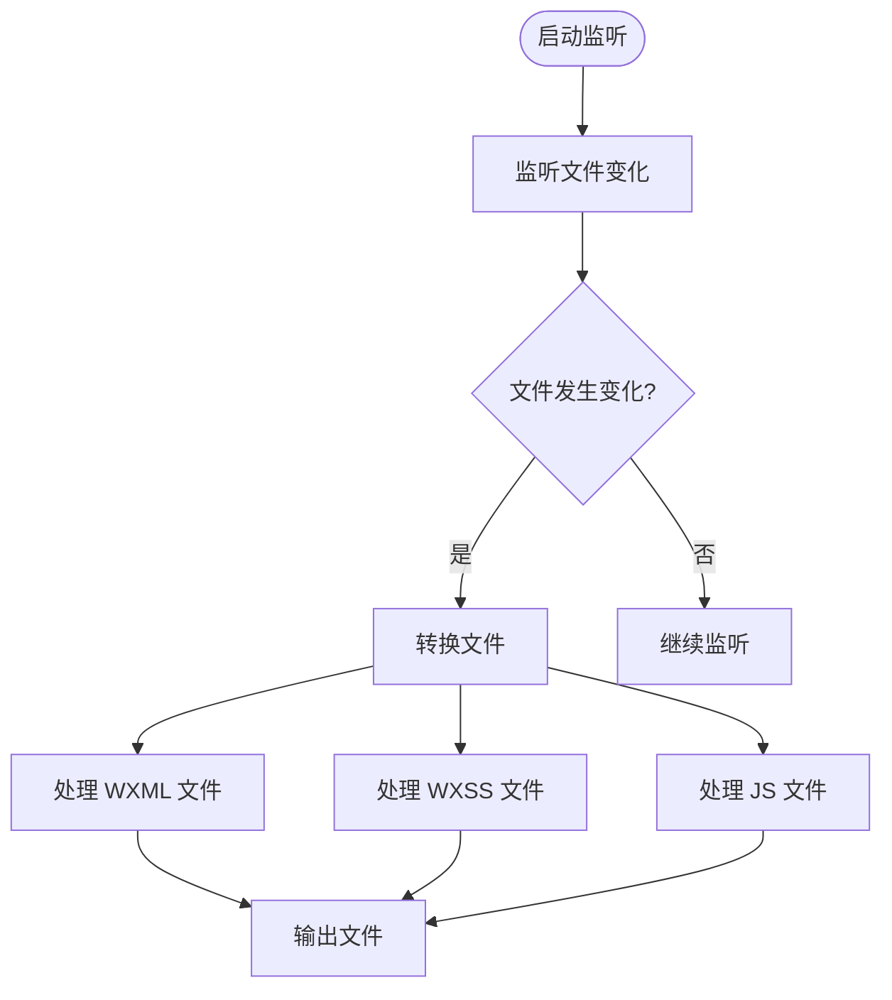

# 构建模式

<cite>
**本文档引用的文件**   
- [vite/index.ts](file://packages/weapp-tailwindcss/src/bundlers/vite/index.ts)
- [webpack/index.ts](file://packages/weapp-tailwindcss/src/bundlers/webpack/index.ts)
- [gulp/index.ts](file://packages/weapp-tailwindcss/src/bundlers/gulp/index.ts)
- [types/index.ts](file://packages/weapp-tailwindcss/src/types/index.ts)
- [cli.ts](file://packages/weapp-tailwindcss/src/cli.ts)
</cite>

## 目录
1. [简介](#简介)
2. [构建模式概述](#构建模式概述)
3. [完整构建模式](#完整构建模式)
4. [增量构建模式](#增量构建模式)
5. [监听模式](#监听模式)
6. [配置选项详解](#配置选项详解)
7. [性能特点与资源消耗](#性能特点与资源消耗)
8. [最佳实践](#最佳实践)

## 简介
weapp-tailwindcss 是一个为小程序开发者提供 Tailwind CSS 原子化样式思想的工具。它支持多种构建工具，包括 Vite、Webpack 和 Gulp，能够将 Tailwind CSS 的功能无缝集成到小程序开发中。本文档详细介绍了 weapp-tailwindcss 的三种主要构建模式：完整构建、增量构建和监听模式，以及它们的配置选项、适用场景和最佳实践。

## 构建模式概述
weapp-tailwindcss 提供了三种主要的构建模式，以满足不同开发和生产环境的需求：
- **完整构建模式**：一次性构建整个项目，适用于生产环境。
- **增量构建模式**：仅重新构建发生变化的文件，提高开发效率。
- **监听模式**：实时监听文件变化并自动重新构建，适用于开发环境。

这些构建模式通过不同的构建工具（如 Vite、Webpack 和 Gulp）实现，并且可以通过 TypeScript 类型定义进行详细的配置。

**Section sources**
- [vite/index.ts](file://packages/weapp-tailwindcss/src/bundlers/vite/index.ts#L1-L479)
- [webpack/index.ts](file://packages/weapp-tailwindcss/src/bundlers/webpack/index.ts#L1-L2)
- [gulp/index.ts](file://packages/weapp-tailwindcss/src/bundlers/gulp/index.ts#L1-L250)

## 完整构建模式
完整构建模式是一次性构建整个项目的模式，通常用于生产环境。在这种模式下，所有文件都会被重新处理和打包，确保最终输出的代码是最新的。

### 实现细节
在 Vite 中，完整构建模式通过 `UnifiedViteWeappTailwindcssPlugin` 插件实现。该插件在 `generateBundle` 阶段处理所有输出文件，包括 HTML、CSS 和 JavaScript 文件。



**Diagram sources**
- [vite/index.ts](file://packages/weapp-tailwindcss/src/bundlers/vite/index.ts#L296-L471)

### 使用模式
在 Vite 配置文件中启用完整构建模式：

```typescript
import { defineConfig } from 'vite'
import { UnifiedViteWeappTailwindcssPlugin } from 'weapp-tailwindcss/vite'

export default defineConfig({
  plugins: [
    UnifiedViteWeappTailwindcssPlugin({
      // 配置选项
    }),
  ],
})
```

**Section sources**
- [vite/index.ts](file://packages/weapp-tailwindcss/src/bundlers/vite/index.ts#L134-L478)

## 增量构建模式
增量构建模式仅重新构建发生变化的文件，从而提高构建速度。这种模式特别适合大型项目，可以显著减少开发过程中的等待时间。

### 实现细节
在 Webpack 中，增量构建模式通过 `BaseUnifiedPlugin/v5` 实现。该插件利用 Webpack 的模块图（Module Graph）来跟踪文件依赖关系，并在文件变化时仅重新处理受影响的模块。



**Diagram sources**
- [webpack/index.ts](file://packages/weapp-tailwindcss/src/bundlers/webpack/index.ts#L1-L2)

### 使用模式
在 Webpack 配置文件中启用增量构建模式：

```typescript
const { BaseUnifiedPlugin } = require('weapp-tailwindcss/webpack')

module.exports = {
  plugins: [
    new BaseUnifiedPlugin({
      // 配置选项
    }),
  ],
}
```

**Section sources**
- [webpack/index.ts](file://packages/weapp-tailwindcss/src/bundlers/webpack/index.ts#L1-L2)

## 监听模式
监听模式实时监听文件变化并自动重新构建，非常适合开发环境。开发者可以在修改代码后立即看到效果，无需手动触发构建。

### 实现细节
在 Gulp 中，监听模式通过 `createPlugins` 函数实现。该函数返回一组转换流（Transform Streams），用于处理不同类型的文件（如 WXML、WXSS 和 JS）。



**Diagram sources**
- [gulp/index.ts](file://packages/weapp-tailwindcss/src/bundlers/gulp/index.ts#L23-L250)

### 使用模式
在 Gulp 配置文件中启用监听模式：

```typescript
const { createPlugins } = require('weapp-tailwindcss/gulp')
const gulp = require('gulp')

const { transformWxml, transformWxss, transformJs } = createPlugins({
  // 配置选项
})

gulp.task('build:wxml', () => {
  return gulp.src('src/**/*.wxml')
    .pipe(transformWxml())
    .pipe(gulp.dest('dist'))
})

gulp.task('build:wxss', () => {
  return gulp.src('src/**/*.wxss')
    .pipe(transformWxss())
    .pipe(gulp.dest('dist'))
})

gulp.task('build:js', () => {
  return gulp.src('src/**/*.js')
    .pipe(transformJs())
    .pipe(gulp.dest('dist'))
})

gulp.task('watch', () => {
  gulp.watch('src/**/*.wxml', gulp.series('build:wxml'))
  gulp.watch('src/**/*.wxss', gulp.series('build:wxss'))
  gulp.watch('src/**/*.js', gulp.series('build:js'))
})
```

**Section sources**
- [gulp/index.ts](file://packages/weapp-tailwindcss/src/bundlers/gulp/index.ts#L23-L250)

## 配置选项详解
weapp-tailwindcss 提供了丰富的配置选项，允许开发者根据具体需求进行定制。以下是主要配置选项的详细说明：

### UserDefinedOptions
`UserDefinedOptions` 是核心配置接口，定义了所有可配置的选项。

```typescript
interface UserDefinedOptions {
  disabled?: DisabledOptions
  customAttributes?: ICustomAttributes
  templateHandler?: (rawSource: string, options?: ITemplateHandlerOptions) => Promise<string>
  styleHandler?: (rawSource: string, options?: IStyleHandlerOptions) => Promise<PostcssResult<Root | Document>>
  jsHandler?: JsHandler
  mainCssChunkMatcher?: (fileName: string, appType: AppType) => boolean
  appType?: AppType
  cache?: ICreateCacheReturnType
  twPatcher?: TailwindcssPatcherLike
  refreshTailwindcssPatcher?: (options?: RefreshTailwindcssPatcherOptions) => Promise<TailwindcssPatcherLike>
  uniAppX?: boolean
  disabledDefaultTemplateHandler?: boolean
}
```

### 主要配置项
- **disabled**: 控制哪些功能被禁用。
- **customAttributes**: 自定义属性配置，用于处理特定框架的属性。
- **templateHandler**: 处理模板文件的函数。
- **styleHandler**: 处理样式文件的函数。
- **jsHandler**: 处理 JavaScript 文件的函数。
- **mainCssChunkMatcher**: 判断是否为主 CSS 文件的函数。
- **appType**: 指定应用类型（如 uni-app、taro 等）。
- **cache**: 缓存配置，用于加速构建过程。
- **twPatcher**: Tailwind CSS 补丁器，用于处理 Tailwind CSS 的核心逻辑。

**Section sources**
- [types/index.ts](file://packages/weapp-tailwindcss/src/types/index.ts#L1-L190)

## 性能特点与资源消耗
不同的构建模式在性能和资源消耗方面有不同的特点：

- **完整构建模式**：构建时间较长，但结果最稳定。适用于生产环境，确保所有文件都被正确处理。
- **增量构建模式**：构建时间较短，只处理变化的文件。适用于大型项目，提高开发效率。
- **监听模式**：实时构建，提供即时反馈。适用于开发环境，但可能增加系统资源消耗。

### 资源消耗
- **内存使用**：监听模式和增量构建模式需要维护模块图和缓存，因此内存使用较高。
- **CPU 使用**：完整构建模式在初次构建时 CPU 使用较高，后续构建则较低。
- **磁盘 I/O**：所有模式都需要读取和写入文件，但监听模式由于频繁的文件操作，磁盘 I/O 较高。

## 最佳实践
为了充分发挥 weapp-tailwindcss 的优势，建议遵循以下最佳实践：

1. **生产环境使用完整构建模式**：确保所有文件都被正确处理，避免遗漏。
2. **开发环境使用监听模式**：提供即时反馈，提高开发效率。
3. **大型项目使用增量构建模式**：减少构建时间，提高开发体验。
4. **合理配置缓存**：利用缓存加速构建过程，特别是在增量构建和监听模式下。
5. **定期清理缓存**：避免缓存过大导致性能下降。
6. **监控资源使用**：特别是在监听模式下，注意系统资源的使用情况，避免影响其他任务。

通过合理选择和配置构建模式，可以显著提升开发效率和项目质量。

**Section sources**
- [vite/index.ts](file://packages/weapp-tailwindcss/src/bundlers/vite/index.ts#L1-L479)
- [webpack/index.ts](file://packages/weapp-tailwindcss/src/bundlers/webpack/index.ts#L1-L2)
- [gulp/index.ts](file://packages/weapp-tailwindcss/src/bundlers/gulp/index.ts#L1-L250)
- [types/index.ts](file://packages/weapp-tailwindcss/src/types/index.ts#L1-L190)
- [cli.ts](file://packages/weapp-tailwindcss/src/cli.ts#L1-L78)