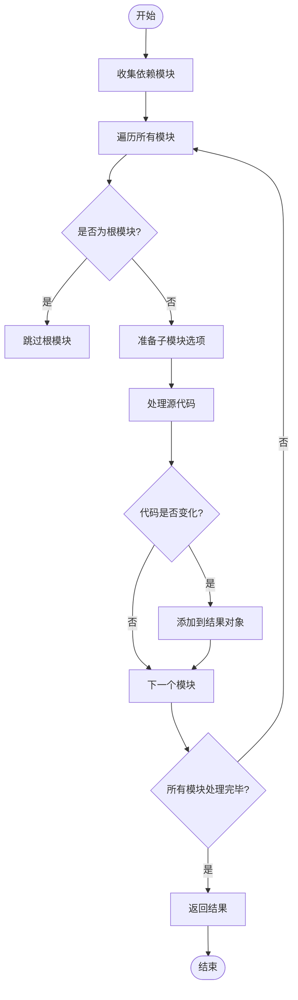
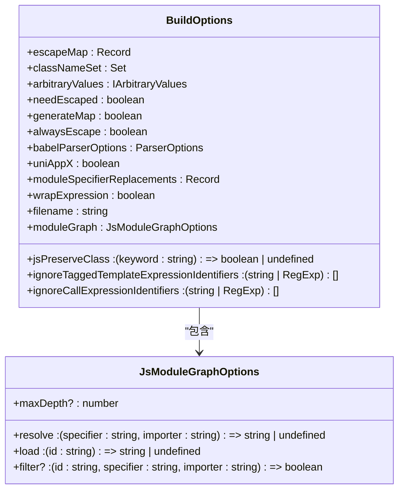
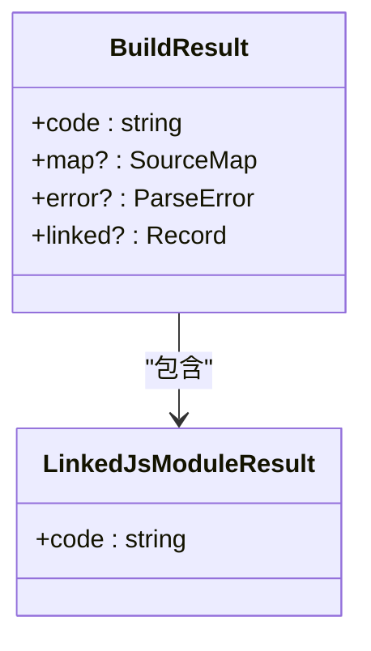
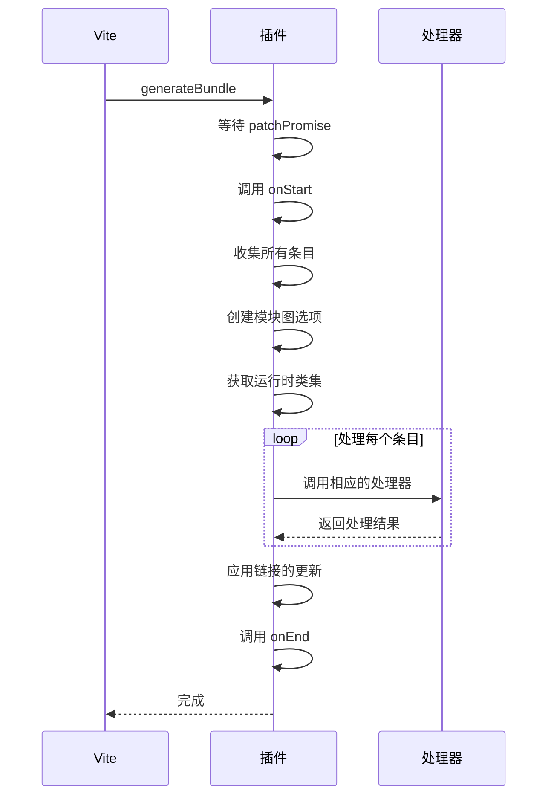
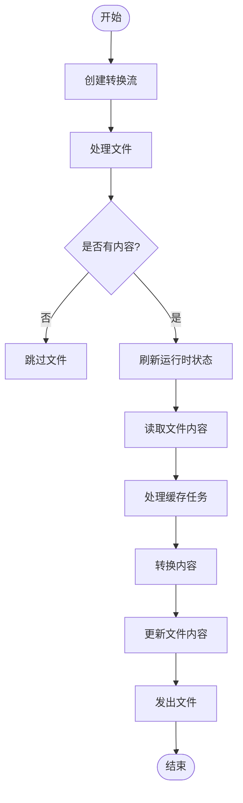
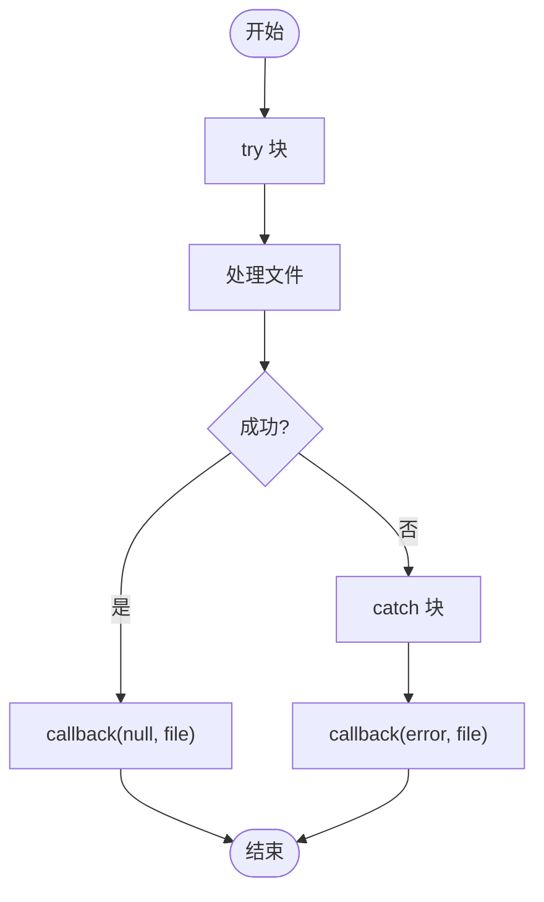
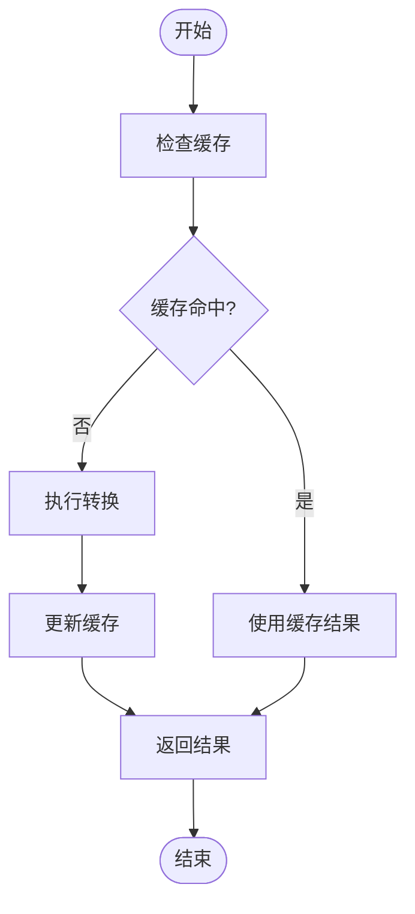

# 构建流程

<cite>
**本文档引用文件**  
- [ModuleGraph.ts](file://packages/weapp-tailwindcss/src/js/ModuleGraph.ts)
- [types.ts](file://packages/weapp-tailwindcss/src/types/index.ts)
- [vite/index.ts](file://packages/weapp-tailwindcss/src/bundlers/vite/index.ts)
- [gulp/index.ts](file://packages/weapp-tailwindcss/src/bundlers/gulp/index.ts)
</cite>

## 目录
1. [简介](#简介)
2. [核心构建函数分析](#核心构建函数分析)
3. [构建选项与结果类型](#构建选项与结果类型)
4. [不同构建方式的工作原理](#不同构建方式的工作原理)
5. [构建生命周期与错误处理](#构建生命周期与错误处理)
6. [性能优化与缓存机制](#性能优化与缓存机制)
7. [项目类型与部署环境策略](#项目类型与部署环境策略)

## 简介
weapp-tailwindcss 是一个为小程序开发者提供 Tailwind CSS 原子化样式能力的工具。其构建流程围绕 `build` 函数展开，支持完整构建、增量构建和监听模式等多种构建方式。本文档将深入分析其构建流程的实现细节，重点介绍 `BuildOptions`、`BuildResult` 等核心数据结构的设计和用途，并提供实际代码示例。

## 核心构建函数分析
`build` 函数是 weapp-tailwindcss 构建流程的核心，负责处理 JavaScript 模块的依赖关系和代码转换。该函数位于 `packages/weapp-tailwindcss/src/js/ModuleGraph.ts` 文件中。

`build` 函数的主要工作流程如下：
1. 调用 `collectDependencies` 方法收集所有依赖模块。
2. 遍历所有模块，对每个模块进行代码转换。
3. 比较转换前后的代码，如果发生变化，则将新代码添加到结果对象中。

**Diagram sources**
- [ModuleGraph.ts](file://packages/weapp-tailwindcss/src/js/ModuleGraph.ts#L59-L80)

**Section sources**
- [ModuleGraph.ts](file://packages/weapp-tailwindcss/src/js/ModuleGraph.ts#L59-L80)

## 构建选项与结果类型
weapp-tailwindcss 提供了丰富的构建选项和结果类型，以满足不同场景的需求。

### BuildOptions
`BuildOptions` 类型定义了构建过程中的各种配置选项。主要包含以下几类：

- **基础选项**：如 `escapeMap`、`classNameSet` 等，用于控制代码转换的基本行为。
- **解析选项**：如 `babelParserOptions`，用于配置 Babel 解析器。
- **跨文件分析选项**：如 `moduleGraph`，用于配置跨文件模块图分析行为。

**Diagram sources**
- [types.ts](file://packages/weapp-tailwindcss/src/types/index.ts#L59-L87)

### BuildResult
`BuildResult` 类型定义了构建过程的输出结果。主要包含以下字段：

- `code`: 转换后的代码字符串。
- `map`: 源码映射，用于调试。
- `error`: 解析错误信息。
- `linked`: 因跨文件分析而被转换的额外模块。

**Diagram sources**
- [types.ts](file://packages/weapp-tailwindcss/src/types/index.ts#L24-L36)

## 不同构建方式的工作原理
weapp-tailwindcss 支持多种构建方式，包括完整构建、增量构建和监听模式。

### 完整构建
完整构建会处理项目中的所有文件，生成最终的构建结果。在 Vite 插件中，完整构建通过 `generateBundle` 钩子实现：

**Diagram sources**
- [vite/index.ts](file://packages/weapp-tailwindcss/src/bundlers/vite/index.ts#L296-L470)

### 增量构建
增量构建只处理发生变化的文件，以提高构建效率。在 Gulp 插件中，增量构建通过流式处理实现：

**Diagram sources**
- [gulp/index.ts](file://packages/weapp-tailwindcss/src/bundlers/gulp/index.ts#L123-L136)

### 监听模式
监听模式会在文件发生变化时自动重新构建。虽然具体的监听逻辑不在核心构建函数中，但构建流程为监听模式提供了支持，通过缓存机制和增量构建来提高效率。

## 构建生命周期与错误处理
weapp-tailwindcss 的构建流程包含完整的生命周期钩子和错误处理机制。

### 构建生命周期
构建生命周期包括以下几个阶段：
1. **开始阶段**：调用 `onStart` 钩子。
2. **处理阶段**：处理各种类型的文件（HTML、JS、CSS）。
3. **结束阶段**：调用 `onEnd` 钩子。

### 错误处理
错误处理主要体现在以下几个方面：
- 在 `JsHandlerResult` 中包含 `error` 字段，用于传递解析错误。
- 在流式处理中使用 try-catch 捕获异常，并通过回调函数传递错误。

**Diagram sources**
- [gulp/index.ts](file://packages/weapp-tailwindcss/src/bundlers/gulp/index.ts#L127-L133)

## 性能优化与缓存机制
weapp-tailwindcss 通过多种方式优化构建性能，其中最重要的是缓存机制。

### 缓存机制
缓存机制通过 `processCachedTask` 函数实现，主要步骤如下：
1. 检查缓存中是否存在结果。
2. 如果存在且未过期，则使用缓存结果（缓存命中）。
3. 如果不存在或已过期，则执行转换并更新缓存。

**Diagram sources**
- [vite/index.ts](file://packages/weapp-tailwindcss/src/bundlers/vite/index.ts#L350-L370)

## 项目类型与部署环境策略
weapp-tailwindcss 支持多种项目类型和部署环境，通过不同的插件和配置来适应各种场景。

### 项目类型支持
- **Vite**: 通过 `UnifiedViteWeappTailwindcssPlugin` 插件支持。
- **Webpack**: 通过 `BaseUnifiedPlugin/v5` 支持。
- **Gulp**: 通过 `createPlugins` 函数支持。

### 部署环境策略
不同的部署环境可能需要不同的构建策略，例如：
- **开发环境**: 启用源码映射，禁用代码压缩。
- **生产环境**: 禁用源码映射，启用代码压缩。

这些策略可以通过 `UserDefinedOptions` 进行配置，以适应不同的部署需求。

**Section sources**
- [vite/index.ts](file://packages/weapp-tailwindcss/src/bundlers/vite/index.ts#L134-L478)
- [gulp/index.ts](file://packages/weapp-tailwindcss/src/bundlers/gulp/index.ts#L23-L250)