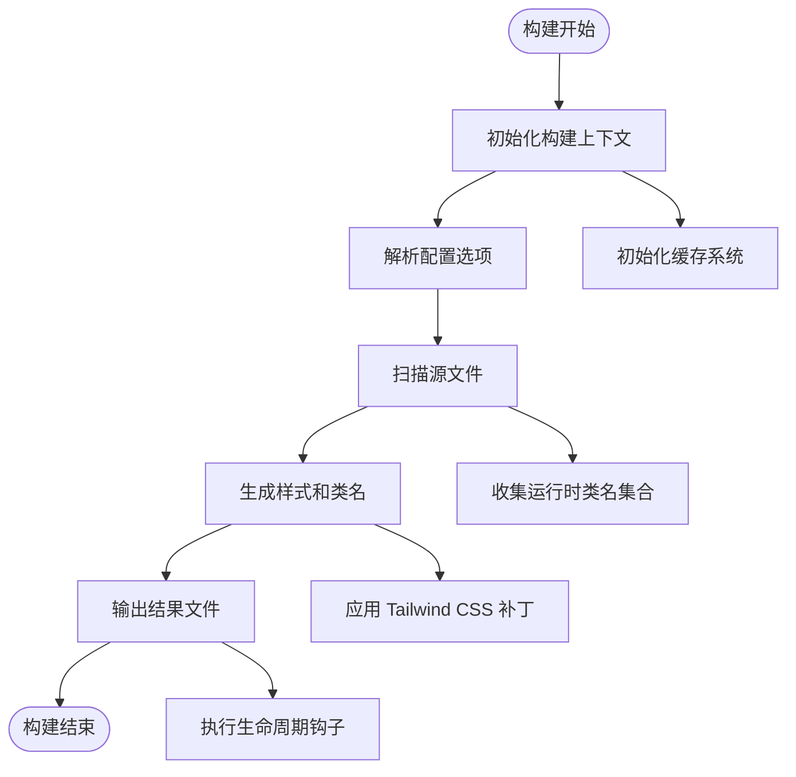
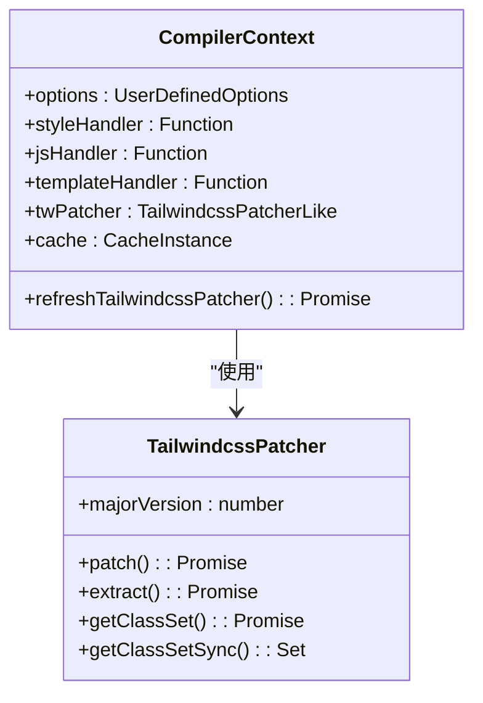
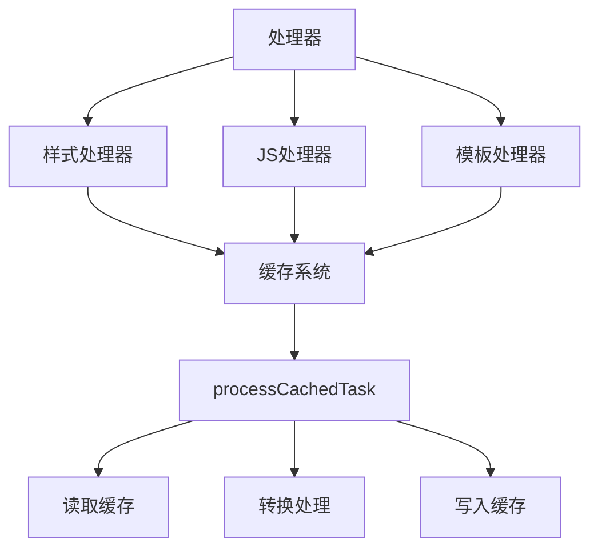
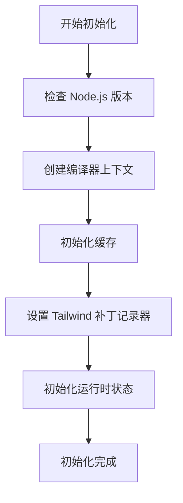
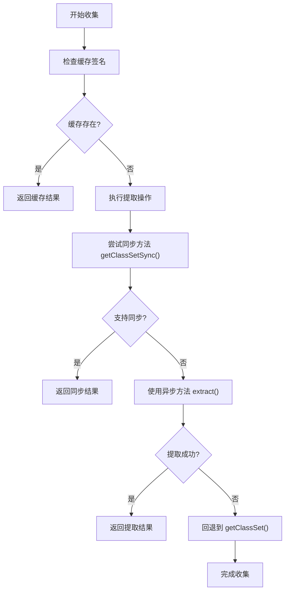
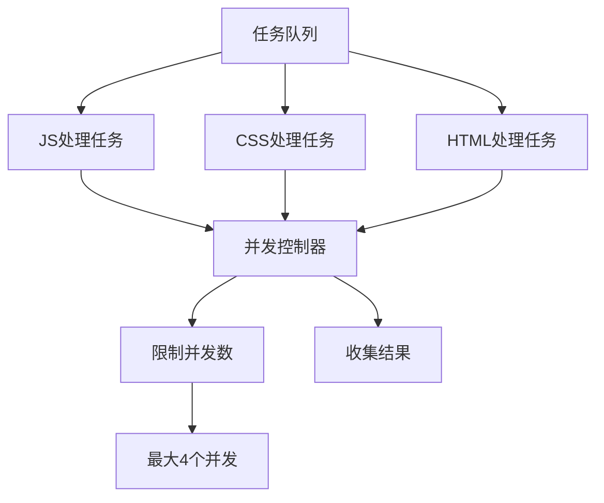

# 构建生命周期

<cite>
**本文档中引用的文件**  
- [index.ts](file://packages/weapp-tailwindcss/src/index.ts)
- [cli.ts](file://packages/weapp-tailwindcss/src/cli.ts)
- [gulp/index.ts](file://packages/weapp-tailwindcss/src/bundlers/gulp/index.ts)
- [vite/index.ts](file://packages/weapp-tailwindcss/src/bundlers/vite/index.ts)
- [webpack/index.ts](file://packages/weapp-tailwindcss/src/bundlers/webpack/index.ts)
- [constants.ts](file://packages/weapp-tailwindcss/src/constants.ts)
- [context/index.ts](file://packages/weapp-tailwindcss/src/context/index.ts)
- [shared/cache.ts](file://packages/weapp-tailwindcss/src/bundlers/shared/cache.ts)
- [shared/run-tasks.ts](file://packages/weapp-tailwindcss/src/bundlers/shared/run-tasks.ts)
- [tailwindcss/runtime.ts](file://packages/weapp-tailwindcss/src/tailwindcss/runtime.ts)
</cite>

## 目录
1. [简介](#简介)
2. [构建生命周期概述](#构建生命周期概述)
3. [核心组件分析](#核心组件分析)
4. [生命周期阶段详解](#生命周期阶段详解)
5. [状态管理与错误传播](#状态管理与错误传播)
6. [性能监控点](#性能监控点)
7. [自定义处理示例](#自定义处理示例)
8. [结论](#结论)

## 简介
weapp-tailwindcss 是一个为微信小程序等轻应用环境提供 Tailwind CSS 支持的构建工具。它通过集成到不同的构建系统（如 Vite、Webpack、Gulp）中，实现从源代码到最终样式文件的完整转换流程。本文档详细描述了其构建生命周期的各个阶段，包括初始化、配置解析、文件扫描、样式生成和结果输出。

## 构建生命周期概述

weapp-tailwindcss 的构建生命周期是一个多阶段的过程，涵盖了从构建初始化到最终输出的完整流程。该过程通过不同构建工具（Vite、Webpack、Gulp）的适配器实现，并保持一致的核心逻辑。



**图示来源**  
- [context/index.ts](file://packages/weapp-tailwindcss/src/context/index.ts#L64-L132)
- [tailwindcss/runtime.ts](file://packages/weapp-tailwindcss/src/tailwindcss/runtime.ts#L144-L227)

## 核心组件分析

weapp-tailwindcss 的核心组件主要包括构建上下文管理、处理器工厂、缓存系统和运行时类名收集器。这些组件协同工作，确保构建过程的高效性和正确性。

### 构建上下文管理

构建上下文是整个构建过程的核心，负责管理配置选项、处理器实例和状态信息。



**图示来源**  
- [context/index.ts](file://packages/weapp-tailwindcss/src/context/index.ts#L1-L132)
- [tailwindcss/runtime.ts](file://packages/weapp-tailwindcss/src/tailwindcss/runtime.ts#L70-L101)

### 处理器与缓存系统

处理器负责处理不同类型的文件（CSS、JS、模板），而缓存系统则优化重复构建的性能。



**图示来源**  
- [bundlers/shared/cache.ts](file://packages/weapp-tailwindcss/src/bundlers/shared/cache.ts#L1-L45)
- [bundlers/vite/index.ts](file://packages/weapp-tailwindcss/src/bundlers/vite/index.ts#L296-L470)

## 生命周期阶段详解

### 构建初始化

构建初始化阶段主要完成构建上下文的创建和基本配置的设置。

**构建初始化流程**


**阶段来源**  
- [cli.ts](file://packages/weapp-tailwindcss/src/cli.ts#L30-L34)
- [context/index.ts](file://packages/weapp-tailwindcss/src/context/index.ts#L64-L132)

### 配置解析

配置解析阶段将用户定义的选项与默认选项合并，创建最终的构建配置。

**配置解析关键步骤**
1. 读取用户提供的配置选项
2. 合并默认配置（使用 `defuOverrideArray`）
3. 初始化日志级别
4. 创建 Tailwind CSS 补丁器实例
5. 验证并警告缺失的 CSS 入口

**阶段来源**  
- [context/index.ts](file://packages/weapp-tailwindcss/src/context/index.ts#L64-L132)

### 文件扫描与类名收集

文件扫描阶段通过分析源代码中的类名使用情况，收集运行时需要的类名集合。

**类名收集流程**


**阶段来源**  
- [tailwindcss/runtime.ts](file://packages/weapp-tailwindcss/src/tailwindcss/runtime.ts#L144-L227)

### 样式生成

样式生成阶段根据收集到的类名集合，生成最终的 CSS 样式文件。

**样式生成关键点**
- 使用 `styleHandler` 处理 CSS 文件
- 应用 PostCSS 转换
- 处理主 CSS 块标记
- 支持 CSS 计算函数的默认值应用

**阶段来源**  
- [bundlers/vite/index.ts](file://packages/weapp-tailwindcss/src/bundlers/vite/index.ts#L428-L461)
- [tailwindcss/v4.ts](file://packages/weapp-tailwindcss/src/tailwindcss/v4.ts)

### 结果输出

结果输出阶段将处理后的文件写入输出目录，并执行相关的生命周期钩子。

**输出阶段钩子**
- `onStart`: 构建开始时调用
- `onUpdate`: 文件更新时调用
- `onEnd`: 构建结束时调用

**阶段来源**  
- [bundlers/vite/index.ts](file://packages/weapp-tailwindcss/src/bundlers/vite/index.ts#L299-L469)

## 状态管理与错误传播

### 状态管理机制

weapp-tailwindcss 使用多种机制来管理构建过程中的状态：

**运行时状态对象**
```typescript
interface TailwindRuntimeState {
  twPatcher: TailwindcssPatcherLike
  patchPromise: Promise<unknown>
  refreshTailwindcssPatcher?: () => Promise<TailwindcssPatcherLike>
  onPatchCompleted?: () => Promise<void> | void
}
```

**状态管理特点**
- 使用 `WeakMap` 缓存运行时类名集合
- 通过 `refreshTailwindcssPatcherSymbol` 符号属性管理刷新函数
- 支持强制刷新和跳过刷新选项

**来源**  
- [tailwindcss/runtime.ts](file://packages/weapp-tailwindcss/src/tailwindcss/runtime.ts#L70-L101)

### 错误传播机制

错误处理贯穿整个构建生命周期，确保问题能够被及时发现和报告。

**错误处理策略**
1. **异步错误捕获**: 在 Promise 链中使用 `.catch()` 捕获异步错误
2. **调试日志**: 使用 `createDebug` 提供详细的调试信息
3. **警告系统**: 通过 `logger.warn()` 报告非致命问题
4. **失败静默**: 某些情况下（如缓存清除失败）选择静默失败而非中断构建

**来源**  
- [tailwindcss/runtime.ts](file://packages/weapp-tailwindcss/src/tailwindcss/runtime.ts#L56-L67)
- [context/index.ts](file://packages/weapp-tailwindcss/src/context/index.ts#L50-L61)

## 性能监控点

weapp-tailwindcss 在多个关键位置设置了性能监控点，以优化构建速度。

### 缓存系统

缓存是性能优化的核心，weapp-tailwindcss 在多个层面实现了缓存：

**缓存类型**
- **文件内容缓存**: 基于文件内容哈希的缓存
- **运行时类名缓存**: 基于 Tailwind 配置签名的缓存
- **补丁结果缓存**: Tailwind CSS 补丁应用结果的缓存

**缓存命中日志**
- `css cache hit: %s`
- `js cache hit: %s`
- `html cache hit: %s`

**来源**  
- [bundlers/shared/cache.ts](file://packages/weapp-tailwindcss/src/bundlers/shared/cache.ts#L1-L45)

### 并发任务处理

通过并发执行独立的任务来提高构建效率。

**并发任务管理**


**来源**  
- [bundlers/shared/run-tasks.ts](file://packages/weapp-tailwindcss/src/bundlers/shared/run-tasks.ts#L1-L52)

## 自定义处理示例

### 自定义生命周期钩子

用户可以通过配置选项在不同生命周期阶段插入自定义逻辑：

```typescript
const options = {
  onStart: () => {
    console.log('构建开始')
  },
  onUpdate: (fileName, previous, next) => {
    console.log(`文件更新: ${fileName}`)
  },
  onEnd: () => {
    console.log('构建结束')
  }
}
```

**来源**  
- [bundlers/vite/index.ts](file://packages/weapp-tailwindcss/src/bundlers/vite/index.ts#L140-L143)

### 自定义属性处理

支持自定义属性的实体转换：

```typescript
const options = {
  customAttributes: {
    'data-tw': 'class'
  }
}
```

**来源**  
- [context/custom-attributes.ts](file://packages/weapp-tailwindcss/src/context/custom-attributes.ts)

## 结论

weapp-tailwindcss 的构建生命周期设计精巧，通过模块化的组件和清晰的阶段划分，实现了高效、可靠的样式构建过程。其核心优势包括：

1. **多构建工具支持**: 通过适配器模式支持 Vite、Webpack、Gulp 等多种构建系统
2. **智能缓存机制**: 多层次的缓存系统显著提升了重复构建的速度
3. **灵活的扩展性**: 提供丰富的生命周期钩子和配置选项，支持深度定制
4. **健壮的错误处理**: 完善的错误传播机制确保构建过程的稳定性
5. **性能优化**: 并发任务处理和智能类名收集算法优化了构建性能

通过理解这些核心机制，开发者可以更好地利用 weapp-tailwindcss 的功能，实现高效的轻应用样式开发。