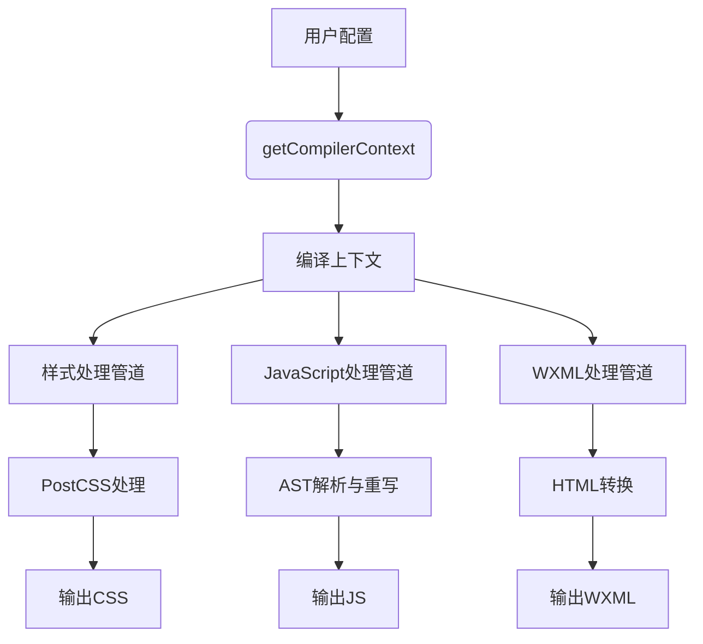
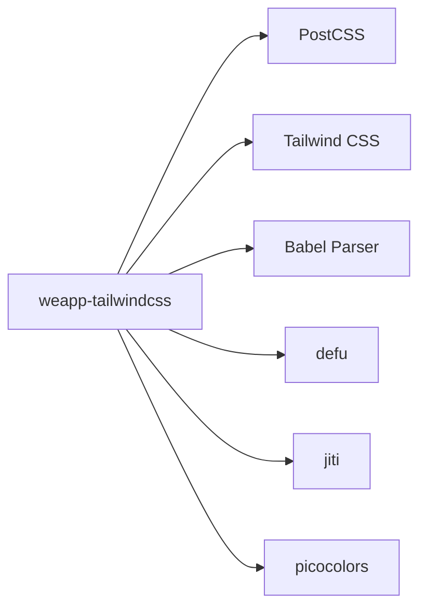

# 后处理器

<cite>
**本文档引用的文件**
- [postcss-html-transform.ts](file://packages/weapp-tailwindcss/src/postcss-html-transform.ts)
- [index.ts](file://packages/weapp-tailwindcss/src/bundlers/vite/index.ts)
- [gulp/index.ts](file://packages/weapp-tailwindcss/src/bundlers/gulp/index.ts)
- [context/index.ts](file://packages/weapp-tailwindcss/src/context/index.ts)
- [compiler-context-cache.ts](file://packages/weapp-tailwindcss/src/context/compiler-context-cache.ts)
- [types.ts](file://packages/weapp-tailwindcss/src/types.ts)
</cite>

## 目录
1. [简介](#简介)
2. [项目结构](#项目结构)
3. [核心组件](#核心组件)
4. [架构概述](#架构概述)
5. [详细组件分析](#详细组件分析)
6. [依赖分析](#依赖分析)
7. [性能考虑](#性能考虑)
8. [故障排除指南](#故障排除指南)
9. [结论](#结论)

## 简介
weapp-tailwindcss 的后处理系统是一个专为小程序设计的样式处理解决方案，旨在将 Tailwind CSS 功能无缝集成到微信小程序等轻应用环境中。该系统通过一系列后处理器实现样式转换、WXML 模板处理、JavaScript 逻辑注入等功能，解决了小程序原生样式系统与现代 CSS 框架之间的兼容性问题。后处理器在构建流程中扮演关键角色，负责处理样式隔离、生成内联样式、优化类名、注入运行时支持等核心任务，确保开发者能够使用 Tailwind CSS 的完整功能集，同时保持小程序的性能和兼容性。

## 项目结构
weapp-tailwindcss 项目采用模块化设计，核心后处理功能分布在 `packages` 目录下的多个子包中。主要结构包括 `weapp-tailwindcss` 主包，它提供了针对不同构建工具（如 Vite、Webpack、Gulp）的集成插件；`tailwindcss-injector` 负责核心的样式注入逻辑；`weapp-style-injector` 处理具体的样式注入细节。项目通过 `src/bundlers` 目录组织不同构建工具的适配器，确保了对多种开发环境的支持。这种分层架构使得后处理系统既具有高度的可扩展性，又能保持核心逻辑的内聚性。

**Section sources**
- [index.ts](file://packages/weapp-tailwindcss/src/bundlers/vite/index.ts#L1-L479)
- [gulp/index.ts](file://packages/weapp-tailwindcss/src/bundlers/gulp/index.ts#L1-L250)

## 核心组件
后处理系统的核心组件包括 `Postprocessor` 和 `PostprocessOptions`。`Postprocessor` 是一个抽象概念，代表了执行特定转换任务的处理单元，如样式处理、模板转换和 JavaScript 代码重写。`PostprocessOptions` 则定义了这些处理器的配置选项，包括缓存策略、自定义属性映射、日志级别等。这些组件通过 `getCompilerContext` 函数进行初始化和配置，该函数负责解析用户定义的选项，并创建一个包含所有必要处理程序和状态的编译上下文。核心组件的设计遵循了依赖注入原则，使得各个处理环节可以独立开发和测试，同时又能通过统一的接口进行协调工作。

**Section sources**
- [context/index.ts](file://packages/weapp-tailwindcss/src/context/index.ts#L1-L133)
- [types.ts](file://packages/weapp-tailwindcss/src/types.ts)

## 架构概述
后处理系统的整体架构是一个基于事件驱动的管道系统。在构建流程的不同阶段，系统会触发相应的处理任务。首先，`getCompilerContext` 函数根据用户配置创建一个编译上下文，该上下文包含了样式、JavaScript 和模板的处理程序。然后，在 Vite 或 Webpack 等构建工具的 `generateBundle` 钩子中，系统会遍历输出的文件，根据文件类型（CSS、JS、WXML）分发到对应的处理管道。每个管道都实现了缓存机制，以避免重复处理，提高构建效率。最终，处理后的代码会被写回输出文件，完成整个后处理流程。

**Diagram sources**
- [context/index.ts](file://packages/weapp-tailwindcss/src/context/index.ts#L130-L132)
- [index.ts](file://packages/weapp-tailwindcss/src/bundlers/vite/index.ts#L296-L471)

## 详细组件分析

### 样式后处理分析
样式后处理是整个系统的核心，它负责将 Tailwind CSS 类名转换为小程序可识别的样式规则。该过程首先通过 `styleHandler` 接收原始 CSS 代码，然后利用 PostCSS 插件链进行处理。关键步骤包括解析 Tailwind 生成的 CSS、应用小程序特定的优化（如单位转换）、处理样式作用域以避免全局污染，最后将处理后的 CSS 注入到小程序的主样式文件中。系统还支持对 `@apply` 指令的处理，确保复杂的样式组合能够正确展开。

**Section sources**
- [index.ts](file://packages/weapp-tailwindcss/src/bundlers/vite/index.ts#L428-L463)

### JavaScript后处理分析
JavaScript 后处理主要负责处理代码中与样式相关的逻辑，例如动态类名的生成和条件渲染。`jsHandler` 会解析 JavaScript 代码的抽象语法树（AST），识别出包含 Tailwind 类名的字符串或模板字面量，并对其进行相应的转换或标记。这使得在运行时能够正确地应用样式，同时支持如 `clsx`、`class-variance-authority` 等流行的类名工具库。处理后的代码会保留原有的逻辑结构，但会注入必要的运行时支持代码。

**Section sources**
- [index.ts](file://packages/weapp-tailwindcss/src/bundlers/vite/index.ts#L377-L406)

### WXML转换分析
WXML 转换是连接样式与模板的关键环节。`templateHandler` 负责处理 WXML 文件，将其中的 Tailwind CSS 类名属性转换为小程序支持的格式。这包括处理 `class` 属性、支持自定义属性映射、以及处理条件类名等复杂场景。转换过程会考虑运行时的类名集合，确保只有实际使用的类名才会被处理，从而优化最终包的大小。此外，系统还支持对模板中内联样式的处理，实现更精细的样式控制。

**Section sources**
- [index.ts](file://packages/weapp-tailwindcss/src/bundlers/vite/index.ts#L346-L373)
- [postcss-html-transform.ts](file://packages/weapp-tailwindcss/src/postcss-html-transform.ts#L1-L7)

## 依赖分析
后处理系统依赖于多个核心库来实现其功能。最基础的是 PostCSS，它提供了强大的 CSS 处理能力。Tailwind CSS 本身是系统的主要目标框架，后处理器需要与其生成的 CSS 代码进行交互。对于 JavaScript 处理，系统依赖于 Babel 的解析器来处理 AST。此外，项目还使用了 `defu` 库进行对象合并，`jiti` 进行模块加载，以及 `picocolors` 进行终端着色。这些依赖共同构成了一个健壮的处理环境，确保了后处理器能够高效、准确地完成各项任务。

**Diagram sources**
- [package.json](file://packages/weapp-tailwindcss/package.json)

## 性能考虑
后处理系统在设计时充分考虑了性能因素。首先，通过 `withCompilerContextCache` 和 `processCachedTask` 实现了多层级的缓存机制，避免了对相同输入的重复处理。其次，系统采用了并发任务处理策略，通过 `pushConcurrentTaskFactories` 将多个处理任务并行执行，充分利用了现代 CPU 的多核能力。此外，对运行时类名集合的管理也经过了优化，通过 `collectRuntimeClassSet` 函数高效地收集和缓存实际使用的类名，减少了不必要的处理开销。这些优化措施共同确保了即使在大型项目中，后处理流程也能保持快速和稳定。

**Section sources**
- [compiler-context-cache.ts](file://packages/weapp-tailwindcss/src/context/compiler-context-cache.ts#L179-L208)

## 故障排除指南
在使用后处理系统时，可能会遇到一些常见问题。例如，如果样式没有正确应用，应首先检查 `tailwind.config.js` 配置是否正确，以及 `content` 字段是否包含了所有需要扫描的文件。如果构建过程出现错误，可以尝试清除缓存，方法是删除 `node_modules/.cache` 目录或在配置中设置 `cache: false`。对于类名混淆或丢失的问题，应检查 `customAttributes` 配置是否正确映射了自定义属性。启用 `logLevel: 'debug'` 可以输出详细的调试信息，帮助定位问题根源。

**Section sources**
- [context/index.ts](file://packages/weapp-tailwindcss/src/context/index.ts#L73-L74)

## 结论
weapp-tailwindcss 的后处理系统是一个功能强大且设计精良的工具，它成功地将 Tailwind CSS 的现代化开发体验带入了小程序生态。通过模块化的设计、灵活的配置选项和高效的处理流程，该系统为开发者提供了一个无缝的开发体验。未来，系统可以进一步增强对更多小程序平台的支持，优化运行时性能，并提供更丰富的开发工具集成，从而成为小程序开发中不可或缺的一部分。