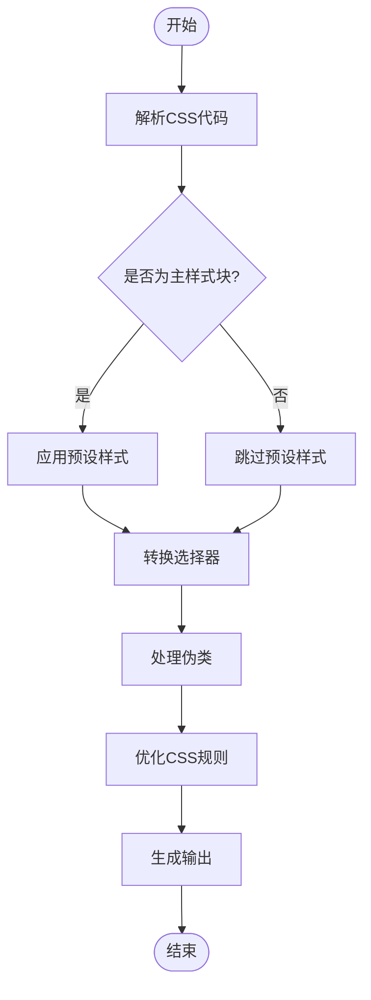
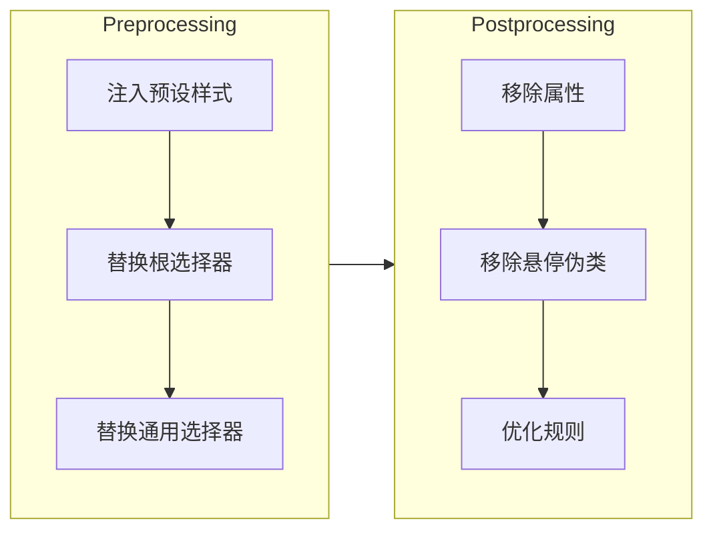
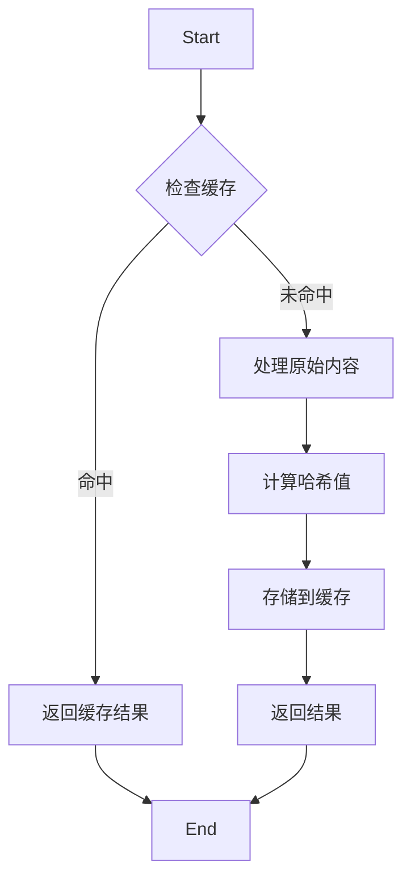
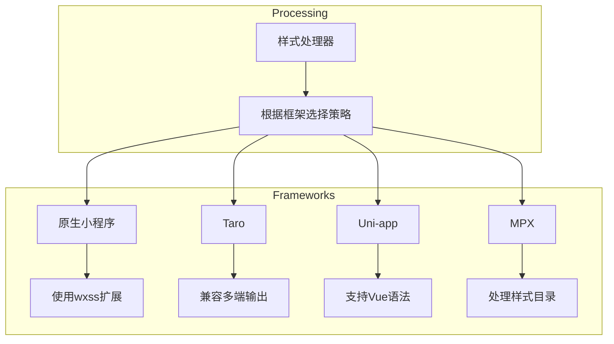

# 样式处理

<cite>
**本文档引用的文件**
- [core.ts](file://packages/weapp-tailwindcss/src/core.ts)
- [style-handler.ts](file://packages/weapp-tailwindcss/src/lightningcss/style-handler.ts)
- [types/index.ts](file://packages/weapp-tailwindcss/src/types/index.ts)
- [pipeline.ts](file://packages/postcss/src/pipeline.ts)
- [handler.ts](file://packages/postcss/src/handler.ts)
- [types.ts](file://packages/postcss/src/types.ts)
- [defaults.ts](file://packages/weapp-tailwindcss/src/defaults.ts)
- [context/index.ts](file://packages/weapp-tailwindcss/src/context/index.ts)
- [cache/index.ts](file://packages/weapp-tailwindcss/src/cache/index.ts)
</cite>

## 目录
1. [简介](#简介)
2. [核心组件](#核心组件)
3. [样式处理流程](#样式处理流程)
4. [核心数据结构](#核心数据结构)
5. [预处理与后处理](#预处理与后处理)
6. [缓存机制](#缓存机制)
7. [框架适配策略](#框架适配策略)
8. [使用示例](#使用示例)

## 简介
weapp-tailwindcss 的样式处理系统为小程序环境提供了完整的 Tailwind CSS 支持。该系统通过一系列处理器将标准的 CSS 规则和 Tailwind 类名转换为小程序可识别的样式格式。核心功能包括样式解析、类名转换、规则优化和跨框架适配，确保在不同小程序平台上的兼容性和性能。

## 核心组件

样式处理系统由多个核心组件构成，包括样式处理器、上下文管理器和缓存系统。这些组件协同工作，实现从原始 CSS 到小程序样式文件的完整转换流程。

**Section sources**
- [core.ts](file://packages/weapp-tailwindcss/src/core.ts#L1-L76)
- [context/index.ts](file://packages/weapp-tailwindcss/src/context/index.ts#L1-L133)

## 样式处理流程

样式处理流程分为多个阶段：预处理、转换和后处理。系统首先解析原始 CSS 代码，然后应用 Tailwind CSS 的转换规则，最后生成优化后的小程序样式。



**Diagram sources**
- [style-handler.ts](file://packages/weapp-tailwindcss/src/lightningcss/style-handler.ts#L1-L485)
- [pipeline.ts](file://packages/postcss/src/pipeline.ts#L1-L278)

## 核心数据结构

### StyleProcessor
StyleProcessor 是样式处理的核心接口，定义了处理 CSS 代码的基本方法。它接收原始 CSS 字符串和配置选项，返回处理后的结果。

### ProcessOptions
ProcessOptions 接口定义了样式处理的各种配置选项，包括预设样式、选择器替换规则和性能优化选项。

```mermaid
classDiagram
class StyleProcessor {
+transformWxss(rawCss : string, options? : Partial~IStyleHandlerOptions~) : Promise~LightningcssStyleHandlerResult~
+transformWxml(rawWxml : string, options? : ITemplateHandlerOptions) : Promise~string~
+transformJs(rawJs : string, options : { runtimeSet? : Set~string~ } & CreateJsHandlerOptions) : Promise~JsHandlerResult~
}
class ProcessOptions {
+cssPreflight : CssPreflightOptions
+cssSelectorReplacement : { root? : string | string[] | false, universal? : string | string[] | false }
+cssChildCombinatorReplaceValue : string | string[]
+cssRemoveProperty : boolean
+cssRemoveHoverPseudoClass : boolean
+cssPresetEnv : PresetEnvOptions
+uniAppX : boolean
+majorVersion : number
}
StyleProcessor --> ProcessOptions : "使用"
```

**Diagram sources**
- [types.ts](file://packages/postcss/src/types.ts#L1-L99)
- [types/index.ts](file://packages/weapp-tailwindcss/src/types/index.ts#L1-L190)

## 预处理与后处理

### 预处理阶段
预处理阶段主要负责注入预设样式和替换特殊选择器。系统会根据配置自动注入 Tailwind 的 Preflight 样式，并将通用选择器替换为小程序组件。

### 后处理阶段
后处理阶段专注于优化和清理生成的 CSS 代码。这包括移除不必要的属性、优化选择器特异性以及处理小程序特定的限制。



**Diagram sources**
- [handler.ts](file://packages/postcss/src/handler.ts#L1-L44)
- [style-handler.ts](file://packages/weapp-tailwindcss/src/lightningcss/style-handler.ts#L1-L485)

## 缓存机制

缓存系统采用 LRU（最近最少使用）算法管理处理结果，提高重复构建的效率。系统为每个处理任务生成唯一的哈希值，用于快速查找缓存。



**Diagram sources**
- [cache/index.ts](file://packages/weapp-tailwindcss/src/cache/index.ts#L1-L151)
- [pipeline.ts](file://packages/postcss/src/pipeline.ts#L1-L278)

## 框架适配策略

样式处理系统支持多种小程序框架，包括原生小程序、Taro、Uni-app 等。每种框架都有特定的适配策略，确保生成的样式符合框架要求。



**Diagram sources**
- [defaults.ts](file://packages/weapp-tailwindcss/src/defaults.ts#L1-L138)
- [context/index.ts](file://packages/weapp-tailwindcss/src/context/index.ts#L1-L133)

## 使用示例

### 基本使用
```typescript
import { createContext } from '@weapp-tailwindcss/core'

const context = createContext({
  cssPreflight: {
    'box-sizing': 'border-box',
    'border-width': '0'
  },
  cssSelectorReplacement: {
    root: 'page',
    universal: ['view', 'text']
  }
})

const result = await context.transformWxss('.container { @apply flex p-4; }')
```

### 高级配置
```typescript
const context = createContext({
  cssPresetEnv: {
    features: {
      'custom-properties': { preserve: true },
      'is-pseudo-class': { specificityMatchingName: 'weapp-tw-ig' }
    }
  },
  cssCalc: true,
  rem2rpx: {
    rootValue: 37.5,
    unitPrecision: 6
  }
})
```

**Section sources**
- [core.ts](file://packages/weapp-tailwindcss/src/core.ts#L1-L76)
- [types.ts](file://packages/postcss/src/types.ts#L1-L99)