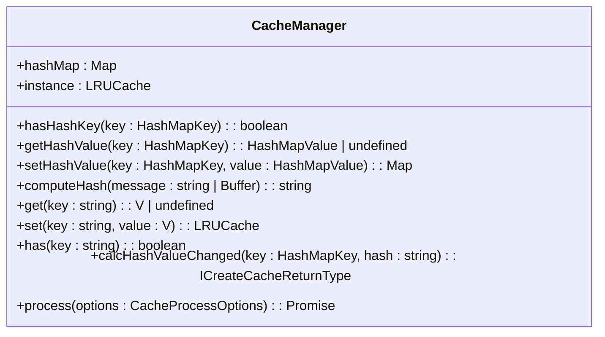
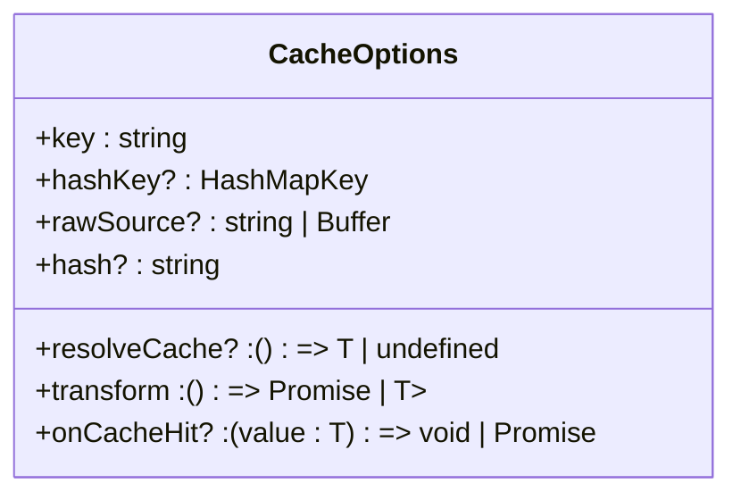
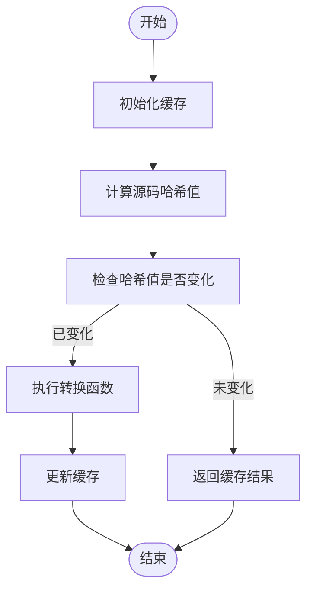
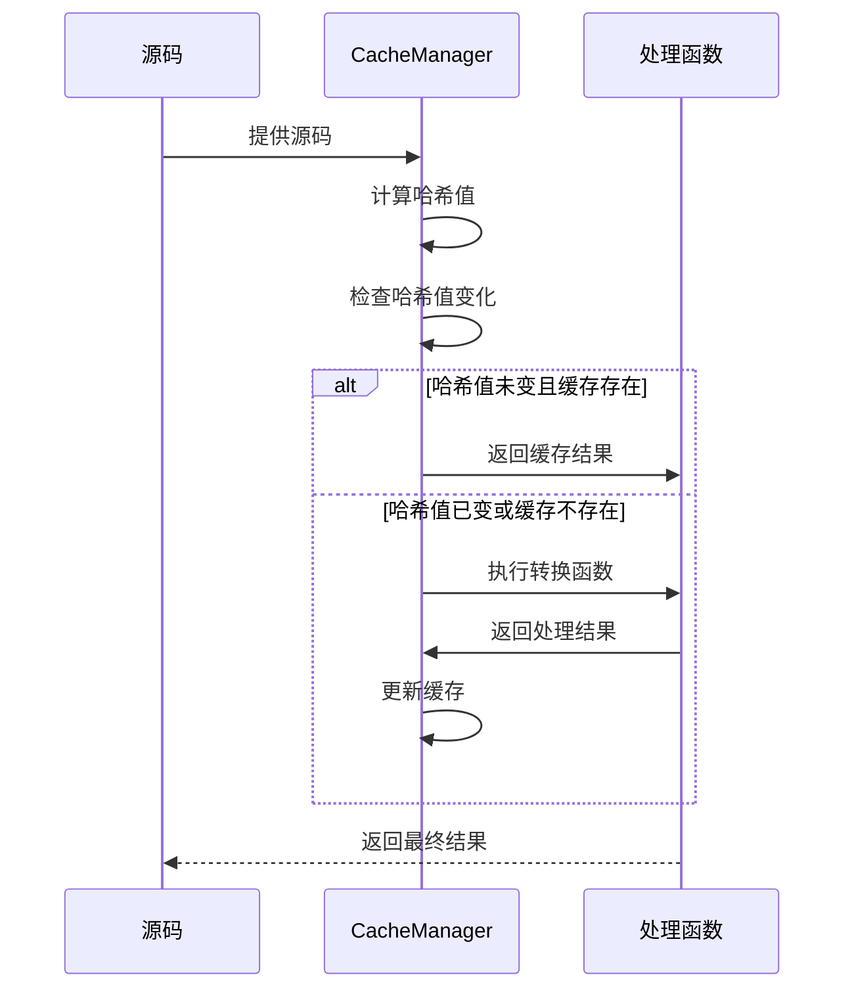
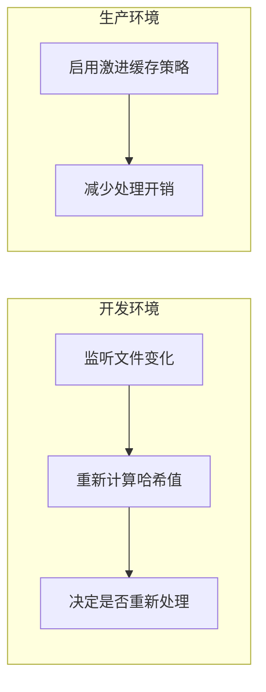

# 缓存机制

<cite>
**本文档引用的文件**  
- [index.ts](file://packages/weapp-tailwindcss/src/cache/index.ts)
- [md5.ts](file://packages/weapp-tailwindcss/src/cache/md5.ts)
- [cache.ts](file://packages/weapp-tailwindcss/src/bundlers/shared/cache.ts)
- [compiler-context-cache.ts](file://packages/weapp-tailwindcss/src/context/compiler-context-cache.ts)
- [cache.test.ts](file://packages/weapp-tailwindcss/test/cache.test.ts)
- [context-cache.test.ts](file://packages/weapp-tailwindcss/test/context-cache.test.ts)
- [vite/index.ts](file://packages/weapp-tailwindcss/src/bundlers/vite/index.ts)
</cite>

## 目录
1. [简介](#简介)
2. [核心数据结构](#核心数据结构)
3. [缓存机制工作流程](#缓存机制工作流程)
4. [缓存策略与失效管理](#缓存策略与失效管理)
5. [开发与生产环境中的缓存使用](#开发与生产环境中的缓存使用)
6. [性能优化与跨平台缓存管理](#性能优化与跨平台缓存管理)
7. [实际应用示例](#实际应用示例)
8. [总结](#总结)

## 简介

weapp-tailwindcss 的缓存系统旨在提升构建性能和开发体验，通过智能缓存处理结果、管理缓存依赖和处理缓存失效等机制，确保在不同开发环境中高效运行。本文档详细介绍了缓存机制在样式处理流程中的作用，并结合 TypeScript 类型定义，解释了 `CacheManager`、`CacheOptions` 等核心数据结构的设计和用途。

**Section sources**
- [index.ts](file://packages/weapp-tailwindcss/src/cache/index.ts#L1-L150)

## 核心数据结构

### CacheManager

`CacheManager` 是缓存系统的核心组件，负责管理缓存实例和哈希映射。它提供了基本的缓存操作接口，如 `get`、`set`、`has` 等。



**Diagram sources**
- [index.ts](file://packages/weapp-tailwindcss/src/cache/index.ts#L30-L42)

### CacheOptions

`CacheOptions` 定义了缓存处理的选项，包括缓存键、哈希键、原始源码、哈希值、解析缓存函数、转换函数和缓存命中回调函数。



**Diagram sources**
- [index.ts](file://packages/weapp-tailwindcss/src/cache/index.ts#L20-L28)

## 缓存机制工作流程

缓存机制的工作流程主要包括以下几个步骤：

1. **初始化缓存**：调用 `createCache` 函数创建缓存实例。
2. **计算哈希值**：使用 `computeHash` 方法计算源码的 MD5 哈希值。
3. **检查缓存变化**：通过 `calcHashValueChanged` 方法判断源码是否发生变化。
4. **处理缓存**：调用 `process` 方法执行缓存处理逻辑，如果源码未变且缓存存在，则直接返回缓存结果；否则执行转换函数并更新缓存。



**Diagram sources**
- [index.ts](file://packages/weapp-tailwindcss/src/cache/index.ts#L98-L137)

## 缓存策略与失效管理

### 缓存策略

缓存策略主要基于 LRU（最近最少使用）算法，最大缓存数量为 1024，无 TTL（生存时间）。通过 `hashMap` 记录每个文件的哈希值和变化状态，确保只有当源码发生变化时才重新处理。

### 缓存失效管理

缓存失效管理通过 `calcHashValueChanged` 方法实现。该方法会比较当前哈希值与之前的哈希值，若不同则标记为已变化，并更新 `hashMap` 中的记录。



**Diagram sources**
- [index.ts](file://packages/weapp-tailwindcss/src/cache/index.ts#L79-L93)

## 开发与生产环境中的缓存使用

### 开发环境

在开发环境中，缓存系统通过监听文件变化来动态更新缓存。每次文件修改后，系统会重新计算哈希值并决定是否需要重新处理。

### 生产环境

在生产环境中，缓存系统更加注重性能优化。由于生产环境下的文件通常不会频繁变动，因此可以启用更激进的缓存策略，减少不必要的处理开销。



**Diagram sources**
- [vite/index.ts](file://packages/weapp-tailwindcss/src/bundlers/vite/index.ts#L349-L370)

## 性能优化与跨平台缓存管理

### 性能优化

- **LRU 缓存**：采用 LRU 算法，确保最常用的资源优先保留。
- **哈希值计算**：使用 MD5 算法快速计算源码哈希值，减少重复处理。
- **异步处理**：所有缓存操作均为异步，避免阻塞主线程。

### 跨平台缓存管理

跨平台缓存管理通过统一的 API 接口实现，支持 Vite 和 Webpack 等多种构建工具。通过 `processCachedTask` 函数封装通用的缓存处理逻辑，确保在不同平台上的一致性。

```mermaid
classDiagram
class ProcessCachedTask {
+cache : ICreateCacheReturnType
+cacheKey : string
+hashKey? : HashMapKey
+rawSource? : string
+readCache? : () => TValue | undefined
+applyResult : (value : TValue) => void | Promise<void>
+transform : () => Promise<{ result : TValue, cacheValue? : CacheValue }>
+onCacheHit? : () => void
}
ProcessCachedTask --> CacheManager : 使用
```

**Diagram sources**
- [cache.ts](file://packages/weapp-tailwindcss/src/bundlers/shared/cache.ts#L3-L15)

## 实际应用示例

### Vite 插件中的缓存使用

在 Vite 插件中，`processCachedTask` 函数被广泛用于处理 HTML、JS 和 CSS 文件的缓存。以下是一个处理 HTML 文件的示例：

```typescript
await processCachedTask<string>({
  cache,
  cacheKey: file,
  rawSource,
  applyResult(source) {
    originalSource.source = source;
  },
  onCacheHit() {
    debug('html cache hit: %s', file);
  },
  async transform() {
    const transformed = await templateHandler(rawSource, {
      runtimeSet: runtime,
    });
    onUpdate(file, rawSource, transformed);
    debug('html handle: %s', file);
    return {
      result: transformed,
    };
  },
});
```

**Section sources**
- [vite/index.ts](file://packages/weapp-tailwindcss/src/bundlers/vite/index.ts#L349-L370)

## 总结

weapp-tailwindcss 的缓存系统通过高效的缓存策略和灵活的缓存管理机制，显著提升了构建性能和开发体验。无论是开发环境还是生产环境，都能通过合理的配置实现最佳性能。通过 TypeScript 类型定义和详细的 API 文档，开发者可以轻松理解和使用这一强大的缓存系统。

**Section sources**
- [index.ts](file://packages/weapp-tailwindcss/src/cache/index.ts#L1-L150)
- [cache.ts](file://packages/weapp-tailwindcss/src/bundlers/shared/cache.ts#L1-L44)
- [compiler-context-cache.ts](file://packages/weapp-tailwindcss/src/context/compiler-context-cache.ts#L1-L209)