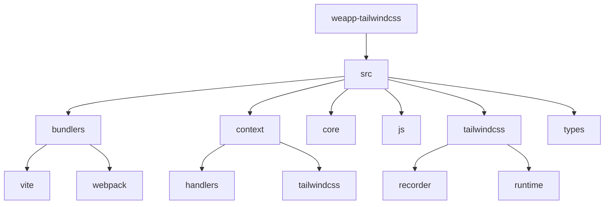
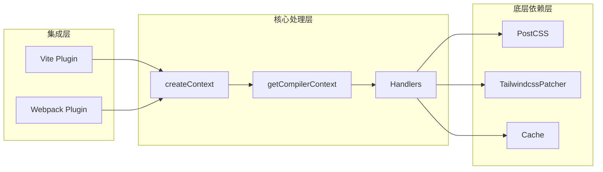
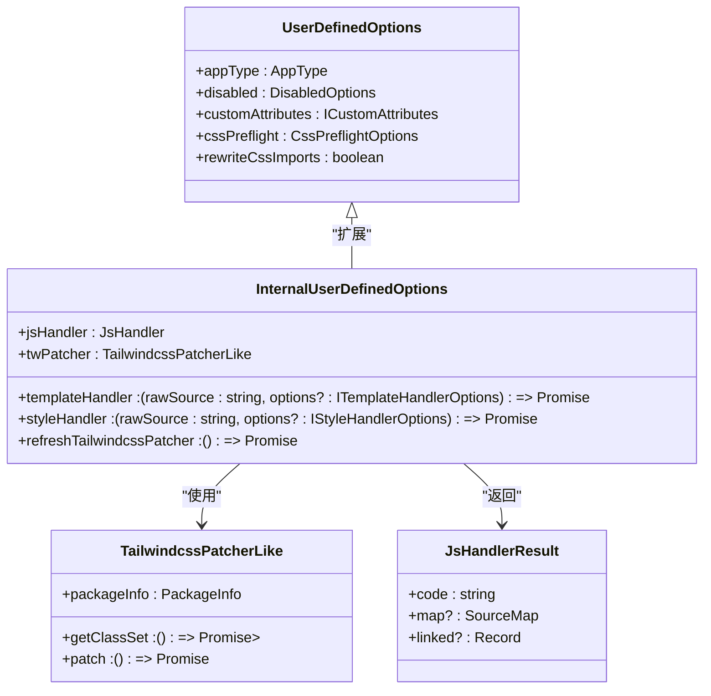
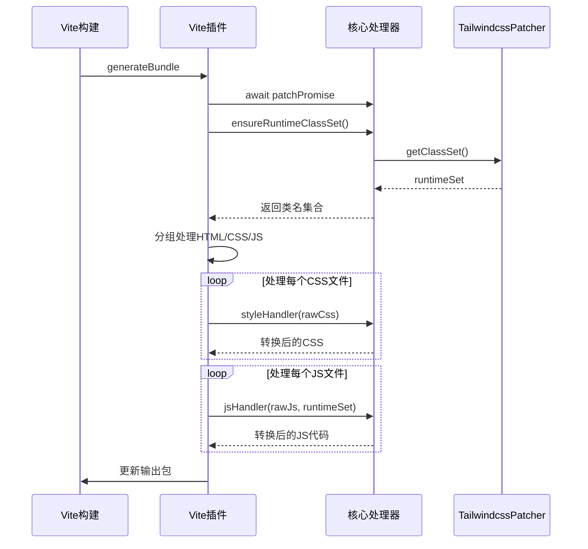
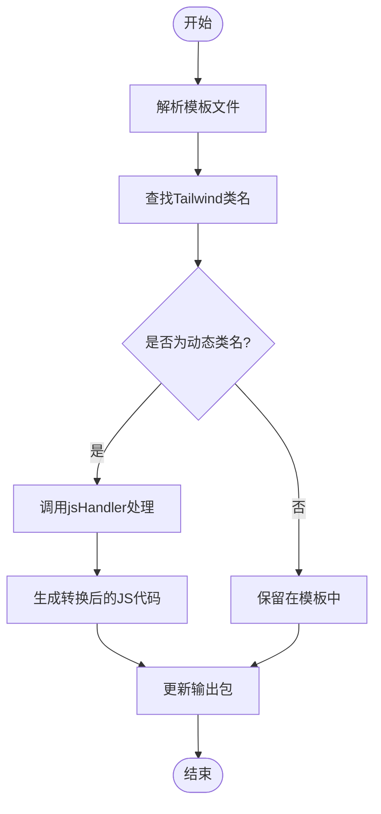

# 预处理器

<cite>
**本文档引用的文件**
- [core.ts](file://packages/weapp-tailwindcss/src/core.ts)
- [types/index.ts](file://packages/weapp-tailwindcss/src/types/index.ts)
- [context/index.ts](file://packages/weapp-tailwindcss/src/context/index.ts)
- [vite/index.ts](file://packages/weapp-tailwindcss/src/bundlers/vite/index.ts)
- [postcss-html-transform.ts](file://packages/weapp-tailwindcss/src/postcss-html-transform.ts)
- [package.json](file://packages/weapp-tailwindcss/package.json)
</cite>

## 目录
1. [简介](#简介)
2. [项目结构](#项目结构)
3. [核心组件](#核心组件)
4. [架构概述](#架构概述)
5. [详细组件分析](#详细组件分析)
6. [依赖分析](#依赖分析)
7. [性能考虑](#性能考虑)
8. [故障排除指南](#故障排除指南)
9. [结论](#结论)

## 简介
weapp-tailwindcss 是一个专为小程序开发设计的 Tailwind CSS 预处理系统，旨在将 Tailwind CSS 的原子化样式思想引入微信小程序、Taro、uni-app 等多端框架。该系统通过构建一个完整的预处理管道，实现了对 CSS 选择器解析、Tailwind 类名处理、CSS-in-JS 语法转换等关键功能的支持。预处理器作为整个系统的核心，负责在构建过程中分析和转换样式代码，确保 Tailwind 类名能够正确生成并注入到小程序的运行时环境中。本 API 文档将深入解析预处理器的工作机制，涵盖其核心数据结构、处理流程以及在不同框架中的集成方式。

## 项目结构
weapp-tailwindcss 项目采用 monorepo 结构，核心预处理逻辑位于 `packages/weapp-tailwindcss` 目录下。该目录包含了处理小程序样式、模板和脚本的核心模块。



**图示来源**
- [core.ts](file://packages/weapp-tailwindcss/src/core.ts)
- [context/index.ts](file://packages/weapp-tailwindcss/src/context/index.ts)
- [bundlers/vite/index.ts](file://packages/weapp-tailwindcss/src/bundlers/vite/index.ts)

**本节来源**
- [package.json](file://packages/weapp-tailwindcss/package.json#L1-L215)

## 核心组件
预处理系统的核心由 `createContext` 函数驱动，该函数根据用户配置创建一个包含 `transformWxss`、`transformWxml` 和 `transformJs` 方法的上下文对象。`transformWxss` 负责处理 CSS 样式，`transformWxml` 处理 WXML 模板，而 `transformJs` 则处理 JavaScript 代码中的类名。这些处理函数依赖于 `TailwindcssPatcher` 来获取当前项目中所有可能生成的 Tailwind 类名集合（runtime class set），并利用 `styleHandler`、`templateHandler` 和 `jsHandler` 进行具体的转换操作。整个流程通过 `patchPromise` 确保在 Tailwind CSS 配置和补丁应用完成后再进行转换，保证了处理的准确性和一致性。

**本节来源**
- [core.ts](file://packages/weapp-tailwindcss/src/core.ts#L1-L76)
- [types/index.ts](file://packages/weapp-tailwindcss/src/types/index.ts#L1-L190)

## 架构概述
weapp-tailwindcss 预处理系统采用分层架构，从上至下分为集成层、核心处理层和底层依赖层。集成层（如 Vite 和 Webpack 插件）负责与构建工具对接，监听构建事件。核心处理层是系统的中枢，`getCompilerContext` 函数根据用户选项初始化所有处理程序和状态，`createContext` 则暴露具体的转换 API。底层依赖层包括 `@weapp-tailwindcss/postcss` 包，它提供了处理 CSS 的 PostCSS 插件，以及 `tailwindcss-patch`，用于与不同版本的 Tailwind CSS 进行兼容性适配。数据流从构建工具的输入文件开始，经过预处理器的分析和转换，最终输出为小程序可识别的样式和模板代码。



**图示来源**
- [core.ts](file://packages/weapp-tailwindcss/src/core.ts)
- [context/index.ts](file://packages/weapp-tailwindcss/src/context/index.ts)
- [bundlers/vite/index.ts](file://packages/weapp-tailwindcss/src/bundlers/vite/index.ts)

## 详细组件分析

### 核心上下文与类型定义分析
`getCompilerContext` 函数是整个预处理系统的入口点，它接收用户定义的选项 `UserDefinedOptions`，并将其合并为一个完整的 `InternalUserDefinedOptions` 对象。这个过程包括初始化缓存、创建 Tailwind CSS 补丁器（`TailwindcssPatcherLike`）、以及根据上下文创建 `styleHandler`、`jsHandler` 和 `templateHandler`。`TailwindcssPatcherLike` 接口定义了与 Tailwind CSS 交互的核心方法，如 `getClassSet` 用于获取运行时类名集合，`patch` 用于应用必要的补丁。`PreprocessOptions` 的设计体现了高度的可配置性，允许用户自定义类名转义、自定义属性处理、跨文件分析等行为。



**图示来源**
- [types/index.ts](file://packages/weapp-tailwindcss/src/types/index.ts#L1-L190)
- [context/index.ts](file://packages/weapp-tailwindcss/src/context/index.ts#L1-L133)

**本节来源**
- [types/index.ts](file://packages/weapp-tailwindcss/src/types/index.ts#L1-L190)
- [context/index.ts](file://packages/weapp-tailwindcss/src/context/index.ts#L1-L133)

### Vite 集成流程分析
Vite 集成通过 `UnifiedViteWeappTailwindcssPlugin` 函数实现。该插件在 `generateBundle` 钩子中执行核心逻辑。首先，它会等待 `patchPromise` 确保 Tailwind CSS 补丁已应用。然后，它会收集输出包中的所有 HTML、CSS 和 JS 文件，并分组处理。对于 CSS 文件，它调用 `styleHandler` 进行转换；对于 JS 文件，它调用 `jsHandler` 并传入通过 `ensureRuntimeClassSet` 获取的运行时类名集合。插件还支持 `uni-app-x` 等特定平台的处理，并通过 `processCachedTask` 实现缓存，以提升构建性能。整个流程通过 `pushConcurrentTaskFactories` 并发执行，优化了处理效率。



**图示来源**
- [bundlers/vite/index.ts](file://packages/weapp-tailwindcss/src/bundlers/vite/index.ts#L1-L479)
- [core.ts](file://packages/weapp-tailwindcss/src/core.ts#L1-L76)

**本节来源**
- [bundlers/vite/index.ts](file://packages/weapp-tailwindcss/src/bundlers/vite/index.ts#L1-L479)

### 样式与模板处理流程分析
预处理器对样式和模板的处理是其核心功能。`postcss-html-transform` 是一个关键的 PostCSS 插件，它被集成到 Vite 的 PostCSS 配置中，负责在构建过程中处理 HTML 模板中的 Tailwind 类名。`styleHandler` 负责解析和转换 CSS 文件，它会处理 `@tailwind` 指令，并将 Tailwind 的原子化规则注入到最终的样式表中。`templateHandler` 则负责分析 WXML 或其他模板文件，识别其中的 Tailwind 类名，并确保它们被正确地保留在输出中。`jsHandler` 处理 JavaScript 中的动态类名，例如在 `className` 或 `class` 绑定中使用模板字符串的情况，确保这些动态生成的类名也能被正确识别和处理。



**图示来源**
- [postcss-html-transform.ts](file://packages/weapp-tailwindcss/src/postcss-html-transform.ts#L1-L7)
- [core.ts](file://packages/weapp-tailwindcss/src/core.ts#L1-L76)

**本节来源**
- [postcss-html-transform.ts](file://packages/weapp-tailwindcss/src/postcss-html-transform.ts#L1-L7)
- [core.ts](file://packages/weapp-tailwindcss/src/core.ts#L1-L76)

## 依赖分析
weapp-tailwindcss 预处理系统依赖于多个关键的外部包。`@weapp-tailwindcss/postcss` 提供了核心的 PostCSS 处理能力，`tailwindcss-patch` 是与 Tailwind CSS 主库进行交互的桥梁，负责版本兼容和补丁应用。`@babel/parser` 和 `@babel/traverse` 用于解析和分析 JavaScript 代码，以支持对动态类名的处理。`magic-string` 用于高效地生成源码映射（source map）。这些依赖共同构成了预处理器的功能基础，使其能够深入分析和转换代码。

```mermaid
graph TD
A[weapp-tailwindcss] --> B[@weapp-tailwindcss/postcss]
A --> C[tailwindcss-patch]
A --> D[@babel/parser]
A --> E[@babel/traverse]
A --> F[magic-string]
A --> G[lru-cache]
B --> H[postcss]
C --> I[tailwindcss]
```

**图示来源**
- [package.json](file://packages/weapp-tailwindcss/package.json#L189-L212)

**本节来源**
- [package.json](file://packages/weapp-tailwindcss/package.json#L189-L212)

## 性能考虑
预处理器通过多种机制来优化性能。首先，它实现了基于 `lru-cache` 的缓存系统，对已处理的文件进行缓存，避免重复计算。其次，在 Vite 插件中，它使用 `processCachedTask` 函数来管理缓存任务，并通过 `pushConcurrentTaskFactories` 并发执行多个处理任务，充分利用多核 CPU 的性能。此外，`refreshTailwindRuntimeState` 和 `collectRuntimeClassSet` 函数的调用被精心安排，确保只在必要时才重新计算运行时类名集合，减少了不必要的开销。这些优化措施共同保证了在大型项目中也能保持较快的构建速度。

## 故障排除指南
当预处理器工作不正常时，可以检查以下几个方面：首先，确认 `tailwind.config.js` 文件存在且配置正确，因为 `TailwindcssPatcher` 依赖于此文件。其次，检查构建工具（如 Vite 或 Webpack）的配置，确保 `weapp-tailwindcss` 插件已正确注册。如果遇到类名未被处理的问题，可以尝试清除缓存，因为旧的缓存可能导致状态不一致。最后，启用 `logLevel` 为 `debug` 可以输出详细的日志信息，帮助定位问题。

**本节来源**
- [context/index.ts](file://packages/weapp-tailwindcss/src/context/index.ts#L75-L83)
- [core.ts](file://packages/weapp-tailwindcss/src/core.ts#L30-L32)

## 结论
weapp-tailwindcss 的预处理系统是一个功能强大且设计精巧的工具，它成功地将 Tailwind CSS 的开发体验带到了小程序生态。通过 `createContext` API 和 `InternalUserDefinedOptions` 类型定义，它为开发者提供了高度的灵活性和可配置性。其分层架构和对缓存、并发的优化，确保了系统的高性能和可维护性。无论是 Taro 还是 uni-app 项目，该预处理器都能无缝集成，为开发者提供一致的、高效的原子化 CSS 开发体验。