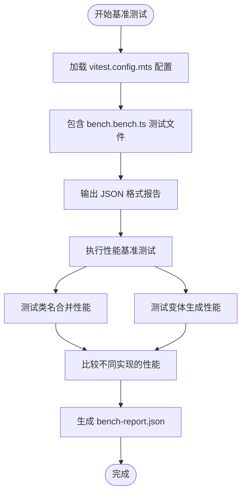
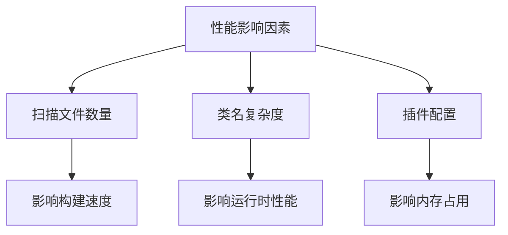
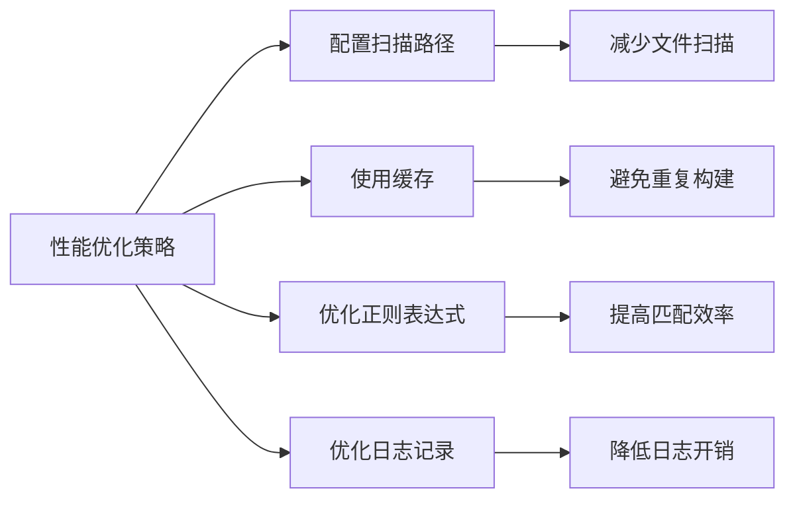

# 性能问题

<cite>
**本文档引用的文件**
- [bench.bench.ts](file://benchmark/tailwindcss3/bench.bench.ts)
- [bench.bench.ts](file://benchmark/tailwindcss4/bench.bench.ts)
- [vitest.config.mts](file://benchmark/tailwindcss3/vitest.config.mts)
- [vitest.config.mts](file://benchmark/tailwindcss4/vitest.config.mts)
- [turbo.json](file://turbo.json)
- [package.json](file://package.json)
- [index.ts](file://packages/logger/src/index.ts)
</cite>

## 目录
1. [简介](#简介)
2. [基准测试与性能监控](#基准测试与性能监控)
3. [关键性能影响因素](#关键性能影响因素)
4. [性能优化策略](#性能优化策略)
5. [生产环境调优建议](#生产环境调优建议)
6. [结论](#结论)

## 简介
本指南旨在解决 WeApp TailwindCSS 项目中的性能问题，包括构建速度慢、内存占用高和运行时性能下降等问题。通过分析项目中的基准测试配置和性能监控工具，提供全面的性能优化策略和最佳实践。

## 基准测试与性能监控

本项目使用 Vitest 进行基准测试，通过 `bench.bench.ts` 文件定义了详细的性能测试用例。测试涵盖了 TailwindCSS v3 和 v4 版本的合并和变体功能，比较了不同实现的性能表现。

**Diagram sources**
- [vitest.config.mts](file://benchmark/tailwindcss3/vitest.config.mts#L1-L11)
- [vitest.config.mts](file://benchmark/tailwindcss4/vitest.config.mts#L1-L11)

**Section sources**
- [vitest.config.mts](file://benchmark/tailwindcss3/vitest.config.mts#L1-L11)
- [vitest.config.mts](file://benchmark/tailwindcss4/vitest.config.mts#L1-L11)

## 关键性能影响因素

### 扫描文件数量
项目使用 Turborepo 进行任务编排，`turbo.json` 文件中定义了构建任务的依赖关系和输出文件。过多的文件扫描会显著影响构建性能。

### 类名复杂度
基准测试显示，类名的复杂度直接影响合并性能。测试中使用了包含多个 TailwindCSS 类的复杂类名组合，用于评估不同实现的性能差异。

### 插件配置
项目中的 `package.json` 包含了大量的开发依赖，这些依赖的配置和使用方式会影响整体性能。特别是 PostCSS、Webpack 和 Vite 相关的插件配置。

**Diagram sources**
- [turbo.json](file://turbo.json#L1-L71)
- [package.json](file://package.json#L1-L277)

**Section sources**
- [turbo.json](file://turbo.json#L1-L71)
- [package.json](file://package.json#L1-L277)

## 性能优化策略

### 合理配置内容扫描路径
通过优化 `turbo.json` 中的 `outputs` 配置，可以减少不必要的文件扫描，提高构建效率。

### 使用缓存机制
利用 Turborepo 的缓存功能，避免重复构建。在 `turbo.json` 中，`dev` 任务已设置 `cache: false`，但在生产构建中应启用缓存。

### 优化正则表达式匹配
在处理类名合并时，优化正则表达式匹配逻辑，减少不必要的字符串操作。

### 日志记录优化
使用 `@weapp-tailwindcss/logger` 包中的 `consola` 进行日志记录，避免使用性能开销大的日志输出方式。

**Diagram sources**
- [turbo.json](file://turbo.json#L1-L71)
- [index.ts](file://packages/logger/src/index.ts#L1-L10)

**Section sources**
- [turbo.json](file://turbo.json#L1-L71)
- [index.ts](file://packages/logger/src/index.ts#L1-L10)

## 生产环境调优建议

### 启用 Turborepo 缓存
在生产构建中确保启用 Turborepo 缓存，避免重复执行相同的构建任务。

### 限制依赖版本
在 `package.json` 中使用精确的依赖版本，避免因依赖更新导致的性能波动。

### 监控内存使用
定期监控构建过程中的内存使用情况，及时发现内存泄漏问题。

### 使用性能分析工具
利用内置的性能分析工具，定期进行性能基准测试，确保性能指标稳定。

**Section sources**
- [package.json](file://package.json#L1-L277)
- [turbo.json](file://turbo.json#L1-L71)

## 结论
通过合理配置构建工具、优化代码实现和使用性能监控工具，可以有效解决 WeApp TailwindCSS 项目中的性能问题。建议定期进行基准测试，持续优化性能关键路径，确保项目在生产环境中的稳定性和高效性。