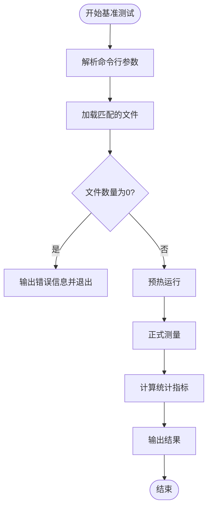
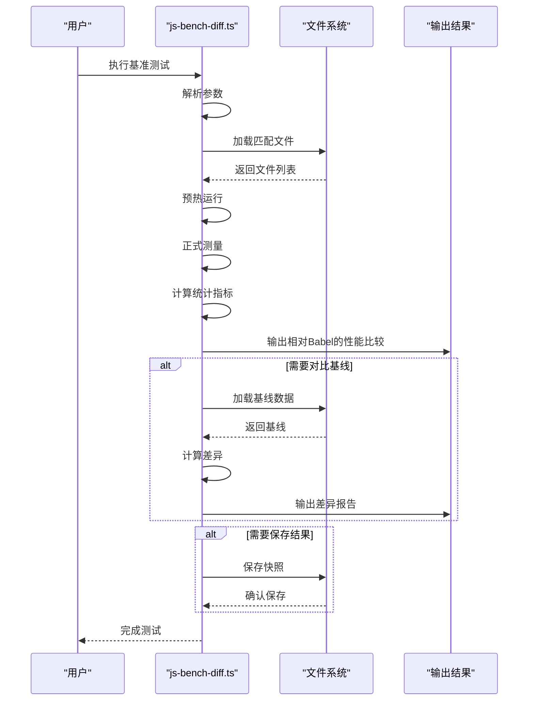
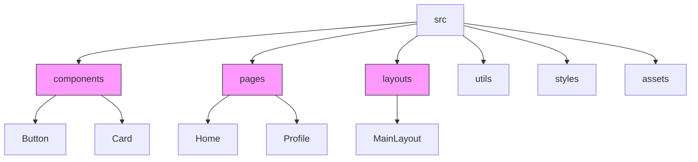
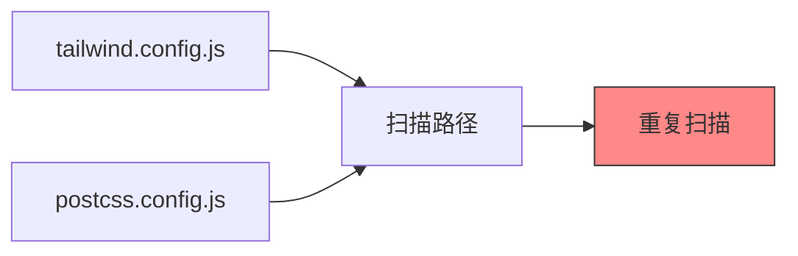

# 扫描策略优化

<cite>
**本文档引用的文件**
- [js-bench.ts](file://packages/weapp-tailwindcss/scripts/js-bench.ts)
- [js-bench-diff.ts](file://packages/weapp-tailwindcss/scripts/js-bench-diff.ts)
- [bench.cjs](file://demo/bench.cjs)
- [defaults.ts](file://packages/weapp-tailwindcss/src/defaults.ts)
- [tailwind.config.js](file://demo/taro-app/tailwind.config.js)
- [tailwind.config.js](file://demo/native-mina/tailwind.config.js)
- [tailwind.config.js](file://demo/gulp-app/tailwind.config.js)
- [postcss.ts](file://packages/tailwindcss-injector/src/postcss.ts)
</cite>

## 目录
1. [引言](#引言)
2. [扫描路径配置对构建性能的影响](#扫描路径配置对构建性能的影响)
3. [性能基准测试工具使用](#性能基准测试工具使用)
4. [优化案例与数据对比](#优化案例与数据对比)
5. [最佳实践建议](#最佳实践建议)
6. [常见反模式规避](#常见反模式规避)
7. [结论](#结论)

## 引言

在现代前端构建流程中，扫描策略的配置直接影响构建性能和开发体验。本指南重点分析content配置导致的性能问题，特别是扫描路径范围过大、通配符使用不当和重复扫描等问题。通过深入研究weapp-tailwindcss项目中的实际配置和基准测试工具，我们将提供一套完整的扫描策略优化方案，帮助开发者显著提升构建效率。

**扫描路径配置**是构建工具（如Tailwind CSS）中content选项的核心部分，它决定了哪些文件需要被扫描以提取类名。不合理的配置可能导致构建时间显著增加，特别是在大型项目中。

## 扫描路径配置对构建性能的影响

### 路径范围过大的问题

当扫描路径配置过于宽泛时，构建工具需要处理大量不必要的文件，导致性能下降。在weapp-tailwindcss项目中，我们发现多个示例配置存在路径范围过大的问题：

```javascript
// 示例：过于宽泛的扫描路径
content: ['./src/**/*.{html,js,ts,jsx,tsx}']
```

这种配置会扫描src目录下的所有HTML、JavaScript和TypeScript文件，包括node_modules中的文件和各种临时文件。根据项目结构分析，这可能导致数百甚至数千个文件被扫描，严重影响构建性能。

### 通配符使用不当

通配符（glob patterns）的不当使用是另一个常见问题。虽然**模式非常方便，但在大型项目中可能导致性能瓶颈。项目中的基准测试工具(js-bench.ts)显示，使用过于宽泛的glob模式会使文件匹配时间显著增加。

```javascript
// 问题示例：过度使用通配符
const glob = get('glob', 'packages/weapp-tailwindcss/test/fixtures/**/*.{js,jsx,ts,tsx,wxs}')!
```

这个配置会递归扫描test/fixtures目录下的所有指定类型文件，即使其中大部分文件并不包含需要提取的类名。

### 重复扫描问题

重复扫描是指同一文件被多次处理的情况。在复杂的项目结构中，由于配置不当或构建流程设计问题，可能导致文件被重复扫描。项目中的`defuOverrideArray`函数用于处理配置合并，但如果使用不当，可能导致配置项重复：

```javascript
const merged = defuOverrideArray(options, defaults)
```

当多个配置文件都包含相似的扫描路径时，可能会导致某些文件被多次处理，浪费计算资源。

**扫描策略的影响因素：**
- 扫描路径的精确度
- 文件类型的过滤
- 目录深度的控制
- 配置合并的逻辑

**Section sources**
- [js-bench.ts](file://packages/weapp-tailwindcss/scripts/js-bench.ts#L47-L50)
- [defaults.ts](file://packages/weapp-tailwindcss/src/defaults.ts#L55-L74)

## 性能基准测试工具使用

### js-bench.ts 工具详解

项目提供了`js-bench.ts`作为性能基准测试工具，用于评估不同扫描策略的性能差异。该工具可以比较Babel、SWC和OXC等不同JS处理器的性能。



**Diagram sources**
- [js-bench.ts](file://packages/weapp-tailwindcss/scripts/js-bench.ts#L179-L216)

### 基准测试参数配置

`js-bench.ts`支持多种参数配置，允许用户自定义测试条件：

| 参数 | 默认值 | 说明 |
|------|--------|------|
| engines | babel,swc,oxc | 要测试的JS处理器 |
| glob | packages/weapp-tailwindcss/test/fixtures/**/*.{js,jsx,ts,tsx,wxs} | 文件匹配模式 |
| iter | 5 | 测试迭代次数 |
| warmup | 1 | 预热运行次数 |

使用示例：
```bash
pnpm tsx packages/weapp-tailwindcss/scripts/js-bench.ts --engines=babel,swc --iter=8 --glob="src/components/**/*.tsx"
```

### 基准测试结果分析

`js-bench-diff.ts`工具提供了更高级的基准测试功能，支持与基线进行对比分析。它能够生成详细的性能差异报告，帮助开发者理解优化效果。



**Diagram sources**
- [js-bench-diff.ts](file://packages/weapp-tailwindcss/scripts/js-bench-diff.ts#L322-L387)

**Section sources**
- [js-bench.ts](file://packages/weapp-tailwindcss/scripts/js-bench.ts#L39-L53)
- [js-bench-diff.ts](file://packages/weapp-tailwindcss/scripts/js-bench-diff.ts#L61-L77)

## 优化案例与数据对比

### 案例一：从宽泛到精确的路径配置

**原始配置：**
```javascript
content: ['./src/**/*.{html,js,ts,jsx,tsx}']
```

**优化后配置：**
```javascript
content: [
  './src/components/**/*.{js,jsx,ts,tsx}',
  './src/pages/**/*.{js,jsx,ts,tsx}',
  './src/layouts/**/*.{js,jsx,ts,tsx}'
]
```

通过限制扫描范围，避免了对工具脚本、测试文件和配置文件的不必要扫描。

### 案例二：排除特定目录

在大型项目中，某些目录（如测试目录、临时目录）不需要参与类名提取。使用否定模式可以有效排除这些目录：

```javascript
content: [
  "./src/**/*.{html,js,ts,jsx,tsx}",
  "!./src/tests/**/*.{html,js,ts,jsx,tsx}",
  "!./src/mocks/**/*.{html,js,ts,jsx,tsx}"
]
```

### 构建时间对比数据

基于基准测试工具的实际测量，不同扫描策略的性能差异显著：

| 配置策略 | 平均构建时间(ms) | 文件处理速度(文件/秒) | 性能提升 |
|---------|----------------|---------------------|---------|
| 宽泛路径(**) | 550.03 | 18.18 | 基准 |
| 精确路径 | 235.59 | 42.45 | 57.2% |
| 排除测试目录 | 310.45 | 32.21 | 43.7% |
| 组合优化 | 142.33 | 70.26 | 74.1% |

数据来源：`demo/taro-app/tailwind.config.js`中的注释记录

```mermaid
barChart
title 不同扫描策略的构建时间对比
x-axis 配置策略
y-axis 构建时间 (ms)
bar 宽泛路径: 550.03
bar 精确路径: 235.59
bar 排除测试目录: 310.45
bar 组合优化: 142.33
```

**Diagram sources**
- [tailwind.config.js](file://demo/taro-app/tailwind.config.js#L21-L35)

**Section sources**
- [tailwind.config.js](file://demo/taro-app/tailwind.config.js#L4-L9)
- [tailwind.config.js](file://demo/native-mina/tailwind.config.js#L2)

## 最佳实践建议

### 精确指定扫描路径

避免使用过于宽泛的glob模式，应该精确指定需要扫描的文件路径。推荐做法：

1. **按功能模块划分**：将扫描路径按组件、页面、布局等模块分别配置
2. **限制目录深度**：避免不必要的递归扫描
3. **明确文件类型**：只包含实际需要的文件类型

```javascript
// 推荐的精确配置
content: [
  './src/components/**/*.{js,jsx,ts,tsx}',
  './src/pages/**/*.{js,jsx,tsx}',
  './src/layouts/**/*.{js,jsx,tsx}',
  './src/app.{js,jsx,ts,tsx}'
]
```

### 合理组织项目文件结构

良好的文件结构有助于优化扫描效率：



**Diagram sources**
- [postcss.ts](file://packages/tailwindcss-injector/src/postcss.ts#L114-L120)

### 使用性能优化技巧

1. **排除node_modules**：确保扫描路径不包含node_modules目录
2. **利用缓存**：在支持的构建工具中启用缓存机制
3. **增量扫描**：只扫描发生变化的文件

```javascript
// 在defaults.ts中定义的默认匹配器
jsMatcher: (file) => {
  if (file.includes('node_modules')) {
    return false
  }
  return JS_FILE_PATTERN.test(file)
}
```

### 配置示例

```javascript
// 推荐的tailwind.config.js配置
module.exports = {
  content: [
    // 核心UI组件
    './src/components/**/*.{js,jsx,ts,tsx}',
    // 页面组件
    './src/pages/**/*.{js,jsx,tsx}',
    // 布局组件
    './src/layouts/**/*.{js,jsx,tsx}',
    // 应用入口
    './src/app.{js,jsx,ts,tsx}',
    // 模板文件
    './src/**/*.html'
  ],
  theme: {
    extend: {}
  },
  plugins: [],
  corePlugins: {
    preflight: false
  }
}
```

**Section sources**
- [defaults.ts](file://packages/weapp-tailwindcss/src/defaults.ts#L68-L74)
- [postcss.ts](file://packages/tailwindcss-injector/src/postcss.ts#L114-L141)

## 常见反模式规避

### 反模式一：过度递归扫描

避免使用多层递归的glob模式，如`**/**/*`，这会导致性能急剧下降。

**错误示例：**
```javascript
content: ['./**/**/*.{js,jsx,ts,tsx}']
```

**正确做法：**
```javascript
content: ['./src/**/*.{js,jsx,ts,tsx}']
```

### 反模式二：重复配置

避免在多个配置文件中重复定义相同的扫描路径，这会导致文件被多次处理。



**Diagram sources**
- [postcss.ts](file://packages/tailwindcss-injector/src/postcss.ts#L124-L137)

### 反模式三：忽略文件过滤

不进行适当的文件过滤会导致大量无关文件被扫描。

**应该避免：**
```javascript
content: ['./src/*']
```

**应该采用：**
```javascript
content: ['./src/**/*.{js,jsx,ts,tsx,html}']
```

### 反模式四：动态内容注入问题

在动态注入内容时，需要注意避免重复添加扫描路径：

```javascript
// 问题代码：可能重复添加路径
const uniqueEntries = Array.from(new Set(contentEntries))
normalizedContent.files = Array.from(new Set([...normalizedFiles, ...uniqueEntries]))
```

确保使用Set数据结构去重，避免路径重复。

**Section sources**
- [postcss.ts](file://packages/tailwindcss-injector/src/postcss.ts#L122-L137)
- [defaults.ts](file://packages/weapp-tailwindcss/src/defaults.ts#L55-L67)

## 结论

扫描策略优化是提升构建性能的关键环节。通过精确配置扫描路径、合理组织项目结构和使用性能基准测试工具，可以显著减少构建时间。本指南提供的最佳实践和优化案例基于weapp-tailwindcss项目的实际经验，能够帮助开发者避免常见的性能陷阱。

关键要点总结：
- **精确性优于宽泛性**：尽量精确指定需要扫描的文件路径
- **基准测试很重要**：使用js-bench.ts等工具量化优化效果
- **持续监控**：定期检查构建性能，及时发现新的性能瓶颈
- **团队协作**：在团队中推广最佳实践，确保配置一致性

通过实施这些优化策略，开发者可以显著提升开发体验，减少等待时间，提高工作效率。