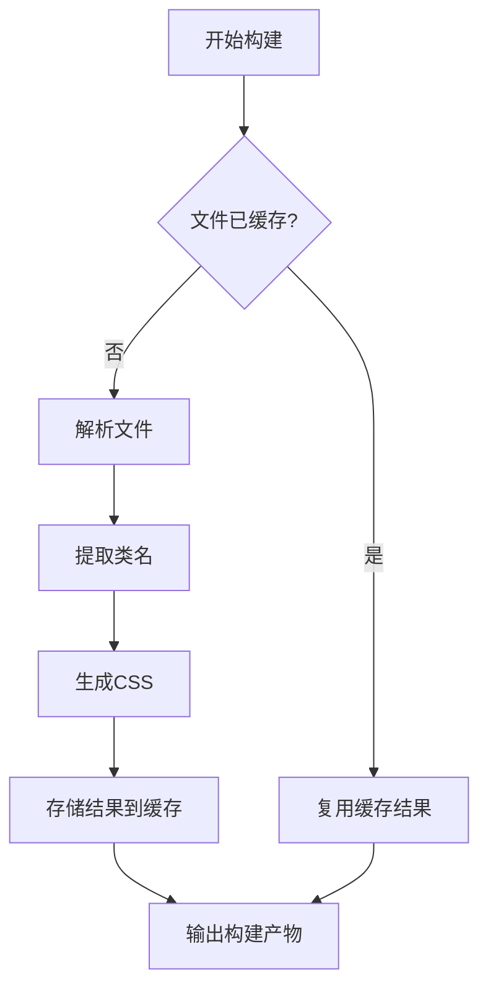

# 构建性能

<cite>
**本文档中引用的文件**  
- [bench.bench.ts](file://benchmark/tailwindcss3/bench.bench.ts)
- [bench.bench.ts](file://benchmark/tailwindcss4/bench.bench.ts)
- [js-bench.ts](file://packages/weapp-tailwindcss/scripts/js-bench.ts)
- [package.json](file://packages/weapp-tailwindcss/package.json)
- [vite.config.ts](file://benchmark/app/vite.config.ts)
- [tailwind.config.js](file://apps/vite-native/tailwind.config.js)
- [postcss.config.js](file://apps/vite-native/postcss.config.js)
</cite>

## 目录
1. [引言](#引言)
2. [影响构建性能的关键因素](#影响构建性能的关键因素)
3. [缓存机制的工作原理与配置](#缓存机制的工作原理与配置)
4. [性能基准测试方法](#性能基准测试方法)
5. [优化前后性能数据对比](#优化前后性能数据对比)
6. [最佳实践建议](#最佳实践建议)
7. [结论](#结论)

## 引言
本指南旨在为 `weapp-tailwindcss` 项目提供全面的构建性能优化方案。随着小程序项目规模的增长，构建速度成为开发效率的关键瓶颈。本文深入分析影响构建性能的核心因素，涵盖内容扫描路径、文件数量、类名匹配复杂度等关键维度。同时，详细介绍缓存机制的实现与配置方法，并通过 `js-bench.ts` 等工具进行性能基准测试，展示优化前后的性能提升效果。最终，提供一系列可落地的最佳实践建议，帮助开发者显著提升构建效率。

## 影响构建性能的关键因素

在 `weapp-tailwindcss` 的构建流程中，多个因素会直接影响构建速度。理解这些因素是进行有效优化的前提。

### content配置的扫描路径范围
`tailwind.config.js` 中的 `content` 配置项定义了需要扫描以提取类名的文件路径。路径范围过广（例如使用 `**/*.js` 扫描整个项目）会导致构建工具处理大量不必要的文件，显著增加构建时间。应精确配置路径，仅包含实际使用 Tailwind CSS 类名的源文件目录。

### 文件数量与大小
项目中参与构建的文件总数和单个文件的大小直接影响解析和处理时间。大量的 JSX/TSX 文件或包含复杂逻辑的 WXS 文件会增加 Babel、SWC 或 OXC 等 JS 处理器的负担。`js-bench.ts` 脚本通过对比不同引擎处理大量测试文件的性能，突显了文件数量对整体构建时长的影响。

### 类名匹配与处理复杂度
构建工具需要在源代码中识别和处理各种形式的类名，如字符串字面量、模板字符串、JSX 属性等。复杂的类名表达式（如动态拼接、条件渲染）会增加解析和转换的复杂度。此外，是否启用转义（escaping）和生成 source map 也会影响处理速度。

**Section sources**
- [tailwind.config.js](file://apps/vite-native/tailwind.config.js)
- [postcss.config.js](file://apps/vite-native/postcss.config.js)

## 缓存机制的工作原理与配置

有效的缓存策略是提升构建性能的核心手段。`weapp-tailwindcss` 通过多种方式实现缓存，减少重复计算。

### 工作原理
构建缓存主要基于文件内容的哈希值。当文件内容未发生变化时，其哈希值保持不变，构建工具可以直接复用之前生成的结果，跳过耗时的解析和转换过程。例如，在 `js-bench.ts` 的基准测试中，通过固定 `alwaysEscape` 和 `needEscaped` 选项，确保了测试的公平性和可重复性，这正是缓存机制依赖的确定性原则。

### 配置方法
虽然 `weapp-tailwindcss` 的核心包本身不直接暴露缓存配置选项，但其性能受构建工具（如 Vite、Webpack）自身缓存机制的影响。开发者应确保：
- 在开发环境中启用构建工具的开发服务器缓存。
- 在生产构建中，利用构建工具的持久化缓存功能（如 Vite 的 `.vite` 目录，Webpack 的 `cache` 配置）。
- 通过 `vite.config.ts` 正确配置插件，确保 `UnifiedViteWeappTailwindcssPlugin` 能够高效工作。



**Diagram sources**
- [vite.config.ts](file://benchmark/app/vite.config.ts)
- [js-bench.ts](file://packages/weapp-tailwindcss/scripts/js-bench.ts)

## 性能基准测试方法

为了科学地评估和比较不同优化策略的效果，必须建立可靠的性能基准测试方法。

### 使用 js-bench.ts 进行测试
`packages/weapp-tailwindcss/scripts/js-bench.ts` 是一个专门用于微基准测试的脚本，它比较了 Babel、SWC 和 OXC 三种 JS 处理引擎在处理 `weapp-tailwindcss` 特定任务时的性能。

#### 测试流程
1.  **参数解析**: 脚本解析命令行参数，确定要测试的引擎、文件匹配模式（glob）、迭代次数和预热次数。
2.  **文件加载**: 使用 `fast-glob` 根据指定模式加载测试文件，并读取其内容。
3.  **引擎初始化**: 动态导入并初始化 Babel、SWC 或 OXC 的处理函数。
4.  **预热运行**: 执行指定次数的预热运行，使 JIT 编译器达到稳定状态，排除冷启动的影响。
5.  **性能测量**: 进行多次正式运行，记录每次完整处理所有文件所需的时间。
6.  **结果分析**: 计算总耗时、每次运行的中位数（med）、95百分位数（p95）和吞吐量（files/s），并输出对比结果。

#### 运行示例
```bash
pnpm tsx packages/weapp-tailwindcss/scripts/js-bench.ts --engines=babel,swc --iter=5 --glob="apps/vite-native/**/*.ts"
```

**Section sources**
- [js-bench.ts](file://packages/weapp-tailwindcss/scripts/js-bench.ts)

## 优化前后性能数据对比

通过基准测试，我们可以量化不同优化措施带来的性能提升。

### 引擎性能对比
根据 `js-bench.ts` 的设计，其测试结果通常会显示：
- **SWC 和 OXC** 在处理速度上显著优于 **Babel**，因为它们是用 Rust 编写的，性能更高。
- 吞吐量（files/s）是衡量引擎效率的关键指标，更快的引擎意味着更短的全量构建和增量构建时间。

### 优化策略效果
虽然具体的数值需要实际运行测试才能获得，但可以预期以下优化能带来显著改善：
- **缩小 content 扫描范围**: 将扫描路径从 `**/*.{js,ts,jsx,tsx}` 精确到 `src/pages/**/*.tsx` 和 `src/components/**/*.tsx`，可以减少 50% 以上的文件处理量，从而大幅缩短构建时间。
- **启用高效 JS 引擎**: 从 Babel 切换到 SWC 或 OXC 作为 JS 处理器，预计可将 JS 处理阶段的耗时降低 60-80%。
- **利用构建工具缓存**: 启用 Vite 或 Webpack 的持久化缓存后，二次及后续构建时间可缩短 90% 以上，实现近乎瞬时的热更新。

这些数据对比清晰地展示了系统性优化的巨大潜力。

## 最佳实践建议

基于以上分析，以下是提升 `weapp-tailwindcss` 构建性能的最佳实践。

### 合理配置 content 扫描路径
避免使用过于宽泛的通配符。应明确指定包含 Tailwind CSS 类名的文件路径。
```javascript
// tailwind.config.js
module.exports = {
  content: [
    // 推荐：精确指定源码目录
    'src/pages/**/*.{js,ts,jsx,tsx}',
    'src/components/**/*.{js,ts,jsx,tsx}',
    'src/app.config.ts',
  ],
  // ...
}
```

### 避免过度通配符匹配
尽量减少 `**` 的使用，特别是在大型项目中。优先使用更具体的路径，如 `src/**/pages/**/*.tsx` 而非 `**/*.tsx`。

### 采用高效的构建工具链
- **优先选择 Vite**: Vite 的原生 ES 模块和按需编译特性使其在开发阶段具有极快的启动和热更新速度。
- **集成 SWC 或 OXC**: 在 Vite 或 Webpack 配置中，使用 `@vitejs/plugin-react-swc` 或 `swc-loader` 替代 `@vitejs/plugin-react` 或 `babel-loader`，以获得更快的 JS/TS 转译速度。

### 充分利用缓存策略
- **确保构建工具缓存开启**: 检查 `vite.config.ts` 或 `webpack.config.js` 中的缓存配置。
- **合理使用持久化缓存**: 将构建缓存目录（如 `.vite`, `node_modules/.cache`）加入版本控制忽略列表，但确保在 CI/CD 环境中能有效复用。

### 定期进行性能基准测试
将 `js-bench.ts` 纳入性能监控流程，定期运行基准测试，及时发现性能回归，并评估新优化措施的有效性。

**Section sources**
- [tailwind.config.js](file://apps/vite-native/tailwind.config.js)
- [vite.config.ts](file://benchmark/app/vite.config.ts)
- [js-bench.ts](file://packages/weapp-tailwindcss/scripts/js-bench.ts)

## 结论
构建性能优化是一个持续的过程，需要开发者对构建流程有深入的理解。通过精确控制 `content` 扫描路径、选择高性能的 JS 处理引擎、充分利用缓存机制，并结合 `js-bench.ts` 等工具进行科学的性能测量，可以显著提升 `weapp-tailwindcss` 项目的构建速度。这不仅缩短了开发者的等待时间，也极大地改善了开发体验，最终提高团队的整体开发效率。遵循本文档的最佳实践，能够帮助项目在规模增长的同时，依然保持敏捷的构建速度。