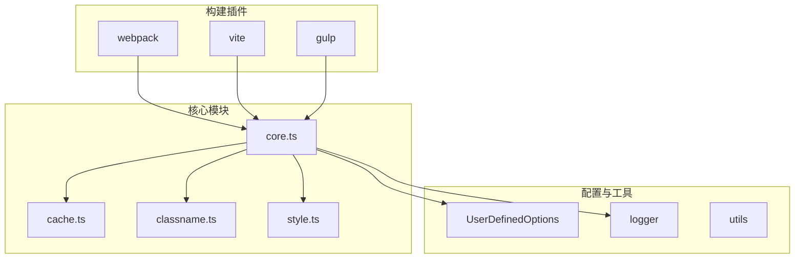
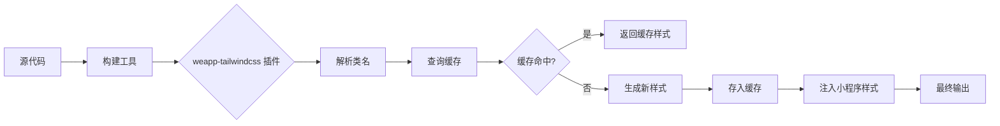
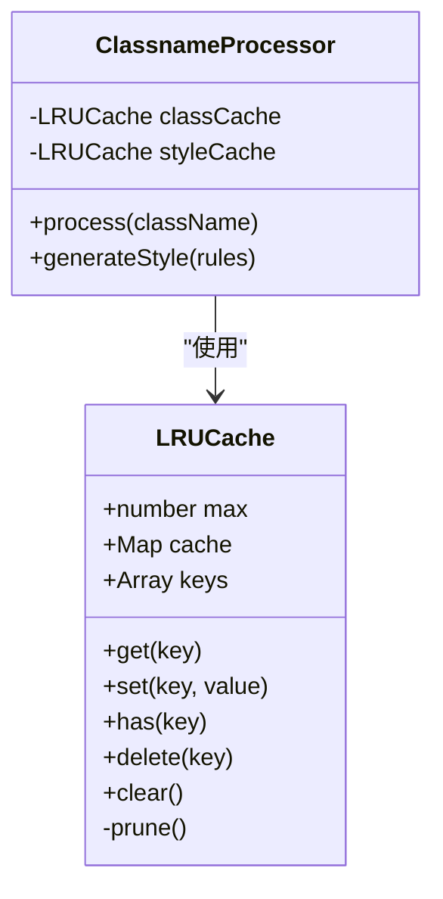

# 内存优化

<cite>
**本文档引用的文件**  
- [weapp-tailwindcss/package.json](file://packages/weapp-tailwindcss/package.json)
- [weapp-tailwindcss/README.md](file://packages/weapp-tailwindcss/README.md)
- [weapp-tailwindcss/src/index.ts](file://packages/weapp-tailwindcss/src/index.ts)
- [weapp-tailwindcss/src/core.ts](file://packages/weapp-tailwindcss/src/core.ts)
- [weapp-tailwindcss/src/cache.ts](file://packages/weapp-tailwindcss/src/cache.ts)
- [weapp-tailwindcss/src/utils/classname.ts](file://packages/weapp-tailwindcss/src/utils/classname.ts)
- [weapp-tailwindcss/src/transform/style.ts](file://packages/weapp-tailwindcss/src/transform/style.ts)
</cite>

## 目录
1. [引言](#引言)
2. [项目结构](#项目结构)
3. [核心组件](#核心组件)
4. [架构概述](#架构概述)
5. [详细组件分析](#详细组件分析)
6. [依赖分析](#依赖分析)
7. [性能考虑](#性能考虑)
8. [故障排除指南](#故障排除指南)
9. [结论](#结论)

## 引言
本指南旨在为使用 `weapp-tailwindcss` 的小程序开发者提供全面的内存优化策略。随着 Tailwind CSS 在小程序中的广泛应用，运行时内存占用问题逐渐显现，尤其是在类名缓存、样式规则存储和运行时对象创建等方面。本文将深入分析这些内存消耗的主要来源，并介绍缓存机制的实现原理与内存管理策略，帮助开发者通过合理配置缓存大小、清理策略以及最佳实践来显著降低内存占用。

## 项目结构
`weapp-tailwindcss` 是一个专为小程序设计的 Tailwind CSS 集成解决方案，支持多种构建工具（如 Webpack、Vite、Gulp）和主流框架（如 Taro、uni-app）。其核心功能是将 Tailwind 的原子化类名转换为小程序可识别的样式规则，并在构建时或运行时注入到页面中。



**图表来源**  
- [weapp-tailwindcss/src/core.ts](file://packages/weapp-tailwindcss/src/core.ts)
- [weapp-tailwindcss/src/cache.ts](file://packages/weapp-tailwindcss/src/cache.ts)
- [weapp-tailwindcss/src/utils/classname.ts](file://packages/weapp-tailwindcss/src/utils/classname.ts)
- [weapp-tailwindcss/src/transform/style.ts](file://packages/weapp-tailwindcss/src/transform/style.ts)

**本节来源**  
- [weapp-tailwindcss/README.md](file://packages/weapp-tailwindcss/README.md)
- [weapp-tailwindcss/package.json](file://packages/weapp-tailwindcss/package.json)

## 核心组件
`weapp-tailwindcss` 的核心组件包括类名解析器、样式转换器、缓存管理器和构建插件接口。这些组件协同工作，确保 Tailwind 类名能够高效地转换为小程序样式，并最小化运行时开销。

**本节来源**  
- [weapp-tailwindcss/src/index.ts](file://packages/weapp-tailwindcss/src/index.ts)
- [weapp-tailwindcss/src/core.ts](file://packages/weapp-tailwindcss/src/core.ts)

## 架构概述
该库采用模块化设计，核心逻辑与构建工具解耦。通过 `core` 模块提供通用的类名处理和样式生成能力，而 `webpack`、`vite` 等插件则负责与具体构建系统的集成。这种设计提高了代码的可维护性和扩展性。



**图表来源**  
- [weapp-tailwindcss/src/core.ts](file://packages/weapp-tailwindcss/src/core.ts)
- [weapp-tailwindcss/src/cache.ts](file://packages/weapp-tailwindcss/src/cache.ts)
- [weapp-tailwindcss/src/transform/style.ts](file://packages/weapp-tailwindcss/src/transform/style.ts)

## 详细组件分析

### 缓存机制分析
缓存是 `weapp-tailwindcss` 内存管理的核心。它使用 `lru-cache` 库来实现一个带最大容量限制的最近最少使用（LRU）缓存，有效避免内存无限增长。



**图表来源**  
- [weapp-tailwindcss/src/cache.ts](file://packages/weapp-tailwindcss/src/cache.ts)
- [weapp-tailwindcss/src/utils/classname.ts](file://packages/weapp-tailwindcss/src/utils/classname.ts)

#### 内存占用来源分析
1. **类名缓存**：每个唯一的类名及其解析后的 CSS 规则都会被缓存。
2. **样式规则存储**：生成的内联样式字符串会占用内存。
3. **AST 对象创建**：在解析和转换过程中会创建大量的抽象语法树（AST）节点。

**本节来源**  
- [weapp-tailwindcss/src/cache.ts](file://packages/weapp-tailwindcss/src/cache.ts)
- [weapp-tailwindcss/src/transform/style.ts](file://packages/weapp-tailwindcss/src/transform/style.ts)

## 依赖分析
`weapp-tailwindcss` 依赖于多个关键库来实现其功能，其中对内存管理影响最大的是 `lru-cache`。

```mermaid
graph TD
A[weapp-tailwindcss] --> B[lru-cache]
A --> C[@babel/parser]
A --> D[magic-string]
A --> E[tailwindcss-patch]
B --> F[内存缓存管理]
C --> G[AST 解析]
D --> H[代码生成]
E --> I[Tailwind 核心功能]
```

**图表来源**  
- [weapp-tailwindcss/package.json](file://packages/weapp-tailwindcss/package.json)

**本节来源**  
- [weapp-tailwindcss/package.json](file://packages/weapp-tailwindcss/package.json)

## 性能考虑
为了优化内存使用，建议采取以下措施：
- 合理设置缓存大小，避免缓存过多不常用的类名。
- 避免在模板中使用大量动态生成的、不可预测的类名。
- 定期监控应用的内存使用情况，特别是在复杂页面中。

## 故障排除指南
如果遇到内存占用过高的问题，请检查：
- 是否有大量重复或冗余的类名被频繁使用。
- 缓存配置是否合理，`max` 值是否过大。
- 是否存在内存泄漏，例如未正确清理的事件监听器或定时器。

**本节来源**  
- [weapp-tailwindcss/src/cache.ts](file://packages/weapp-tailwindcss/src/cache.ts)
- [weapp-tailwindcss/README.md](file://packages/weapp-tailwindcss/README.md)

## 结论
通过深入理解 `weapp-tailwindcss` 的内部缓存机制和内存管理策略，开发者可以有效地控制小程序的内存占用。合理利用缓存、避免不必要的类名生成，并结合性能监控工具，可以构建出既美观又高效的轻量级小程序应用。