# 渲染优化

<cite>
**本文档引用文件**   
- [style-handler.ts](file://packages/weapp-tailwindcss/src/lightningcss/style-handler.ts)
- [post.ts](file://packages/postcss/src/plugins/post.ts)
- [pre.ts](file://packages/postcss/src/plugins/pre.ts)
- [CssInJsDemo.vue](file://apps/vue-app/src/features/history/CssInJsDemo.vue)
- [cssInJsRuntime.ts](file://apps/vue-app/src/lib/cssInJsRuntime.ts)
- [weapp-style-injector.ts](file://packages/weapp-style-injector/src/index.ts)
- [theme-transition.css](file://packages-runtime/theme-transition/css/index.css)
- [environment.ts](file://packages-runtime/theme-transition/src/utils/environment.ts)
- [geometry.ts](file://packages-runtime/theme-transition/src/utils/geometry.ts)
- [transitionDuration.ts](file://packages/tailwindcss-core-plugins-extractor/src/corePlugins/transitionDuration.ts)
- [transitionDelay.ts](file://packages/tailwindcss-core-plugins-extractor/src/corePlugins/transitionDelay.ts)
</cite>

## 目录
1. [引言](#引言)
2. [渲染性能瓶颈分析](#渲染性能瓶颈分析)
3. [样式注入优化策略](#样式注入优化策略)
4. [高效使用变体与样式规则](#高效使用变体与样式规则)
5. [渲染性能监控方法](#渲染性能监控方法)
6. [实际优化案例与效果评估](#实际优化案例与效果评估)
7. [结论](#结论)

## 引言

小程序界面渲染卡顿是影响用户体验的关键问题。本指南旨在深入分析渲染性能瓶颈，包括样式注入频率、DOM更新开销、重排重绘成本等，并提供系统性的优化方案。通过减少不必要的样式计算和DOM操作，优化样式注入时机和批量处理机制，结合高效使用变体、避免过度嵌套、简化样式规则等最佳实践，实现流畅的界面渲染体验。

**Section sources**
- [style-handler.ts](file://packages/weapp-tailwindcss/src/lightningcss/style-handler.ts#L1-L485)

## 渲染性能瓶颈分析

### 样式注入频率与开销

在小程序开发中，频繁的样式注入会导致性能下降。项目中的 `weapp-style-injector` 插件负责将预定义的样式文件注入到目标样式表中，但若配置不当或注入时机不合理，会增加编译和运行时的负担。

```mermaid
flowchart TD
A[源样式文件] --> B{是否匹配注入规则?}
B --> |是| C[注入@import语句]
B --> |否| D[跳过处理]
C --> E[生成最终样式文件]
D --> E
```

**Diagram sources **
- [weapp-style-injector.ts](file://packages/weapp-style-injector/src/index.ts#L1-L37)

### DOM更新与重排重绘成本

动态主题切换等场景下，直接覆写style属性会导致频繁的DOM更新，进而引发浏览器的重排（reflow）和重绘（repaint）。这些操作是昂贵的，尤其是在复杂布局中。

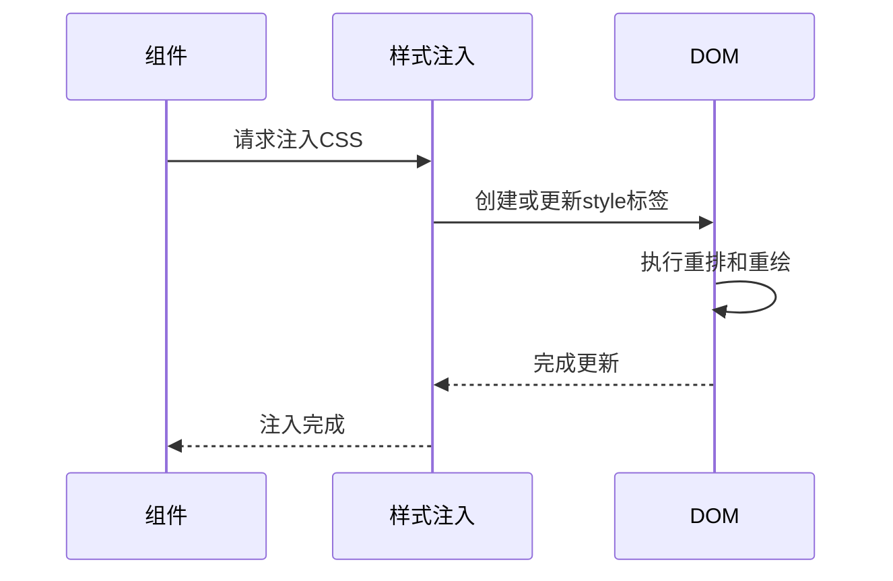

**Diagram sources **
- [cssInJsRuntime.ts](file://apps/vue-app/src/lib/cssInJsRuntime.ts#L1-L23)
- [CssInJsDemo.vue](file://apps/vue-app/src/features/history/CssInJsDemo.vue#L93-L95)

### 预处理与后处理阶段的性能影响

样式处理分为预处理和后处理两个阶段。预处理阶段通过 `postcssWeappTailwindcssPrePlugin` 进行变量定义和基础样式设置，而后处理阶段则负责选择器兜底、声明去重与变量排序。

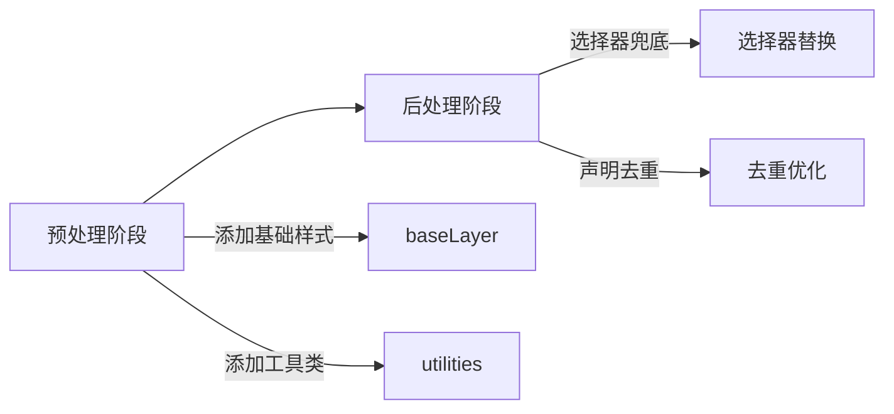

**Diagram sources **
- [pre.ts](file://packages/postcss/src/plugins/pre.ts#L29-L66)
- [post.ts](file://packages/postcss/src/plugins/post.ts#L273-L334)

## 样式注入优化策略

### 减少不必要的样式计算

通过配置 `cssPreflight` 选项，可以控制是否注入预设样式。禁用不需要的预设可以减少最终CSS文件的大小和解析时间。

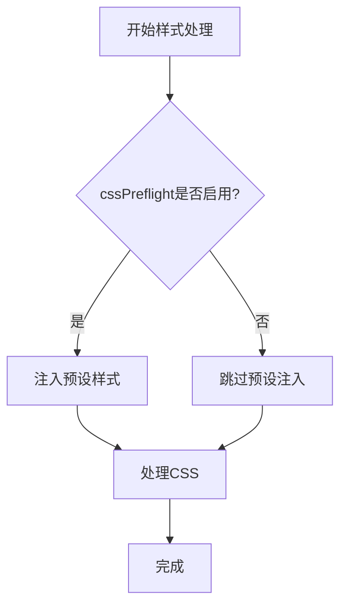

**Diagram sources **
- [style-handler.ts](file://packages/weapp-tailwindcss/src/lightningcss/style-handler.ts#L127-L128)

### 优化样式注入时机

利用缓存机制避免重复处理相同的样式文件。在Webpack插件中，通过 `processCachedTask` 实现缓存检查，只有当缓存未命中时才执行实际的样式处理。

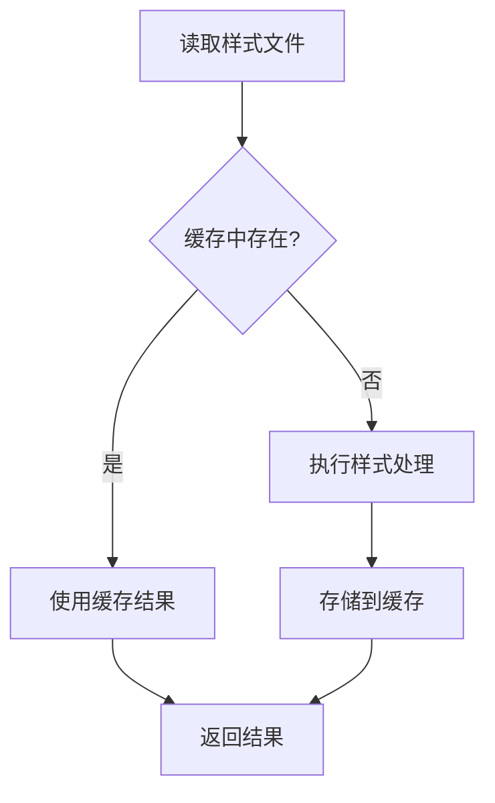

**Diagram sources **
- [v4.ts](file://packages/weapp-tailwindcss/src/bundlers/webpack/BaseUnifiedPlugin/v4.ts#L388-L437)
- [v5.ts](file://packages/weapp-tailwindcss/src/bundlers/webpack/BaseUnifiedPlugin/v5.ts#L385-L435)

### 批量处理机制

将多个样式文件的处理任务合并为批处理操作，减少I/O操作次数。通过 `Promise.all` 并行处理所有任务，提高整体效率。

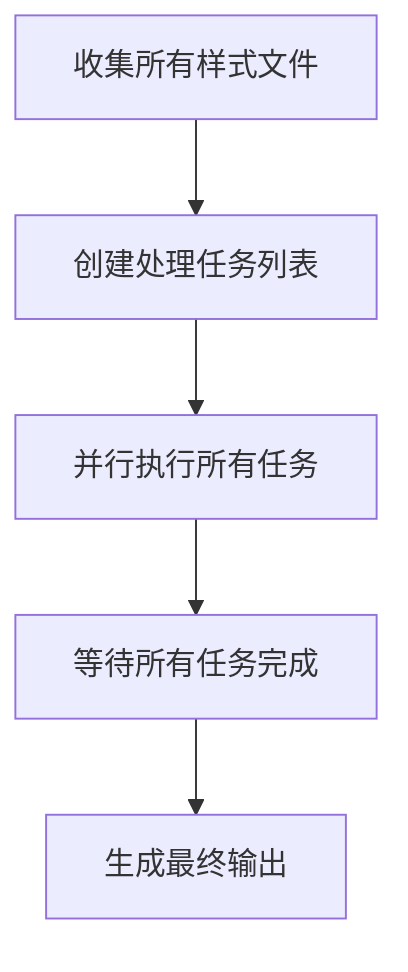

**Section sources**
- [v4.ts](file://packages/weapp-tailwindcss/src/bundlers/webpack/BaseUnifiedPlugin/v4.ts#L432-L433)
- [v5.ts](file://packages/weapp-tailwindcss/src/bundlers/webpack/BaseUnifiedPlugin/v5.ts#L428-L429)

## 高效使用变体与样式规则

### 合理使用变体（Variants）

Tailwind CSS 提供了丰富的变体支持，如 `hover`、`focus` 等。合理使用这些变体可以减少自定义CSS的编写，但过度使用会导致CSS文件膨胀。

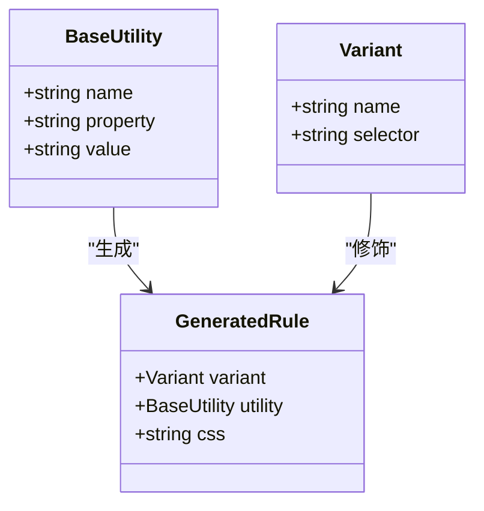

**Diagram sources **
- [transitionDuration.ts](file://packages/tailwindcss-core-plugins-extractor/src/corePlugins/transitionDuration.ts#L1-L29)
- [transitionDelay.ts](file://packages/tailwindcss-core-plugins-extractor/src/corePlugins/transitionDelay.ts#L1-L29)

### 避免过度嵌套

CSS选择器的嵌套层级过深会增加样式的复杂性和匹配成本。应尽量保持扁平化的结构，避免不必要的嵌套。

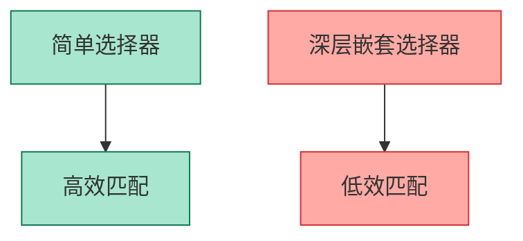

**Section sources**
- [post.ts](file://packages/postcss/src/plugins/post.ts#L273-L334)

### 简化样式规则

通过后处理阶段的去重和排序优化，消除冗余的CSS声明。例如，逻辑属性与变量重复定义时，保留最优组合。

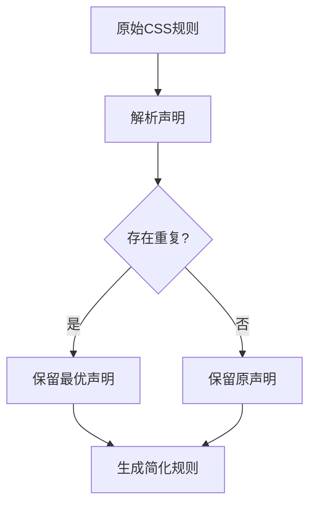

**Diagram sources **
- [post.ts](file://packages/postcss/src/plugins/post.ts#L172-L270)

## 渲染性能监控方法

### 帧率监测

通过浏览器开发者工具或小程序调试面板监控页面渲染帧率（FPS），确保动画和交互过程中的帧率稳定在60FPS以上。

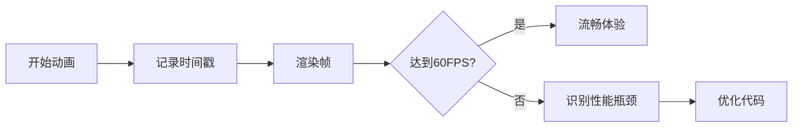

**Section sources**
- [environment.ts](file://packages-runtime/theme-transition/src/utils/environment.ts#L34-L36)

### 渲染耗时分析

使用性能分析工具（如Chrome DevTools Performance面板）记录关键渲染路径的耗时，重点关注样式计算、布局、绘制等阶段的时间消耗。

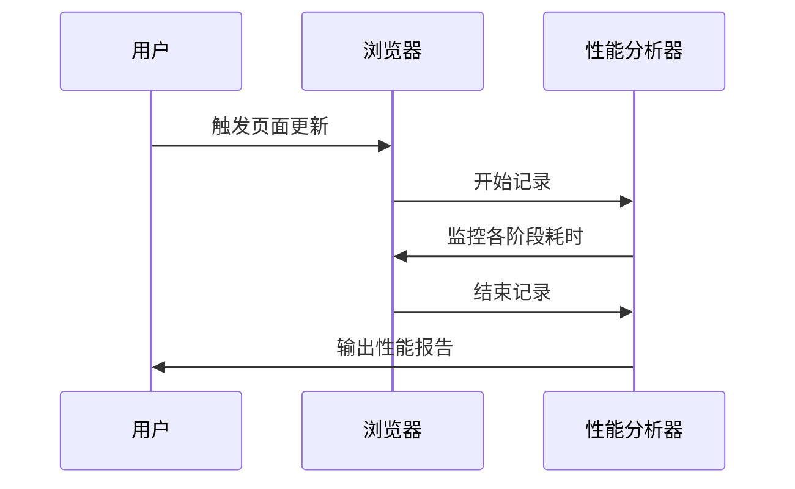

**Section sources**
- [geometry.ts](file://packages-runtime/theme-transition/src/utils/geometry.ts#L42-L68)

## 实际优化案例与效果评估

### 动态主题切换优化

在 `CssInJsDemo.vue` 中，通过 `injectCss` 方法实现动态主题切换。每次切换主题时，直接覆写style标签内容，避免了重新创建DOM节点的开销。

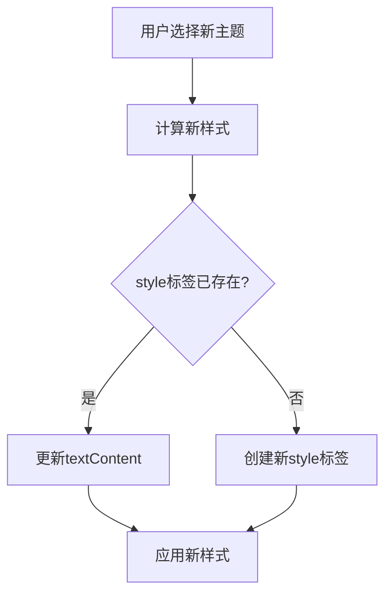

**Diagram sources **
- [cssInJsRuntime.ts](file://apps/vue-app/src/lib/cssInJsRuntime.ts#L8-L23)
- [CssInJsDemo.vue](file://apps/vue-app/src/features/history/CssInJsDemo.vue#L93-L95)

### 视图转换动画优化

利用CSS视图转换（View Transitions）API实现平滑的主题切换动画。通过 `::view-transition-old` 和 `::view-transition-new` 伪元素分别控制旧视图和新视图的动画效果。

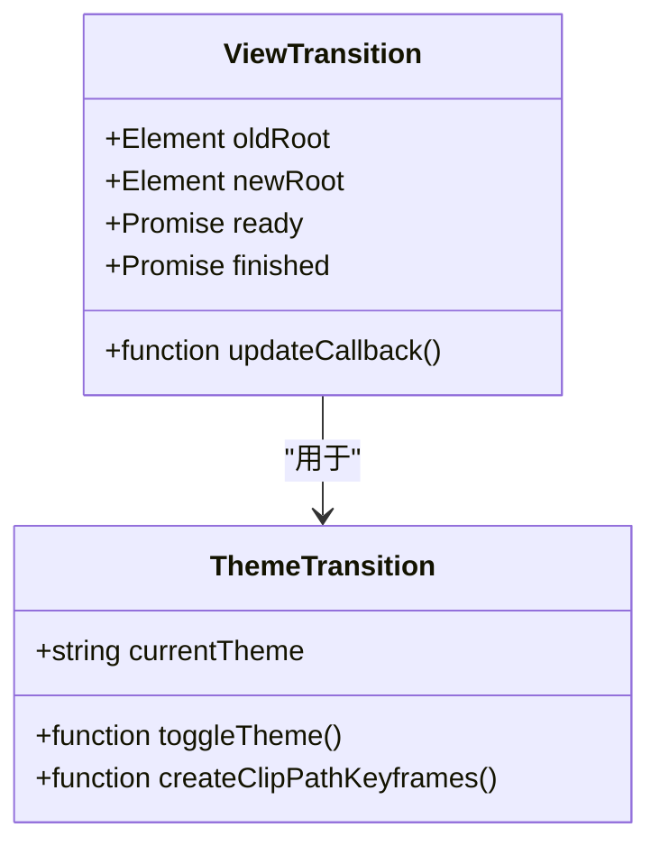

**Diagram sources **
- [theme-transition.css](file://packages-runtime/theme-transition/css/index.css#L1-L21)
- [environment.ts](file://packages-runtime/theme-transition/src/utils/environment.ts#L30-L32)

## 结论

通过系统性地分析和优化渲染性能瓶颈，我们可以显著提升小程序的界面流畅度。关键在于减少不必要的样式计算和DOM操作，优化样式注入时机和批量处理机制，并结合高效的变体使用和简洁的样式规则。同时，建立完善的性能监控体系，持续跟踪和评估优化效果，确保用户体验始终处于最佳状态。