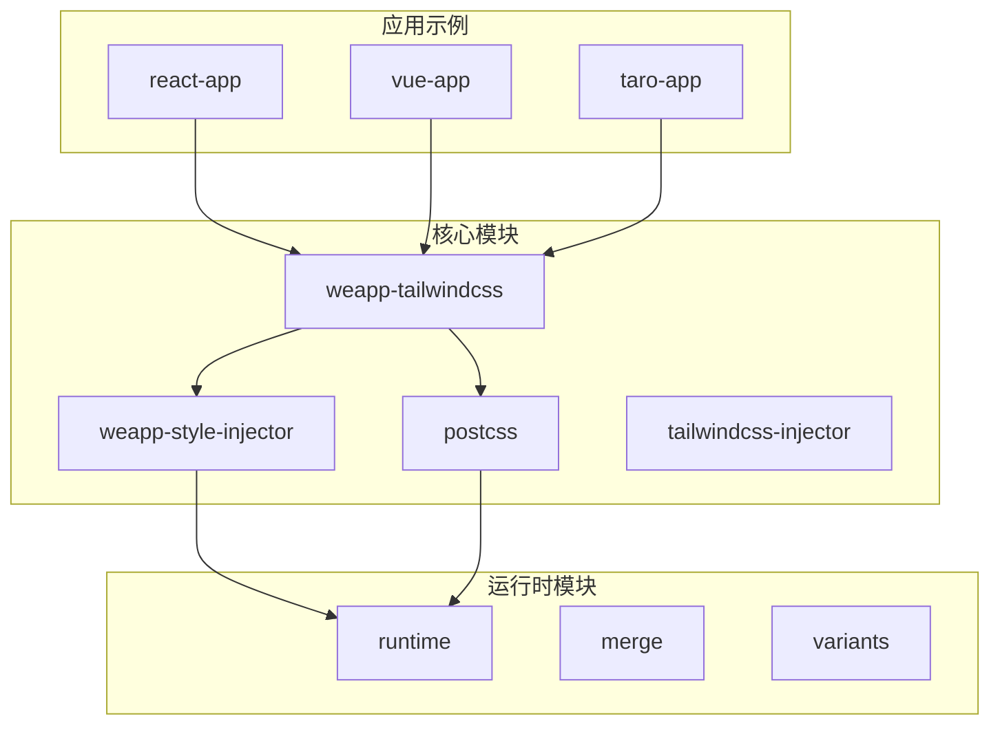
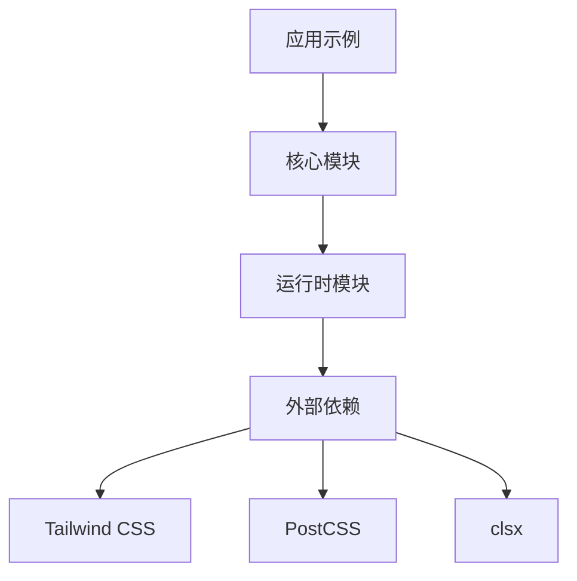
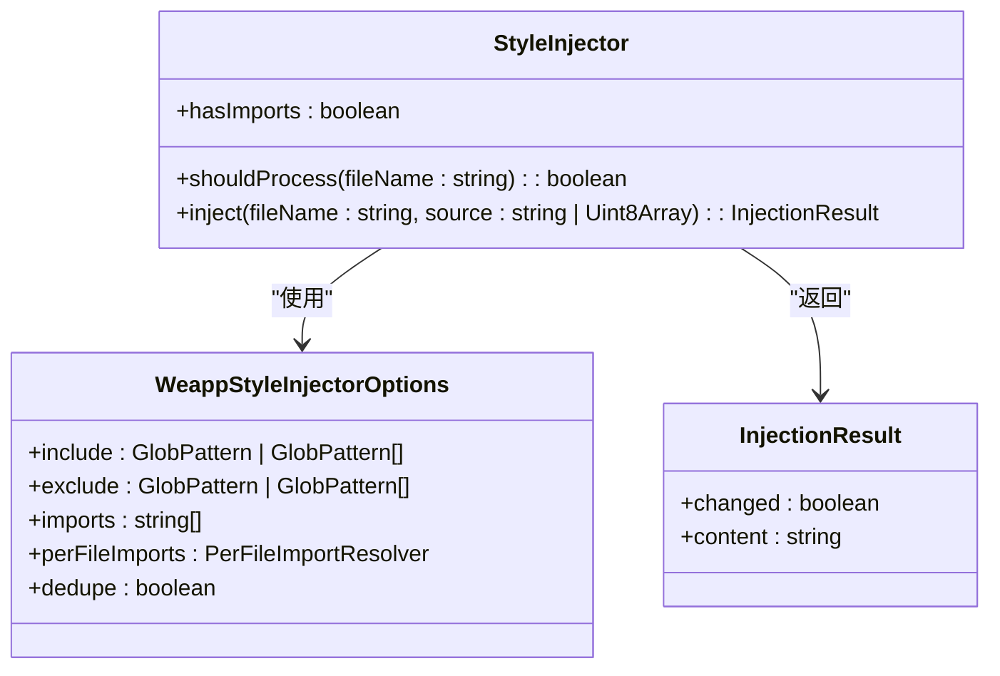
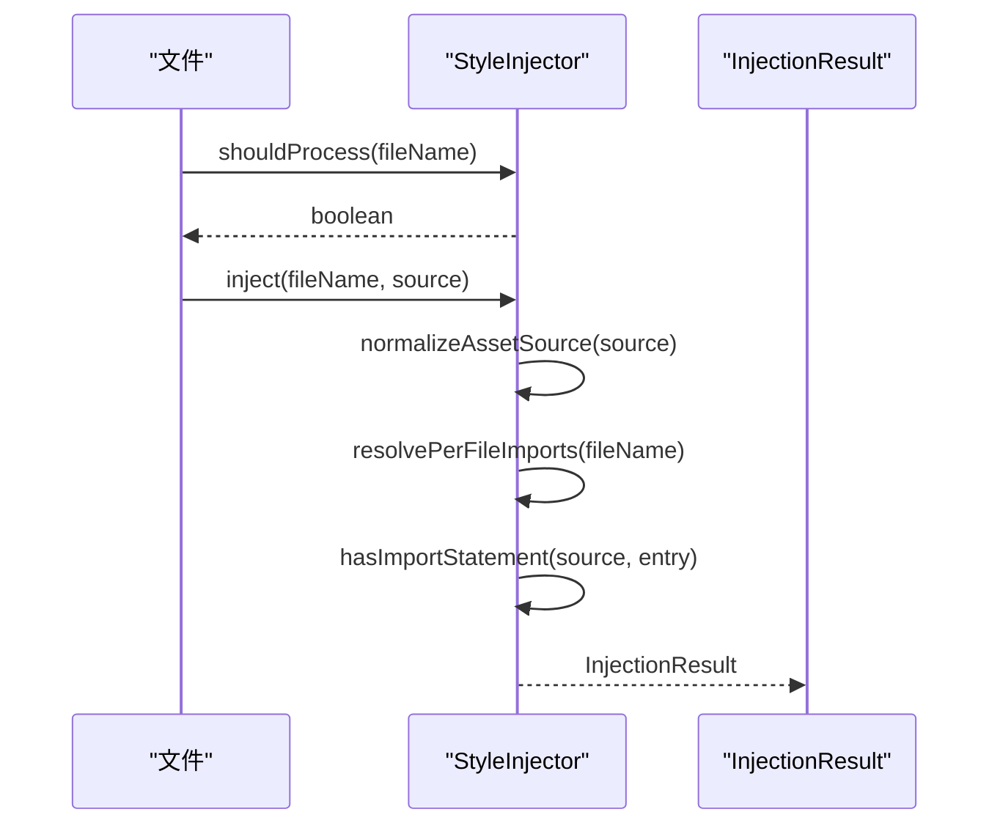
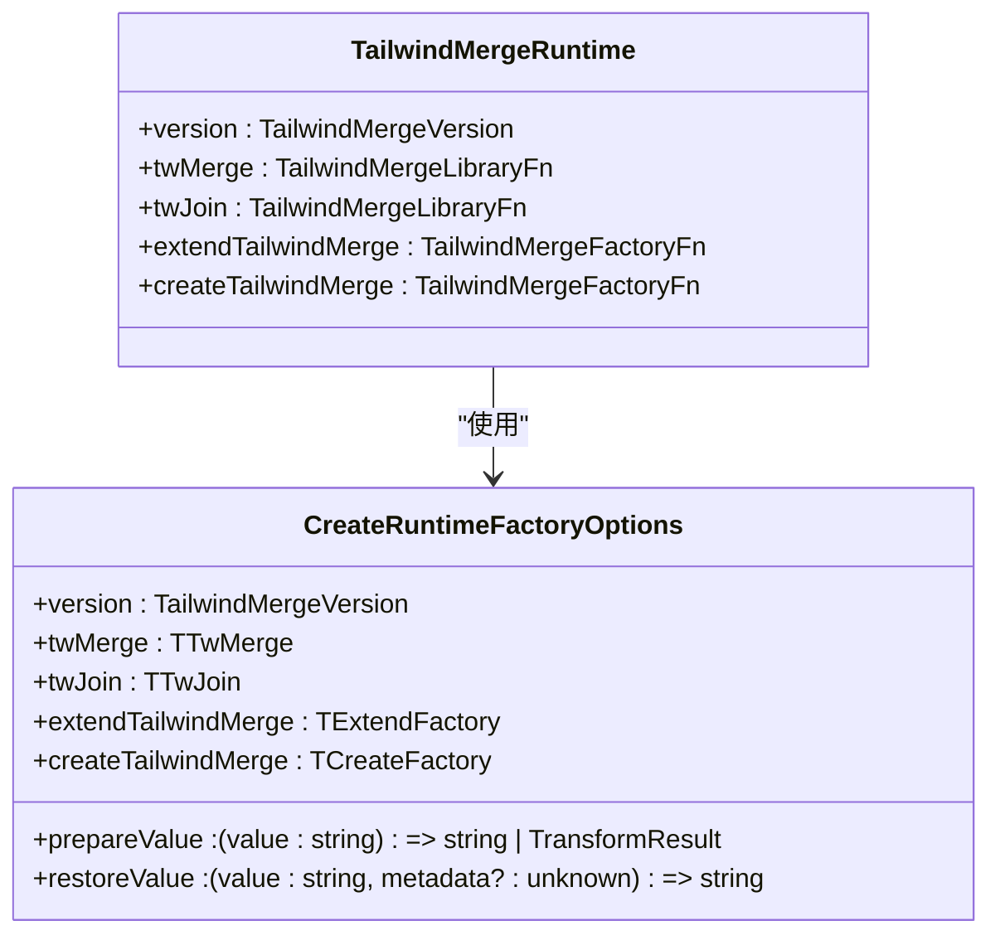
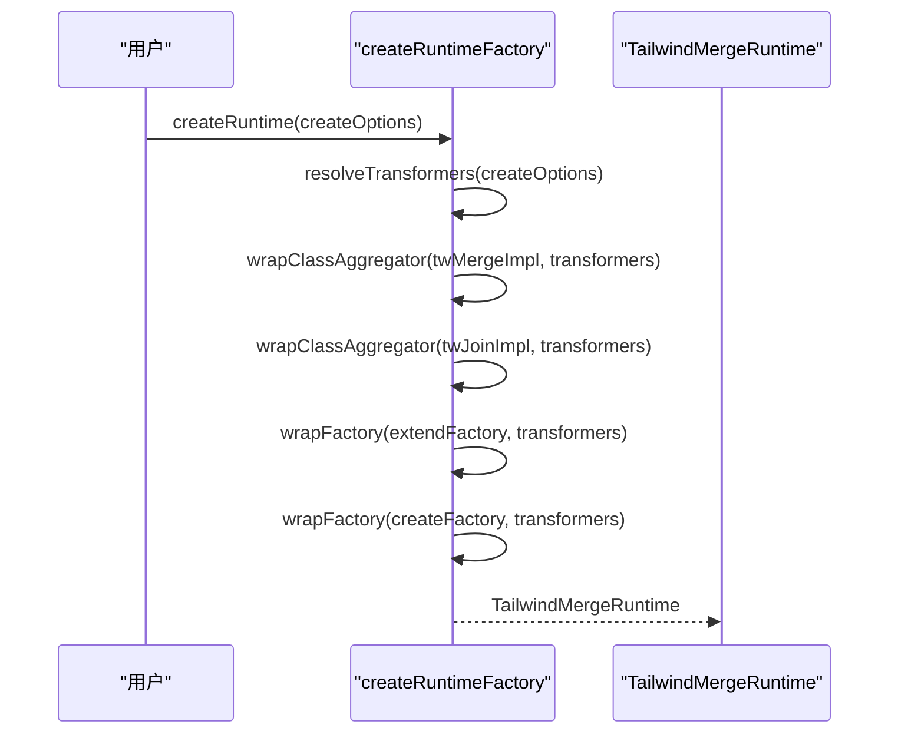
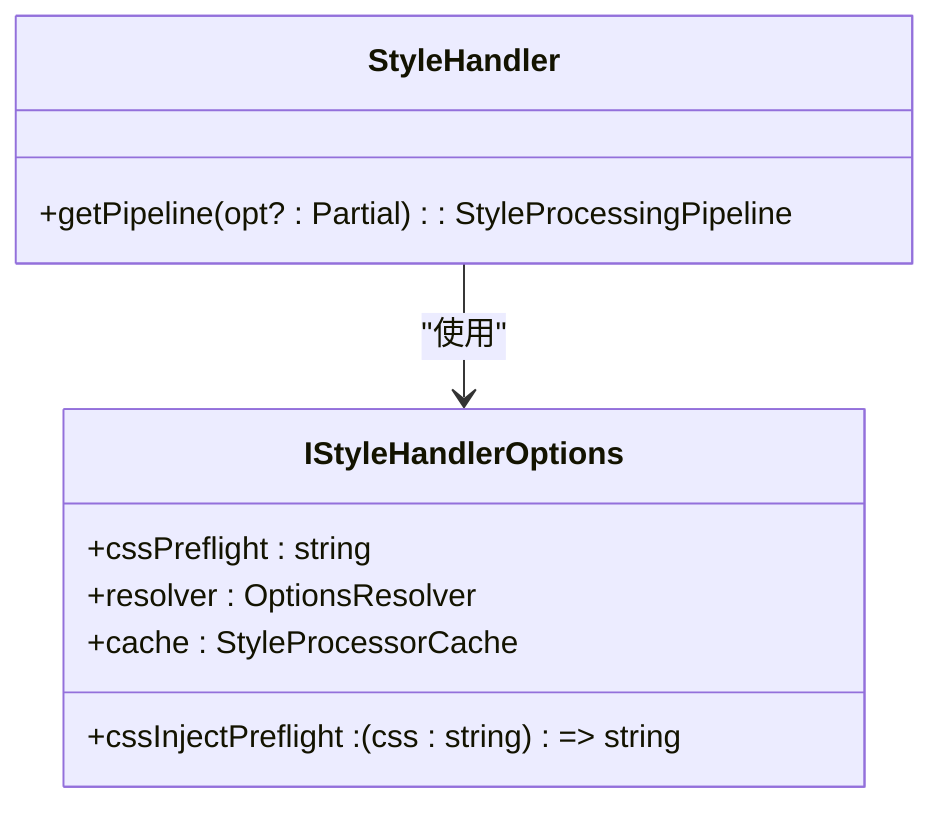
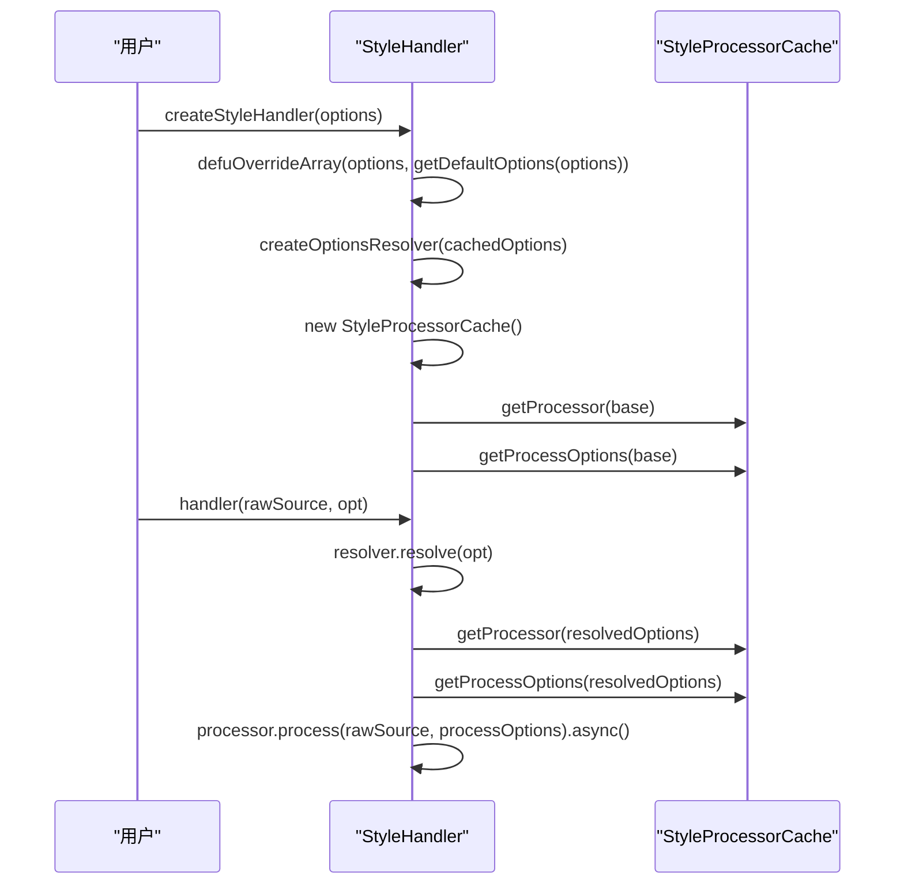
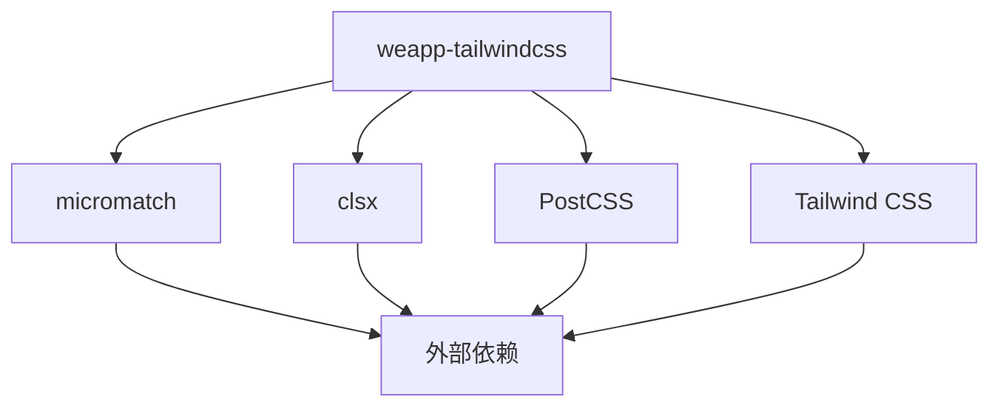

# 运行时性能

<cite>
**本文档中引用的文件**   
- [core.ts](file://packages/weapp-style-injector/src/core.ts#L1-L156)
- [create-runtime.ts](file://packages-runtime/runtime/src/create-runtime.ts#L1-L148)
- [handler.ts](file://packages/postcss/src/handler.ts#L1-L44)
- [index.ts](file://packages/weapp-style-injector/src/index.ts#L1-L37)
- [index.ts](file://packages-runtime/runtime/src/index.ts#L1-L23)
- [index.ts](file://packages/postcss/src/index.ts#L1-L14)
</cite>

## 目录
1. [引言](#引言)
2. [项目结构](#项目结构)
3. [核心组件](#核心组件)
4. [架构概述](#架构概述)
5. [详细组件分析](#详细组件分析)
6. [依赖分析](#依赖分析)
7. [性能考量](#性能考量)
8. [故障排除指南](#故障排除指南)
9. [结论](#结论)

## 引言
本文档旨在为小程序运行时性能优化提供全面的指南，重点解决运行时性能下降的问题。通过分析性能瓶颈、缓存机制、样式计算和DOM操作，提供优化建议和实际案例，帮助开发者提升小程序的运行效率。

## 项目结构
本项目采用模块化设计，主要分为以下几个部分：
- `packages/`：包含核心功能模块，如`weapp-tailwindcss`、`weapp-style-injector`、`postcss`等。
- `packages-runtime/`：包含运行时相关的模块，如`runtime`、`merge`等。
- `apps/`：包含各种应用示例，如`react-app`、`vue-app`等。
- `demo/`：包含演示项目，用于展示不同框架下的Tailwind CSS集成。

**图表来源**
- [core.ts](file://packages/weapp-style-injector/src/core.ts#L1-L156)
- [create-runtime.ts](file://packages-runtime/runtime/src/create-runtime.ts#L1-L148)
- [handler.ts](file://packages/postcss/src/handler.ts#L1-L44)

**章节来源**
- [core.ts](file://packages/weapp-style-injector/src/core.ts#L1-L156)
- [create-runtime.ts](file://packages-runtime/runtime/src/create-runtime.ts#L1-L148)
- [handler.ts](file://packages/postcss/src/handler.ts#L1-L44)

## 核心组件
### 样式注入器 (Style Injector)
样式注入器负责在构建过程中将Tailwind CSS类名注入到小程序的样式文件中。其主要功能包括：
- **条件处理**：根据文件名判断是否需要处理。
- **导入管理**：自动添加必要的CSS导入语句。
- **去重**：避免重复的导入语句。

### 运行时工厂 (Runtime Factory)
运行时工厂负责创建和管理Tailwind CSS的运行时实例。其主要功能包括：
- **缓存管理**：使用LRU缓存策略，限制缓存大小为256个条目。
- **类名聚合**：通过`clsx`库聚合多个类名。
- **转换器**：支持自定义的转换器，用于处理类名的转义和恢复。

### 样式处理器 (Style Handler)
样式处理器负责处理CSS样式，构建和复用PostCSS管线。其主要功能包括：
- **选项解析**：解析和合并配置选项。
- **缓存**：使用`StyleProcessorCache`缓存处理器和处理选项。
- **异步处理**：支持异步处理CSS样式。

**章节来源**
- [core.ts](file://packages/weapp-style-injector/src/core.ts#L1-L156)
- [create-runtime.ts](file://packages-runtime/runtime/src/create-runtime.ts#L1-L148)
- [handler.ts](file://packages/postcss/src/handler.ts#L1-L44)

## 架构概述
本项目的架构设计遵循模块化和可扩展的原则，主要分为以下几个层次：
- **核心模块**：提供基础功能，如样式注入、PostCSS处理等。
- **运行时模块**：提供运行时支持，如类名聚合、缓存管理等。
- **应用示例**：展示不同框架下的集成方式。

**图表来源**
- [core.ts](file://packages/weapp-style-injector/src/core.ts#L1-L156)
- [create-runtime.ts](file://packages-runtime/runtime/src/create-runtime.ts#L1-L148)
- [handler.ts](file://packages/postcss/src/handler.ts#L1-L44)

## 详细组件分析
### 样式注入器分析
#### 类图

**图表来源**
- [core.ts](file://packages/weapp-style-injector/src/core.ts#L1-L156)

#### 序列图

**图表来源**
- [core.ts](file://packages/weapp-style-injector/src/core.ts#L1-L156)

### 运行时工厂分析
#### 类图

**图表来源**
- [create-runtime.ts](file://packages-runtime/runtime/src/create-runtime.ts#L1-L148)

#### 序列图

**图表来源**
- [create-runtime.ts](file://packages-runtime/runtime/src/create-runtime.ts#L1-L148)

### 样式处理器分析
#### 类图

**图表来源**
- [handler.ts](file://packages/postcss/src/handler.ts#L1-L44)

#### 序列图

**图表来源**
- [handler.ts](file://packages/postcss/src/handler.ts#L1-L44)

**章节来源**
- [core.ts](file://packages/weapp-style-injector/src/core.ts#L1-L156)
- [create-runtime.ts](file://packages-runtime/runtime/src/create-runtime.ts#L1-L148)
- [handler.ts](file://packages/postcss/src/handler.ts#L1-L44)

## 依赖分析
本项目的主要依赖包括：
- `micromatch`：用于文件路径匹配。
- `clsx`：用于类名聚合。
- `PostCSS`：用于CSS处理。
- `Tailwind CSS`：用于生成CSS类名。

**图表来源**
- [core.ts](file://packages/weapp-style-injector/src/core.ts#L1-L156)
- [create-runtime.ts](file://packages-runtime/runtime/src/create-runtime.ts#L1-L148)
- [handler.ts](file://packages/postcss/src/handler.ts#L1-L44)

**章节来源**
- [core.ts](file://packages/weapp-style-injector/src/core.ts#L1-L156)
- [create-runtime.ts](file://packages-runtime/runtime/src/create-runtime.ts#L1-L148)
- [handler.ts](file://packages/postcss/src/handler.ts#L1-L44)

## 性能考量
### 缓存机制
- **LRU缓存**：运行时工厂使用LRU缓存策略，限制缓存大小为256个条目，避免内存占用过高。
- **处理器缓存**：样式处理器使用`StyleProcessorCache`缓存处理器和处理选项，减少重复创建的开销。

### 样式计算优化
- **去重**：样式注入器在注入导入语句时会自动去重，避免重复的导入语句。
- **条件处理**：样式注入器根据文件名判断是否需要处理，减少不必要的处理开销。

### DOM操作优化
- **异步处理**：样式处理器支持异步处理CSS样式，避免阻塞主线程。
- **批量处理**：建议在批量更新DOM时使用`requestAnimationFrame`或`setTimeout`，减少重排和重绘的次数。

## 故障排除指南
### 常见问题
- **样式未生效**：检查是否正确配置了`include`和`exclude`选项，确保文件被正确处理。
- **性能下降**：检查缓存是否正常工作，避免频繁创建处理器实例。
- **类名冲突**：使用`twMerge`和`twJoin`函数合并类名，避免冲突。

### 调试方法
- **日志输出**：启用详细的日志输出，查看处理过程中的每一步。
- **性能监控**：使用浏览器的性能工具，分析样式处理和DOM操作的耗时。

**章节来源**
- [core.ts](file://packages/weapp-style-injector/src/core.ts#L1-L156)
- [create-runtime.ts](file://packages-runtime/runtime/src/create-runtime.ts#L1-L148)
- [handler.ts](file://packages/postcss/src/handler.ts#L1-L44)

## 结论
本文档详细介绍了小程序运行时性能优化的各个方面，包括核心组件、架构设计、性能考量和故障排除。通过合理使用缓存机制、优化样式计算和DOM操作，可以显著提升小程序的运行效率。希望本文档能帮助开发者更好地理解和应用这些优化技术。