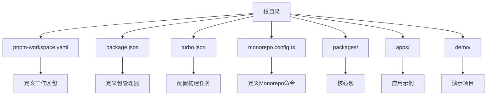
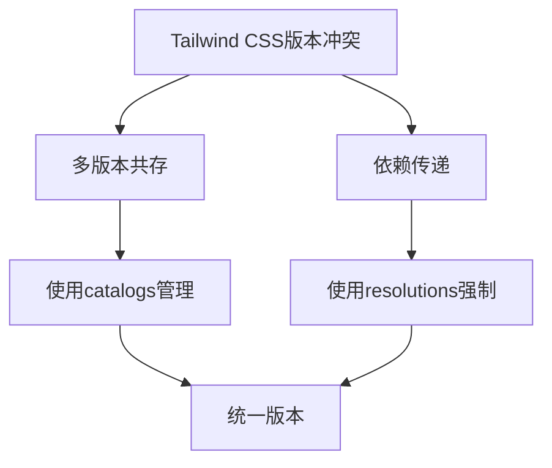
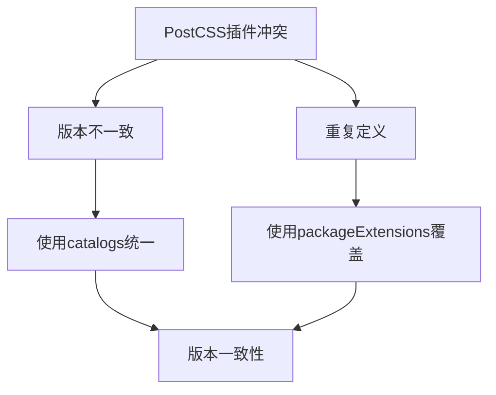
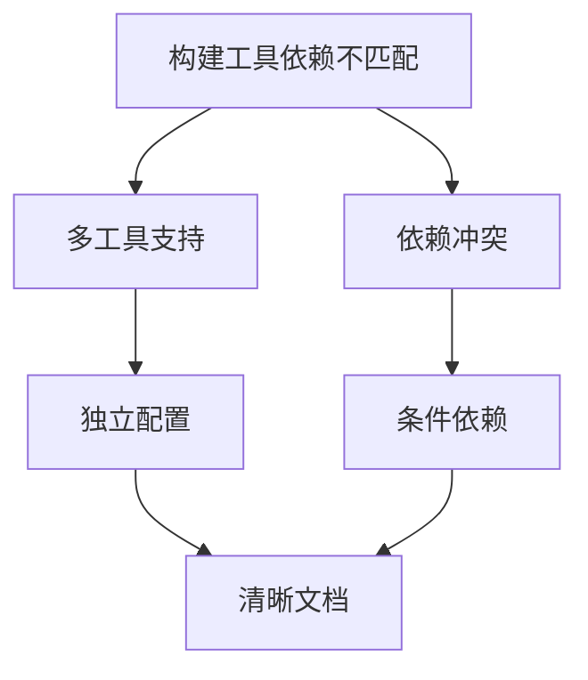
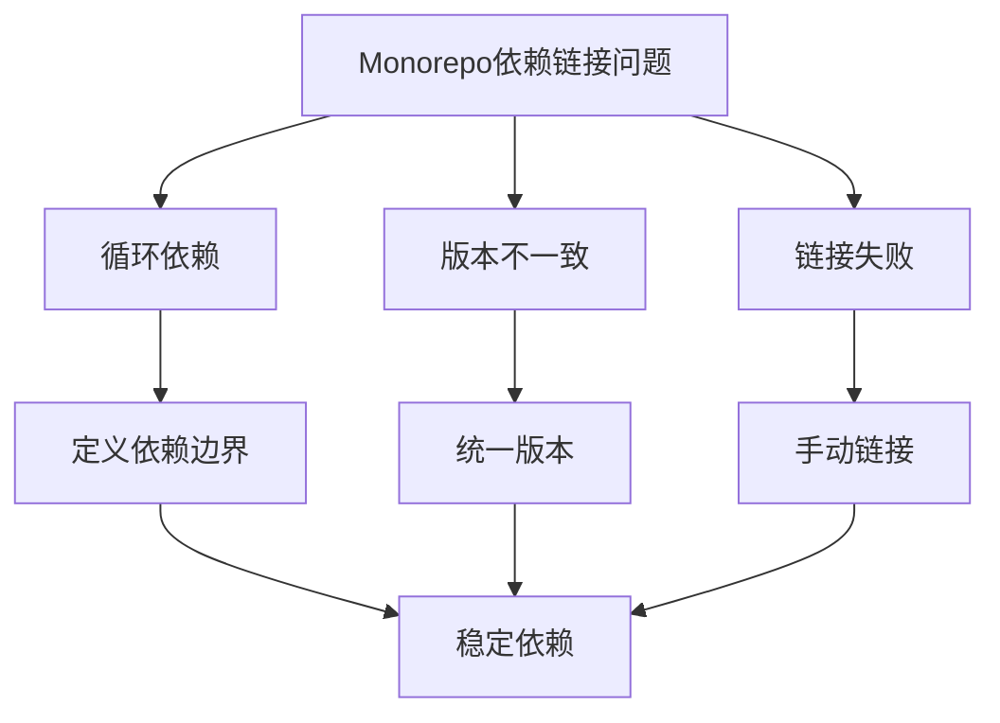
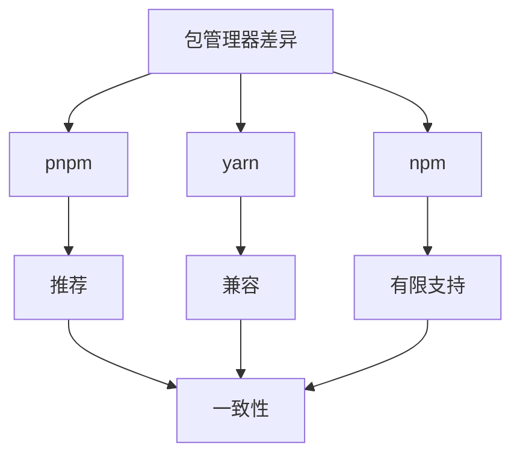
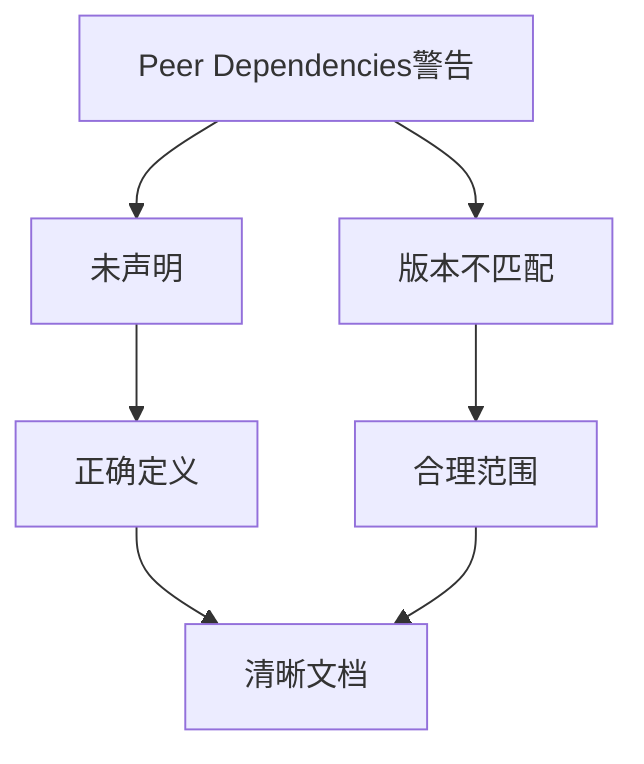
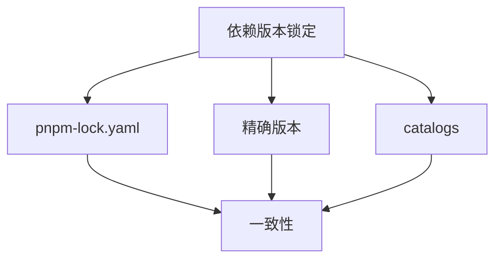
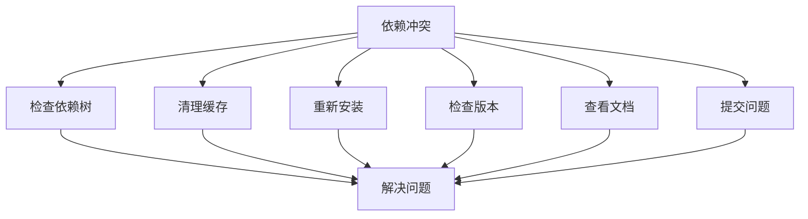

# 依赖冲突

<cite>
**本文档引用的文件**  
- [package.json](file://package.json)
- [pnpm-workspace.yaml](file://pnpm-workspace.yaml)
- [monorepo.config.ts](file://monorepo.config.ts)
- [turbo.json](file://turbo.json)
- [apps/react-app/package.json](file://apps/react-app/package.json)
- [apps/vue-app/package.json](file://apps/vue-app/package.json)
- [apps/uni-app-x-hbuilderx-tailwindcss4/package.json](file://apps/uni-app-x-hbuilderx-tailwindcss4/package.json)
- [apps/taro-webpack-tailwindcss-v4/package.json](file://apps/taro-webpack-tailwindcss-v4/package.json)
- [packages/weapp-tailwindcss/package.json](file://packages/weapp-tailwindcss/package.json)
- [packages/postcss/package.json](file://packages/postcss/package.json)
- [packages/tailwindcss-config/package.json](file://packages/tailwindcss-config/package.json)
- [renovate.json](file://renovate.json)
</cite>

## 目录
1. [简介](#简介)
2. [项目结构与依赖管理](#项目结构与依赖管理)
3. [核心依赖冲突问题分析](#核心依赖冲突问题分析)
4. [Tailwind CSS版本兼容性问题](#tailwind-css版本兼容性问题)
5. [PostCSS插件版本冲突](#postcss插件版本冲突)
6. [构建工具依赖不匹配](#构建工具依赖不匹配)
7. [Monorepo环境中的依赖链接问题](#monorepo环境中的依赖链接问题)
8. [不同包管理器的解决方案](#不同包管理器的解决方案)
9. [Peer Dependencies警告处理](#peer-dependencies警告处理)
10. [依赖版本锁定策略](#依赖版本锁定策略)
11. [故障排除指南](#故障排除指南)

## 简介
weapp-tailwindcss项目是一个为小程序开发者提供Tailwind CSS JIT引擎的工具集，支持多种构建工具和框架。该项目采用Monorepo架构，包含多个子项目和包，涉及React、Vue、Taro、uni-app等多种技术栈。由于项目复杂度高，依赖关系错综复杂，容易出现依赖版本冲突问题。本文档旨在提供详细的依赖冲突故障排除指南，帮助开发者解决在不同项目环境中常见的依赖版本冲突问题。

## 项目结构与依赖管理
weapp-tailwindcss项目采用Monorepo架构，使用pnpm作为包管理器，通过`pnpm-workspace.yaml`文件定义工作区包。项目根目录下的`package.json`文件中指定了`packageManager`为`pnpm@10.26.1`，确保所有开发者使用相同版本的包管理器。

项目使用Turbo作为构建工具，通过`turbo.json`文件配置任务依赖关系。`monorepo.config.ts`文件定义了Monorepo的命令配置，如创建、清理、同步等操作。



**图示来源**
- [pnpm-workspace.yaml](file://pnpm-workspace.yaml)
- [package.json](file://package.json)
- [turbo.json](file://turbo.json)
- [monorepo.config.ts](file://monorepo.config.ts)

**本节来源**
- [pnpm-workspace.yaml](file://pnpm-workspace.yaml#L1-L136)
- [package.json](file://package.json#L1-L277)
- [turbo.json](file://turbo.json#L1-L71)
- [monorepo.config.ts](file://monorepo.config.ts#L1-L23)

## 核心依赖冲突问题分析
在weapp-tailwindcss项目中，常见的依赖冲突问题主要包括：
- Tailwind CSS核心版本不兼容
- PostCSS插件版本冲突
- 构建工具依赖不匹配
- Monorepo环境中的依赖链接问题
- Peer Dependencies警告

这些问题可能导致构建失败、样式不生效、运行时错误等。通过分析项目中的`package.json`文件和依赖关系，可以找到解决方案。

## Tailwind CSS版本兼容性问题
weapp-tailwindcss项目中使用了多个版本的Tailwind CSS。在根目录的`package.json`文件中，`devDependencies`包含了`tailwindcss`和`tailwindcss4`两个版本：

```json
"devDependencies": {
  "tailwindcss": "catalog:tailwindcss3",
  "tailwindcss4": "catalog:tailwindcss4"
}
```

在`pnpm-workspace.yaml`文件中，定义了`catalogs`来管理不同版本的依赖：

```yaml
catalogs:
  tailwindcss3:
    tailwindcss: ^3.4.19
  tailwindcss4:
    '@tailwindcss/postcss': ^4.1.18
    '@tailwindcss/vite': ^4.1.18
    tailwindcss: ^4.1.18
    tailwindcss4: npm:tailwindcss@^4.1.17
```

这种多版本共存的策略允许项目在不同子项目中使用不同版本的Tailwind CSS，但也可能导致版本冲突。例如，在`apps/react-app/package.json`中，直接指定了Tailwind CSS 4.1.18版本：

```json
"devDependencies": {
  "tailwindcss": "^4.1.18"
}
```

而在`apps/uni-app-x-hbuilderx-tailwindcss3/package.json`中，可能使用的是Tailwind CSS 3.x版本。

解决版本兼容性问题的方法包括：
1. 统一使用`catalogs`来管理依赖版本
2. 在子项目中明确指定所需的Tailwind CSS版本
3. 使用`resolutions`字段强制指定依赖版本



**图示来源**
- [package.json](file://package.json#L243-L244)
- [pnpm-workspace.yaml](file://pnpm-workspace.yaml#L61-L68)
- [apps/react-app/package.json](file://apps/react-app/package.json#L34)

**本节来源**
- [package.json](file://package.json#L243-L244)
- [pnpm-workspace.yaml](file://pnpm-workspace.yaml#L61-L68)
- [apps/react-app/package.json](file://apps/react-app/package.json#L34)

## PostCSS插件版本冲突
PostCSS插件版本冲突是weapp-tailwindcss项目中的另一个常见问题。在`packages/postcss/package.json`中，定义了PostCSS相关依赖：

```json
"dependencies": {
  "postcss": "~8.5.6",
  "postcss-preset-env": "^10.5.0",
  "postcss-pxtrans": "^1.0.0",
  "postcss-rem-to-responsive-pixel": "catalog:postcssRem610",
  "postcss-selector-parser": "~7.1.1",
  "postcss-value-parser": "^4.2.0"
}
```

在根目录的`package.json`中，也定义了PostCSS相关依赖：

```json
"devDependencies": {
  "postcss": "catalog:postcss85",
  "postcss-load-config": "^6.0.1",
  "postcss-loader": "^8.2.0",
  "postcss-preset-env": "^10.5.0",
  "postcss-scss": "^4.0.9"
}
```

这种重复定义可能导致版本不一致。例如，`postcss`在`packages/postcss`中是`~8.5.6`，而在根目录中是`catalog:postcss85`，虽然都指向8.5.x版本，但具体版本号可能不同。

解决PostCSS插件版本冲突的方法包括：
1. 统一使用`catalogs`来管理PostCSS相关依赖
2. 在`pnpm-workspace.yaml`中定义`packageExtensions`来覆盖特定包的依赖
3. 使用`peerDependencies`来声明兼容的版本范围



**图示来源**
- [packages/postcss/package.json](file://packages/postcss/package.json#L55-L60)
- [package.json](file://package.json#L226-L231)
- [pnpm-workspace.yaml](file://pnpm-workspace.yaml#L31-L32)

**本节来源**
- [packages/postcss/package.json](file://packages/postcss/package.json#L55-L60)
- [package.json](file://package.json#L226-L231)
- [pnpm-workspace.yaml](file://pnpm-workspace.yaml#L31-L32)

## 构建工具依赖不匹配
weapp-tailwindcss项目支持多种构建工具，包括Vite、Webpack、Gulp等。不同构建工具的依赖可能不兼容，导致构建失败。

在`apps/taro-webpack-tailwindcss-v4/package.json`中，使用了Webpack 5：

```json
"devDependencies": {
  "webpack": "5.104.1"
}
```

而在`apps/react-app/package.json`中，使用了Vite：

```json
"devDependencies": {
  "vite": "^7.3.0"
}
```

在`packages/weapp-tailwindcss/package.json`中，同时支持多种构建工具：

```json
"dependencies": {
  "webpack-sources": "3.3.3"
}
```

这种多构建工具支持增加了依赖管理的复杂性。解决构建工具依赖不匹配的方法包括：
1. 为不同构建工具创建独立的依赖配置
2. 使用条件依赖（conditional dependencies）
3. 在文档中明确说明不同构建工具的依赖要求



**图示来源**
- [apps/taro-webpack-tailwindcss-v4/package.json](file://apps/taro-webpack-tailwindcss-v4/package.json#L93)
- [apps/react-app/package.json](file://apps/react-app/package.json#L38)
- [packages/weapp-tailwindcss/package.json](file://packages/weapp-tailwindcss/package.json#L211)

**本节来源**
- [apps/taro-webpack-tailwindcss-v4/package.json](file://apps/taro-webpack-tailwindcss-v4/package.json#L93)
- [apps/react-app/package.json](file://apps/react-app/package.json#L38)
- [packages/weapp-tailwindcss/package.json](file://packages/weapp-tailwindcss/package.json#L211)

## Monorepo环境中的依赖链接问题
在Monorepo环境中，依赖链接问题尤为突出。weapp-tailwindcss项目使用pnpm的workspace功能来管理内部包的链接。

在`pnpm-workspace.yaml`中，定义了工作区包：

```yaml
packages:
  - packages/*
  - packages-runtime/*
  - apps/*
  - website
  - benchmark/*
  - e2e
  - '!tailwindcss-weapp'
  - '!**/test/**'
  - demo/*
```

内部包之间使用`workspace:*`来引用：

```json
"@weapp-tailwindcss/shared": "workspace:*",
"@weapp-tailwindcss/test-helper": "workspace:*"
```

可能出现的依赖链接问题包括：
1. 循环依赖
2. 版本不一致
3. 链接失败

解决Monorepo依赖链接问题的方法包括：
1. 使用`turbo.json`中的`boundaries`来定义包之间的依赖边界
2. 定期运行`pnpm install`来确保链接正确
3. 使用`pnpm link`命令手动链接包



**图示来源**
- [pnpm-workspace.yaml](file://pnpm-workspace.yaml#L1-L8)
- [package.json](file://package.json#L171-L172)
- [turbo.json](file://turbo.json#L64-L68)

**本节来源**
- [pnpm-workspace.yaml](file://pnpm-workspace.yaml#L1-L8)
- [package.json](file://package.json#L171-L172)
- [turbo.json](file://turbo.json#L64-L68)

## 不同包管理器的解决方案
weapp-tailwindcss项目主要使用pnpm，但也需要考虑npm和yarn用户的需求。

### pnpm解决方案
pnpm是推荐的包管理器，通过`packageManager`字段指定：

```json
"packageManager": "pnpm@10.26.1"
```

使用`pnpm-workspace.yaml`来管理workspace包，确保内部包正确链接。

### yarn解决方案
对于yarn用户，可以使用yarn workspace功能。需要将`pnpm-workspace.yaml`转换为`package.json`中的`workspaces`字段：

```json
"workspaces": [
  "packages/*",
  "apps/*",
  "demo/*"
]
```

### npm解决方案
npm从7.0版本开始支持workspace，但功能有限。建议使用`npm link`来链接内部包。

不同包管理器的依赖树结构不同，可能导致行为差异。建议统一使用pnpm以确保一致性。



**图示来源**
- [package.json](file://package.json#L6)
- [pnpm-workspace.yaml](file://pnpm-workspace.yaml#L1-L8)

**本节来源**
- [package.json](file://package.json#L6)
- [pnpm-workspace.yaml](file://pnpm-workspace.yaml#L1-L8)

## Peer Dependencies警告处理
Peer Dependencies警告是常见的依赖问题。在weapp-tailwindcss项目中，可以通过以下方式处理：

1. 在`package.json`中正确定义`peerDependencies`
2. 使用`peerDependenciesMeta`来标记可选的peer dependencies
3. 在安装后运行检查脚本

例如，在`packages/weapp-tailwindcss/package.json`中，虽然没有显式定义`peerDependencies`，但实际使用了多个peer dependencies，如`tailwindcss`、`postcss`等。

处理peer dependencies警告的最佳实践：
- 明确声明所有peer dependencies
- 指定合理的版本范围
- 提供清晰的安装说明



**图示来源**
- [packages/weapp-tailwindcss/package.json](file://packages/weapp-tailwindcss/package.json)

**本节来源**
- [packages/weapp-tailwindcss/package.json](file://packages/weapp-tailwindcss/package.json)

## 依赖版本锁定策略
为了确保构建一致性，weapp-tailwindcss项目采用以下依赖版本锁定策略：

1. 使用`pnpm-lock.yaml`锁定依赖版本
2. 在`package.json`中使用精确版本或合理范围
3. 使用`catalogs`统一管理常用依赖版本

在`renovate.json`中，禁用了某些包的自动更新：

```json
"packageRules": [
  {
    "matchPackageNames": [
      "@dcloudio/*",
      "@mpxjs/*",
      "@tarojs/*"
    ],
    "enabled": false
  }
]
```

这可以防止这些关键依赖的意外更新。

依赖版本锁定的最佳实践：
- 定期更新依赖
- 测试新版本的兼容性
- 使用CI/CD自动化测试



**图示来源**
- [renovate.json](file://renovate.json#L12-L21)
- [pnpm-workspace.yaml](file://pnpm-workspace.yaml#L12-L124)

**本节来源**
- [renovate.json](file://renovate.json#L12-L21)
- [pnpm-workspace.yaml](file://pnpm-workspace.yaml#L12-L124)

## 故障排除指南
当遇到依赖冲突问题时，可以按照以下步骤进行故障排除：

1. **检查依赖树**：使用`pnpm list`或`npm ls`查看依赖树，找出冲突的包
2. **清理缓存**：运行`pnpm store prune`清理pnpm缓存
3. **重新安装**：删除`node_modules`和`pnpm-lock.yaml`，重新运行`pnpm install`
4. **检查版本**：确认所有相关包的版本是否兼容
5. **查看文档**：参考项目文档中的依赖要求
6. **提交问题**：如果问题无法解决，提交issue并提供详细的环境信息

常见问题及解决方案：
- **问题**：安装后构建失败
  **解决方案**：检查`postinstall`脚本是否正常运行
- **问题**：样式不生效
  **解决方案**：检查PostCSS插件是否正确配置
- **问题**：运行时错误
  **解决方案**：检查peer dependencies是否满足



**图示来源**
- [package.json](file://package.json#L81)
- [packages/weapp-tailwindcss/package.json](file://packages/weapp-tailwindcss/package.json#L182)

**本节来源**
- [package.json](file://package.json#L81)
- [packages/weapp-tailwindcss/package.json](file://packages/weapp-tailwindcss/package.json#L182)