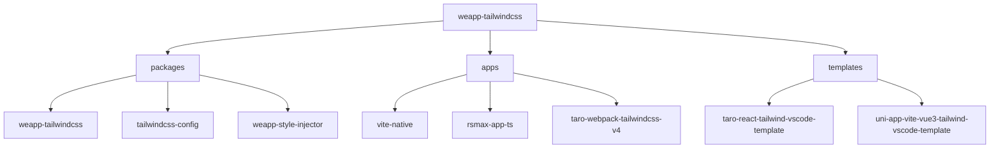
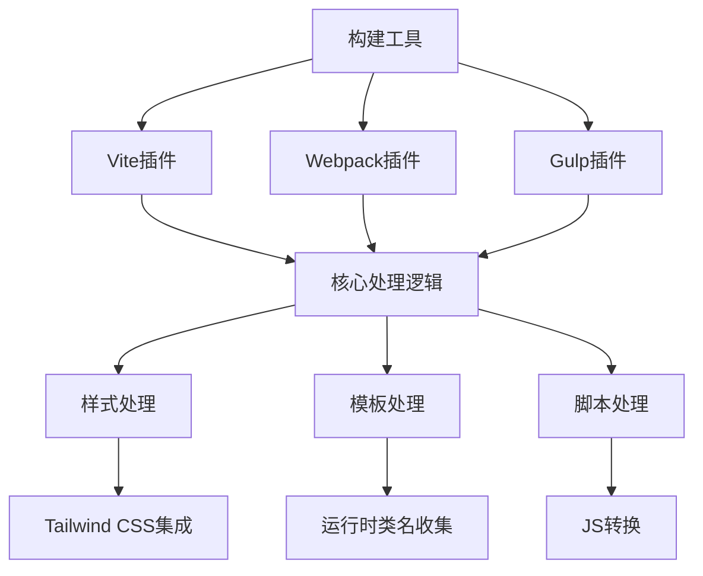
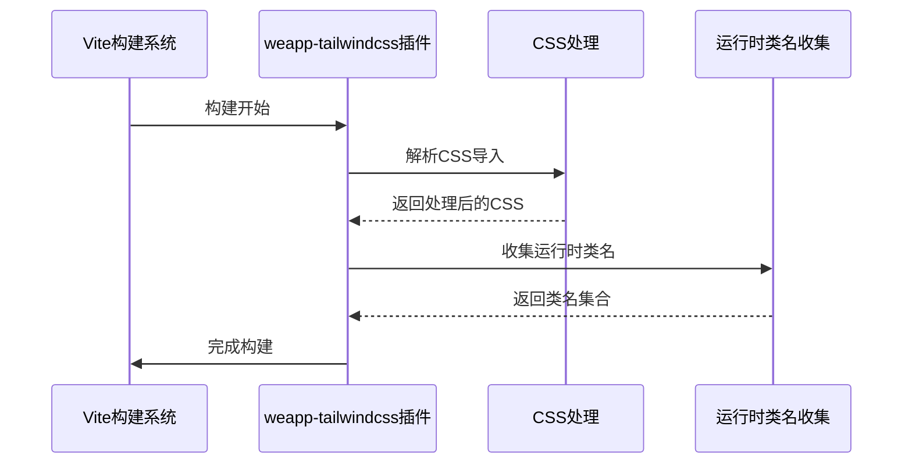
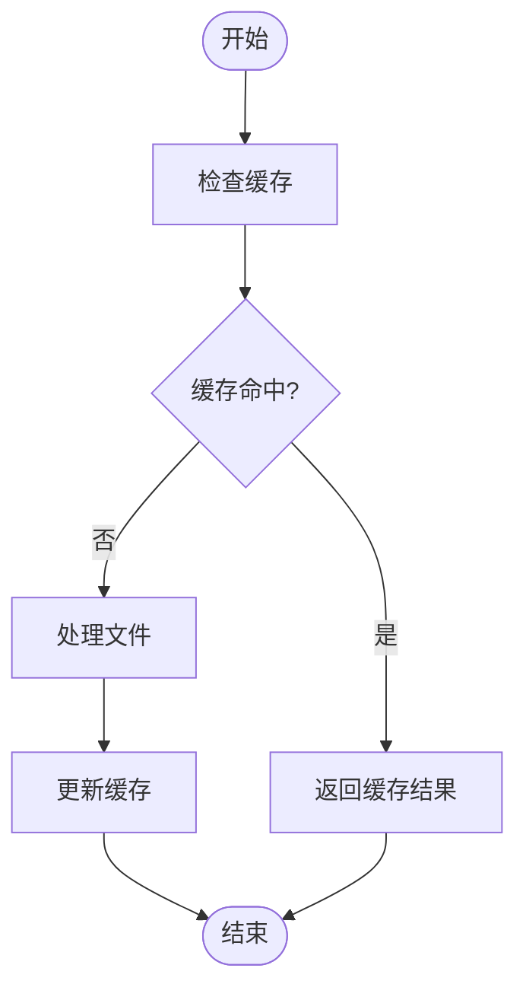

# 构建性能

<cite>
**本文档引用的文件**
- [package.json](file://packages/weapp-tailwindcss/package.json)
- [tsup.config.ts](file://packages/weapp-tailwindcss/tsup.config.ts)
- [core.ts](file://packages/weapp-tailwindcss/src/core.ts)
- [vite/index.ts](file://packages/weapp-tailwindcss/src/bundlers/vite/index.ts)
- [gulp/index.ts](file://packages/weapp-tailwindcss/src/bundlers/gulp/index.ts)
- [webpack/index.ts](file://packages/weapp-tailwindcss/src/bundlers/webpack/index.ts)
- [tailwind.config.js](file://apps/vite-native/tailwind.config.js)
- [postcss.config.js](file://apps/vite-native/postcss.config.js)
</cite>

## 目录
1. [简介](#简介)
2. [项目结构](#项目结构)
3. [核心组件](#核心组件)
4. [架构概述](#架构概述)
5. [详细组件分析](#详细组件分析)
6. [依赖分析](#依赖分析)
7. [性能考量](#性能考量)
8. [故障排除指南](#故障排除指南)
9. [结论](#结论)

## 简介
本文档旨在为大型项目中的 weapp-tailwindcss 提供详细的构建性能优化指南。涵盖构建时间过长、内存占用过高、文件扫描范围过大等问题的解决方案。详细说明如何分析构建性能瓶颈，如何优化配置减少不必要的处理，以及如何利用缓存和并行处理提升构建速度。提供具体的性能基准测试方法和指标，以及不同项目规模下的最佳实践建议。

## 项目结构
weapp-tailwindcss 项目采用 monorepo 结构，包含多个子包和应用示例。核心包位于 `packages/weapp-tailwindcss` 目录下，提供了 Vite、Webpack 和 Gulp 的集成支持。项目还包括多个应用示例（位于 `apps/` 目录）和模板（位于 `templates/` 目录），用于演示不同框架下的使用方法。



**Diagram sources**
- [package.json](file://package.json)
- [monorepo.config.ts](file://monorepo.config.ts)

**Section sources**
- [package.json](file://package.json)
- [pnpm-workspace.yaml](file://pnpm-workspace.yaml)

## 核心组件
weapp-tailwindcss 的核心功能由 `packages/weapp-tailwindcss` 包提供，主要包括 Vite、Webpack 和 Gulp 的插件实现。核心逻辑位于 `src/core.ts` 文件中，通过 `createContext` 函数创建上下文对象，用于处理小程序的模板、样式和脚本转换。

**Section sources**
- [core.ts](file://packages/weapp-tailwindcss/src/core.ts)
- [index.ts](file://packages/weapp-tailwindcss/src/index.ts)

## 架构概述
weapp-tailwindcss 的架构设计旨在提供灵活的构建集成方案，支持多种构建工具（Vite、Webpack、Gulp）。核心架构包括上下文管理、样式处理、模板处理和脚本处理四个主要部分，通过插件化的方式集成到不同的构建流程中。



**Diagram sources**
- [vite/index.ts](file://packages/weapp-tailwindcss/src/bundlers/vite/index.ts)
- [webpack/index.ts](file://packages/weapp-tailwindcss/src/bundlers/webpack/index.ts)
- [gulp/index.ts](file://packages/weapp-tailwindcss/src/bundlers/gulp/index.ts)

## 详细组件分析

### Vite 插件分析
Vite 插件是 weapp-tailwindcss 的主要集成方式之一，通过 `UnifiedViteWeappTailwindcssPlugin` 函数实现。插件在构建过程中处理 CSS 导入重写、样式转换和运行时类名收集。

#### 对于 API/服务组件：


**Diagram sources**
- [vite/index.ts](file://packages/weapp-tailwindcss/src/bundlers/vite/index.ts)
- [core.ts](file://packages/weapp-tailwindcss/src/core.ts)

### Gulp 插件分析
Gulp 插件通过 `createPlugins` 函数实现，提供流式处理能力。插件支持样式和脚本的转换，利用缓存机制提高构建效率。

#### 对于复杂逻辑组件：


**Diagram sources**
- [gulp/index.ts](file://packages/weapp-tailwindcss/src/bundlers/gulp/index.ts)
- [core.ts](file://packages/weapp-tailwindcss/src/core.ts)

**Section sources**
- [gulp/index.ts](file://packages/weapp-tailwindcss/src/bundlers/gulp/index.ts)
- [shared/cache.ts](file://packages/weapp-tailwindcss/src/bundlers/shared/cache.ts)

## 依赖分析
weapp-tailwindcss 项目依赖多个核心包，包括 `@tailwindcss-mangle/config`、`@vue/compiler-dom`、`fast-glob` 等。这些依赖包提供了 CSS 处理、模板编译和文件匹配等关键功能。

```mermaid
graph TD
A[weapp-tailwindcss] --> B[@tailwindcss-mangle/config]
A --> C[@vue/compiler-dom]
A --> D[fast-glob]
A --> E[magic-string]
A --> F[lru-cache]
B --> G[CSS压缩]
C --> H[模板编译]
D --> I[文件匹配]
E --> J[字符串操作]
F --> K[缓存管理]
```

**Diagram sources**
- [package.json](file://packages/weapp-tailwindcss/package.json)
- [tsup.config.ts](file://packages/weapp-tailwindcss/tsup.config.ts)

**Section sources**
- [package.json](file://packages/weapp-tailwindcss/package.json)
- [tsup.config.ts](file://packages/weapp-tailwindcss/tsup.config.ts)

## 性能考量
weapp-tailwindcss 在设计时充分考虑了构建性能，通过以下方式优化构建过程：
- 利用 LRU 缓存减少重复计算
- 支持并行任务处理
- 提供配置选项以减少文件扫描范围
- 优化 CSS 处理流程

## 故障排除指南
当遇到构建性能问题时，可以按照以下步骤进行排查：
1. 检查配置文件中的 `content` 字段，确保只包含必要的文件路径
2. 启用缓存功能，避免重复处理
3. 监控内存使用情况，必要时增加 Node.js 内存限制
4. 使用性能分析工具定位瓶颈

**Section sources**
- [core.ts](file://packages/weapp-tailwindcss/src/core.ts)
- [vite/index.ts](file://packages/weapp-tailwindcss/src/bundlers/vite/index.ts)

## 结论
weapp-tailwindcss 为小程序开发者提供了强大的 Tailwind CSS 集成能力。通过合理的配置和优化，可以在大型项目中实现高效的构建性能。建议在实际项目中根据具体需求调整配置，充分利用缓存和并行处理等优化手段。