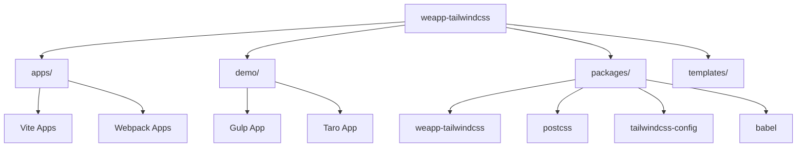
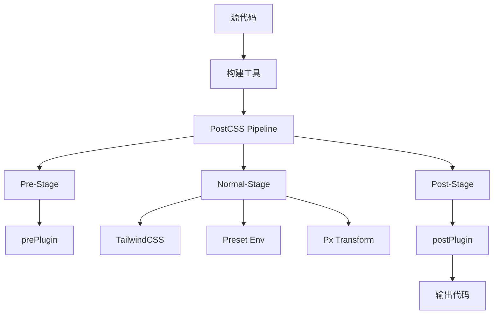
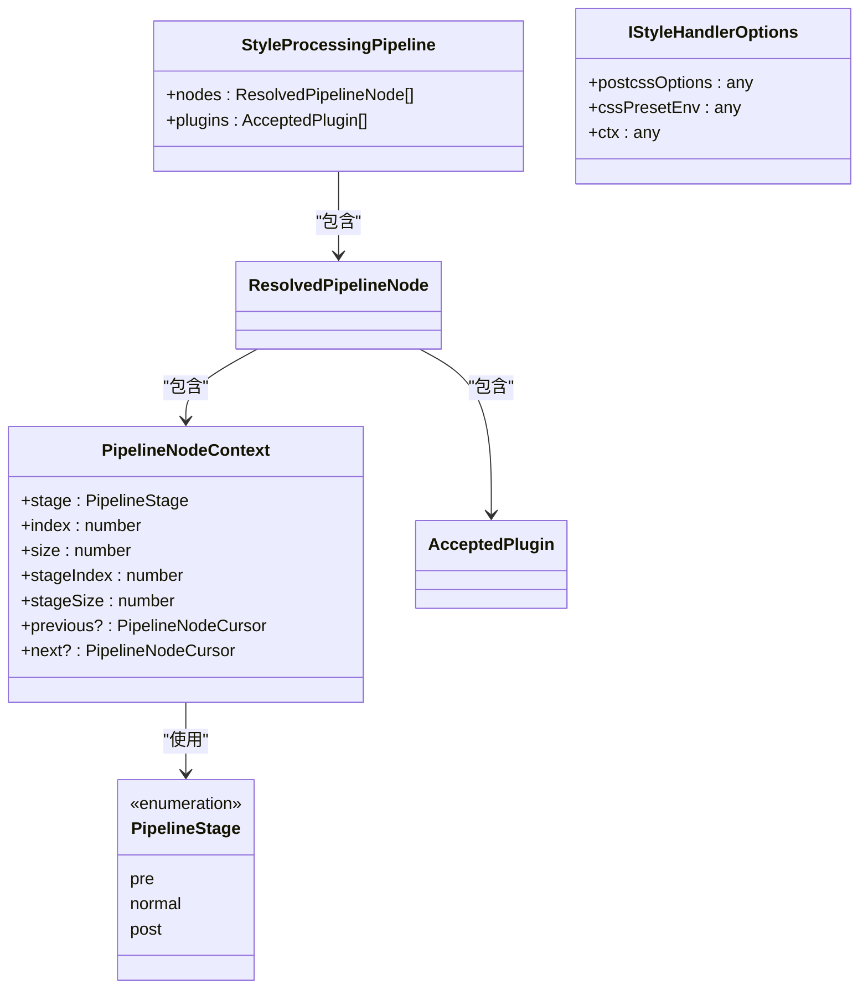
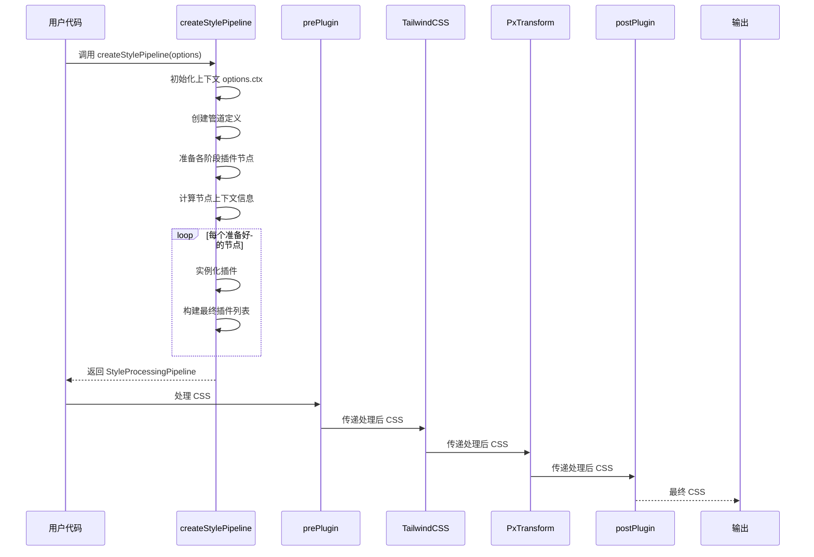
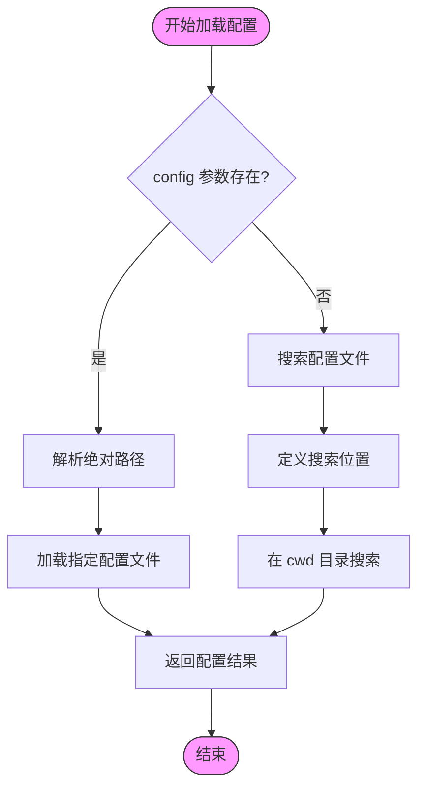

# 构建问题

<cite>
**本文档中引用的文件**  
- [weapp-tailwindcss/package.json](file://packages/weapp-tailwindcss/package.json)
- [postcss/src/index.ts](file://packages/postcss/src/index.ts)
- [postcss/src/pipeline.ts](file://packages/postcss/src/pipeline.ts)
- [tailwindcss-config/src/index.ts](file://packages/tailwindcss-config/src/index.ts)
- [weapp-tailwindcss/src/index.ts](file://packages/weapp-tailwindcss/src/index.ts)
- [apps/taro-webpack-tailwindcss-v4/postcss.config.mjs](file://apps/taro-webpack-tailwindcss-v4/postcss.config.mjs)
- [apps/vite-native/postcss.config.js](file://apps/vite-native/postcss.config.js)
- [demo/gulp-app/postcss.config.js](file://demo/gulp-app/postcss.config.js)
- [apps/taro-webpack-tailwindcss-v4/babel.config.js](file://apps/taro-webpack-tailwindcss-v4/babel.config.js)
- [apps/vite-native-ts/tailwind.config.ts](file://apps/vite-native-ts/tailwind.config.ts)
- [apps/uni-app-x-hbuilderx-tailwindcss3/tailwind.config.js](file://apps/uni-app-x-hbuilderx-tailwindcss3/tailwind.config.js)
- [apps/vite-native/vite.config.ts](file://apps/vite-native/vite.config.ts)
- [apps/vite-native-skyline/vite.config.ts](file://apps/vite-native-skyline/vite.config.ts)
- [apps/vite-native-ts/vite.config.ts](file://apps/vite-native-ts/vite.config.ts)
- [apps/vite-native-ts-skyline/vite.config.ts](file://apps/vite-native-ts-skyline/vite.config.ts)
- [apps/taro-webpack-tailwindcss-v4/vite.config.ts](file://apps/taro-webpack-tailwindcss-v4/vite.config.ts)
- [apps/uni-app-x-hbuilderx-tailwindcss3/vite.config.ts](file://apps/uni-app-x-hbuilderx-tailwindcss3/vite.config.ts)
- [apps/uni-app-x-hbuilderx-tailwindcss4/vite.config.ts](file://apps/uni-app-x-hbuilderx-tailwindcss4/vite.config.ts)
- [apps/vite-native-skyline/postcss.config.js](file://apps/vite-native-skyline/postcss.config.js)
- [apps/vite-native-ts/postcss.config.js](file://apps/vite-native-ts/postcss.config.js)
- [apps/vite-native-ts-skyline/postcss.config.js](file://apps/vite-native-ts-skyline/postcss.config.js)
- [apps/web-postcss7-compat/postcss.config.js](file://apps/web-postcss7-compat/postcss.config.js)
- [apps/web-postcss7-compat/tailwind.config.js](file://apps/web-postcss7-compat/tailwind.config.js)
</cite>

## 目录
1. [简介](#简介)
2. [项目结构](#项目结构)
3. [核心组件](#核心组件)
4. [架构概述](#架构概述)
5. [详细组件分析](#详细组件分析)
6. [依赖分析](#依赖分析)
7. [性能考虑](#性能考虑)
8. [故障排除指南](#故障排除指南)
9. [结论](#结论)

## 简介
本文档旨在为 `weapp-tailwindcss` 项目提供一个全面的构建问题故障排除指南。该指南涵盖了在不同构建环境下可能出现的常见错误，包括构建失败、插件加载错误、配置解析错误等。我们将深入探讨如何诊断构建日志，识别错误根源，如依赖版本冲突、配置文件格式错误等，并提供针对 Webpack、Vite、Gulp 等不同构建工具的具体解决方案。此外，文档还将指导如何正确配置 Babel、PostCSS 和 TailwindCSS 配置文件，处理缓存问题和增量构建异常，并提供构建性能优化建议。

## 项目结构
`weapp-tailwindcss` 项目采用 monorepo 结构，包含多个子包和应用示例。主要目录包括 `apps/`（各种框架的应用示例）、`demo/`（演示项目）、`packages/`（核心功能包）和 `templates/`（项目模板）。这种结构支持多种构建工具和框架，如 Vite、Webpack、Gulp、Taro、Uni-app 等。



**图示来源**
- [apps/vite-native/vite.config.ts](file://apps/vite-native/vite.config.ts)
- [apps/taro-webpack-tailwindcss-v4/vite.config.ts](file://apps/taro-webpack-tailwindcss-v4/vite.config.ts)
- [demo/gulp-app/gulpfile.ts](file://demo/gulp-app/gulpfile.ts)

**节来源**
- [apps/vite-native/vite.config.ts](file://apps/vite-native/vite.config.ts)
- [apps/taro-webpack-tailwindcss-v4/vite.config.ts](file://apps/taro-webpack-tailwindcss-v4/vite.config.ts)
- [demo/gulp-app/gulpfile.ts](file://demo/gulp-app/gulpfile.ts)

## 核心组件
`weapp-tailwindcss` 的核心组件包括用于不同构建工具的插件（如 Vite、Webpack、Gulp）、PostCSS 处理管道、TailwindCSS 配置加载器以及 Babel 支持。这些组件协同工作，将 TailwindCSS 的原子化样式思想应用于小程序开发。

**节来源**
- [packages/weapp-tailwindcss/src/index.ts](file://packages/weapp-tailwindcss/src/index.ts)
- [packages/postcss/src/index.ts](file://packages/postcss/src/index.ts)
- [packages/tailwindcss-config/src/index.ts](file://packages/tailwindcss-config/src/index.ts)

## 架构概述
`weapp-tailwindcss` 的架构围绕一个可扩展的 PostCSS 处理管道构建。该管道分为预处理（pre）、正常（normal）和后处理（post）三个阶段，允许在不同阶段插入自定义插件。核心功能由 `@weapp-tailwindcss/postcss` 包提供，而构建工具集成则通过 `weapp-tailwindcss` 包的特定导出（如 `vite`、`webpack`）实现。



**图示来源**
- [packages/postcss/src/pipeline.ts](file://packages/postcss/src/pipeline.ts)
- [packages/postcss/src/handler.ts](file://packages/postcss/src/handler.ts)

## 详细组件分析

### PostCSS 处理管道分析
PostCSS 处理管道是 `weapp-tailwindcss` 的核心，它定义了样式处理的完整流程。

#### 处理管道阶段


**图示来源**
- [packages/postcss/src/pipeline.ts](file://packages/postcss/src/pipeline.ts)

#### 处理流程序列图


**图示来源**
- [packages/postcss/src/pipeline.ts](file://packages/postcss/src/pipeline.ts)
- [packages/postcss/src/plugins/pre.ts](file://packages/postcss/src/plugins/pre.ts)
- [packages/postcss/src/plugins/post.ts](file://packages/postcss/src/plugins/post.ts)

**节来源**
- [packages/postcss/src/pipeline.ts](file://packages/postcss/src/pipeline.ts)
- [packages/postcss/src/plugins/pre.ts](file://packages/postcss/src/plugins/pre.ts)
- [packages/postcss/src/plugins/post.ts](file://packages/postcss/src/plugins/post.ts)

### 配置加载分析
TailwindCSS 配置加载器负责从项目中查找并解析 `tailwind.config` 文件。

#### 配置加载流程


**图示来源**
- [packages/tailwindcss-config/src/index.ts](file://packages/tailwindcss-config/src/index.ts)

**节来源**
- [packages/tailwindcss-config/src/index.ts](file://packages/tailwindcss-config/src/index.ts)

## 依赖分析
`weapp-tailwindcss` 项目依赖于多个关键的第三方库，包括 `@babel/parser`、`tailwindcss`、`postcss`、`lilconfig` 等。这些依赖项通过 `package.json` 文件中的 `dependencies` 字段进行管理。项目还利用了 `pnpm` 的 workspace 功能来管理内部包之间的依赖关系。

```mermaid
graph LR
A[weapp-tailwindcss] --> B[tailwindcss]
A --> C[postcss]
A --> D[@babel/parser]
A --> E[lilconfig]
A --> F[@weapp-tailwindcss/postcss]
A --> G[@weapp-tailwindcss/shared]
F --> H[postcss-preset-env]
F --> I[postcss-pxtransform]
G --> J[magic-string]
G --> K[fast-glob]
```

**图示来源**
- [packages/weapp-tailwindcss/package.json](file://packages/weapp-tailwindcss/package.json)
- [packages/postcss/package.json](file://packages/postcss/package.json)

**节来源**
- [packages/weapp-tailwindcss/package.json](file://packages/weapp-tailwindcss/package.json)

## 性能考虑
为了优化构建性能，建议采取以下措施：
- **减少文件扫描范围**：在 `tailwind.config.js` 的 `content` 字段中，精确指定需要扫描的文件路径，避免不必要的文件遍历。
- **优化依赖加载**：利用构建工具的 tree-shaking 功能，确保只打包实际使用的代码。
- **缓存利用**：合理配置构建工具的缓存机制，如 Vite 的预构建缓存和 Webpack 的持久化缓存，以加速重复构建。
- **增量构建**：确保构建工具正确配置了增量构建，只重新编译发生变化的文件。

## 故障排除指南

### 构建失败
当构建失败时，首先检查错误日志中的具体错误信息。常见的构建失败原因包括：
- **依赖版本冲突**：确保 `tailwindcss`、`postcss` 和 `@weapp-tailwindcss/*` 相关包的版本兼容。
- **配置文件格式错误**：检查 `tailwind.config.js`、`postcss.config.js` 等配置文件的语法是否正确。
- **路径问题**：确认 `content` 字段中的路径是否正确，文件是否存在。

**节来源**
- [apps/vite-native-ts/tailwind.config.ts](file://apps/vite-native-ts/tailwind.config.ts)
- [apps/uni-app-x-hbuilderx-tailwindcss3/tailwind.config.js](file://apps/uni-app-x-hbuilderx-tailwindcss3/tailwind.config.js)

### 插件加载错误
插件加载错误通常与 `postcss.config.js` 文件的配置有关。确保插件名称正确，并且已安装相应的 npm 包。例如，在 Vite 项目中，应使用 `'@tailwindcss/postcss'` 而不是 `tailwindcss`。

```js
// 正确的 Vite 配置
export default {
  plugins: {
    '@tailwindcss/postcss': {},
  },
}
```

**节来源**
- [apps/taro-webpack-tailwindcss-v4/postcss.config.mjs](file://apps/taro-webpack-tailwindcss-v4/postcss.config.mjs)
- [apps/vite-native/postcss.config.js](file://apps/vite-native/postcss.config.js)

### 配置解析错误
配置解析错误可能源于 `tailwind.config.js` 文件中的语法错误或不支持的导出方式。建议使用默认导出，并确保文件格式与构建工具兼容（如 `.mjs` 文件使用 `export default`）。

**节来源**
- [apps/vite-native-ts/tailwind.config.ts](file://apps/vite-native-ts/tailwind.config.ts)

### 缓存问题和增量构建异常
如果遇到样式未更新的问题，可能是缓存导致的。尝试清除构建工具的缓存目录（如 Vite 的 `node_modules/.vite`）或重启开发服务器。对于增量构建异常，检查构建工具的 watch 配置是否正确。

**节来源**
- [apps/vite-native/vite.config.ts](file://apps/vite-native/vite.config.ts)
- [apps/vite-native-skyline/vite.config.ts](file://apps/vite-native-skyline/vite.config.ts)

## 结论
`weapp-tailwindcss` 是一个功能强大的工具，能够将 TailwindCSS 的便利性带入小程序开发。通过理解其架构和配置方式，开发者可以有效地解决构建过程中遇到的各种问题。遵循本文档中的故障排除指南，可以显著提高开发效率和构建稳定性。